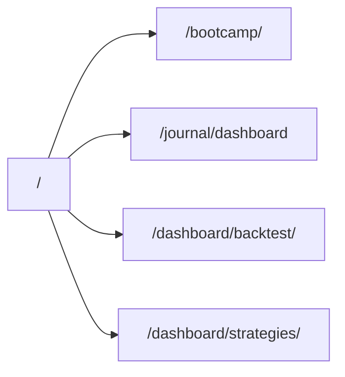

# Talaria-Log — Site routing & architecture map

> Generated from repo audit (`homepage/`, `journal-backend/`, `chart v 1.4/chart/`, `docker-compose.yml`).  
> **Note:** `journal-frontend/` was removed; `/journal/*` UI redirects to Next; `/journal/api/*` stays on Flask.  
> Use this to see **where each URL goes** and spot **duplicate or conflicting paths**.

---

## 1. Production request flow (Docker Compose)

Your VPS stack (`docker-compose.yml`, port **3000**) uses **`homepage/nginx.local.conf`** (mounted over the image default).

```mermaid
flowchart TB
  Browser["Browser :3000"]
  Nginx["homepage nginx"]
  NextStatic["Next static export /usr/share/nginx/html"]
  Chart["trading-chart :8000"]
  JournalBE["journal-backend :5000"]

  Browser --> Nginx
  Nginx -->|"/" marketing + "/dashboard/*" pages| NextStatic
  Nginx -->|"/chart/*" proxy| Chart
  Nginx -->|"/api/*" except /api/chart/| Chart
  Nginx -->|"/api/chart/*"| JournalBE
  Nginx -->|"/journal/api/*"| JournalBE
  Nginx -->|"/journal/*" UI redirects| NextStatic
  Nginx -->|"/ws/*"| Chart
  Nginx -->|"/dashboard/admin*"| Chart admin HTML
```

| Prefix | Served by | Notes |
|--------|-----------|--------|
| `/`, `/login/`, `/pricing/`, `/dashboard/…` | Next **`out/`** static files | App Router → static HTML |
| `/chart/` | **Chart API** (proxied) | Live V9 UI, `chart.js`, modules, admin HTML |
| `/api/` | **Chart API** | Sessions, auth, tiles, backtest state |
| `/api/chart/` | **Journal backend** | Chart preferences / settings |
| `/journal/api/` | **Journal backend** | Strategies, journal CRUD, admin APIs |
| `/journal/` (except `/journal/api/`) | **301 →** `/dashboard/journal/` (Next) | Legacy SPA removed |
| `/ws/` | Chart | Support + chart websockets |

**Important:** `homepage/Dockerfile` copies **`nginx.conf`**, which is **older** (no `/chart/` proxy, no admin redirects). **Compose overrides** with `nginx.local.conf` — always deploy with compose or mount the local config.

---

## 2. Landing hub → product areas (your screenshot)

**File:** `homepage/src/app/page.tsx` (`/`)

| UI label | Link target | Actual destination |
|----------|-------------|-------------------|
| **Mentorship** | `/bootcamp/` | Next bootcamp / resources page |
| **Journal** | `/journal/dashboard` if entitled, else `/pricing/` or `/login/?next=…` | **Legacy journal SPA**, not `/dashboard/journal/` |
| **Backtest** | `/dashboard/backtest/` | Next **Backtesting Sessions** (`BacktestView`) |
| **Strategies Lab** | `/dashboard/strategies/` | Next **Strategy Bank** (`strategyLabV9BankApp`) |



**Resolved:** Home hub and sidebar both use **`/dashboard/journal/`** (legacy `/journal/dashboard` redirects).

---

## 3. Dashboard shell (sidebar)

**Layout:** `homepage/src/app/dashboard/layout.tsx`  
**Paid gate:** `homepage/src/lib/dashboardAccess.ts` (client + APIs must still enforce)

| Nav ID | Route | Page component |
|--------|-------|----------------|
| dashboard | `/dashboard/` | `BacktestAnalyticsPage` (session analytics when `?sessionId=`) |
| journal | `/dashboard/journal/` | Full Next journal hub (`journal/page.tsx` ~900 lines) |
| backtest | `/dashboard/backtest/` | `BacktestView` — sessions list + stats |
| strategies | `/dashboard/strategies/` | Strategy Lab V9 |
| cot | `/dashboard/cot/` | COT analysis |
| resources | `/bootcamp/` | **iframe** to bootcamp (external view) |
| support | `/dashboard/support/` | Support inbox |
| profile | `/dashboard/profile/` | Account / billing (exempt from paywall) |
| admin | `/dashboard/admin/` | See **§7 Admin conflict** |

Opening a session from backtest:

- **Play chart:** `/chart/index.html?mode=…&sessionId=…` → proxied to chart server **`dist-v9`**
- **Dashboard analytics:** `/dashboard/?sessionId=…` → `BacktestAnalyticsPage`

---

## 4. Next.js app routes (canonical)

`output: "export"`, `trailingSlash: true` — all routes become static folders under `homepage/out/`.

### 4.1 Public / marketing

| Path | Purpose |
|------|---------|
| `/` | Landing hub |
| `/login/`, `/register/` | Auth |
| `/pricing/`, `/pricing/success/` | Checkout |
| `/bootcamp/` | Mentorship / resources |
| `/ninjatrader/` | Partner page |
| `/terms/`, `/privacy/`, `/refunds/`, `/disclaimer/` | Legal |

### 4.2 Dashboard (authenticated shell)

| Path | Live UI? | Component / behavior |
|------|----------|----------------------|
| `/dashboard/` | ✅ | `BacktestAnalyticsPage` |
| `/dashboard/backtest/` | ✅ | `BacktestView` |
| `/dashboard/strategies/` | ✅ | Strategy Lab V9 |
| `/dashboard/journal/` | ✅ | New journal (main implementation) |
| `/dashboard/cot/` | ✅ | COT page |
| `/dashboard/support/` | ✅ | Support |
| `/dashboard/profile/` | ✅ | Profile |
| `/dashboard/admin/` | ⚠️ | Next admin UI — **often overridden by nginx** (§7) |
| `/dashboard/backtest/design/` | ✅ | V9 chart iframe demo (`/chart/dist-v9/`) |
| `/dashboard/sessions/analytics/` | ✅ | Session analytics (query `?id=`) |
| `/dashboard/sessions/[id]/analytics/` | ↪️ | Redirects to `…/analytics/?id=` |

### 4.3 Dashboard journal — stub routes (⚠️ blank pages)

These exist as static routes but **`return null`** (legacy iframe placeholders; iframe wiring was removed from layout):

| Path | Status |
|------|--------|
| `/dashboard/journal/trades/` | ⚠️ Empty |
| `/dashboard/journal/journal/` | ⚠️ Empty |
| `/dashboard/journal/analytics/` | ⚠️ Empty |
| `/dashboard/journal/analytics/*` (all sub-pages) | ⚠️ Empty |
| `/dashboard/journal/settings/`, `notes/`, `learn/`, … | ⚠️ Empty |

**Only** `/dashboard/journal/` has real UI today. Deep links like `/dashboard/journal/trades/` show a **blank** main area.

### 4.4 Legacy redirects (Next `redirects` in `next.config.mjs`)

| From | To |
|------|-----|
| `/strategies-lab/`, `/strategy-v8-lab-preview/` | `/dashboard/strategies/` |
| `/dashboard/strategylab-v9/` | `/dashboard/strategies/` |

### 4.5 Client-side legacy redirects (`page.tsx` → `window.location`)

| From | To |
|------|-----|
| `/backtest/` | `/dashboard/backtest/` |
| `/backtest/design/` | `/dashboard/backtest/design/` |
| `/backtest/analytics/` | `/dashboard/` (with query preserved) |
| `/dashboard/backtest/analytics/` | `/dashboard/` |
| `/journal/pricing/` | `/pricing/` |
| `/journal/subscription-status/` | (redirect page — check file) |

---

## 5. Legacy `/journal/*` URLs (SPA removed)

| Old URL | Now |
|---------|-----|
| `/journal/`, `/journal/dashboard` | `/dashboard/journal/` |
| `/journal/login` | `/login/?next=/dashboard/journal/` |
| `/journal/pricing` | `/pricing/` |
| `/journal/subscription-status` | `/pricing/?browse=1` |
| `/journal/api/*` | **Unchanged** → `journal-backend` |

---

## 6. Chart server routes (`trading-chart :8000`)

Served under **`/chart/`** (via nginx proxy from browser).

| Path | Content |
|------|---------|
| `/chart/index.html` | **V9 live** (`dist-v9/`) when built |
| `/chart/dist-v9/*` | React bundle + assets |
| `/chart/chart.js`, `/chart/modules/*` | Engine |
| `/chart/admin-dashboard.html` | **Chart admin** (datasets, users) |
| `/chart/legacy-index.html` | Legacy monolith fallback |
| `/api/*` | Sessions, auth, files, analytics, admin APIs |

Chart API also serves **`homepage/out/*`** when embedded in chart-only Docker image (`homepage/out/` path in `api_server.py`) — not used when homepage nginx serves the site.

---

## 7. Admin — duplicate / conflicting paths ⚠️

Three different “admin” implementations:

| URL | What happens (compose + `nginx.local.conf`) |
|-----|---------------------------------------------|
| `/dashboard/admin/` | **302 → `/chart/admin-dashboard.html`** (chart admin) |
| `/dashboard/admin/datasets/` | **302 → chart admin `#datasets`** |
| `/dashboard/admin/users/` | **302 → chart admin `#users`** |
| `homepage/src/app/dashboard/admin/page.tsx` | Next **unified admin** (users, flags, metrics) — **not reached** behind nginx.local |
| `/journal/admin/feature-flags` | Journal SPA feature flags |
| `/journal/api/admin/*` | Journal backend admin API (used by Next admin page) |

**Broken link in Next admin UI:** links to **`/dashboard/sessions/`** — **no such route** (only `/dashboard/sessions/analytics/`).

---

## 8. API routing summary

| Client calls | Dev (`next dev` rewrites) | Prod (nginx.local) |
|--------------|---------------------------|---------------------|
| `/api/sessions`, `/api/auth/me`, … | → chart `:8000` | → trading-chart |
| `/api/chart/…` | (not in next rewrites) | → journal-backend |
| `/journal/api/strategies`, … | → journal `:5000` | → journal-backend |
| Bearer `localStorage.token` | Journal + some admin calls | Same |

Strategy Lab saves to **`/journal/api/strategies`** (journal backend).

---

## 9. Static assets & mirrors

| Path | Source of truth |
|------|-----------------|
| `homepage/public/chart/dist-v9/` | Synced from `chart/dist-v9/` (`npm run build:chart-v9`) |
| `homepage/public/chart/chart.js` | Synced |
| `homepage/public/chart/modules/` | **Only** `compare-overlay.js`, `drawing-tools-manager.js` |
| `homepage/public/talaria-v8b-design/` | Vite mockup build (`talaria-design` `npm run build`) |

In production, **`/chart/modules/*`** is usually fetched from the **chart server** (proxy), not from `public/`.

---

## 10. Issues checklist (wrong / duplicate paths)

| Severity | Issue | Recommendation |
|----------|--------|----------------|
| 🔴 High | **Journal:** landing → `/journal/dashboard`, sidebar → `/dashboard/journal/` | Pick one product; align links |
| 🔴 High | **`/dashboard/admin/`** nginx → chart HTML vs Next admin page | Pick one admin UI; remove nginx 302 or remove Next page |
| 🟠 Medium | **~20 `/dashboard/journal/*` sub-routes** render blank | Remove stubs, redirect to `/dashboard/journal/`, or re-enable iframe |
| 🟠 Medium | **`/dashboard/sessions/`** linked but missing | Add page or change links to `/dashboard/backtest/` |
| 🟡 Low | **`nginx.conf` vs `nginx.local.conf`** | Ship one config; document compose volume requirement |
| 🟡 Low | Duplicate analytics URLs `/backtest/analytics/` and `/dashboard/backtest/analytics/` | OK (both redirect to `/dashboard/`) — keep redirects |
| 🟡 Low | Legacy strategy URLs | OK — permanent redirects in `next.config.mjs` |
| ✅ OK | `/dashboard/backtest/` vs `/backtest/` | Legacy redirect intentional |
| ✅ OK | Chart play URL `/chart/index.html?sessionId=` | Canonical for live chart |

---

## 11. Quick reference — “where should I link?”

| User action | Use this URL |
|-------------|----------------|
| Home hub | `/` |
| Backtest session list | `/dashboard/backtest/` |
| Strategy Bank | `/dashboard/strategies/` |
| Session chart (replay) | `/chart/index.html?sessionId={id}` |
| Session dashboard analytics | `/dashboard/?sessionId={id}` |
| New journal (Next) | `/dashboard/journal/` |
| Journal (Next) | `/dashboard/journal/` |
| Login | `/login/` |
| Pricing | `/pricing/` |
| Chart admin (datasets/users) | `/chart/admin-dashboard.html` or `/dashboard/admin/` (nginx) |
| Journal API strategies | `/journal/api/strategies` |

---

## 12. Services map (repo folders)

```
full-talaria-log--main/
├── homepage/              ← Next.js site (port 3000)
├── journal-backend/       ← /journal/api/* (Flask API only)
├── chart v 1.4/
│   ├── chart/             ← api_server.py + chart.js + dist-v9
│   └── talaria-design/    ← V9 React build source
└── docker-compose.yml     ← orchestration
```

---

*Update this file when adding routes or changing nginx redirects.*
