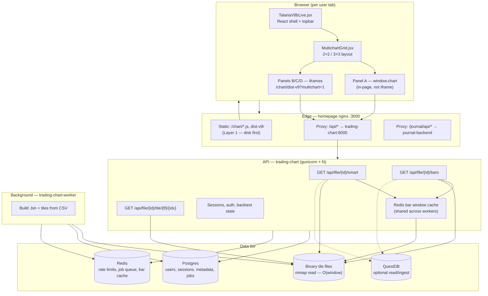
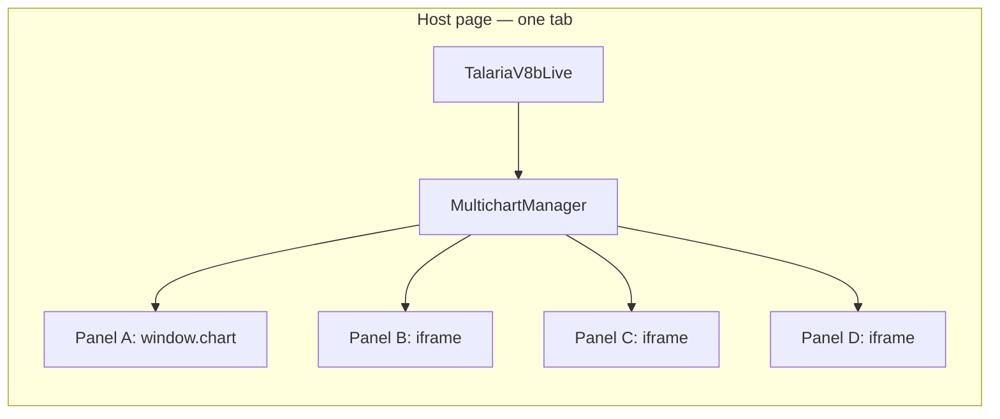
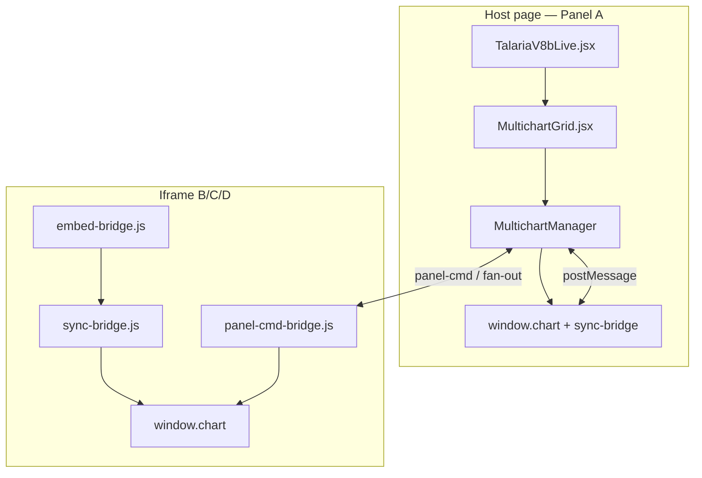
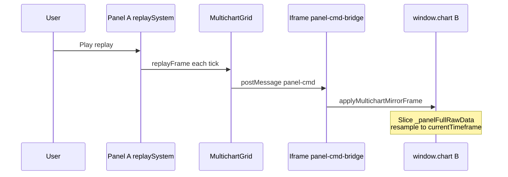
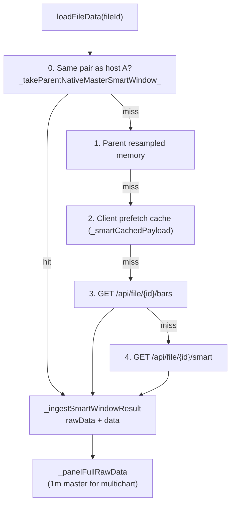
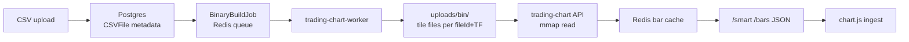
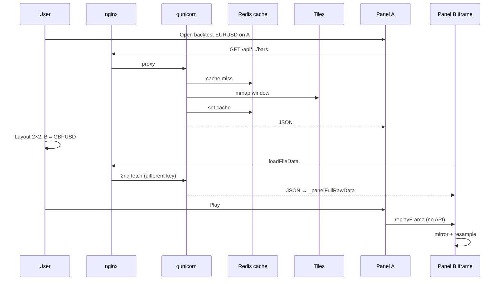

# Talaria chart, multichart & backtest — full architecture

This document describes how the live chart, backtest replay, multichart grid, data API, and deployment stack fit together. It is the reference for scaling work (TradingView-like: CDN tiles + shared bar cache + client-side resample).

**Related docs:**

- [backtest-scaling-checklist.md](./backtest-scaling-checklist.md) — implementation tracks A/B/C
- [backtest-scaling-test-guide.md](./backtest-scaling-test-guide.md) — how to verify changes

---

## Table of contents

1. [Big picture](#1-big-picture)
2. [Browser entry points](#2-browser-entry-points)
3. [Single chart vs multichart](#3-single-chart-vs-multichart)
4. [Bridge layer (IPC)](#4-bridge-layer-ipc)
5. [Client data layer (`chart.js`)](#5-client-data-layer-chartjs)
6. [Replay system (`replay-system.js`)](#6-replay-system-replay-systemjs)
7. [Server data pipeline](#7-server-data-pipeline)
8. [API endpoints](#8-api-endpoints)
9. [Docker / process layout](#9-docker--process-layout)
10. [nginx: static vs API](#10-nginx-static-vs-api)
11. [Multichart sync settings](#11-multichart-sync-settings)
12. [End-to-end flows](#12-end-to-end-flows)
13. [TradingView comparison](#13-tradingview-comparison)
14. [Scaling roadmap](#14-scaling-roadmap)
15. [Key file index](#15-key-file-index)

---

## 1. Big picture



**TradingView analogy:** TV separates **chart UI (client)**, **UDF/datafeed (API)**, and **pre-built bar storage (CDN/tiles)**. Talaria has the same shape; the gap is **too much bar assembly in gunicorn** and **no global edge cache** until Redis/CDN layers are fully deployed.

---

## 2. Browser entry points

| Entry | URL / file | What loads |
|--------|------------|------------|
| **Main chart app** | `/chart/` → `dist-v9/index.html` | React (`talaria-v9-live.js`) + **chart engine** (`chart.js`) + modules |
| **Multichart** | Same page, layout 2+ in `TalariaV8bLive` | `MultichartGrid.jsx` splits screen |
| **Backtest from dashboard** | Next iframe → `/chart/dist-v9/` | Single panel unless user picks multichart layout inside chart |

**Script load order (important):**

1. D3, chart modules (`viewport-data-manager.js`, `compare-overlay.js`, …)
2. **`chart.js`** → creates `window.chart`
3. **`replay-system.js`**
4. Order manager, indicators, …
5. React bundle `talaria-v9-live.js`

The engine is **not bundled inside React**; React is chrome around the canvas engine.

| Layer | Path |
|-------|------|
| React shell | `chart v 1.4/talaria-design/src/TalariaV8bLive.jsx` |
| Multichart grid | `chart v 1.4/talaria-design/src/MultichartGrid.jsx` |
| Built V9 | `chart v 1.4/chart/dist-v9/` → mirrored to `homepage/public/chart/dist-v9/` |
| Engine (served) | `homepage/public/chart/chart.js` (synced from `chart v 1.4/chart/chart.js`) |

---

## 3. Single chart vs multichart



| Panel | Document | Chart instance | Chrome |
|-------|----------|----------------|--------|
| **A** | Parent page | `window.chart` (original `#chartWrapper`) | Topbar on parent; chart cell in grid |
| **B/C/D** | Separate iframes | Each iframe’s `window.chart` | Hidden via `?multichart=1` + `[data-v9-chrome="1"]` |

**Iframe URL pattern:**

```
/chart/dist-v9/index.html?multichart=1&panelId=B&fileId=…&tf=…&sessionId=…
```

(`mode=backtest` is omitted on iframes to avoid parallel `autoLoadBacktestingData` races.)

**TradingView analogy:** TV Pro uses multiple chart widgets in one runtime (shared memory possible). Talaria uses **1 parent + 3 iframes** = four JS heaps and four canvases — heavier but isolated.

---

## 4. Bridge layer (IPC)

Scripts live in `chart v 1.4/chart/multichart-prod/` (mirrored to `homepage/public/chart/multichart-prod/`).



### 4.1 `engine-api-guards.js`

- **Side:** client (host + iframes)
- **Role:** Allowlist for sync messages. **Blocks** `timeframe`, `priceMin`, `priceMax`, `autoScale`, `indicators`, `drawings`, etc. from crossing panels.
- **Allows:** `time`, `startTime`, `endTime`, `symbol` (time-axis sync only).

### 4.2 `sync-bridge.js`

- **Side:** client (host A + every iframe)
- **Outbound (iframe → parent):** `crosshair`, `visibleRange`, `chart-state`, `drawing-*`, `bridge-ready`
- **Inbound:** filtered sync with `causationId` loop guard
- **Does not:** change timeframe, load files, or drive replay (those are commands)

### 4.3 `panel-cmd-bridge.js`

- **Side:** iframe only (host A uses `window.chart` directly)
- **Protocol:** `{ type: 'panel-cmd', target, cmd, args, requestId }` → `{ type: 'cmd-result', … }`
- **Commands:** `setTimeframe`, `loadFile`, `replayEnter`, `replayTick`, `replayFrame`, `replayPlay`, `replayPause`, `replayExit`, `addIndicator`, orders, …
- **Not** subject to `FORBIDDEN_SYNC_FIELDS` — intentional user/topbar actions

### 4.4 `embed-bridge.js`

- **Side:** iframe only
- Polls until `window.chart` exists; installs sync-bridge; mirrors `backtestingSession`; first `loadFileData`; forwards diagnostics to parent

### 4.5 `multichart-manager.js`

- **Side:** parent only
- Registers host + iframe charts; PEER fan-out; `sendCommand` / `sendCommandNoReply`
- Exposes `window.__multichartGrid.runCommand(cmd, args, { panelId })` for topbar routing

### 4.6 Replay broadcast (parent → iframes)

`MultichartGrid.jsx` patches host `replaySystem.play/pause/…` and streams:

| Message | When |
|---------|------|
| `replayEnter` | First sync / panel bootstrap |
| `replayFrame` | Each animation frame while playing |
| `replayTick` | Pause, scrub, drift correction |
| `replaySetStepTf` | Candle step size mirror |
| `syncFromHost` | Session / playhead alignment |



---

## 5. Client data layer (`chart.js`)

Canonical source: `chart v 1.4/chart/chart.js` (synced to `homepage/public/chart/chart.js`).

### 5.1 Primary entry: `loadFileData(fileId)`



| Field | Meaning |
|-------|---------|
| **`rawData`** | Native-resolution OHLC (often **1m** in backtest multichart) |
| **`data`** | Resampled to **`currentTimeframe`** (5m, 1h, …) for drawing |
| **`_panelFullRawData`** | Full **1m master** for this panel; TF switches = client resample, not refetch |
| **`_nativeRawFetchTf`** | Resolution last fetched from server (typically `1m` for multichart) |

### 5.2 Layer 2 — parent memory sharing (client-side)

| Priority | Source | Function |
|----------|--------|----------|
| 0 | Host A `replaySystem.fullRawData` | `_takeParentNativeMasterSmartWindow` |
| 1 | Host A resampled bars | `_takeParentMemorySmartWindow` |
| 2 | In-tab prefetch LRU | `_tryTakeSmartPrefetch` / `_getSmartCachedPayload` |
| 3 | Network `/bars` | `_fetchSmartWindowViaBars` |
| 4 | Network `/smart` | `_fetchSmartWindowWithParams` |

**Same pair on B/C/D:** no network — copy host 1m master.  
**Different pair:** full fetch + own `_panelFullRawData`.

### 5.3 Timeframe switch (backtest replay)

| Case | Path |
|------|------|
| Independent pair + `_panelFullRawData` | `_independentPanelTimeframeSwitch` — client resample only |
| Same pair iframe | `_multichartSamePairTimeframeResampleFromParent` |
| Fallback | `_refetchBacktestTimeframeCore` → `/smart` (expensive) |

**Must not:** stale `ensureReplayDataCoversTimestamp` async completing after TF switch and resetting `currentTimeframe` to 1m (fixed in `_independentPanelTimeframeSwitch` + generation guard).

### 5.4 Client-side `/smart` cache (per tab)

- Key: `_smartCacheKeyFromParams(file_id|query)`
- TTL ~120s, LRU max 8 entries
- **Does not** share across users or gunicorn workers — server Redis cache addresses that

---

## 6. Replay system (`replay-system.js`)

**Side:** client only (one `ReplaySystem` per `window.chart`).

| Responsibility | Detail |
|----------------|--------|
| Master series | `fullRawData` (1m for backtest multichart) |
| Playhead | `replayTimestamp`, `currentIndex` |
| Display | Slice → `rawData` → `resampleData(currentTimeframe)` → canvas |
| Host play loop | Panel A drives; iframes mirror via `applyMultichartMirrorFrame` |
| Tick animation | Forming candle from tick path (client) |

**Server during replay:** initial window load + pan past loaded edge (`ensureReplayDataCoversTimestamp`). Not every candle tick.

**Multichart mirror:** `applyMultichartMirrorFrame` uses `_panelFullRawData` for independent pairs and resamples to `chart.currentTimeframe`.

---

## 7. Server data pipeline



| Storage | Format | Read path |
|---------|--------|-----------|
| **Tile files** | Binary, 48 bytes/candle | `_tiles_read_window` — **default production path** |
| **Legacy `.bin`** | Single file per TF | mmap fallback |
| **QuestDB** | Time-series | Only if `QUESTDB_READ_PRIMARY=true` (default **off**) |
| **CSV** | Source of truth / recovery | Slow — when binaries not ready |

**Build queue:** `BINARY_BUILD_MODE=queue`, worker wakes via Redis `BRPOP`.

---

## 8. API endpoints

| Endpoint | Role |
|----------|------|
| `GET /api/file/{id}/bars` | Range query: `from`, `to`, `resolution`, `limit` — **client tries first** |
| `GET /api/file/{id}/smart` | Window loader: `timeframe`, `start_ts`, `end_ts`, `anchor`, `limit` |
| `GET /api/file/{id}/tile/{tf}/{idx}` | Raw tile bytes; optional CDN redirect (`TILE_CDN_*`) |
| `GET /api/file/{id}/candles` | Cursor pagination for pan-load |
| `PATCH /api/sessions/{id}/state` | Backtest session, journal, playhead persistence |

**Rate limits (Redis when configured):**

- `BACKTEST_SMART_RATE_PER_MINUTE` (default 90) — applies to `/smart` and `/bars`
- `BACKTEST_SESSION_PATCH_RATE_PER_MINUTE`
- `BACKTEST_WHATIF_RATE_PER_MINUTE`

**Server bar cache (Redis):**

- `BACKTEST_BARS_CACHE_ENABLED` (default true when `REDIS_URL` set)
- `BACKTEST_BARS_CACHE_TTL_SEC` (default 300)
- Shared across all gunicorn workers — same `fileId+window` hit once per TTL

---

## 9. Docker / process layout

Root stack: `docker-compose.yml`

| Service | Role |
|---------|------|
| **homepage** | nginx + Next static export, port 3000 |
| **trading-chart** | `gunicorn × WEB_CONCURRENCY` — `/api/*`, chart static fallback |
| **trading-chart-worker** | Tile builds, FirstRate sync — **not** user request path |
| **journal-backend** | Auth, journal, `/api/chart/*` preferences |
| **postgres** | Users, sessions, file metadata, job queue |
| **redis** | Rate limits, binary wake queue, **bar window cache**, what-if cache |
| **questdb** | Optional; worker pools capped in compose for idle CPU |

**Volumes:** `chart_uploads`, `chart_data`, `questdb_data`, `postgres_data`

**Why 2 heavy users can max a 16 GB VPS:**

- `WEB_CONCURRENCY=4` → four full Python processes
- Multichart → up to four parallel `/bars`/`/smart` per user
- Each worker holds mmap caches; RAM duplicates until Redis cache + lower concurrency

---

## 10. nginx: static vs API

**Target config:** `homepage/nginx.local.conf`

| Route | Target |
|-------|--------|
| `^~ /chart/` | **Static first** (`try_files` on Next export) → fallback `@chart_upstream` |
| `^~ /api/` | `trading-chart:8000` |
| `/api/file/*/tile/*` | API + **nginx tile cache** (24h) |
| `^~ /journal/api/` | `journal-backend:5000` |
| `/` | Next static |

**Layer 1:** chart JS/CSS/dist-v9 never touch gunicorn when static path is active.

**Plain `homepage/nginx.conf`:** may proxy all `/chart/` to gunicorn — enable `nginx.local.conf` in production Docker mount for Layer 1.

---

## 11. Multichart sync settings

| Setting | ON | OFF (independent panels) |
|---------|----|---------------------------|
| **Symbol sync** | All panels same `fileId` | Each panel own pair → **N fetches** |
| **Interval sync** | TF fan-out via `setTimeframe` on all panels | Each panel own TF; client resample from 1m master |
| **Crosshair / time** | Shared virtual time on axis | via `sync-bridge` allowlist |
| **Replay** | Host A playhead → iframe mirror | Shared clock; **per-panel OHLC** |

---

## 12. End-to-end flows

### 12.1 Boot — 4 panels, different pairs



### 12.2 TF switch — independent pair, interval sync OFF

1. User selects 5m on panel B  
2. `setTimeframe` → `_independentPanelTimeframeSwitch`  
3. `_commitTimeframeChange` + resample `_panelFullRawData`  
4. **No** `/smart` if master loaded  
5. Parent `replayFrame` continues to mirror at new TF  

### 12.3 What 500 users would require

Not one VPS — **horizontal API**, **Redis bar cache**, **tile CDN**, debounced session PATCH, fair rate limits. See [Scaling roadmap](#14-scaling-roadmap).

---

## 13. TradingView comparison

| Layer | TradingView | Talaria today | Gap |
|-------|-------------|---------------|-----|
| Chart UI | Widget bundle | `chart.js` + React — **good** | Polish |
| Multi-chart | Multi-widget, one runtime option | 1 host + 3 iframes | Optional single-process refactor |
| Bar storage | CDN + aggregates | **Binary tiles** — **good** | `TILE_CDN_REDIRECT` |
| History API | Thin UDF + edge cache | gunicorn + **Redis cache (added)** | More API replicas |
| TF change | Client resample | Client resample when 1m master present | Enforce master; fix refetch races |
| Replay | Client playback | Client playback | Avoid refetch on TF |
| Scale | Global edge | Single VPS + Redis | LB + CDN + sharding |

---

## 14. Scaling roadmap

| Phase | Work | TV parallel |
|-------|------|-------------|
| **Done** | Multichart bridges, replay mirror, Layer 2 parent 1m share | Shared layout data |
| **Done** | Independent TF client resample + refetch race fixes | Interval without refetch |
| **Done** | Lazy tick LRU cache (`replay-system.js`) | Client memory discipline |
| **Done** | nginx static `/chart/` (Layer 1) | Widget CDN |
| **Done / this doc** | **Redis bar window cache** (`bar_window_cache.py`) | Edge cache for identical windows |
| **Next** | `TILE_CDN_REDIRECT` + object storage | Bar CDN |
| **Next** | `WEB_CONCURRENCY=2` + horizontal API replicas | Sharded datafeed |
| **Next** | Session PATCH debounce (Track A checklist) | — |
| **Later** | Single-process multichart (no iframes) | TV desktop layout |

See [backtest-scaling-checklist.md](./backtest-scaling-checklist.md) for detailed checkboxes.

---

## 15. Key file index

| Area | Path |
|------|------|
| React shell | `chart v 1.4/talaria-design/src/TalariaV8bLive.jsx` |
| Multichart grid | `chart v 1.4/talaria-design/src/MultichartGrid.jsx` |
| Chart engine | `chart v 1.4/chart/chart.js` |
| Replay | `chart v 1.4/chart/modules/replay-system.js` |
| Bridges | `chart v 1.4/chart/multichart-prod/` |
| API server | `chart v 1.4/chart/api_server.py` |
| Redis helpers | `chart v 1.4/chart/chart_redis.py` |
| Bar window cache | `chart v 1.4/chart/bar_window_cache.py` |
| nginx (docker) | `homepage/nginx.local.conf` |
| Docker stack | `docker-compose.yml` |
| Backtest dashboard embed | `homepage/src/app/dashboard/backtest/design/page.tsx` |
| Scaling checklist | `docs/backtest-scaling-checklist.md` |
| **This document** | `docs/chart-multichart-architecture.md` |

---

## Appendix A — Environment variables (chart / scaling)

| Variable | Default | Purpose |
|----------|---------|---------|
| `WEB_CONCURRENCY` | `2` (compose), `4` in `.env.example` for multichart | gunicorn workers |
| `REDIS_URL` | `redis://redis:6379` in compose | Rate limits, queues, bar cache |
| `BACKTEST_BARS_CACHE_ENABLED` | `true` | Server-side bar window cache |
| `BACKTEST_BARS_CACHE_TTL_SEC` | `300` | Cache TTL for immutable historical windows |
| `BACKTEST_SMART_RATE_PER_MINUTE` | `90` | Per-user `/smart` + `/bars` limit |
| `QUESTDB_READ_PRIMARY` | `false` | Serve from tiles, not QuestDB |
| `TILE_CDN_BASE_URL` | empty | Optional CDN for raw tiles |
| `TILE_CDN_REDIRECT` | `false` | Redirect tile GETs to CDN |
| `SKIP_BINARY_BACKFILL_ON_STARTUP` | `true` | Avoid CPU storm on deploy |

---

## Appendix B — Memory roadmap (client, backtest-first)

| Step | Status | Description |
|------|--------|-------------|
| 0 | Done | `window.__talariaMemStats()` |
| 1 | Done | Lazy LRU tick cache in `replay-system.js` |
| 3 | Next | Evict old symbol caches on pair switch |
| 2 | Then | Reduce duplicate bar arrays |
| 4 | Later | Windowed backtest bars |
| 5 | Later | Multichart iframe cleanup |
| 7 | Partial | Layer 2 shared data (same-pair); server Redis cache |

---

*Last updated: 2026-06-06 — includes Redis bar window cache and independent-pair TF switch fixes.*
