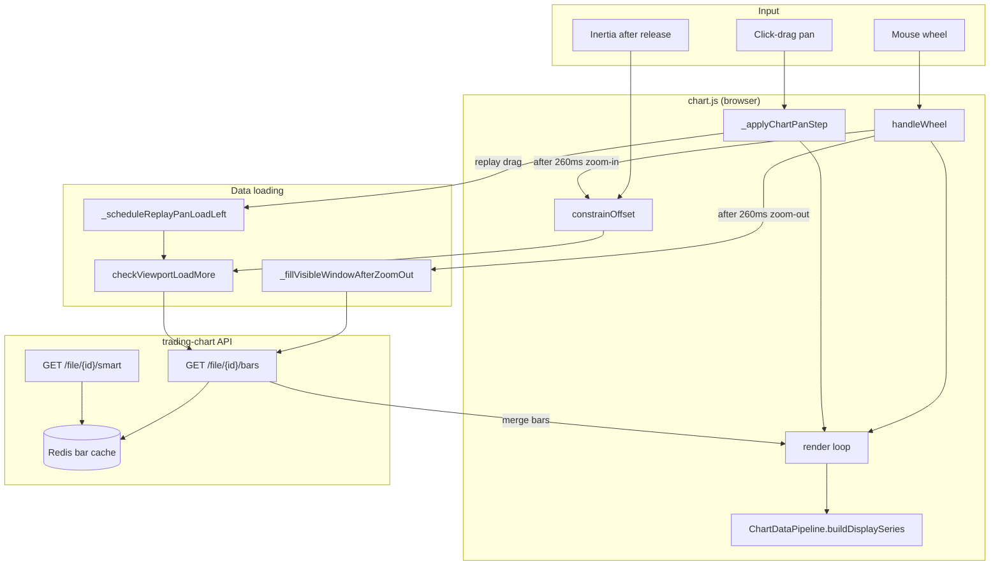
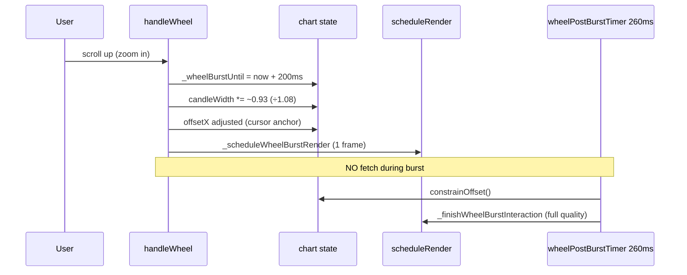
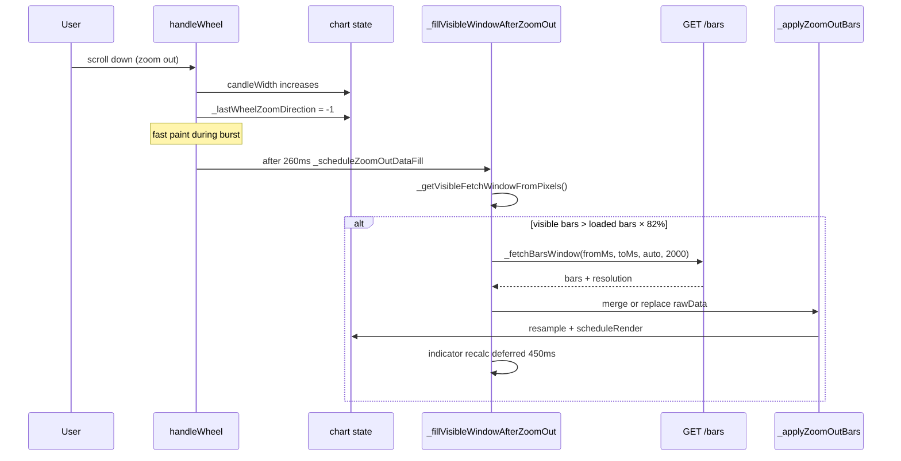

# Chart — Zoom, Pan, and Candle Loading

> How horizontal zoom, chart movement, and server fetches work in Talaria.  
> Complements [`chart-multichart-architecture.md`](./chart-multichart-architecture.md) and server notes in [`talaria-performance-fixes.md`](./talaria-performance-fixes.md).

**Related docs:** [`chart-multichart-architecture.md`](./chart-multichart-architecture.md), [`talaria-zoom-pan-fixes.md`](./talaria-zoom-pan-fixes.md)

---

Everything builds on these chart state variables (in `chart v 1.4/chart/chart.js`):

| Variable | Meaning |
|----------|---------|
| `candleWidth` | Horizontal zoom — **smaller** = zoom **in**, **larger** = zoom **out** |
| `offsetX` | Horizontal scroll — **increase** = chart moves **right** → you see **older** candles on the **left** |
| `data[]` / `rawData[]` | Candles currently in memory |
| `_serverCursors` | `firstTs`, `lastTs`, `hasMoreLeft`, `hasMoreRight` — what's loaded vs still on disk |

**Pixel → bar index:**

```text
barIndex = (mouseX - leftMargin - offsetX) / candleSpacing
```

If `barIndex < 0` → left side of screen has **no loaded data yet** (black gap) → triggers **backward load**.

---

## High-level map



---

## 1. Zoom IN (mouse wheel up / scroll up)

**Goal:** Fewer candles on screen, wider bodies, anchored under cursor.



| Step | What happens |
|------|----------------|
| 1 | `handleWheel` — direction `+1`, `candleWidth` decreases |
| 2 | Cursor anchor — `offsetX` recalculated so bar under mouse stays fixed |
| 3 | **200ms burst** — fast paint only; **no** `checkViewportLoadMore` |
| 4 | After **260ms** — `constrainOffset()` once (edges + maybe load) |
| 5 | Full render — indicators, drawings, time axis rebuilt |

**Load candles?** Usually **no** — zoom in shows fewer bars; memory is enough.

**Key code:** `setupEvents()` → `handleWheel` in `chart.js`.

---

## 2. Zoom OUT (mouse wheel down / scroll down)

**Goal:** Many candles on screen; may need **more bars in memory** than currently loaded.



| Step | What happens |
|------|----------------|
| 1 | `candleWidth` increases → more bars fit on screen |
| 2 | During wheel burst — **no** edge fetch (avoids lag) |
| 3 | After stop → `_fillVisibleWindowAfterZoomOut` |
| 4 | Compares **visible bar count** vs **loaded bar count** |
| 5 | If gap → `GET /file/{id}/bars?from=&to=&resolution=auto` (up to ~2000 bars) |
| 6 | `_applyZoomOutBars` — merge into `rawData` or replace snapshot |
| 7 | `ChartDataPipeline` — pixel-slot LOD when spacing &lt; 2px |
| 8 | Indicators recalculated **450ms later** (`_deferIndicatorRecalcAfterZoomFill`) |

**Paint when zoomed out:** bars merged into **~1 pixel column slots** (`TV_ZOOMED_OUT_SLOT_PX = 2`) so thousands of 1m bars don't draw as thousands of wicks.

**Key code:** `_scheduleZoomOutDataFill`, `_fillVisibleWindowAfterZoomOut`, `_applyZoomOutBars` in `chart.js`.

---

## 3. Chart movement (PAN — click & drag)

**Goal:** Move the viewport; load **older** history when you drag **right** (revealing the left).

```mermaid
sequenceDiagram
    participant User
    participant Pan as _applyChartPanStep
    participant Drag as _constrainOffsetDuringDrag
    participant Loop as pan render loop rAF
    participant Replay as _scheduleReplayPanLoadLeft
    participant Load as checkViewportLoadMore backward
    participant API as _fetchCandlesCursor

    User->>Pan: mousedown + mousemove right
    Pan->>Pan: offsetX += dx
    Pan->>Drag: soft rubber-band at edges
    Pan->>Loop: 1 render per animation frame
    alt replay / backtest active
        Pan->>Replay: if dx > 0.5 (drag right)
        Replay->>Load: after 90ms debounce
        Load->>API: cursor=firstTs, direction=backward, ~2000 bars
        API-->>Load: bars merged into rawData + replay.fullRawData
        Load->>Loop: scheduleRender
    else normal browse mode
        Note over Pan: load deferred until pan ends
    end
    User->>Pan: mouseup
    Pan->>Pan: constrainOffset + checkViewportLoadMore
```

| Phase | Behavior |
|-------|----------|
| **During drag** | `offsetX` updates every move; **cheap** `_constrainOffsetDuringDrag` (no fetch) |
| **Paint** | `_startChartPanRenderLoop` — **one `render()` per frame** |
| **Time axis** | Cached ticks shifted by `dx` (`_buildPanTimeTicks`) — not rebuilt every frame |
| **Replay/backtest** | Drag **right** → `_scheduleReplayPanLoadLeft` → `checkViewportLoadMore('backward')` **while still dragging** |
| **Normal mode** | Fetch runs in `constrainOffset()` **after** you release (not mid-drag) |
| **Mouse up** | Full render + `_finishPanDrawingRedraw` |

**Backtest + replay (e.g. EUR/USD 1m):** dragging right uses the **replay path** — loads older candles **during** drag (~90ms debounce, up to 2000 bars per chunk).

**Key code:** `_applyChartPanStep`, `_scheduleReplayPanLoadLeft`, `_startChartPanRenderLoop` in `chart.js`.

---

## 4. Loading candles — all paths

```text
┌─────────────────────────────────────────────────────────────────┐
│                    WHEN CANDLES ARE FETCHED                       │
├──────────────────────┬──────────────────────────────────────────┤
│ Trigger              │ Function → API                            │
├──────────────────────┼──────────────────────────────────────────┤
│ Zoom out stopped     │ _fillVisibleWindowAfterZoomOut            │
│                      │ → GET /bars (time window, auto TF)        │
├──────────────────────┼──────────────────────────────────────────┤
│ Pan near left edge   │ checkViewportLoadMore('backward')         │
│ (replay: while drag) │ → _fetchCandlesCursor(firstTs, backward)│
├──────────────────────┼──────────────────────────────────────────┤
│ Pan near right edge  │ checkViewportLoadMore('forward')          │
│                      │ → _fetchCandlesCursor(lastTs, forward)    │
├──────────────────────┼──────────────────────────────────────────┤
│ Initial session load │ loadFileData / autoLoadBacktestingData    │
│                      │ → GET /smart (anchor end + session dates) │
├──────────────────────┼──────────────────────────────────────────┤
│ Replay playhead edge │ ensureReplayDataCoversTimestamp           │
│                      │ → GET /smart or /bars                     │
├──────────────────────┼──────────────────────────────────────────┤
│ ViewportDataManager  │ _refreshViewportBarsFromServer            │
│ (large series mode)  │ → chunked /candles loads                  │
└──────────────────────┴──────────────────────────────────────────┘
                              │
                              ▼
                    Redis bar_window_cache (server)
                    dedupe across gunicorn workers
```

### After API returns

```mermaid
flowchart LR
    A[API JSON bars] --> B[_normalizeCandlesFromApi]
    B --> C{Merge direction}
    C -->|backward| D[Prepend to rawData]
    C -->|forward| E[Append to rawData]
    C -->|zoom-out window| F[_applyZoomOutBars]
    D --> G[resampleData → data[]]
    E --> G
    F --> G
    G --> H[recalculateIndicators]
    H --> I[scheduleRender / render]
    I --> J[Canvas + SVG drawings]
```

**Memory cap:** `rawData` trimmed to **`_RAW_DATA_CAP` (~8000)** — keeps bars centered on viewport when merging.

**Debounce:** replay pan load ~**80ms**; normal pan ~**120ms** between chunks.

**Key code:** `checkViewportLoadMore`, `_commitLoadedBars`, `_fetchCandlesCursor` in `chart.js`; `bar_window_cache.py` on server.

---

## 5. Render pipeline

```text
render()
  │
  ├─ _timeframeSwitching? → skip (frozen frame)
  │
  ├─ calculateScales() + visible index range
  │
  ├─ _shouldUseDisplayPipeline()?
  │     yes → ChartDataPipeline.buildDisplaySeries()
  │            (pixel buckets when zoomed out)
  │     no  → data.slice(visibleStart, visibleEnd)
  │
  ├─ _isInteractionFastRender()?  (pan / wheel burst / axis drag)
  │     yes → drawGrid + LOD candles + panFast indicators
  │     no  → full quality overlays
  │
  └─ redrawDrawings() + order overlays
```

### Interaction fast render

`_isInteractionFastRender()` is true during:

- Chart pan / inertia (`_chartPanRenderLoopActive`, `drag.type === 'pan'`)
- Wheel zoom burst (`_wheelBurstUntil`, 200ms)
- Price/time axis drag zoom
- Separate panel resize drag

Wheel zoom coalesces to **one paint per frame** via `_scheduleWheelBurstRender`.

---

## 6. Quick reference — user action → result

| You do | Chart state | Loads data? | When |
|--------|-------------|-------------|------|
| Wheel **in** | `candleWidth ↓` | Rarely | After 260ms if at edge |
| Wheel **out** | `candleWidth ↑` | **Yes** if screen needs more bars | `_fillVisibleWindowAfterZoomOut` |
| Drag **right** | `offsetX ↑` | **Yes** (older history) | Replay: **during drag**; normal: on release |
| Drag **left** | `offsetX ↓` | Maybe forward | Near right edge |
| Release pan | inertia optional | `constrainOffset()` | Full quality paint |

---

## 7. constrainOffset — when loads fire

`constrainOffset()` runs after zoom settles, on mouseup, and during inertia.

| Gate | Effect |
|------|--------|
| `_wheelBurstUntil` active | **Skip** all load triggers |
| `_zoomOutFillInflight` / pending | **Skip** (zoom fill owns the fetch) |
| `_isChartViewPanning()` + normal mode | **Skip** backward/forward (loads on release) |
| Replay active | **Allow** backward load near left edge even while not panning |

Near-edge threshold: **`500 × candleSpacing`** pixels from loaded edge.

---

## 8. Key files

| File | Role |
|------|------|
| `chart v 1.4/chart/chart.js` | Wheel, pan, `constrainOffset`, `checkViewportLoadMore`, zoom-out fill |
| `chart v 1.4/chart/modules/chart-data-pipeline.js` | Zoomed-out pixel LOD + display cache |
| `chart v 1.4/chart/modules/replay-system.js` | Replay playhead + `fullRawData` |
| `chart v 1.4/chart/modules/viewport-data-manager.js` | Chunked lazy load (large datasets) |
| `chart v 1.4/chart/api_server.py` | `/bars`, `/smart` endpoints |
| `chart v 1.4/chart/bar_window_cache.py` | Shared Redis cache across gunicorn workers |

---

## 9. Debugging checklist

| Symptom | Check |
|---------|--------|
| Black gap on left while panning | Network: `/bars` backward requests; replay `_scheduleReplayPanLoadLeft` firing |
| Lag only on wheel zoom out | `_fillVisibleWindowAfterZoomOut` + indicator recalc; should not run during burst |
| Lag on pan loading history | Do **not** cap bar index range during pan — breaks pixel→slot mapping |
| No server load at all | `REDIS_URL` + `BACKTEST_BARS_CACHE_*`; `./scripts/verify-bar-cache-env.sh` |
| Stale bundle | Hard refresh; confirm `chart.js?v=…` matches latest build |

---

*Last updated: 2026-06-06*
