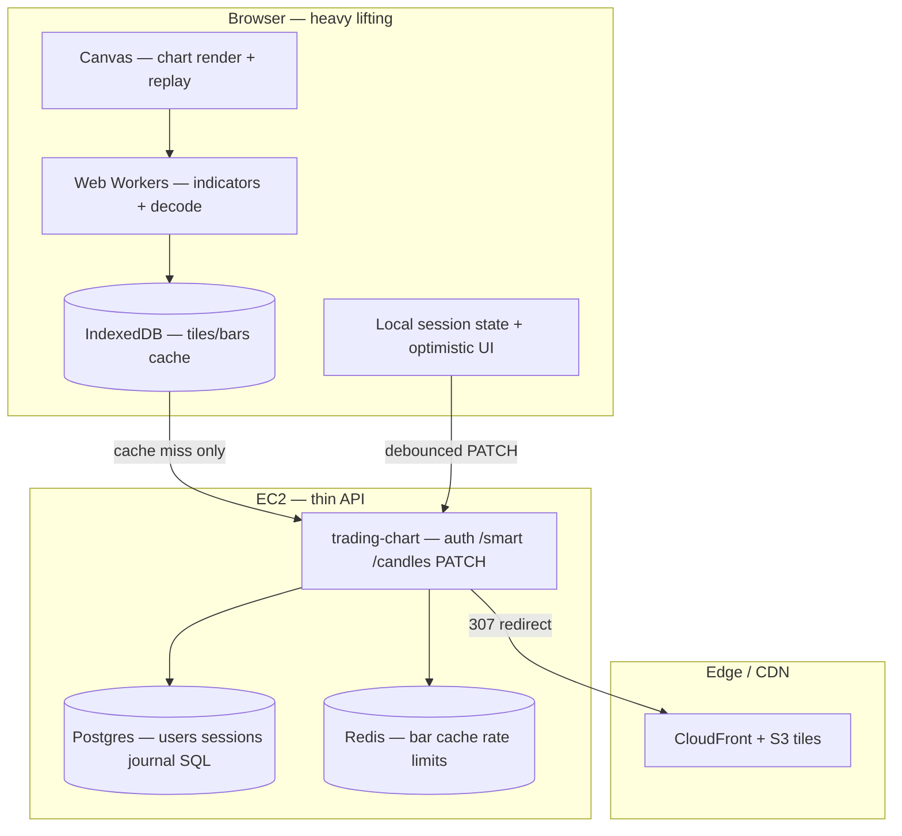

# Talaria — Client-heavy scaling roadmap (full plan)

Step-by-step plan to scale Talaria like TradingView / FXReplay: **heavy work on the user’s device**, **thin server**, **CDN for bar bytes**.

**Target architecture:**



**Related docs:**

| Doc | Topic |
|-----|--------|
| [tile-cdn-phase2-aws.md](./tile-cdn-phase2-aws.md) | S3 + CloudFront setup |
| [backtest-scaling-checklist.md](./backtest-scaling-checklist.md) | Rate limits, Redis cache, Track A–C |
| [chart-multichart-architecture.md](./chart-multichart-architecture.md) | System map |
| [talaria-performance-fixes.md](./talaria-performance-fixes.md) | WEB_CONCURRENCY, nginx static |

---

## Status dashboard

| Layer | Item | Status | Phase |
|-------|------|--------|-------|
| Server | Docker stack healthy | ✅ Done on AWS | 0 |
| Server | `QUESTDB_READ_PRIMARY=false` | ✅ Done | 0 |
| Server | Redis bar window cache | ✅ Done | 0 |
| Server | Per-user rate limits | ✅ Done | 0 |
| Server | `WEB_CONCURRENCY=2` | ✅ Done | 0 |
| Server | DNS + HTTPS + Elastic IP | ⬜ Todo | 1 |
| Server | Tile CDN S3 + CloudFront | ⬜ Todo | 2 |
| Server | 2nd `trading-chart` replica | ⬜ Todo | 7 |
| Client | Canvas chart + client replay | ✅ Done | — |
| Client | Indicator Web Worker | ✅ Done | — |
| Client | IndexedDB tile cache | 🟡 Coded — verify | 3 |
| Client | `/smart` in-memory cache (120s LRU) | ✅ Done | — |
| Client | Debounced session PATCH (4s / 8s replay) | ✅ Done | — |
| Client | Candle decode worker everywhere | ⬜ Todo | 5 |
| Client | Virtual journal lists | ⬜ Todo | 6 |
| Client | WASM indicators | ⬜ Optional | 8 |
| Data | Journal in SQL (lean `state_json`) | 🟡 Partial Track C | 4 |

**Capacity (r6i.2xlarge, eu-north-1):**

| Milestone | Comfortable concurrent active backtesters |
|-----------|------------------------------------------|
| Today (Phase 0) | ~30–40 |
| + Phase 2 CDN | ~50–80 |
| + Phase 3 IndexedDB | ~100–200 |
| + Phase 7 horizontal API | ~150–300 |

---

## Phase 0 — AWS server baseline (done ✅)

Verify on VPS at `/opt/talaria`:

```bash
docker compose ps
curl -s http://localhost/api/status | python3 -m json.tool
docker compose exec -T trading-chart env | grep -E 'QUESTDB_READ_PRIMARY|WEB_CONCURRENCY|REDIS_URL|BACKTEST_BARS'
```

Expected: all containers Up, `redis: ok`, `questdb_read_primary: false`, `WEB_CONCURRENCY=2`.

---

## Phase 1 — Production cutover

**Goal:** Real domain, HTTPS, stable IP.  
**Effort:** ~1 day  
**Capacity impact:** None (required for launch)

### Steps

- [ ] **1.1** Allocate **Elastic IP** in AWS → attach to EC2 (IP won’t change on reboot)
- [ ] **1.2** DNS: `talaria-log.com` / `www` → Elastic IP
- [ ] **1.3** HTTPS: Let’s Encrypt on nginx (or ALB + ACM)
- [ ] **1.4** Update repo root `.env`:
  ```env
  FRONTEND_URL=https://www.talaria-log.com
  CORS_ORIGINS=https://www.talaria-log.com,https://talaria-log.com
  TRUSTED_ORIGINS=https://www.talaria-log.com,https://talaria-log.com
  SESSION_COOKIE_SECURE=true
  ```
- [ ] **1.5** Stripe webhook URL → `https://www.talaria-log.com/...`
- [ ] **1.6** `docker compose up -d` and smoke-test login + chart + journal
- [ ] **1.7** Remove `/root/talaria.pem` from old Hostinger server

### Verify

```bash
curl -I https://www.talaria-log.com
./scripts/check-journal-backend.sh
./scripts/verify-bar-cache-env.sh
```

---

## Phase 2 — Tile CDN (S3 + CloudFront)

**Goal:** Bar **bytes** served from edge; EC2 stops shipping tiles under load.  
**Effort:** ~2–3 days  
**Capacity impact:** +20–40 concurrent users; lower CPU on tile storms

**Full AWS guide:** [tile-cdn-phase2-aws.md](./tile-cdn-phase2-aws.md)

### Steps

- [ ] **2.1** Create S3 bucket `talaria-tiles-prod` (eu-north-1), block public access
- [ ] **2.2** CloudFront distribution + OAC (private bucket)
- [ ] **2.3** IAM role on EC2 for `s3:PutObject` / `s3:ListBucket`
- [ ] **2.4** Sync tiles:
  ```bash
  export TILE_CDN_S3_BUCKET=talaria-tiles-prod
  python3 scripts/sync-tiles-to-s3.py \
    --uploads "$(docker volume inspect talaria_chart_uploads -f '{{.Mountpoint}}')"
  ```
- [ ] **2.5** `.env`:
  ```env
  TILE_CDN_BASE_URL=https://dXXXX.cloudfront.net
  TILE_CDN_REDIRECT=true
  ```
- [ ] **2.6** `docker compose up -d trading-chart`
- [ ] **2.7** Nightly cron: re-run `sync-tiles-to-s3.py` after dataset uploads

### Verify (see before/after difference)

```bash
chmod +x scripts/verify-tile-cdn.sh
./scripts/verify-tile-cdn.sh | tee /tmp/tile-cdn-after.txt
```

**Pass:** HTTP `307` → CloudFront; repeat fetch `x-cache: Hit`; lower `trading-chart` CPU in section 3.

---

## Phase 3 — IndexedDB client cache

**Goal:** Second visit / reload = **no server fetch** for tiles already loaded (diagram: “cache miss only”).  
**Effort:** ~1–2 days (code in repo)  
**Capacity impact:** Largest client win — server mostly auth + saves

### Steps

- [ ] **3.1** Deploy build with `TileIdbCache` + updated `TileManager` in `chart.js`
- [ ] **3.2** Enable (opt-in when ready):
  ```js
  localStorage.setItem('talaria_tile_idb', '1')  // enable IndexedDB tile cache
  localStorage.removeItem('talaria_tile_idb')    // disable (default off)
  ```
- [ ] **3.3** Build + sync homepage:
  ```bash
  npm run build:chart-v9   # from repo root
  docker compose build homepage && docker compose up -d homepage
  ```
- [ ] **3.4** Hard-refresh browser (Ctrl+Shift+R)

### Verify

```bash
chmod +x scripts/verify-tile-idb.sh
./scripts/verify-tile-idb.sh
```

**Browser:**

1. Open chart → DevTools → Network → load a pair (tile requests appear)
2. Hard refresh → same pair → **no** `/tile/` requests (served from IndexedDB)
3. Console: `[tile-idb] hit fileId/tf/idx`

**Pass:** Second load skips network for tiles; server `/api/status` traffic drops on repeat sessions.

---

## Phase 4 — Lean session saves (Track C)

**Goal:** PATCH sends **small** payloads — journal in SQL, not giant `state_json`.  
**Effort:** ~2–3 days  
**Capacity impact:** Faster saves, healthier Postgres

### Steps

- [ ] **4.1** Confirm env on `trading-chart`:
  ```env
  SESSION_JOURNAL_SQL_PRIMARY=true
  SESSION_STRIP_JOURNAL_FROM_STATE_JSON=true
  MAX_JOURNAL_TRADES_PER_SESSION=5000
  ```
- [ ] **4.2** Backfill existing sessions:
  ```bash
  docker compose exec -T trading-chart python3 scripts/backfill_session_journal_sql.py --strip
  ```
- [ ] **4.3** Spot-check 10 sessions: trades visible after reload, analytics unchanged
- [ ] **4.4** Measure PATCH body size before/after (DevTools → Network → PATCH `state`)

### Verify

- PATCH body &lt; ~50 KB for typical session (was potentially MB with journal blob)
- p95 PATCH &lt; 2s under load

---

## Phase 5 — Web Worker polish

**Goal:** Decode/resample off main thread — smoother UI under load.  
**Effort:** ~1–2 days

### Steps

- [ ] **5.1** Wire `chart/workers/candle-decode.worker.js` in `TileManager._decodeBinary` path
- [ ] **5.2** Use worker for large columnar `/smart` payloads in `chart.js`
- [ ] **5.3** Confirm indicator worker fallback still works on worker error

### Verify

- Chrome Performance: main thread less blocked during large dataset load
- No regression on TF switch / replay

---

## Phase 6 — Virtual journal lists

**Goal:** 5000+ trades in session without DOM/memory blow-up.  
**Effort:** ~2–3 days

### Steps

- [ ] **6.1** Identify journal table component (order panel / session trades list)
- [ ] **6.2** Add windowing (`react-window` or virtual scroll) — render visible rows only
- [ ] **6.3** Test session with 1000+ trades: scroll smooth, save/reload OK

---

## Phase 7 — Horizontal API replicas

**Goal:** More parallel `/smart` + `/candles` without one container RAM explosion.  
**When:** Load test fails at ~50–80 users **after** Phases 2–3  
**Effort:** ~1 day

### Steps

- [ ] **7.1** Duplicate `trading-chart` service in `docker-compose.yml` (`trading-chart-2`)
- [ ] **7.2** Shared volume: `chart_uploads` on EFS or same Docker volume
- [ ] **7.3** nginx upstream:
  ```nginx
  upstream trading_chart_api {
      server trading-chart:8000;
      server trading-chart-2:8000;
  }
  ```
- [ ] **7.4** Keep **one** `trading-chart-worker` (background jobs)
- [ ] **7.5** Optional: `WEB_CONCURRENCY=3` per replica if RAM &lt; 70%

### Verify

```bash
./scripts/vps-backtest-healthcheck.sh
# k6 realistic 80 VUs
```

---

## Phase 8 — Optional polish

| Item | When | Notes |
|------|------|-------|
| WASM indicators | UI jank on 10+ indicators | JS worker often enough |
| WebSocket live ticks | Live mode product | Not required for backtest |
| PgBouncer | Postgres connection pressure | Phase 7+ |
| Stripe tier limits | Monetize fair usage | `max_sessions`, rate per plan |
| `TILE_CDN` signed URLs | Private dataset paranoia | file_id guessing today |

---

## Load testing (run after each major phase)

From your PC (k6 installed):

```powershell
$env:K6_BASE_URL = "https://www.talaria-log.com"
$env:K6_SCENARIO = "realistic"
$env:K6_VUS_MAX = "50"
$env:K6_TEST_EMAIL = "loadtest@example.com"
$env:K6_TEST_PASSWORD = "..."
k6 run scripts/load-testing/talaria-k6.js
```

| Metric | Target |
|--------|--------|
| `http_req_failed` | &lt; 5% |
| p95 `/smart` | &lt; 3s |
| Some `429` under stress | OK (rate limits working) |

On server during test: `docker stats`, `free -h`, `df -h /`

---

## What NOT to do

- Don’t move replay to the server
- Don’t duplicate OHLC datasets per user
- Don’t set `WEB_CONCURRENCY=8` without measuring RAM
- Don’t bulk QuestDB sync with `QUESTDB_READ_PRIMARY=false`
- Don’t weaken auth, CSRF, or rate limits to “fix” load
- Don’t skip Elastic IP before DNS cutover

---

## Scripts index

| Script | Purpose |
|--------|---------|
| `scripts/verify-tile-cdn.sh` | Before/after CDN benchmark |
| `scripts/sync-tiles-to-s3.py` | Upload tiles to S3 for CloudFront |
| `scripts/verify-tile-idb.sh` | IndexedDB cache instructions + checks |
| `scripts/verify-bar-cache-env.sh` | Redis bar cache |
| `scripts/vps-backtest-healthcheck.sh` | Full stack health |
| `scripts/check-journal-backend.sh` | Journal + nginx |
| `scripts/load-testing/talaria-k6.js` | Load test |

---

## Code index

| Area | Path |
|------|------|
| TileManager + TileIdbCache | `chart v 1.4/chart/chart.js` |
| Tile CDN redirect | `chart v 1.4/chart/api_server.py` |
| Redis bar cache | `chart v 1.4/chart/bar_window_cache.py` |
| Session journal SQL | `chart v 1.4/chart/session_journal_store.py` |
| Indicator worker | `chart v 1.4/chart/workers/indicator-worker.js` |
| Candle decode worker | `chart v 1.4/chart/workers/candle-decode.worker.js` |
| nginx tile cache | `homepage/nginx.local.conf` |
| Docker stack | `docker-compose.yml` |

---

## Recommended ship order

```text
Phase 1  Production (DNS, HTTPS, Elastic IP)     ← do first
Phase 2  Tile CDN                                 ← server offload
Phase 3  IndexedDB                                ← client offload (biggest win)
Phase 4  Lean PATCH (Track C)                     ← smaller saves
Phase 5  Worker polish                            ← UX smoothness
Phase 6  Virtual journal lists                    ← large sessions
Phase 7  Horizontal API                           ← when load test says so
Phase 8  Optional (WASM, WebSocket, PgBouncer)
```

---

## VPS deploy after `git pull`

**Script:** `scripts/vps-deploy-after-pull.sh`

```bash
cd /opt/talaria
chmod +x scripts/vps-deploy-after-pull.sh

# Most frontend/chart.js fixes (fast, ~2–5 min):
./scripts/vps-deploy-after-pull.sh homepage

# Python API changes (api_server.py, bar cache, etc.):
./scripts/vps-deploy-after-pull.sh api

# Journal backend only:
./scripts/vps-deploy-after-pull.sh journal

# Big release / unsure what changed (~10–20 min):
./scripts/vps-deploy-after-pull.sh full

# Config/.env only — no image rebuild:
./scripts/vps-deploy-after-pull.sh none
docker compose up -d   # picks up .env changes
```

| You changed | Command |
|-------------|---------|
| `chart.js`, `replay-system.js`, `homepage/`, nginx | `homepage` |
| `api_server.py`, Python chart code, `docker-compose.yml` env for API | `api` |
| `journal-backend/` | `journal` |
| Many areas / release | `full` |
| Only `.env` | `none` then `docker compose up -d` |

**Rules:**

- Uses `TMPDIR=/opt/talaria/.tmp` (not RAM `/tmp`) — avoids “disk quota exceeded”
- Do **not** put large files in `/tmp` (use `/opt/talaria/backups`)
- After several builds: `./scripts/vps-cleanup-deploy-cache.sh`
- **GHCR pull deploy** (no host build): `./scripts/vps-deploy-after-pull.sh pull`

---

## Progress log

| Date | Phase | Notes |
|------|-------|-------|
| 2026-06-17 | 0 | AWS EC2 migrated, stack healthy |
| | 2 | Scripts + docs added (`sync-tiles-to-s3.py`, `verify-tile-cdn.sh`) |
| | 3 | `TileIdbCache` added to `chart.js` |
| | | _Update this table as you complete each phase_ |

---

*Last updated: 2026-06-18*
