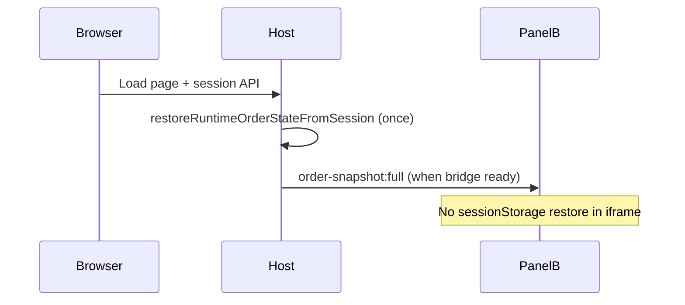

# A6-4 — Host-Canonical Order Store (Design)

**Status:** Ratified target architecture (D-020 / ESC-017); dispatch **deferred post-re-migration**.  
**Scope:** Design only — no product code in this deliverable.  
**RC:** RC-5 (order-entry state model + multichart ownership).  
**Binding decisions:** D-019 (session-scoped persist pending + open), I2 (iframe comms via `postMessage`), I15 (real multichart actuation for proof).

---

## Executive summary

Multichart today runs **one `OrderManager` per document** (host tile A + each iframe). The host is *partially* canonical (trades panel, session PATCH, initial mirror fan-out), but iframes retain **mutable clones** with only **pending** sync (`order:pending-updated`). Open-leg edits, PnL ticks, and A6-2 restore all run per-panel. That split explains the four live symptoms. The fix is **ownership inversion**: a single host store; panels become **render + command surfaces**; one persistence writer; explicit command/query `postMessage` instead of bolting `order:opened-updated` onto the clone model.

**Diagnostic dependencies (explicit):**

| Report | Status | This design uses |
|--------|--------|------------------|
| `ORD-DUP-DURATION-diagnostic-report.md` | **Landded** | Duplication + Duration mechanisms (§1.4, §5 interim) |
| `ORD-MULTICHART-PARITY-diagnostic-report.md` | **Not landed** (prompt only) | Lockout + dual-replay PnL stall hypotheses (§1.2–1.3) — **code-predicted, NEEDS-LIVE** |

Where parity diagnostics disagree with code trace, treat parity as authoritative once filed.

---

## 1. Current-state map

### 1.1 Instance model (who owns what)

| Surface | `window.chart.orderManager` | Role today | Evidence |
|---------|----------------------------|------------|----------|
| **Host (tile A)** | Parent document singleton | Trades panel source; session PATCH; mirror hub | `TalariaV8bLive.jsx` reads `window.chart?.orderManager` (`11624–11631`); `MultichartGrid.jsx` host bus subscription (`6464–6495`) |
| **Panel B/C… iframe** | **Separate** singleton per iframe | Full `OrderManager` + `OrderService`; mutable clone after one-time `addOrder` | `chart-embed.html` loads full chart stack (`class="multichart-embed"`); `panel-cmd-bridge.js` `addOrder` → `registerOpenOrder` (`3495–3523`) |
| **Module scope** | N/A | `order-manager.js` / `order-service.js` are **not** cross-iframe shared — each iframe gets its own instance at chart boot | `OrderManager` constructor binds `OrderService` per chart (`order-manager.js:334–371`) |

There is **no shared JS heap** across iframes. Collisions happen via **shared persistence keys**, **mirror echo loops**, and **host-only UI readers** — not via a global singleton.

### 1.2 Order creation paths

```mermaid
flowchart TD
  subgraph hostPath [Host tile A]
    HExec[Execute / placeOrderButton] --> HPlace[orderManager.placeAdvancedOrder]
    HPlace --> HReg[orderService.registerOpenOrder / registerPendingOrder]
    HReg --> HBus[eventBus order:opened / order:pending]
    HBus --> HMirror[broadcastOrder → peer iframes addOrder]
  end
  subgraph iframePath [Iframe panel B]
    PIntercept[Parent capture intercept] --> PCmd[runCommand placeOrder]
    PCmd --> IPlace[iframe orderManager.placeAdvancedOrder]
    IPlace --> IReg[iframe orderService.register*]
    IReg --> IBus[iframe eventBus]
    IBus --> IPost[postMessage iframe-order]
    IPost --> HMirror2[broadcastOrder → host + peers]
  end
  subgraph primePath [Panel ready prime]
    Ready[readyPanels effect] --> PushHost[host openPositions/pendingOrders]
    PushHost --> AddClone[runCommand addOrder per new panel]
  end
```



| Step | File:line | Notes |
|------|-----------|-------|
| Host placement | `order-manager.js:24820+` `placeAdvancedOrder` | Requires `replaySystem.isActive` (`24823–24826`) |
| Iframe placement (focused panel) | `MultichartGrid.jsx:6693–6718` intercept → `runCommand("placeOrder")` | Parent `#orderPanel` DOM collected (`6145–6174`) |
| Iframe `placeOrder` handler | `panel-cmd-bridge.js:3419–3493` | Also requires iframe replay active (`3478–3480`) |
| Register open | `order-service.js:309–340` | Always `push` to `openPositions` — **no id dedupe on open list** (`336–337`) |
| Prime clones on panel ready | `MultichartGrid.jsx:3780–3800` | One-time push of host snapshot to newly-ready iframes |
| Host→peer mirror | `MultichartGrid.jsx:6388–6455` `broadcastOrder` | `opened` / `pending` → `addOrder`; `pending-updated` → `syncPendingOrder` |
| Iframe→host mirror | `panel-cmd-bridge.js:978–1010` `postIframeOrder` | Forwards bus events to parent |
| **Missing** | grep: no `order:opened-updated` | Open SL/TP drag mutates iframe-local store only (`T4-A6-ORDER-INTERACTION-CONTRACT.md:20`) |

Pending drag sync (partial): `order-manager.js:1087–1100` `_emitPendingMirrorSync` → bus → `MultichartGrid` `syncPendingOrder` (`6437–6449`).

### 1.3 Persistence and rehydration

**Keys (same origin — host and iframes share `sessionStorage` in one tab):**

| Key / path | Writer | Reader | File:line |
|------------|--------|--------|-----------|
| `chart_orders_runtime_session_v1:{sessionId}` | Every `OrderManager` with A6-2 ON | Every instance `_bootstrapRuntimeOrderPersistenceV1` | `order-runtime-persist.mjs:6–29`; `order-manager.js:11–21`, `5250–5312` |
| `chart_orders_runtime_local_v1` (localStorage via `userStorage`) | No-session fallback | Bootstrap fallback | `order-manager.js:9–10`, `5274–5306` |
| API session `state_json` runtime patch | Host `scheduleSessionStateSave` | `chart.js` `loadTradingSessionStateIfNeeded` | `order-manager.js:4198–4200`; `chart.js:10766–10767` |
| Journal / closed trades | API GET session state | `order-manager.js` journal load | `order-manager.js:5047` (not localStorage) |

**Restore assigns arrays, does not rebuild `orders[]`:**

```4320:4321:chart v 1.4/chart/modules/order-manager.js
        if (pendingOrders) this.pendingOrders = pendingOrders;
        if (openPositions) this.openPositions = openPositions;
```

No corresponding assignment to `this.orders` from restored open positions (`4279–4411` region).

**Multiple restore call sites on host alone:**

| Path | File:line |
|------|-----------|
| A6-2 bootstrap (guarded by empty store) | `order-manager.js:5293–5312` |
| Session API / backup | `chart.js:10521–10522`, `10634`, `10766–10767` |

**Iframe restore:** Each iframe runs `_bootstrapRuntimeOrderPersistenceV1` on init (`5200–5201`) against the **same session key**, repopulating a **second** mutable store, then emits `order:opened` → host `addOrder` → duplicate (`ORD-DUP-DURATION-diagnostic-report.md:§8.1`).

### 1.4 PnL recomputation clock

| Layer | Mechanism | Clock source | File:line |
|-------|-----------|--------------|-----------|
| Tick driver | `replaySystem.onUpdate = () => this.updatePositions()` | **Per-document** replay loop | `order-manager.js:5193–5196` |
| Mark / SL/TP | `updatePositions()` | `getCurrentCandle()` on **that** chart; iframe may borrow host candle via `_getMultichartParentGuardCandle` when same instrument+TF | `27905–27912`, `27139–27163` |
| Cross-ticker on host | Background bar branch | `_getBackgroundBarForTicker` when ticker/file mismatch | `27962–27986` |
| Trades table PnL | `buildLiveTradeRowsFromOrderManager` | Reads **host** `openPositions[].unrealizedPnL` | `orderManagerTradeRows.js:1204–1295` |
| Trades table `now` | `rowNowMs` | **Host** `window.chart.replaySystem.replayTimestamp` else wall clock | `orderManagerTradeRows.js:1206–1209` |
| React refresh | `omTradeRev` interval + bus | Host `orderManager.eventBus` — **`order:update-tick` rarely emitted from full `updatePositions`** (service stub `order-service.js:388–396`) | `TalariaV8bLive.jsx:11982–11998` |

**Per-panel replay:** Iframes receive ticks via `panel-cmd-bridge.js` `replayTick` (`3188+`), driving **iframe-local** `updatePositions`. Host replay may be paused while iframe B plays → **host store PnL frozen** → trades panel stale despite 800ms re-render bump.

### 1.5 Symptom → mechanism (four live defects)

#### A. Panel-B order-entry lockout (intermittent)

**Hypothesis rank (NEEDS-LIVE — depends on `ORD-MULTICHART-PARITY` report):**

| Rank | Mechanism | Evidence | Confidence |
|------|-----------|----------|------------|
| 1 | **Iframe replay gate** — `placeOrder` throws when iframe `replaySystem.isActive` false | `panel-cmd-bridge.js:3478–3480`; host path also gates (`MultichartGrid.jsx:4695`) | High for hard no-op |
| 2 | **Stuck interaction guard** — `isDraggingPreviewLine` / `_orderProvisionalEdit.phase !== 'idle'` blocks preview/entry refresh paths | `order-manager.js:1016–1021`, `587–590`, `632–651` cancel handlers | Medium — pointer-loss across iframe boundary unverified |
| 3 | **`_orderPlacedAwaitingReset`** on iframe after place — parent Execute still routes to iframe `placeAdvancedOrder` (bypasses iframe button onclick) | `14341–14349`, `15872–15874` vs intercept `6693–6707` | Low for full lockout; may confuse second entry |
| 4 | **A6-4 clone divergence** — draft/SL state on B doesn't match host; user perceives "can't place" | `_multichartPostDraftSnapshotToParent` draft-only (`24535+`); no open-leg sync | Medium for wrong limits; not pure lockout |

**Not refuted:** Per-panel ownership makes B's entry depend on B's local replay + local guard state while parent rail reads host DOM — a class of desync A6-4 removes.

#### B. PnL stuck when replaying two panels

| Mechanism | Evidence |
|-----------|----------|
| Trades panel reads **host** store; host `updatePositions` runs on **host** replay ticks only | `orderManagerTradeRows.js:1204–1209`; `order-manager.js:5195` |
| Iframe replay ticks update **iframe clone** `unrealizedPnL`, not host | Separate `OrderManager` instances |
| Host background PnL for foreign tickers only advances when **host** `updatePositions` fires | `27962–27986` |
| `order:update-tick` subscription on host bus is weakly driven | `order-service.js:388–396` vs full logic in `order-manager.js:27905+` |

**Coupling:** Same root as canonical-store gap; interim can proxy tick marks to host (§5.3).

#### C. Trades panel duplication after refresh (multichart)

**Confirmed primary path** (`ORD-DUP-DURATION-diagnostic-report.md`):

1. Host restores `openPositions` from session (`4320–4321`); `orders[]` empty.
2. Each iframe bootstraps same session key → local open copy.
3. Iframe emits `order:opened` → `broadcastOrder` → host `addOrder` → `registerOpenOrder` push (`order-service.js:336`) — dedupe checks **`orders[]` only** (`panel-cmd-bridge.js:3505–3510`, `MultichartGrid.jsx:4713–4714`).

Node simulation from diagnostic: `after restore: open=1 orders=0` → `after mirror addOrder: open=2 orders=1`.

#### D. Wrong Duration column

| Mechanism | Evidence |
|-----------|----------|
| `v9TradeDuration` uses raw `openTime` without `normalizeEpochMs` | `orderManagerTradeRows.js:21–27`, `1272–1295` |
| Duplicate rows carry inconsistent `openTime` / fallback `Date.now()` | Linked to §C (`ORD-DUP-DURATION-diagnostic-report.md:§9`) |
| `rowNowMs` uses host replay ts — duplicate rows with mixed `openTime` units → 5138h vs 90h | `1206–1209` |

---

## 2. Target design — host-canonical store

### 2.1 Principles

1. **Exactly one mutator:** host `HostOrderStore` (facade over existing `OrderService` + journal/account fields on host `orderManager`).
2. **Panels are projections:** iframe `orderManager` open/pending lists become **read-only mirrors** for drawing only, or are bypassed for store mutation entirely.
3. **Commands in, snapshots out:** all placement, drag-release, close, cancel → host; host emits versioned snapshots to panels.
4. **Single persistence writer:** host only calls `persistRuntimeOrderState` / `scheduleSessionStateSave`.
5. **Do not** add `order:opened-updated` fan-out on the clone model as the final architecture — that is a conceivable **interim** only (§5).

### 2.2 Data model

```typescript
/** Host-only authoritative document */
interface HostOrderStoreSnapshot {
  version: number;              // monotonic per session
  sessionId: string | null;
  pendingOrders: PendingOrder[];
  openPositions: OpenPosition[];
  closedPositions: ClosedPosition[];  // recent window for markers — full history in journal
  orders: Order[];              // union index — always rebuilt on restore
  account: {
    balance: number;
    equity: number;
    initialBalance: number;
    sessionCurrentTime?: number;  // replay/session clock
  };
  counters: { orderIdCounter: number; tradeGroupIdCounter: number };
}

/** Per-panel projection (iframe cache) */
interface PanelOrderProjection {
  panelId: string;
  symbol: string;
  fileId: string;
  snapshotVersion: number;
  /** Positions visible on this panel (same instrument OR explicit mirror rules) */
  visibleOpen: OpenPosition[];
  visiblePending: PendingOrder[];
}
```

**Identity:** Order id globally unique in host store. Panel projection filters by existing mirror rules (`normalizeOrderTickerForMirror`, `sourceFileId` — today in `MultichartGrid.jsx:6198–6236`).

**Versioning:** Host increments `version` on every successful mutation. Panels ignore stale snapshots (`version <= lastApplied`).

### 2.3 Ownership inversion

| Concern | Before | After |
|---------|--------|-------|
| `registerOpenOrder` / `registerPendingOrder` | Any panel | **Host only** |
| `placeAdvancedOrder` body | iframe or host | Host executes; iframe sends command |
| Open SL/TP drag | Mutates iframe `openPositions` | iframe sends `order-command:patch-open-leg`; host commits; fan-out snapshot |
| `updatePositions` / fills / PnL | Per panel | Host authoritative; iframe runs **display-only** mark override from snapshot OR host pushes computed `unrealizedPnL` |
| `persistRuntimeOrderState` | Any instance | Host only |
| Trades panel | Host `orderManager` (unchanged reader) | Same — now truly canonical |

### 2.4 Command / query flow (I2 — postMessage)

Extend existing `iframe-order` / `runCommand` transport; prefer **typed envelopes** on the host listener in `MultichartGrid.jsx` (today `6516–6681`).

#### Commands (iframe → host)

| Message type | Payload | Host action |
|--------------|---------|-------------|
| `order-command:place` | `{ panelId, side, type, quantity, entryPrice, sl, tp, … }` | Validate replay active for **that panel's chart context**; host `placeAdvancedOrder` with panel attribution (`sourcePanelId`, `sourceFileId`) |
| `order-command:patch-pending` | `{ orderId, patch }` | Merge pending; bump version; persist |
| `order-command:patch-open-leg` | `{ orderId, stopLoss?, takeProfit?, … }` | Apply-on-release commit (A6-1); bump version |
| `order-command:close` | `{ orderId, … }` | `closePosition` |
| `order-command:cancel-pending` | `{ orderId }` | `cancelPendingOrder` |
| `order-command:request-snapshot` | `{ panelId, sinceVersion? }` | Reply with projection |

#### Queries / events (host → iframe)

| Message type | Payload | Panel action |
|--------------|---------|--------------|
| `order-snapshot:full` | `HostOrderStoreSnapshot` | Replace projection; redraw lines |
| `order-snapshot:delta` | `{ version, changedIds[], pending[], open[] }` | Merge + redraw (optimization) |
| `order-snapshot:remove` | `{ orderId, kind }` | Remove lines (replaces `removeMirroredOrder` fan-out) |

**Replace** bi-directional `iframe-order` opened/pending echo for mutations — keep echo only as **legacy shim** during migration (Step 0).

**Replay coupling:** Host registers **one** `updatePositions` on host replay **and** subscribes to per-panel replay tick notifications (`replayTick` already flows through `panel-cmd-bridge.js:3188+`) to advance marks for positions tagged with that panel's instrument — unifying PnL without requiring host playhead to move.

### 2.5 Panel rendering from host store

1. Host maintains `Map<panelId, PanelOrderProjection>`.
2. On snapshot, host sends `order-snapshot:*` via `multichart-manager` / `runCommand('applyOrderSnapshot', …)` new bridge case.
3. Iframe **`applyOrderSnapshot`**:
   - Updates read-only mirror arrays (or dedicated `projectionStore`).
   - Calls existing draw routines: `drawOrderLine`, `drawSLTPLines`, `updateOrderLines` (`panel-cmd-bridge.js:3547–3557` pattern).
   - **Does not** call `registerOpenOrder` on snapshot apply.
4. Local drag: iframe shows provisional geometry (A6-1 guard unchanged); **commit** posts `order-command:patch-open-leg` to host.

### 2.6 Single persistence / refresh

| Rule | Implementation |
|------|----------------|
| Write | Host `_schedulePersistAfterOrderMutation` only |
| Iframe bootstrap | **Skip** `_bootstrapRuntimeOrderPersistenceV1` when `multichart-embed` (`chart-embed.html:2`) |
| Restore | Host restores once; then `order-snapshot:full` to all ready panels |
| `orders[]` rebuild | On host restore, rebuild union index from pending + open (fixes dedupe gap — see interim §5.1) |
| Session PATCH | Unchanged — host `chart.scheduleSessionStateSave` |

F5 flow:



---

## 3. Migration steps (ordered, one kill-switch each)

Master switch (proposed, extends contract):  
`window.__TALARIA_DISABLE_ORDER_MC_STATE_CONVERGE_FIX` — **unset = new architecture ON** (matches `T4-A6-ORDER-INTERACTION-CONTRACT.md:20`).

| Step | Switch (OFF = revert to today) | Behavior | Files touched |
|------|-------------------------------|----------|---------------|
| **0 — Shim** | `__TALARIA_DISABLE_ORDER_MC_HOST_STORE_SHIM_V1` | Host-only restore; iframes skip A6-2 bootstrap; optional `order:opened-updated` fan-out (if needed before full cut) | `order-manager.js` (bootstrap guard), `MultichartGrid.jsx`, `panel-cmd-bridge.js` |
| **1 — Single writer** | `__TALARIA_DISABLE_ORDER_MC_HOST_PERSIST_ONLY_V1` | Disable iframe `persistRuntimeOrderState` / pagehide flush | `order-manager.js` |
| **2 — Command place** | `__TALARIA_DISABLE_ORDER_MC_HOST_PLACE_V1` | All `placeOrder` routes to host; iframe `placeAdvancedOrder` rejects direct mutation | `MultichartGrid.jsx`, `panel-cmd-bridge.js` |
| **3 — Snapshot render** | `__TALARIA_DISABLE_ORDER_MC_SNAPSHOT_PROJECTION_V1` | Replace `addOrder` register path with `applyOrderSnapshot` | `MultichartGrid.jsx`, `panel-cmd-bridge.js`, `order-manager.js` (snapshot builder) |
| **4 — Open-leg commands** | `__TALARIA_DISABLE_ORDER_MC_OPEN_PATCH_V1` | SL/TP commit → host; remove iframe-local open mutation | `order-manager.js`, `order-interaction-guard.mjs` (commit hook), `panel-cmd-bridge.js` |
| **5 — PnL tick hub** | `__TALARIA_DISABLE_ORDER_MC_PNL_HUB_V1` | Host `updatePositions` driven by aggregated panel replay ticks | `MultichartGrid.jsx`, `order-manager.js` |
| **6 — Retire clone bus** | `__TALARIA_DISABLE_ORDER_MC_LEGACY_IFRAME_ORDER_V1` | Remove `iframe-order` opened/pending echo; snapshot-only | `MultichartGrid.jsx`, `panel-cmd-bridge.js` |

Each step must pass its RED with **prior steps ON, target step OFF → RED**, all ON → GREEN.

**Deploy note:** Steps 0–1 are partially freeze-safe (order-manager only). Steps 2–6 require `MultichartGrid.jsx` + `panel-cmd-bridge.js` — post-re-migration lane per D-020.

---

## 4. Freeze-safe interim mitigations (pre–full rework)

`chart.js` is **FROZEN** — none of the below edit `chart.js`.

| ID | Symptom | Fix | Switch (unset = fix ON) | Files |
|----|---------|-----|-------------------------|-------|
| **INT-1** | Duplication on F5 | `registerOpenOrder`: skip if `openPositions.some(id)` | `__TALARIA_DISABLE_ORDER_OPEN_DEDUPE_V1` | `order-service.js:309–340` |
| **INT-2** | Duplication on F5 | Rebuild `orders[]` on restore from pending+open | `__TALARIA_DISABLE_ORDER_RESTORE_REBUILD_ORDERS_V1` | `order-manager.js:4279+` |
| **INT-3** | Duplication on F5 | Iframe skip A6-2 bootstrap in embed | `__TALARIA_DISABLE_ORDER_MC_IFRAME_RESTORE_SKIP_V1` | `order-manager.js:5293+` |
| **INT-4** | Duplication | Host skip `addOrder` when open id exists | `__TALARIA_DISABLE_MC_HOST_ORDER_MIRROR_V1` | `MultichartGrid.jsx:4706+` |
| **INT-5** | Wrong Duration | `normalizeEpochMs` in row builder | `__TALARIA_DISABLE_TRADE_DURATION_NORM_V1` | `orderManagerTradeRows.js:21–27`, `1272–1295` |
| **INT-6** | Lockout (guard) | Watchdog: clear provisional if pointer suppressed > N s | `__TALARIA_DISABLE_ORDER_GUARD_STUCK_RESET_V1` | `order-interaction-guard.mjs`, `order-manager.js` (`_oiEnsureProvisionalCancelHandlers`) |
| **INT-7** | Lockout (replay gate) | Parent sync replay active flag before iframe place | `__TALARIA_DISABLE_ORDER_MC_PLACE_REPLAY_SYNC_V1` | `MultichartGrid.jsx`, `panel-cmd-bridge.js` |
| **INT-8** | PnL stall | On iframe replay tick, postMessage host to run background mark for that symbol | `__TALARIA_DISABLE_ORDER_MC_TICK_PNL_PROXY_V1` | `panel-cmd-bridge.js`, `MultichartGrid.jsx`, `order-manager.js` (narrow hook) |

**Not recommended as final fix:** persisting per-panel namespaced session keys — fights D-019 session-scoped model and duplicates account state. Prefer **INT-3** (iframe skip restore) + host-canonical path.

Rank order matches `ORD-DUP-DURATION-diagnostic-report.md:§11` for dup/duration; INT-6/7/8 address parity symptoms pending diagnostic confirmation.

---

## 5. Kill-switch strategy

| Layer | Policy |
|-------|--------|
| Naming | `__TALARIA_DISABLE_<AREA>_<FEATURE>_V1` — unset means fix/architecture **ON** |
| Master | `__TALARIA_DISABLE_ORDER_MC_STATE_CONVERGE_FIX` gates entire A6-4 package |
| Granularity | One switch per migration step (§3) + one per interim (§4) so bisect is deterministic |
| I13 | Full revert of Steps 2–6 requires coordinated OFF on host + all iframes — document in runbook |
| Default | New code ships with switches **unset (ON)**; staging validates OFF repro before DONE |

---

## 6. Test discriminators (I15-honest)

| ID | Setup | Actuation | Assert GREEN | Switch OFF → RED |
|----|-------|-----------|--------------|------------------|
| **A6-4-RED-1** | 2-up multichart, same symbol | Place on B, drag SL on B, release | Host + A `stopLoss` equal; one store id | B local ≠ host |
| **A6-4-RED-2** | 2-up, different tickers, one order each | Play replay on both 30s | Trades panel PnL updates both rows | Host PnL frozen for B ticker |
| **A6-4-RED-3** | 2-up, place 1 order | F5 reload | `openPositions.length === 1`; tab count === rows | length ≥ 2 |
| **A6-4-RED-4** | After RED-3 | Duration column | Single sane duration; no 5138h outlier | Wild spread |
| **A6-4-RED-5** | 2-up | Place on B ×3 after prior place | All succeed (no lockout) | Intermittent throw / no-op |
| **RC5-ORD-DUP-1..3** | From dup diagnostic | As specified in `ORD-DUP-DURATION-diagnostic-report.md:§12` | Dedup invariants | Per diagnostic |

**Proof bars:** Real iframe pointer for drag (not `runCommand` only). Built product / multichart harness. Switch-OFF must reproduce **today's** failure mode, not a weaker variant.

---

## 7. Files touched (summary)

### Full A6-4 rework

| File | Changes |
|------|---------|
| `chart v 1.4/talaria-design/src/MultichartGrid.jsx` | Host store facade, command router, snapshot fan-out, retire `broadcastOrder` clone path |
| `chart v 1.4/chart/multichart-prod/panel-cmd-bridge.js` | `applyOrderSnapshot`, command postMessage, disable local register on mirror |
| `chart v 1.4/chart/modules/order-manager.js` | Host-only mutation helpers, snapshot builder, optional PnL hub hooks, iframe bootstrap guard |
| `chart v 1.4/chart/modules/order-interaction-guard.mjs` | Commit callback → host command (browser + tests) |
| `chart v 1.4/chart/modules/order-service.js` | Dedupe + emit contract (`order:store-changed` or keep granular events from host only) |
| `chart v 1.4/chart/modules/order-runtime-persist.mjs` | Document single-writer expectation |
| `chart v 1.4/talaria-design/src/orderManagerTradeRows.js` | Duration norm (may ship earlier as INT-5) |
| `chart v 1.4/talaria-design/src/TalariaV8bLive.jsx` | Optional: subscribe to host store version event (if bus shape changes) |
| Mirror tree | `homepage/public/chart/**` (I8 parity) |
| Harness | `multichart-prod/harness/` — register RED rows (Lane 4) |

**Explicitly not required for A6-4:** `chart.js` (unless later session-hook coordination), `replay-system.js` (per A6 contract).

### Interim only (§4)

| INT | Files |
|-----|-------|
| 1–2, 6, 8 | `order-service.js`, `order-manager.js`, `order-interaction-guard.mjs` |
| 3–4, 7–8 | `MultichartGrid.jsx`, `panel-cmd-bridge.js` |
| 5 | `orderManagerTradeRows.js` |

---

## 8. Uncertainties and open items

1. **`ORD-MULTICHART-PARITY-diagnostic-report.md` not filed** — lockout root cause may be replay gate vs stuck guard vs focus routing; INT-6/7 ordering may change after live bisect.
2. **Tab count 4 vs rows 8–10** — diagnostic refutes count≠source for single layer but leaves React key collision / dual DOM (legacy + React) — NEEDS-LIVE (`ORD-DUP-DURATION:§8.1`).
3. **Option: iframe store elimination vs read-only mirror** — design prefers read-only mirror first (lower draw-stack churn); full removal of iframe `orderManager` is a later simplification.
4. **Multi-instrument margin / `recomputeSharedMarginState`** — host already owns account; verify cross-ticker margin when all fills route host-side (likely OK — `order-service.js:338`).
5. **Phase 7 collision** — schedule beside re-migration Phase 7 per `RESOLUTION-TRACKER.csv:36`; avoid parallel edits to `panel-cmd-bridge.js` without merge plan.
6. **Shim `order:opened-updated`** — acceptable as Step 0 bridge only; do not document as target architecture (D-020 binding).

---

## 9. References

- `docs/tickets-overhaul/T4-A6-ORDER-INTERACTION-CONTRACT.md` — A6-4 row + diagnostic table
- `docs/tickets-overhaul/DIRECTOR-DECISIONS.md` — D-020 ratification
- `docs/tickets-overhaul/worker-reports/ORD-DUP-DURATION-diagnostic-report.md` — dup + duration
- `docs/tickets-overhaul/worker-prompts/ORD-MULTICHART-PARITY-diagnostic-lane3.md` — pending parity diagnostic
- `docs/tickets-overhaul/RESOLUTION-TRACKER.csv` — A6-4 row (`DEFERRED`)

---

*Design author: A6-4 architecture task (read-only). Evidence lines refer to `chart v 1.4/chart/**` canonical tree.*
