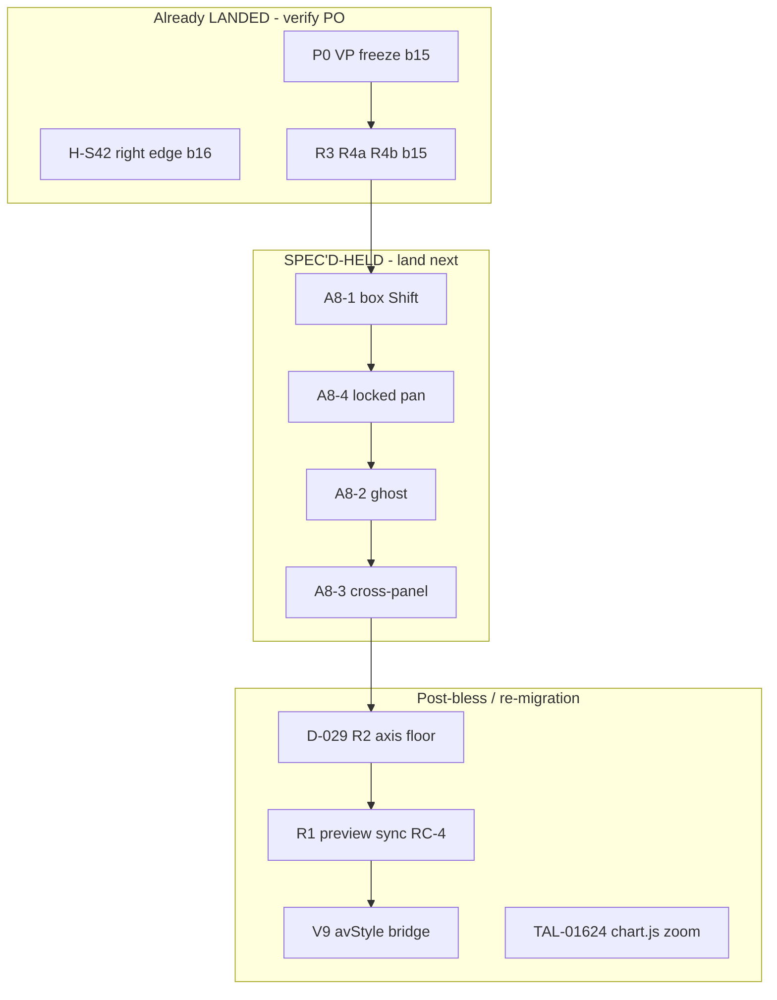

# Volume-profile + modifier-drag + locked-drawing — ticket-family closure sweep

**Task:** Lane 5 read-only inventory (drawing batch gate prep).  
**Scope:** VP / anchored-VP cluster (A7b), shift-resize family (A8), locked pass-through (A8-4), and **directly related** legacy registry parents.  
**As-of:** build **`20260717b16`** (H-S42); A7b P0 + R3/R4a/R4b on **`20260717b15`** per worker reports.  
**Status:** Docs only — no product/harness edits.

**Disposition key:**

| Label | Meaning |
|-------|---------|
| **LANDED** | Freeze-safe (or blessed) code in I8 trees; may still need PO retest / harness GREEN |
| **SPEC'D-HELD** | Implementation or harness spec written; **HOLD** until gate (A6-4, post-bless `chart.js`, re-migration) |
| **OPEN / UNROUTED** | No landed fix and no spec row — **gap risk** |

---

## 1. Executive summary

| Bucket | Ticket count (intake) | Notes |
|--------|----------------------|--------|
| **LANDED** (drawing modules) | 10 ticket-rows | P0 freeze, H-S42, R3, R4a, R4b |
| **SPEC'D-HELD** | 12 ticket-rows | D-029 R2, A8-1…4 harness+impl, A8-5 PO-gated, A7b R1 re-migration |
| **OPEN / UNROUTED** | 5 gaps flagged | §4 — must route before batch sign-off |

**Not in bless path:** entire A7b/A8 drawing batch is queued **after A6-4 ship-gate** (`A8-FREEZE-SAFE-IMPL-SPEC.md` §0). LANDED rows are in worktree / lane reports; PO closure still **STAGED**.

---

## 2. Master table — intake tickets (2026-07-15/16 export)

### 2.1 A7b — Volume Profile / Anchored Volume Profile

| Ticket | Symptom (short) | Mechanism (root leg) | Fix / switch | Disposition |
|--------|-----------------|----------------------|--------------|-------------|
| **TAL-01665** | Price + time scales vanish on placement | **R2** — `margin.r`/`margin.b` collapse in multichart; `drawAxes` skips labels when `axisW→0` | **`D-029 R2`:** `__TALARIA_DISABLE_AXIS_MARGIN_FLOOR_AFTER_VP_FIX` + `H-A7b-R2` | **SPEC'D-HELD** — [`D029-R2-AXIS-MARGIN-CLAMP-IMPL-SPEC.md`](D029-R2-AXIS-MARGIN-CLAMP-IMPL-SPEC.md); **`chart.js` post-bless** |
| **TAL-01666** | Cannot control chart / layout issues after add | **R2** + **R3** (pan block) + **R1** (peer pollution) | R2 → D-029; R3 → `__TALARIA_DISABLE_VP_BODY_PAN_BLOCK_FIX` | **PARTIAL LANDED** — R3 **LANDED** (b15); R2 **SPEC'D-HELD**; R1 **SPEC'D-HELD** (RC-4) |
| **TAL-01667** | Tool “disappears”; control lost until removed | **R1** + **R2** (+ P0 freeze overlap) | P0 recursion fix; R1 sync; R2 D-029 | **PARTIAL LANDED** — **P0 LANDED**; R1/R2 **SPEC'D-HELD** |
| **TAL-01661** | Fixed-range VP preview on **all** layouts while drawing | **R1** — `_syncLivePreviewDrawing` → `broadcastDrawingChange` | Re-migration / Phase-5 **RC-4** preview filter (no Lane 5 switch yet) | **SPEC'D-HELD** — diagnostic [`A7b-volume-profile-diagnostic-report.md`](worker-reports/A7b-volume-profile-diagnostic-report.md) §R1; **Manager / RC-4 tranche** |
| **TAL-01662** | Fixed-range VP price/time labels don’t work | **R4** — axis highlight geometry + default-on labels | **R4a:** `__TALARIA_DISABLE_VP_AXIS_HIGHLIGHT_GEOMETRY_FIX`; **R4b:** `__TALARIA_DISABLE_VP_AXIS_LABEL_DEFAULT_ON_FIX` | **LANDED (PARTIAL)** — engine **b15**; **V9 `avStyle` bridge gap** for anchored VP → **OPEN** (§4.1) |
| **TAL-01664** | Cannot adjust tool position (labels/coordinates) | **R4** — axis bands + coordinates tab context; **R3** if drag blocked | Same R4a/R4b + pan R3 | **LANDED (PARTIAL)** — highlight/defaults **b15**; **coordinates reposition** not fully proven → **OPEN** (§4.2) |

**P0 / anchoring (whole-cluster enabler, not a single ticket):**

| Mechanism | Fix / switch | Disposition | Tickets helped |
|-----------|--------------|-------------|----------------|
| Stack overflow `resolveDrawingPoints` ↔ `resolveAnchoredVolumeProfileRange` | Break recursion in `drawing-tools-base.js`; render-storm guard; bin cache | **LANDED** — [`A7b-P0-anchored-VP-freeze-report.md`](worker-reports/A7b-P0-anchored-VP-freeze-report.md), **b15** | **01665–01667** (freeze class); unblocks placement testing |
| Ancillary perf | `__TALARIA_DISABLE_ANCHORED_VP_BIN_CACHE_FIX`; `__TALARIA_DISABLE_DRAWING_INVALIDATION_DURING_RENDER_GUARD` | **LANDED** (b15) | Perf only |
| Right-edge drift 1m→5m (**H-S42**) | `__TALARIA_DISABLE_ANCHORED_VP_RIGHT_EDGE_TIMESTAMP_FIX` | **LANDED (PROVEN)** — **10/10** [`HS42-anchored-vp-drift-report.md`](worker-reports/HS42-anchored-vp-drift-report.md), **b16** | Anchored VP TF switch (RC-3 class) |

**R3 / R4 tranche (freeze-safe):**

| Leg | Switch (unset = ON) | Report | Harness |
|-----|---------------------|--------|---------|
| **R3** pan on zone background | `__TALARIA_DISABLE_VP_BODY_PAN_BLOCK_FIX` | [`A7b-tranche1-R3-R4a-IMPL-report.md`](worker-reports/A7b-tranche1-R3-R4a-IMPL-report.md) | NEEDS-LIVE (no H-S* VP pan row) |
| **R4a** axis highlight geometry | `__TALARIA_DISABLE_VP_AXIS_HIGHLIGHT_GEOMETRY_FIX` | same | NEEDS-LIVE |
| **R4b** VP label defaults ON | `__TALARIA_DISABLE_VP_AXIS_LABEL_DEFAULT_ON_FIX` | same | NEEDS-LIVE |

---

### 2.2 A8 — Shift-modifier / resize family

| Ticket | Symptom (short) | Mechanism | Fix / switch | Disposition |
|--------|-----------------|-----------|--------------|-------------|
| **TAL-01593** | Shift + rectangle corner → jumps to chart top/bottom | **A8-1** — `squareConstrainedBoxPoint` mixes bar-index Δx with price Δy | `__TALARIA_DISABLE_A8_BOX_SHIFT_SQUARE_PIXEL_FIX` | **SPEC'D-HELD** — [`A8-FREEZE-SAFE-IMPL-SPEC.md`](A8-FREEZE-SAFE-IMPL-SPEC.md) §A8-1; harness **`H-A8-1`** [`A8-RED-HARNESS-SPECS.md`](A8-RED-HARNESS-SPECS.md) |
| **TAL-01654** | Seven Shift tools (trendline, ray, … parallel channel, regression) | **A8-1/2** for box+line paths; **A8-5** registry gap for channel tools | A8-1 switch; **A8-5:** `__TALARIA_DISABLE_A8_PARALLEL_REGRESSION_SHIFT_SNAP_FIX` (PO-gated) | **SPEC'D-HELD** — core tools covered by A8-1/2; **01654 channel subset → A8-5 HOLD** |
| **TAL-01655** | Shift + drag → duplicate at origin | **A8-2** — body d3 drag skips `_commitStaleDrawingGroupTransform`; live render/sync | `__TALARIA_DISABLE_A8_SHIFT_DRAG_STALE_TRANSFORM_FIX` | **SPEC'D-HELD** — §A8-2; **`H-A8-2`** |
| **TAL-01651** | Shift tools misaligned across layouts / start point | **A8-3** — live `_broadcastLiveEditUpdate` drops `timestampPoints` | `__TALARIA_DISABLE_A8_SHIFT_LIVE_CROSSPANEL_SYNC_FIX` | **SPEC'D-HELD** — §A8-3; **`H-A8-3`**; full mixed-TF parity may still need **RC-4** |

**Related interaction (A8 diagnostic, not shift-resize):**

| Ticket | Symptom | Mechanism | Fix / switch | Disposition |
|--------|---------|-----------|--------------|-------------|
| **TAL-01624** | Keyboard zoom wrong anchor (want right-edge candle) | `chart.js` `zoomAtLastCandle` pins `data.length-1` vs visible right edge | **`__TALARIA_DISABLE_KEYBOARD_ZOOM_VISIBLE_RIGHT_EDGE_FIX`** (Manager) | **OPEN / UNROUTED (Lane 5)** — [`A8-FREEZE-SAFE-IMPL-SPEC.md`](A8-FREEZE-SAFE-IMPL-SPEC.md) §9; **frozen `chart.js`** |

---

### 2.3 Locked drawing pass-through

| Ticket | Symptom (short) | Mechanism | Fix / switch | Disposition |
|--------|-----------------|-----------|--------------|-------------|
| **TAL-01652** | Grab locked tool → chart doesn’t pan | Locked SVG hit targets + `mousedown.locked-guard`; no pan forward | **A8-4:** `__TALARIA_DISABLE_A8_LOCKED_DRAWING_PAN_PASSTHROUGH_FIX` | **SPEC'D-HELD** — §A8-4; **`H-A8-4`** |

---

### 2.4 VP-adjacent chrome (same intake batch, not A8 core)

| Ticket | Symptom (short) | Mechanism | Fix / switch | Disposition |
|--------|-----------------|-----------|--------------|-------------|
| **TAL-01656** | Too many anchor control points (VP tools) | **R5** — handle chrome / anchor UX | UI-polish batch (Lane 5 fill) | **OPEN / UNROUTED** — cited A7b §R5; **no impl spec** |
| **TAL-01657** | VWAP double control points at start | **R5** — anchored VWAP handle layout | UI-polish batch | **OPEN / UNROUTED** — same |

---

## 3. Legacy registry parents (pre-intake, same family)

| Parent | Area | Overlap with 2026 intake | Disposition |
|--------|------|--------------------------|-------------|
| **TAL-00323** | Fixed-range volume profile (27 sub-rows) | Pan block (#8→R3), labels (#10,#15→R4), body drag (#13), first-click (#4,#14→RC-1) | **PARTIAL MAP** — R3/R4 **LANDED** where listed; RC-1/RC-3 sub-rows **separate tracks** (re-migration / RC-3); not re-ticketed in 0166x |
| **TAL-00882** | Anchored volume profile (3 msgs) | “Same bugs as fixed VP” → routes to **01662–01667** + **H-S42** | **PARTIAL LANDED** — P0 + H-S42 + R4; scale **R2** still SPEC'D-HELD |
| **TAL-00322** | Anchored VWAP (29 msgs) | **01657** control-point chrome only in this sweep | **OPEN / UNROUTED** for VWAP body (A7 indicator perf **separate** — not VP family) |

---

## 4. Gaps — not covered by LANDED or SPEC'D-HELD (action required)

| # | Gap | Affected tickets | Recommended route |
|---|-----|------------------|-------------------|
| **4.1** | **V9 anchored-VP label bridge** — `avStyle` omits price/time label props; engine R4b alone insufficient in production shell | **TAL-01662**, **01664** (anchored path) | Re-migration / `TalariaV8bLive.jsx` tranche (frozen); note in [`A7b-tranche1-R3-R4a-IMPL-report.md`](worker-reports/A7b-tranche1-R3-R4a-IMPL-report.md) §5 |
| **4.2** | **Coordinates-tab reposition** (tester: “adjust position on chart”) — R4a bands ≠ full coordinates editor parity | **TAL-01664** | Lane 5 diagnostic NEEDS-LIVE after R4 land; may need drawing-tools-ui + V9 transport |
| **4.3** | **Cross-layout VP preview (R1)** — no kill-switch spec, only RC-4 handoff | **TAL-01661**, amplifies **01666/01667** | Manager: Phase-5/RC-4 preview-scoped sync; attach A7b §R1 evidence |
| **4.4** | **VP anchor chrome (R5)** — excess/double handles | **TAL-01656**, **01657** | UI-polish batch prompt (Lane 5 fill); not in A8/A7b impl specs |
| **4.5** | **Harness rows for landed A7b legs** — R3/R4 no `H-S*`; R2 only in D-029 | Proof bar for bless | Lane 4: optional `H-A7b-R3`/`R4` companions; **H-A7b-R2** required for R2 |
| **4.6** | **Keyboard zoom (TAL-01624)** | Listed in A8 intake but **out of Lane 5 fence** | Manager `chart.js` batch item; do not block A8 drawing land |

---

## 5. A8 tranche queue (SPEC'D-HELD detail)

| Tranche | Switch | Harness | Gate | Tickets (primary) |
|---------|--------|---------|------|-------------------|
| **A8-1** | `__TALARIA_DISABLE_A8_BOX_SHIFT_SQUARE_PIXEL_FIX` | `H-A8-1` | After A6-4 | **01593** |
| **A8-4** | `__TALARIA_DISABLE_A8_LOCKED_DRAWING_PAN_PASSTHROUGH_FIX` | `H-A8-4` | After A6-4 | **01652** |
| **A8-2** | `__TALARIA_DISABLE_A8_SHIFT_DRAG_STALE_TRANSFORM_FIX` | `H-A8-2` | After A6-4 | **01655** |
| **A8-3** | `__TALARIA_DISABLE_A8_SHIFT_LIVE_CROSSPANEL_SYNC_FIX` | `H-A8-3` | After A6-4 | **01651** (+ multichart **01655**) |
| **A8-5** | `__TALARIA_DISABLE_A8_PARALLEL_REGRESSION_SHIFT_SNAP_FIX` | — (NEEDS-LIVE first) | PO-gated | **01654** subset |

**Docs:** [`A8-FREEZE-SAFE-IMPL-SPEC.md`](A8-FREEZE-SAFE-IMPL-SPEC.md), [`A8-RED-HARNESS-SPECS.md`](A8-RED-HARNESS-SPECS.md), HOLD prompt [`worker-prompts/A8-freeze-safe-IMPL-lane5-HOLD.md`](worker-prompts/A8-freeze-safe-IMPL-lane5-HOLD.md).

---

## 6. Suggested closure order when drawing batch lands

1. **PO retest** LANDED legs on **`20260717b16`** (console build id + module parity).  
2. **Lane 5** land A8 tranches per HOLD prompt (after **A6-4 gate**).  
3. **Lane 4** wire **H-A8-*** + capture RED-first; register **H-A7b-R2** when D-029 authorized.  
4. **Manager** schedule **R2** (first post-bless `chart.js` edit), **R1**, **V9 bridge**, **01624**.  
5. **Route gaps** §4.1–4.4 before marking VP cluster **CLOSED**.

---

## 7. Scoreboard cross-check

| Ticket | `PLAN2-SCOREBOARD.csv` track | This sweep |
|--------|------------------------------|------------|
| TAL-01665–01667, 01661–01662, 01664 | A7b(L5) IN-TRACK | Partial LANDED + SPEC'D-HELD |
| TAL-01593, 01654–01655, 01651 | A8(L5) IN-TRACK | SPEC'D-HELD |
| TAL-01652 | T1-locked(L5) IN-TRACK | SPEC'D-HELD (A8-4) |
| TAL-01624 | T2-zoom(L5) IN-TRACK | OPEN (Manager) |
| TAL-01656–01657 | UI-polish(L5) IN-TRACK | OPEN / UNROUTED |

**Not in this family (excluded from table):** TAL-01663 (order freeze), TAL-01658/01669 (orders), TAL-01632/01659/… (A7 indicator perf), TAL-01660 (PO decision).

---

## 8. References

| Doc | Role |
|-----|------|
| [`worker-reports/A7b-volume-profile-diagnostic-report.md`](worker-reports/A7b-volume-profile-diagnostic-report.md) | R1–R5 split |
| [`worker-reports/A7b-P0-anchored-VP-freeze-report.md`](worker-reports/A7b-P0-anchored-VP-freeze-report.md) | P0 LANDED |
| [`worker-reports/A7b-tranche1-R3-R4a-IMPL-report.md`](worker-reports/A7b-tranche1-R3-R4a-IMPL-report.md) | R3/R4 LANDED |
| [`worker-reports/HS42-anchored-vp-drift-report.md`](worker-reports/HS42-anchored-vp-drift-report.md) | H-S42 LANDED |
| [`D029-R2-AXIS-MARGIN-CLAMP-IMPL-SPEC.md`](D029-R2-AXIS-MARGIN-CLAMP-IMPL-SPEC.md) | R2 SPEC'D-HELD |
| [`A8-FREEZE-SAFE-IMPL-SPEC.md`](A8-FREEZE-SAFE-IMPL-SPEC.md) | A8 product SPEC'D-HELD |
| [`A8-RED-HARNESS-SPECS.md`](A8-RED-HARNESS-SPECS.md) | A8 harness SPEC'D-HELD |
| [`worker-reports/A8-modifier-drag-locked-zoom-diagnostic-report.md`](worker-reports/A8-modifier-drag-locked-zoom-diagnostic-report.md) | A8 diagnostic |
| [`POST-BLESS-RETEST-CLOSURE-PLAN.md`](POST-BLESS-RETEST-CLOSURE-PLAN.md) §7 | Not pending-deploy |
| [`DAILY-INTAKE.md`](DAILY-INTAKE.md) | Intake routing A7b/A8 |
