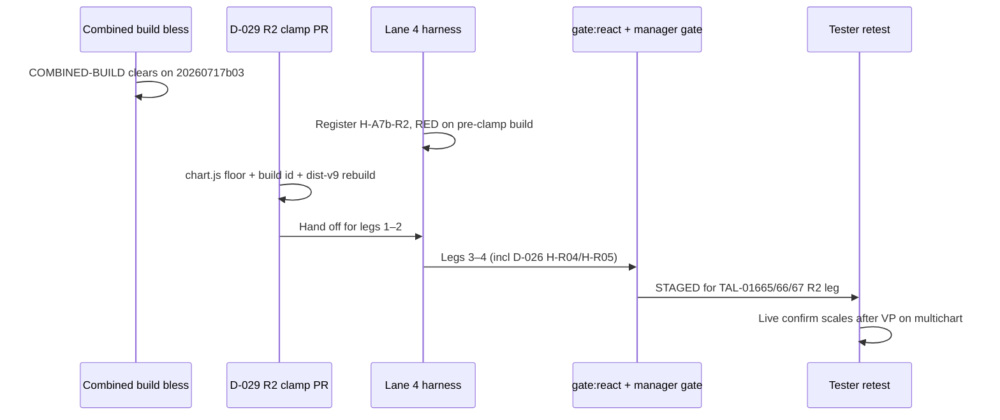

# D-029 R2 — Axis-margin floor (`PRICE_AXIS_MIN_R`) implementation spec

**Authority:** D-029 (ESC-025) — item **#1** of the post-bless `chart.js` batch.  
**Status:** READ-ONLY spec (no product edits in this deliverable). Turnkey for the worker who lands the clamp after the combined-build bless clears.  
**RC:** RC-3-adjacent (axis-margin contract) · RC-7 (dev/prod parity — D029-01)  
**Tickets (R2 leg only):** TAL-01665 (primary), TAL-01666/01667 (control-loss partial — scales leg)

**Diagnostic inputs (read before implementing):**

| Doc | Covers |
|-----|--------|
| `DIRECTOR-DECISIONS.md` — D-029 §2–3 | Authorization, proof bar, sequencing |
| `worker-reports/A7b-volume-profile-diagnostic-report.md` — R2 | Mechanism, proposed switch, file fence |
| `worker-reports/A7b-P0-anchored-VP-freeze-report.md` | Single-panel stable `margin.r=55`; multichart crush separate |
| `worker-reports/D029-dev-only-parity-sweep-report.md` — D029-01 | Dev clamp origin; do **not** port verbatim wrap |
| `chart v 1.4/chart/multichart/chart-host.html` ~964–987 | Dev reference (`PRICE_AXIS_MIN_R = 60`) — **reference only** |

---

## 0. Fence — when this runs and what it does NOT touch

| Rule | Detail |
|------|--------|
| **Pre-bless** | **NO `chart.js` edits** until `COMBINED-BUILD` bless clears on build `20260717b03` (D-026 transport). This fix is the **first** post-bless core edit — own gated build, own PR. |
| **Scope** | R2 axis-margin floor only. Do **not** bundle R1 (VP preview leak), R3 (pan block), R4 (axis highlights), or A7b drawing-module fixes in the same PR. |
| **Dev surface** | Do **not** port the dev `drawAxes` monkey-patch verbatim. Land the floor in the **core margin contract** inside `chart.js`. |
| **Lane 5** | Lane 5 must **not** implement this (frozen core pre-bless). Post-bless: assign to a worker authorized for `chart.js` (chart.js batch owner / Lane 2 escalation). |
| **Bless blocker** | This PR must **not** block or replace the bless build. Bless first; clamp second. |

**Interim tester workaround (unchanged until clamp ships):** remove the VP tool to recover scales — note on A7b family row (`POST-BLESS-RETEST-CLOSURE-PLAN.md` §7).

---

## 1. Problem statement

After placing **anchored** or **fixed-range** Volume Profile in **multichart** topology, the placement tile can lose its **price scale strip** (and often the **time scale** with it): candles run edge-to-edge, Y tick labels do not paint, pan/zoom feels uncontrollable until the tool is removed (`TAL-01665/1951_21.png`).

**Root cause (verified static + harness):**

1. `_syncAdaptivePriceAxisMargin()` (`chart.js` ~27930–27990) computes adaptive width with engine `minW = 48`, but multichart iframe resize + VP finalize redraw can leave **`margin.r` (or `margin.l` when `priceAxisLeft`) below a usable strip** or skip sync when plot height collapses.
2. Early return when `ch <= 0` (~27937–27938) exits **without** enforcing any floor on existing margins.
3. `drawAxes()` (~26566+) paints the price strip with `axisW = axisLeft ? m.l : m.r` (~26581–26582). When `axisW → 0`, labels are skipped (~26643–26648) — user-visible “both axes gone.”
4. Dev sandbox masked this for months via a post-wrap clamp in `chart-host.html` (`PRICE_AXIS_MIN_R = 60`). Production embed path never had it (D029-01).

**Why single-panel harness cannot carry the discriminator:** A7b P0 probe on 1-panel harness reports stable `margin.r = 55` before and after anchored VP placement. The crush is **multichart-topology-specific** (iframe embed + peer layout stress). D-029 §3 mandates RED-first in **built React multichart** (`mcLayout=2v`), not host-only single tile.

---

## 2. Switch (I3 + I13)

| Property | Value |
|----------|--------|
| **Name** | `window.__TALARIA_DISABLE_AXIS_MARGIN_FLOOR_AFTER_VP_FIX` |
| **Default** | **unset** = fix **ON** (floor enforced) |
| **OFF** | `= true` → full revert to pre-fix margin behavior (no floor, current early-return path) |
| **Gating surface** | **`chart.js` only** — one file family, both mirror trees. No React/bridge edits required for the product fix. |
| **I13 proof** | With switch ON, `_enforceAxisMarginFloor` (or equivalent) is a no-op; behavior byte-for-byte prior path. Document in FIX report with grep/show of the gated block. |

**Harness CLI / env (Lane 4 registers when implementing scenario):**

| Hook | Maps to |
|------|---------|
| `--axis-margin-floor-off` | `react-run.mjs` / `run.mjs` pre-boot |
| `REACT_PARITY_AXIS_MARGIN_FLOOR_OFF=1` | env alias for CI |

---

## 3. Product implementation — `chart.js` hunks

**Target files (byte-identical mirrors + build id):**

| Path |
|------|
| `chart v 1.4/chart/chart.js` |
| `homepage/public/chart/chart.js` |

Bump `CHART_ENGINE_BUILD` in **both** trees (e.g. `20260718b01` — use next available id). Rebuild `dist-v9` both product trees per existing `build:live` workflow. No hand-editing dist blobs beyond the normal build pipeline.

### 3.1 Constants (near `_syncAdaptivePriceAxisMargin` or chart layout constants)

```javascript
// D-029 R2 — match dev-proven floor; do not silently change without Director ruling
const PRICE_AXIS_MIN_R = 60;
const PRICE_AXIS_MIN_L = 60;  // symmetric when priceAxisLeft
const PRICE_AXIS_MIN_B = 24;  // time strip floor (default init margin.b = 30)
```

Use module-level `const` in the same style as neighboring chart.js constants. **Do not** export to `window` unless an existing pattern requires it (prefer private).

### 3.2 Hunk A — `_enforceAxisMarginFloor()` helper (CAUSAL)

Add a small method on the Chart class:

```javascript
_enforceAxisMarginFloor() {
    if (window.__TALARIA_DISABLE_AXIS_MARGIN_FLOOR_AFTER_VP_FIX === true) return;
    const m = this.margin;
    if (!m) return;
    const axisLeft = !!this.priceAxisLeft;
    if (axisLeft) {
        if (Number(m.l) < PRICE_AXIS_MIN_L) m.l = PRICE_AXIS_MIN_L;
    } else {
        if (Number(m.r) < PRICE_AXIS_MIN_R) m.r = PRICE_AXIS_MIN_R;
    }
    if (Number(m.b) < PRICE_AXIS_MIN_B) m.b = PRICE_AXIS_MIN_B;
}
```

**Design notes:**

- Floor applies to the **active** price side (`l` vs `r`) — matches dev clamp intent extended for left-axis layouts.
- `margin.b` floor prevents time-strip collapse when plot height math goes wrong (D-029 text: “min `margin.r`/`margin.b`”).
- Keep helper **pure** (no `scheduleRender`, no DOM) — contract enforcement only.

### 3.3 Hunk B — call sites (CAUSAL)

| Location | Change |
|----------|--------|
| **`_syncAdaptivePriceAxisMargin()`** ~27930 | (1) On **`ch <= 0` early return** (~27937): call `_enforceAxisMarginFloor()` **before** `return`. (2) After assigning `this.margin.l` / `this.margin.r` (~27980–27984): call `_enforceAxisMarginFloor()`. |
| **`drawAxes()`** ~26566 | Immediately **after** the existing `_syncAdaptivePriceAxisMargin()` call (~26569) and **before** `axisW` is read (~26581): call `_enforceAxisMarginFloor()`. |

**Why both sites:** VP finalize can mutate layout between the render-path sync (~26188, which may skip under `skipHeavyChrome`) and axis paint. `drawAxes` always re-syncs at ~26569; the post-sync floor guarantees paint sees a usable strip. Early-return guard covers the `ch <= 0` race called out in ESC-025.

**Do NOT:**

- Wrap `drawAxes` from outside (dev-host pattern).
- Change `minW = 48` inside the adaptive calculator unless RED proves 48–59 band is the failure mode — the authorized floor is **60** to match dev provenance.
- Add VP-type special cases in drawing modules — R2 is **topology/margin contract**, not tool-specific logic in Lane 5 files.

### 3.4 Hunk C — optional defense-in-depth (NON-LOAD-BEARING)

If isolated proof shows floor still lost between `_syncAdaptivePriceAxisMargin` and fillRect, add a third `_enforceAxisMarginFloor()` immediately before price-strip `fillRect` (~26588). **Report must prove B alone carries 10/10** without relying on C (same discipline as D-026 Hunk A).

### 3.5 Out of scope for this PR

- `invalidate layout after VP finalize` in `drawing-tools-manager.js` — only add if post-bless triage proves margin floor alone insufficient; file separately.
- Removing dev-host wrap in `chart-host.html` — hygiene follow-up after prod floor ships (avoid double-clamp in dev sandbox).

---

## 4. Harness — multichart-topology discriminator (Lane 4 + product worker)

**Registration IDs:**

| Spec ID | Proposed scenario id | CLI switch-OFF |
|---------|---------------------|----------------|
| **D029-01 / A7b-R2** | `H-A7b-R2` | `--axis-margin-floor-off` |

Add to `react-parity-scenarios.mjs` (primary — I15 real iframe actuation). Optional companion `H-A7b-R2-FIXED` for fixed-range VP — same probes, second row; not required for initial bless of R2 if anchored alone reproduces RED reliably.

### 4.1 Pre-boot L1 (React row)

| Check | Requirement |
|-------|-------------|
| `boot.buildIds.ok` | Same `CHART_ENGINE_BUILD` on host + panel B iframe |
| `boot.boundary.ok` | Panel B is iframe embed |
| Layout | `mcLayout=2v`, **`pair=independent`** (host file25 / panel B file27 — different tickers) |
| Session | `REACT_PARITY_ISOLATE_SESSION=1` for 10/10 legs |

### 4.2 Setup

| Step | Detail |
|------|--------|
| 1 | Boot built React multichart (`bootReactMultichart` / `runWithReact`) |
| 2 | Wait chart ready on **panel B** iframe (`window.chart`, `data.length > 0`, `yScale` set) |
| 3 | Optional stress amplifier if RED is intermittent on first draft: **window resize** 1440×960 → 1280×720 → back, or toggle sync on host then settle — document whichever amplifier makes RED ≥8/10 on pre-fix build |

### 4.3 Actuation (I15 — real)

| Step | Mechanism | Notes |
|------|-----------|-------|
| 1 | `focusReactPanel(page, 'B')` | Real mouse at iframe-translated coords |
| 2 | Select **Anchored Volume Profile** from parent drawing toolbar (same path testers use) | Do not `drawingManager.addDrawing` synthetic inject as primary leg |
| 3 | **Real click** anchor point on panel B canvas | Use `placeTool(page, 'B', 'anchored-volume-profile', pts)` from `interactive-helpers.mjs` only if it exercises real toolbar + canvas clicks (existing RC-3 rows do) |
| 4 | Wait settle | Poll up to **3s** (signal-gated, not blind 3s sleep): `drawingManager.drawings` contains `anchored-volume-profile` AND at least one `render`/`scheduleRender` cycle completed |

**Invalid actuation:** parent-only evaluate placement with no iframe tool selection; direct `chart.margin.r = 0` injection (except optional **companion** unit probe in `scenarios.mjs` marked non-bless-path).

### 4.4 End-state probe (honest — not proxy)

Evaluate **inside panel B iframe** after settle:

```javascript
(() => {
  const ch = window.chart;
  if (!ch || !ch.margin || !ch.yScale) return { ok: false, reason: 'missing chart/yScale' };
  const m = ch.margin;
  const axisLeft = !!ch.priceAxisLeft;
  const axisW = axisLeft ? Number(m.l) : Number(m.r);
  const chPlot = Number(ch.h) - Number(m.t) - Number(m.b);
  const priceSideKey = axisLeft ? 'l' : 'r';
  const priceMin = 60; // must match PRICE_AXIS_MIN_R / MIN_L in product
  const timeMin = 24;
  // Recompute visible Y tick count the same way drawAxes uses
  const numYTicks = Math.max(8, Math.min(15, Math.floor(chPlot / 60)));
  let labelCount = 0;
  const yTicks = typeof ch._getYPriceTicks === 'function' ? ch._getYPriceTicks(numYTicks) : [];
  const pricePlotBottom = chPlot > 0 ? (ch.h - m.b) : 0;
  yTicks.forEach((price) => {
    const y = ch.yScale(price);
    if (y > m.t + 8 && y < pricePlotBottom - 8) labelCount += 1;
  });
  const timeTicks = (typeof ch._buildTimeTicks === 'function')
    ? ch._buildTimeTicks({ full: true })
    : (ch._timeTicks || []);
  const crush =
    axisW < 48 ||
    chPlot <= 0 ||
    labelCount === 0 ||
    (Array.isArray(timeTicks) && timeTicks.length === 0);
  return {
    ok: !crush,
    crush,
    marginR: Number(m.r),
    marginL: Number(m.l),
    marginB: Number(m.b),
    axisW,
    chPlot,
    labelCount,
    timeTickCount: Array.isArray(timeTicks) ? timeTicks.length : 0,
    priceSideKey,
    floorOk: Number(m[priceSideKey]) >= priceMin && Number(m.b) >= timeMin,
  };
})()
```

**Pass criteria (fix ON):**

- `ok === true`
- `floorOk === true` (`margin.r` or `margin.l` ≥ **60**, `margin.b` ≥ **24**)
- `labelCount >= 1`
- `timeTickCount >= 1`

**RED criteria (fix OFF or pre-fix build):** `crush === true` OR `floorOk === false` — must be **non-vacuous** (not always pass on all builds).

**Negative control:** Run same scenario on **single-panel** host harness — expect PASS even without fix (-documents topology requirement; scenario may `notes.push('single-panel N/A')` in companion probe only, not as bless substitute).

### 4.5 Scenario development workflow

1. **Before product fix:** implement `H-A7b-R2` on bless build `20260717b03` → confirm **honest RED** (target ≥8/10 fail without fixed sleeps).
2. **After product fix:** `H-A7b-R2` **10/10 PASS** with fix ON (default).
3. **Discriminator:** `--axis-margin-floor-off` → **10/10 RED** (or honest majority fail — same bar as D-023).
4. Register row in `known-failing.json` / gate config when RED confirmed pre-fix; promote when GREEN proven.

---

## 5. Proof bar (binding — D-029 §3)

Execute on **clamp-inclusive built dist** (`build:live`, build id verified **inside panel B iframe**).

| Leg | Command / action | Pass |
|-----|------------------|------|
| **0 RED-first** | `H-A7b-R2` on **pre-clamp** build (bless build ok) | Honest RED documented (evidence file) |
| **1 ON** | `REACT_PARITY_ISOLATE_SESSION=1 node react-run.mjs --only=H-A7b-R2 --runs=10` | **10/10 PASS** |
| **2 OFF** | same + `--axis-margin-floor-off` | **Honest RED** (non-vacuous) |
| **3 D-026 re-run** | `H-R04` + `H-R05` ×10 each, default (transport ON) | **10/10 PASS** each — clamp must not regress panel-B settings transport |
| **4 Full gate** | `gate:react` (3× clean per combined-build manifest) + manager gate | 0 unexpected regressions; quarantine rows tolerated per D-027 |
| **5 I13** | switch ON diff | `_enforceAxisMarginFloor` no-op; margins behave as pre-fix |

**Determinism:** No blessing on `<10/10` without documented flake triage. If crush is intermittent, add the resize amplifier (§4.2) and re-run — do not ship on proxy greens.

---

## 6. Sequencing and gate interaction



| Step | Owner | Output |
|------|-------|--------|
| 1 | Manager | Bless clears; `COMBINED-BUILD` → **BLESSED** |
| 2 | Lane 4 | `H-A7b-R2` registered; RED capture on bless build |
| 3 | Chart.js worker | Hunks §3 + mirrors + build id + FIX report |
| 4 | Lane 4 | Proof legs §5; gate logs |
| 5 | Manager | Registry updates §7; scoreboard STAGED → await PO |

**Does not wait for:** A6-4, Option A, Phase 7, or other `chart.js` batch items.

---

## 7. Registry updates (Manager / worker report)

On GREEN proof, update:

| File | Row / field |
|------|-------------|
| `RESOLUTION-TRACKER.csv` | New row `H-A7b-R2` or `D029-01`: `RESOLVED-DEV`, build id, switch name, 10/10 + OFF RED |
| `RESOLUTION-TRACKER.csv` | TAL-01665 R2 leg → **STAGED** (full ticket closure awaits PO retest per D-028) |
| `PLAN2-SCOREBOARD.csv` | TAL-01665 → **STAGED** with note “R2 clamp build:____; PO retest pending” |
| `PER-BUG-REGISTRY.csv` | Link `H-A7b-R2` as discriminator for R2 family |
| `known-failing.json` | Remove/promote `H-A7b-R2` when GREEN stable |

**Not fix-counted until:** PO confirms on shipped/clamp build (I15 live path for ticket closure).

---

## 8. Worker deliverable

**Prompt file (optional dispatch copy):** `docs/tickets-overhaul/worker-prompts/D029-R2-axis-margin-clamp-IMPL-post-bless.md` — may mirror this spec 1:1 when dispatching.

**Report (mandatory):** `docs/tickets-overhaul/worker-reports/D029-R2-axis-margin-clamp-FIX-report.md` per `WORKER-REPORT-STANDARD.md`:

- Hunks A/B/(C) with line refs both trees
- Switch + I13 diff
- Proof legs 0–5 with evidence filenames
- Explicit note: single-panel probe stays ~55 — multichart topology required
- Commit hash(es) — file-scoped, own PR
- Status: **DONE (proven)** only if legs 1–4 run on **built dist** with build id inside iframe

---

## 9. Live-verification handoff (PO / tester)

| Step | Action |
|------|--------|
| Build | Confirm `CHART_ENGINE_BUILD` on host + **each panel iframe** matches clamp build |
| Layout | 2-up multichart, independent symbols |
| Act | Place **Anchored Volume Profile** on one panel (real toolbar + click) |
| Expect | Price scale strip visible (right edge labels); time scale visible bottom; pan/zoom responsive **without** removing tool |
| Fail signal | Edge-to-edge candles, no price labels, control loss — same as TAL-01665 screenshot |
| Workaround until ship | Delete VP drawing to recover scales |

---

## 10. References

- `DIRECTOR-DECISIONS.md` — D-029
- `MANAGER-ESCALATIONS.md` — ESC-025
- `worker-reports/A7b-volume-profile-diagnostic-report.md` — §R2, §8 row R2
- `worker-reports/D029-dev-only-parity-sweep-report.md` — D029-01
- `T3-panelB-settings-transport-FIX-lane1-D026.md` — proof-bar pattern for D-026 re-run
- `T3-MULTICHART-ORDER-PARITY-HARNESS-SPEC.md` — harness spec template
- Dev clamp reference: `chart v 1.4/chart/multichart/chart-host.html` ~978–987
