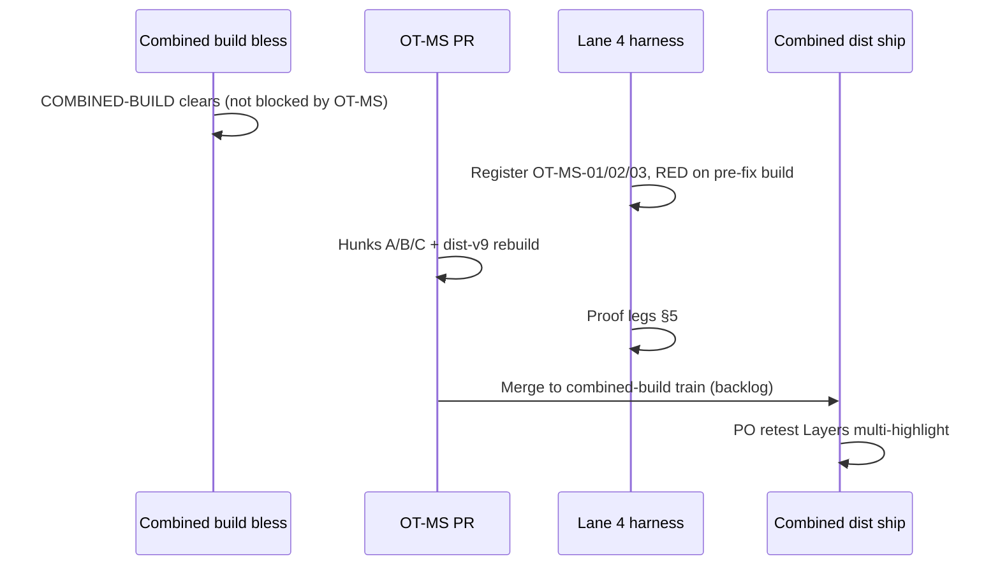

# OT-MS — Objects-Tree multi-select highlight implementation spec

**Authority:** Manager acceptance (`MANAGER-FINDINGS.md` 2026-07-16) · `RESOLUTION-TRACKER.csv` row **OT-MS**  
**Status:** READ-ONLY spec (no product/harness/registry edits). Turnkey for post-bless / combined-build backlog worker.  
**RC:** RC-1 (selection substrate) · RC-4 (multichart UI parity)  
**Related:** PLAN2-FOUND#3 (duplication) — **independent thread**; do not merge fixes

**Diagnostic inputs (read before implementing):**

| Doc | Covers |
|-----|--------|
| `worker-reports/T3-remig-lane1-objecttree-lifecycle-diagnostic-report.md` | Root cause, two surfaces, RED spec draft |
| `RESOLUTION-TRACKER.csv` — OT-MS | Backlog status, switch name |
| `MANAGER-FINDINGS.md` § Lane 1 object-tree diagnostic | Thread separation, dispatch posture |
| Integration contract §A.4 | `dm.selectedDrawings` authoritative for canvas selection |

---

## 0. Landing fence — when this runs and what it does NOT touch

| Rule | Detail |
|------|--------|
| **Bless blocker** | **NOT critical path.** Does **not** gate combined-build bless. Queue **post-P1**, rides the **combined build** (same dist-v9 ship train), own gated PR. |
| **Freeze-safe scope** | `object-tree.js`, `drawing-tools-manager.js` (event dispatch only), `TalariaV8bLive.jsx` + `dist-v9` rebuild. **No `chart.js` core.** |
| **Independence** | **Do not** merge with PLAN2-FOUND#3 id-dedupe (`__TALARIA_DISABLE_OBJECTS_TREE_MULTICHART_DEDUPE_V1`). OT-MS-03 is a **regression fence** for dedupe, not part of this fix. |
| **Lifecycle store** | **Out of scope for v1** — do not change `tool-lifecycle-store.js` `_reduce` / `toolSelected` collapse. Trees read **`dm.selectedDrawings`** directly (integration contract). |
| **Row click behavior** | Layers row click stays **`dm.selectDrawing(d)` single-select** — this spec fixes **highlight read path + V9 re-render**, not tree-driven multi-select UX. |
| **Lane 5** | Drawing-module paths only where noted; no VP/A7b bundle. |

---

## 1. Problem statement

PO-visible **V9 Layers** panel (`rightPanel === 'layers'`) and legacy **`ObjectTreeManager`** sidebar both fail to show **multi-selection** when the user Ctrl+clicks or Ctrl+marquees 2+ drawings on the chart.

**Authoritative selection store:** `drawingManager.selectedDrawings[]` — populated correctly by `selectDrawing(drawing, true)` and marquee (P6). Canvas chrome and toolbar helpers already read this array (`v9DrawingIsPrimarySelection`, ~3914–3942).

**Wrong read paths today:**

| Surface | File | Current highlight source | Failure |
|---------|------|-------------------------|---------|
| **Legacy tree** | `object-tree.js` `createObjectItem()` ~299–306 | `lifecycleStore.getSelectedDrawing()` **first**, else `dm.selectedDrawing` | At most **one** `.selected` row; stale lifecycle single if row-click emitted `toolSelected`; **never reads `dm.selectedDrawings[]`** |
| **V9 Layers** | `TalariaV8bLive.jsx` ~36907–36951 | **None** — rows only use hover (`swHov`) | Multi-select on chart is **invisible** in tree; `v9DrawingIsPrimarySelection` exists but is **not used** in layers list |

**Contributing design debt (not v1 fix target):** `ToolLifecycleStore._reduce` collapses `toolSelected` to a single drawing (~103–105). Canvas Ctrl/marquee paths write `dm.selectedDrawings` **without** emitting `toolSelected`. Legacy tree row-click **does** emit `toolSelected` → store can be stale/wrong relative to canvas multi-select.

**V9 rebuild gap:** `layersItems` rebuild listens to `drawingsChanged`, `drawingStyleChanged`, `chartDataLoaded`, `timeframeChanged`, `panelSelected` (~19357–19367) — **not selection change**. Even after highlight logic exists, React must re-render when `selectedDrawings` changes.

---

## 2. Switch (I3 + I13)

| Property | Value |
|----------|--------|
| **Name** | `window.__TALARIA_DISABLE_OBJECTS_TREE_MULTISELECT_HIGHLIGHT_V1` |
| **Default** | **unset** = fix **ON** (multi-highlight enabled) |
| **OFF** | `= true` → revert to current behavior (legacy: singular path; V9: no selection styling) |
| **Gated files (I13 — every path)** | `object-tree.js`, `drawing-tools-manager.js` (event dispatch block only), `TalariaV8bLive.jsx` |
| **Independent switches** | `__TALARIA_DISABLE_OBJECTS_TREE_MULTICHART_DEDUPE_V1` (inventory only) · `__TALARIA_DISABLE_TOOL_LIFECYCLE_V2` (unchanged) |

**Harness CLI / env (Lane 4 registers with scenario):**

| Hook | Maps to |
|------|---------|
| `--ot-ms-highlight-off` | pre-boot `__TALARIA_DISABLE_OBJECTS_TREE_MULTISELECT_HIGHLIGHT_V1 = true` |
| `REACT_PARITY_OT_MS_HIGHLIGHT_OFF=1` | env alias |

**Helper (both trees — pattern):**

```javascript
function objectsTreeMultiselectHighlightEnabled() {
  try {
    return !(typeof window !== 'undefined'
      && window.__TALARIA_DISABLE_OBJECTS_TREE_MULTISELECT_HIGHLIGHT_V1 === true);
  } catch (_) {
    return true;
  }
}
```

Place in `object-tree.js` (module scope) and mirror the check inline or as `v9ObjectsTreeMultiselectHighlightEnabled()` near other V9 switch helpers in `TalariaV8bLive.jsx`.

---

## 3. Product implementation — hunks

### 3.1 Target files

| Path | Role |
|------|------|
| `chart v 1.4/chart/modules/object-tree.js` | Legacy tree highlight read path |
| `homepage/public/chart/modules/object-tree.js` | I8 mirror (byte-identical) |
| `chart v 1.4/chart/modules/drawing-tools-manager.js` | Selection-change event dispatch (V9 re-render trigger) |
| `homepage/public/chart/modules/drawing-tools-manager.js` | I8 mirror |
| `chart v 1.4/talaria-design/src/TalariaV8bLive.jsx` | V9 Layers row styling + selection listener |
| `chart v 1.4/chart/dist-v9/` (+ homepage mirror if applicable) | Rebuilt via `build:live` — build id inside parent + iframe |

Bump `CHART_ENGINE_BUILD` / dist bundle id per existing workflow.

### 3.2 Hunk A — Legacy tree read path (CAUSAL)

**File:** `object-tree.js` — `createObjectItem()` ~294–306

**Replace** singular highlight block with gated helper:

```javascript
_isDrawingSelectedForTreeHighlight(drawing) {
    const dm = this.drawingManager;
    if (!dm || !drawing) return false;

    // Switch OFF — preserve legacy singular path byte-for-byte
    if (typeof window !== 'undefined'
        && window.__TALARIA_DISABLE_OBJECTS_TREE_MULTISELECT_HIGHLIGHT_V1 === true) {
        const storeSelected = dm.lifecycleStore
            && typeof dm.lifecycleStore.getSelectedDrawing === 'function'
            ? dm.lifecycleStore.getSelectedDrawing()
            : null;
        return (storeSelected && storeSelected === drawing)
            || (!storeSelected && dm.selectedDrawing === drawing);
    }

    // Fix ON — dm.selectedDrawings authoritative (id-safe match)
    if (Array.isArray(dm.selectedDrawings) && dm.selectedDrawings.length) {
        for (const d of dm.selectedDrawings) {
            if (!d) continue;
            if (d === drawing) return true;
            if (drawing.id != null && d.id != null && String(d.id) === String(drawing.id)) return true;
        }
    }
    if (dm.selectedDrawing) {
        if (dm.selectedDrawing === drawing) return true;
        if (drawing.id != null && dm.selectedDrawing.id != null
            && String(dm.selectedDrawing.id) === String(drawing.id)) return true;
    }
    return false;
}
```

In `createObjectItem`:

```javascript
if (this._isDrawingSelectedForTreeHighlight(drawing)) {
    item.classList.add('selected');
}
```

**Do NOT:** change `refresh()` inventory (`dm.drawings` loop ~209–238); change row-click `selectDrawing` / `toolSelected` emit (~477–492).

### 3.3 Hunk B — V9 Layers highlight + re-render (CAUSAL)

**File:** `TalariaV8bLive.jsx`

#### B1 — Row styling (~36907–36951)

When `objectsTreeMultiselectHighlightEnabled()`:

```javascript
const { dm, d } = layerCtx();
const isSelected = dm && d && v9DrawingIsPrimarySelection(dm, d);
```

Apply selected styling (reuse existing accent language from news/country rows ~36700–36702):

- `background`: selected ? `c.acD` : hover bg
- Left accent bar (2px gradient) when `isSelected` (distinct from hover-only accent at ~36952)
- Optional: `data-layer-selected="1"` on row root for harness probe (recommended)
- Font weight / color: `isSelected ? c.acL : …` (match single-select emphasis)

When switch OFF: keep current hover-only styling (no `isSelected` branch).

#### B2 — Selection revision state

Add React state:

```javascript
const [layersSelectionRevision, setLayersSelectionRevision] = useState(0);
```

`useEffect` (mount once):

```javascript
const bump = () => setLayersSelectionRevision((n) => n + 1);
window.addEventListener('drawingSelectionChanged', bump);
return () => window.removeEventListener('drawingSelectionChanged', bump);
```

Include `layersSelectionRevision` in layers row `key` or force parent re-render when revision changes (row map must re-evaluate `v9DrawingIsPrimarySelection`).

**Do NOT:** fold selection into `layersItemsSigRef` inventory signature — inventory and selection are orthogonal (PLAN2-FOUND#3 independence).

### 3.4 Hunk C — Selection-change event (CAUSAL for V9)

**File:** `drawing-tools-manager.js`

No `drawingSelectionChanged` event exists today. `selectDrawing` calls `objectTreeManager.refresh()` (~10187–10189) but does **not** notify React V9 Layers.

At end of **`selectDrawing`** (after `objectTreeManager.refresh()` block) and end of **`deselectAll`** (when selection cleared/changed), when `objectsTreeMultiselectHighlightEnabled()`:

```javascript
try {
    const ids = (this.selectedDrawings || [])
        .map((d) => d && d.id != null ? String(d.id) : null)
        .filter(Boolean);
    window.dispatchEvent(new CustomEvent('drawingSelectionChanged', {
        detail: { ids, count: ids.length },
    }));
} catch (_) {}
```

Gate entire block with switch OFF = no dispatch (I13).

**Load-bearing:** Hunk B alone cannot go GREEN without Hunk C (or unacceptable polling). Report must prove B+C together; switch OFF skips dispatch + styling.

### 3.5 Out of scope

| Item | Reason |
|------|--------|
| `tool-lifecycle-store.js` multi-select `_reduce` | Phase 2+; trees read `dm` directly for v1 |
| `MultichartGrid.jsx` | No selection routing change required |
| Layers row Ctrl+click multi-select | UX enhancement; not required for highlight parity |
| `getSelectedDrawingAcrossCharts` toolbar first-only | Separate toolbar issue (~3816–3817) |

---

## 4. Harness — RED-first scenarios (Lane 4 + product worker)

**Registration:** OT-MS family in `react-parity-scenarios.mjs` (primary — I15 parent DOM + real iframe canvas actuation).

**Pre-boot L1:**

| Check | Requirement |
|-------|-------------|
| `boot.buildIds.ok` | Host + panel B iframe same build id |
| Layout OT-MS-01/02 | `mcLayout=2v`, `pair=independent` |
| Layout OT-MS-03 | `mcLayout=4` (or product 4-up), dedupe **ON** (switch unset) |
| Migration | Re-migration ON (default combined build) |
| Session | `REACT_PARITY_ISOLATE_SESSION=1` for 10/10 legs |

**Open Layers panel (all rows):** real click parent toolbar control that sets `rightPanel === 'layers'` (`TalariaV8bLive.jsx` ~34785 — layers icon in right utility rail). Wait until layers list has ≥ expected row count.

### 4.1 OT-MS-01 — Ctrl+click multi-select

| Step | Detail |
|------|--------|
| Setup | 2v multichart; place **two trendlines** on panel B (`placeTool` with real toolbar + canvas clicks) |
| Act | Select first via canvas click; **real Ctrl+click** second on panel B canvas |
| Probe (parent DOM) | Count layer rows with `[data-layer-selected="1"]` **or** computed style matching selected spec ≥ **2** |
| Probe (iframe) | `dm.selectedDrawings.length >= 2` |
| Legacy (optional) | If `#objectTreePanel` visible: `.object-tree-item.selected` count ≥ 2 |

**Pass (fix ON):** both probes ≥ 2 highlighted rows matching the two drawing ids.

**RED (pre-fix or switch OFF):** highlighted count ≤ 1 (V9) or only `selectedDrawing` row (legacy).

### 4.2 OT-MS-02 — Ctrl+marquee multi-select

| Step | Detail |
|------|--------|
| Setup | Same as OT-MS-01 (two shapes on panel B) |
| Act | **Real Ctrl+drag marquee** enclosing both shapes (reuse P6 / H-R08 actuation helpers — real pointer at iframe coords, not synthetic `selectDrawing` loop) |
| End-state | Same probes as OT-MS-01 — **both** rows highlighted |

**Invalid actuation:** `page.evaluate(() => dm.selectedDrawings.push(...))` without canvas gesture.

### 4.3 OT-MS-03 — PLAN2-FOUND#3 regression fence

| Step | Detail |
|------|--------|
| Setup | 4-panel layout; `__TALARIA_DISABLE_OBJECTS_TREE_MULTICHART_DEDUPE_V1` **unset** (dedupe ON) |
| Act | Place **one rectangle** on any panel |
| Probe | V9 Layers list row count for that shape = **1** (not 4) |
| Independence | Run with OT-MS highlight ON — passes/fails on **inventory**, not selection styling |

**Purpose:** prove highlight fix did not regress id-first dedupe (`rebuildNow` ~19254–19263).

### 4.4 OT-MS-OFF — switch discriminator

| Step | Detail |
|------|--------|
| Boot | `--ot-ms-highlight-off` |
| Act | Repeat OT-MS-01 |
| Expect | **Honest RED** — ≤ 1 highlighted row / no V9 selected styling (non-vacuous) |

---

## 5. Proof bar (binding)

Execute on **built dist** (`build:live`); build id verified in **parent document and panel B iframe**.

| Leg | Command / action | Pass |
|-----|------------------|------|
| **0 RED-first** | OT-MS-01 on pre-fix combined build | Honest RED documented |
| **1 ON** | `REACT_PARITY_ISOLATE_SESSION=1 node react-run.mjs --only=OT-MS-01,OT-MS-02,OT-MS-03 --runs=10` | **10/10 PASS** each |
| **2 OFF** | same + `--ot-ms-highlight-off` on OT-MS-01 | **Honest RED** |
| **3 Isolation** | OT-MS-03 with dedupe switch OFF (separate run) | Still fails duplication (proves OT-MS ≠ dedupe) — document only |
| **4 I13** | Switch ON in all three gated files | Singular legacy path + no V9 styling + no `drawingSelectionChanged` dispatch |
| **5 Regression smoke** | H-R07 peer isolation ×3 or checklist row | No new dual-select leak from tree changes |

**Determinism:** 10/10 for OT-MS-01/02; OT-MS-03 may be deterministic 10/10 (inventory).

**I15:** Greens must cite **real Ctrl+click / Ctrl+marquee** actuation and **parent Layers DOM** end-state (or legacy `.selected` count) — not iframe `selectedDrawings.length` alone.

---

## 6. Sequencing



| Constraint | Detail |
|------------|--------|
| vs D-029 R2 | **Independent** — R2 is post-bless `chart.js`; OT-MS is freeze-safe modules + React |
| vs PLAN2-FOUND#3 | Dedupe may land separately; OT-MS-03 fences dedupe |
| vs bless | **Never** block bless waiting for OT-MS |

---

## 7. Registry updates (on GREEN)

| File | Update |
|------|--------|
| `RESOLUTION-TRACKER.csv` | OT-MS → **RESOLVED-DEV** or **STAGED** with build id, 10/10 + OFF RED |
| `PLAN2-SCOREBOARD.csv` | OT-MS row → **STAGED** pending PO |
| `PER-BUG-REGISTRY.csv` | Link OT-MS-01/02/03 as discriminators |
| `known-failing.json` | Promote OT-MS family when stable |

**Not fix-counted until:** PO confirms Layers shows 2+ selected rows on live multichart build.

---

## 8. Worker deliverable

**Report:** `docs/tickets-overhaul/worker-reports/OT-MS-multiselect-highlight-FIX-report.md` per `WORKER-REPORT-STANDARD.md`:

- Hunks A/B/C with line refs (both module mirrors + TalariaV8bLive)
- Switch + I13 diff on all three gated files
- Proof legs 0–5 with evidence filenames
- Explicit note: PLAN2-FOUND#3 independent; OT-MS-03 fence result
- Status **DONE (proven)** only with built dist + parent Layers DOM proof

**Optional dispatch mirror:** `docs/tickets-overhaul/worker-prompts/OT-MS-multiselect-highlight-IMPL-lane1.md`

---

## 9. Live-verification handoff (PO)

1. Confirm build id on host + panel iframes.
2. Open multichart → **Layers** right panel.
3. Place two trendlines on one panel → Ctrl+click to multi-select both on canvas.
4. **Expect (fix ON):** both shapes show selected styling in Layers list.
5. **Expect (today pre-fix):** zero or one row highlighted — defect confirmed.
6. 4-up → one shape → **one** row in list (dedupe — independent check).

---

## 10. References

- `worker-reports/T3-remig-lane1-objecttree-lifecycle-diagnostic-report.md` — §5–8
- `RESOLUTION-TRACKER.csv` — OT-MS row
- `MANAGER-FINDINGS.md` — Lane 1 object-tree diagnostic ACCEPTED
- `object-tree.js` ~299–306 — current wrong path
- `TalariaV8bLive.jsx` ~3914–3942 (`v9DrawingIsPrimarySelection`), ~19217–19392 (rebuild), ~36907–36951 (row render)
- `drawing-tools-manager.js` ~10070–10189 (`selectDrawing`)
- `tool-lifecycle-store.js` ~103–105 (`toolSelected` collapse — context only)
