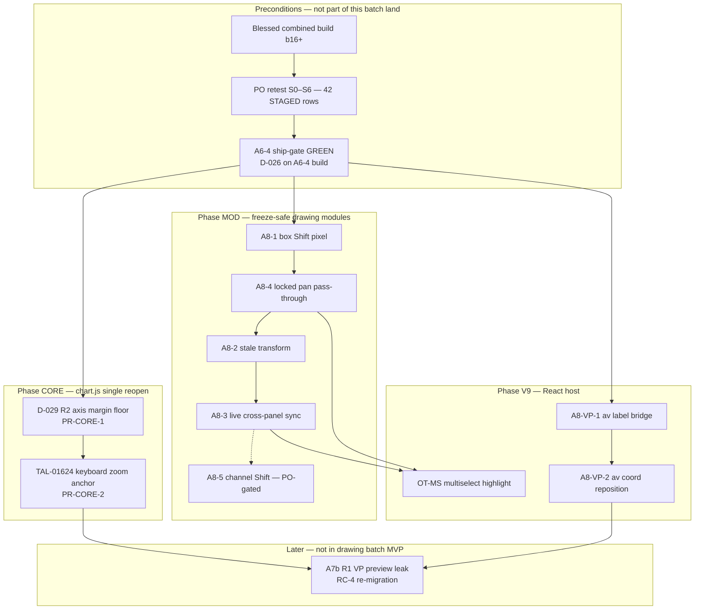

# Post-bless drawing + chart.js batch — landing plan

**Authority:** D-018 (one combined build), D-023 (per-row discriminators), D-026 (panel-B settings transport proof), D-029 (post-bless `chart.js` batch), D-030 item 4 (A6-4 ship-gate).  
**Status:** **READ-ONLY plan** — no product/harness/registry edits.  
**Baseline blessed build:** **`20260717b16`** (`T3-COMBINED-BUILD-MANIFEST.md`).  
**Scope:** Every **SPEC'D-HELD** drawing / VP / A8 / OT-MS item plus the **single post-bless `chart.js` reopen** (R2 clamp + queued core items).

**Source specs consolidated:**

| Spec | Role |
|------|------|
| [`D029-R2-AXIS-MARGIN-CLAMP-IMPL-SPEC.md`](D029-R2-AXIS-MARGIN-CLAMP-IMPL-SPEC.md) | **Only authorized pre-bless `chart.js` work** — first post-bless core PR |
| [`A8-FREEZE-SAFE-IMPL-SPEC.md`](A8-FREEZE-SAFE-IMPL-SPEC.md) | A8-1…A8-5 modifier-drag + locked pan |
| [`A8-VP-V9-LABEL-BRIDGE-IMPL-SPEC.md`](A8-VP-V9-LABEL-BRIDGE-IMPL-SPEC.md) | A8-VP-1 label bridge + A8-VP-2 coord reposition |
| [`A8-VP-FAMILY-CLOSURE-SWEEP.md`](A8-VP-FAMILY-CLOSURE-SWEEP.md) | LANDED vs HELD inventory |
| [`A8-RED-HARNESS-SPECS.md`](A8-RED-HARNESS-SPECS.md) | H-A8-1…4 |
| [`OT-MS-IMPL-SPEC.md`](OT-MS-IMPL-SPEC.md) | Objects-Tree multi-select highlight |
| [`POST-BLESS-RETEST-CLOSURE-PLAN.md`](POST-BLESS-RETEST-CLOSURE-PLAN.md) | PO retest **before** this batch closes tickets |
| [`T3-COMBINED-BUILD-MANIFEST.md`](T3-COMBINED-BUILD-MANIFEST.md) | Assembly + bless discipline |

---

## 0. What this plan is / is not

| In scope | Out of scope (separate tracks) |
|----------|--------------------------------|
| Post-bless **drawing-module** + **V9 host** + **one `chart.js` reopen family** | A6-4 host-canonical order store **implementation** (ship-gate only here) |
| Ordered PRs, kill-switches, proof gates, file-conflict sequencing | A7 indicator perf (A7), full **RC-4 Phase 7** re-migration |
| Combined-build **micro-assembly** after each tranche + **macro cut** at drawing-batch sign-off | Order-entry RC-5 (already staged on bless build) |
| D-026 re-run rules when re-migration-adjacent files move | A7b **R1** preview leak (RC-4 tranche — spec reference only, no impl spec yet) |
| | A7b **R5** VP chrome (01656/01657) — OPEN, no spec |

**Critical sequencing rule (D-018 / Director):** The **42 STAGED PO retest** on blessed **`b16`** runs **first** (`POST-BLESS-RETEST-CLOSURE-PLAN.md`). This landing plan starts **after** that retest + **A6-4 ship-gate** (D-030 #4) clears. Do not mix STAGED retest closure with new product lands on the same build id without Manager sign-off.

---

## 1. Dependency graph



### 1.1 Hard dependencies (must land before)

| Successor | Must wait on | Reason |
|-----------|--------------|--------|
| **Any post-bless product land** | **Bless + A6-4 gate** | A8 / VP-V9 specs gate on A6-4; drawing batch must not race ship-gate |
| **PR-CORE-2** (TAL-01624) | **PR-CORE-1** (D-029 R2) | **Same file** (`chart.js` both trees) — one-phase-per-PR on core |
| **A8-2** | **A8-1** recommended, **A8-4** before **A8-2** per A8 spec | Clean ghost signal; locked pan isolated first |
| **A8-3** | **A8-2** | Multichart live sync depends on stale-transform fix for honest RED |
| **A8-VP-2** | **A8-VP-1** | Label bridge + shared `v9SyncDrawingAxisHighlights` path |
| **OT-MS** | **A8-4** minimum; **A8-VP-2** preferred | `drawing-tools-manager.js` selection-event hunk should not race A8 drag hunks |
| **A7b R1** (RC-4) | **Drawing batch MVP + full re-migration authorization** | Touches `drawing-tools-manager.js` + sync bridge + possibly `chart.js` |
| **VP cluster PO CLOSED-VERIFIED** (01665–01667 scale leg) | **PR-CORE-1 GREEN** + PO retest on clamp build | R2 is primary scale fix; R3/R4 already LANDED b15 |

### 1.2 Soft dependencies (may parallelize)

| Track A | Track B | Rule |
|---------|---------|------|
| **Phase MOD** (A8-*) | **Phase V9** (A8-VP-*) | **Parallel OK** — disjoint primary files (`drawing-tools-*.js` vs `TalariaV8bLive.jsx`) |
| **Phase MOD** | **Phase CORE** | **Parallel OK after A6-4** — R2 spec explicitly does not wait for A8 |
| **Phase V9** | **Phase CORE** | **Parallel OK** — VP-V9 is React-only; R2 is `chart.js`-only |
| **Harness registration** (Lane 4) | **All product PRs** | Harness specs may be written in parallel; **RED capture** must precede each tranche merge |

### 1.3 Already LANDED (do not re-land — verify on bless build)

| Leg | Switch | Build / report |
|-----|--------|----------------|
| A7b P0 recursion / render guard | (internal) | **b15** — [`A7b-P0-anchored-VP-freeze-report.md`](worker-reports/A7b-P0-anchored-VP-freeze-report.md) |
| A7b R3 pan block | `__TALARIA_DISABLE_VP_BODY_PAN_BLOCK_FIX` | **b15** |
| A7b R4a highlight geometry | `__TALARIA_DISABLE_VP_AXIS_HIGHLIGHT_GEOMETRY_FIX` | **b15** |
| A7b R4b label defaults ON | `__TALARIA_DISABLE_VP_AXIS_LABEL_DEFAULT_ON_FIX` | **b15** |
| H-S42 anchored VP TF drift | `__TALARIA_DISABLE_ANCHORED_VP_RIGHT_EDGE_TIMESTAMP_FIX` | **b16** — 10/10 |

---

## 2. Surface map — chart.js vs freeze-safe vs V9 React

| Surface class | Files (canonical) | Specs / tranches | `CHART_ENGINE_BUILD` bump? |
|---------------|-------------------|------------------|----------------------------|
| **`chart.js` core (single reopen)** | `chart v 1.4/chart/chart.js`, `homepage/public/chart/chart.js` | **PR-CORE-1** D-029 R2; **PR-CORE-2** TAL-01624 | **YES** — each core PR |
| **Freeze-safe drawing modules** | `drawing-tools-manager.js`, `drawing-tools-shapes.js`, `drawing-tools-base.js`, `drawing-tools-channels.js`, `drawing-tools-advanced-volume.js` (R3/R4 **landed**) | **A8-1…A8-5** | **NO** — module paths + dist rebuild only |
| **V9 React host** | `talaria-design/src/TalariaV8bLive.jsx` → `dist-v9` | **A8-VP-1**, **A8-VP-2**, **OT-MS** | **NO** — V9 bundle id / serve stamp |
| **Legacy tree module** | `object-tree.js` | **OT-MS** only | **NO** |
| **Re-migration-adjacent (D-026 trigger)** | `MultichartGrid.jsx`, `panel-cmd-bridge.js`, `TalariaV8bLive.jsx`, `drawing-tools-manager.js` (selection/sync/live paths) | Any touch → **D-026 re-run** (§5) | Per tranche |

**Forbidden for this batch:** `replay-system.js`, `panel-cmd-bridge.js` **implementation** (unless future R1 RC-4 dispatch), `MultichartGrid.jsx` **implementation** (A6-4 / RC-4 only).

---

## 3. Full kill-switch inventory (held + this batch)

**Convention:** `window.__TALARIA_DISABLE_*` — **unset = fix ON**; **`= true` = honest RED** (D-023).

### 3.1 Phase CORE — `chart.js`

| Switch | Tranche | Spec | Primary tickets |
|--------|---------|------|-----------------|
| `__TALARIA_DISABLE_AXIS_MARGIN_FLOOR_AFTER_VP_FIX` | **PR-CORE-1** | D029-R2 | **TAL-01665**, 01666/01667 (scale leg) |
| `__TALARIA_DISABLE_KEYBOARD_ZOOM_VISIBLE_RIGHT_EDGE_FIX` | **PR-CORE-2** | A8 diagnostic §7.6 | **TAL-01624** |

### 3.2 Phase MOD — A8 freeze-safe (5 switches)

| Switch | Tranche | Harness | Primary tickets |
|--------|---------|---------|-----------------|
| `__TALARIA_DISABLE_A8_BOX_SHIFT_SQUARE_PIXEL_FIX` | A8-1 | H-A8-1 | **TAL-01593**, 01654 (partial) |
| `__TALARIA_DISABLE_A8_LOCKED_DRAWING_PAN_PASSTHROUGH_FIX` | A8-4 | H-A8-4 | **TAL-01652** |
| `__TALARIA_DISABLE_A8_SHIFT_DRAG_STALE_TRANSFORM_FIX` | A8-2 | H-A8-2 | **TAL-01655** |
| `__TALARIA_DISABLE_A8_SHIFT_LIVE_CROSSPANEL_SYNC_FIX` | A8-3 | H-A8-3 | **TAL-01651**, 01655 (multichart) |
| `__TALARIA_DISABLE_A8_PARALLEL_REGRESSION_SHIFT_SNAP_FIX` | A8-5 (optional) | — (NEEDS-LIVE) | **TAL-01654** (channel subset) |

**Helpers:** `_isA8*FixEnabled()` in `drawing-tools-base.js` (A8 spec §2).

### 3.3 Phase V9 — VP label bridge (2 switches)

| Switch | Tranche | Harness | Primary tickets |
|--------|---------|---------|-----------------|
| `__TALARIA_DISABLE_VP_V9_AV_LABEL_BRIDGE_FIX` | A8-VP-1 | H-A8-VP-1 | **TAL-01662** (anchored path) |
| `__TALARIA_DISABLE_VP_V9_AV_COORD_REPOSITION_FIX` | A8-VP-2 | H-A8-VP-2 | **TAL-01664** |

### 3.4 Phase V9 — Objects Tree (1 switch)

| Switch | Tranche | Harness | Primary tickets |
|--------|---------|---------|-----------------|
| `__TALARIA_DISABLE_OBJECTS_TREE_MULTISELECT_HIGHLIGHT_V1` | OT-MS | H-OT-MS-1 (Lane 4 register) | OT-MS backlog |

### 3.5 LANDED VP switches (verify only — not in this batch)

| Switch | Status |
|--------|--------|
| `__TALARIA_DISABLE_VP_BODY_PAN_BLOCK_FIX` | LANDED b15 |
| `__TALARIA_DISABLE_VP_AXIS_HIGHLIGHT_GEOMETRY_FIX` | LANDED b15 |
| `__TALARIA_DISABLE_VP_AXIS_LABEL_DEFAULT_ON_FIX` | LANDED b15 |
| `__TALARIA_DISABLE_ANCHORED_VP_RIGHT_EDGE_TIMESTAMP_FIX` | LANDED b16 |

### 3.6 Deferred (reference — not in drawing-batch MVP)

| Switch | Spec / track |
|--------|--------------|
| `__TALARIA_DISABLE_VP_LIVE_PREVIEW_CROSS_PANEL_SYNC_FIX` | A7b R1 — RC-4 re-migration |
| `__TALARIA_DISABLE_MC_REMIGRATION_PHASE*` / H-R0* switches | Already on bless build — not part of this batch |

**Batch switch count (new lands):** **11** (2 core + 5 A8 + 2 VP-V9 + 1 OT-MS + 1 optional A8-5).

---

## 4. Ordered landing sequence (PR queue)

### Phase 0 — Gates (no product)

| Step | Owner | Deliverable |
|------|-------|-------------|
| 0.1 | PO + Manager | Blessed build retest complete (`POST-BLESS-RETEST-CLOSURE-PLAN.md` S0–S6) |
| 0.2 | Lane 4 | A6-4 ship-gate: full gate + **D-026 H-R04/H-R05 ×10** on A6-4 build vs **b16** baseline |
| 0.3 | Lane 4 | Register all held harness rows (H-A8-*, H-A8-VP-*, H-A7b-R2, H-OT-MS-1); capture **RED-first** on pre-fix builds |

---

### Phase CORE — `chart.js` single reopen (serialize — same file)

| PR | Tranche | Primary files | Depends | Proof bar |
|----|---------|---------------|---------|-----------|
| **PR-CORE-1** | **D-029 R2** | `chart.js` (both trees) | Phase 0 | H-A7b-R2 10/10 ON; `--axis-margin-floor-off` RED; **D-026 H-R04/H-R05 ×10**; 3× `gate:react` |
| **PR-CORE-2** | **TAL-01624** | `chart.js` (both trees) | PR-CORE-1 merged | H-KZ-1 (Lane 4 register); keyboard zoom visible-right-edge; **D-026 re-run**; 3× `gate:react` |

**Macro rule:** At most **one open `chart.js` PR** at a time. Do not start A7b R1 or any other core edit until CORE-2 is GREEN.

---

### Phase MOD — A8 freeze-safe (serialize on `drawing-tools-manager.js`)

| PR | Tranche | Primary files | Shared-file note | Proof |
|----|---------|---------------|------------------|-------|
| **PR-A8-1** | A8-1 | `drawing-tools-shapes.js`, `drawing-tools-manager.js`, `drawing-tools-base.js` (helpers) | First DTM touch in batch | H-A8-1 RED→GREEN + switch-OFF |
| **PR-A8-4** | A8-4 | `drawing-tools-manager.js` | **Conflict with PR-A8-1** — land after A8-1 | H-A8-4 |
| **PR-A8-2** | A8-2 | `drawing-tools-manager.js` | **Conflict** — land after A8-4 | H-A8-2 |
| **PR-A8-3** | A8-3 | `drawing-tools-manager.js` (`_broadcastLiveEditUpdate`) | **Conflict** — land after A8-2; **D-026 recommended** (live sync wire) | H-A8-3 |
| **PR-A8-5** | A8-5 (optional) | `drawing-tools-channels.js`, possibly `drawing-tools-manager.js` | PO-gated; only if NEEDS-LIVE confirms | Manual / PO |

**May run in parallel with Phase CORE or Phase V9** — only the **MOD chain order** is binding among themselves.

---

### Phase V9 — React + tree (serialize on `TalariaV8bLive.jsx`)

| PR | Tranche | Primary files | Shared-file note | Proof |
|----|---------|---------------|------------------|-------|
| **PR-VP-1** | A8-VP-1 | `TalariaV8bLive.jsx` | First V9 touch in batch | H-A8-VP-1; **D-026 mandatory** |
| **PR-VP-2** | A8-VP-2 | `TalariaV8bLive.jsx` | **Conflict with PR-VP-1** — land after VP-1 | H-A8-VP-2; **D-026 mandatory** |
| **PR-OT-MS** | OT-MS | `object-tree.js`, `drawing-tools-manager.js` (event block), `TalariaV8bLive.jsx` | **Conflict:** DTM with A8-3; **V9 with VP-1/2** — land **after PR-A8-3 and PR-VP-2** | H-OT-MS-1; **D-026 mandatory** |

---

### Phase LATER — RC-4 (not drawing-batch MVP)

| PR | Item | Why deferred |
|----|------|--------------|
| **PR-R1** | A7b R1 VP preview leak | Re-migration + `drawing-tools-manager.js` + bridge; no standalone impl spec in repo |

---

## 5. File-conflict matrix (one-phase-per-PR)

**Binding rule (D-022 / Director):** Before commit on a shared file, `git diff --stat` against the phase manifest; out-of-manifest hunks = STOP.

| File | Specs / PRs that touch it | Required sequence |
|------|---------------------------|-------------------|
| **`chart.js`** | PR-CORE-1 (R2), PR-CORE-2 (01624), future R1 | **CORE-1 → CORE-2** (only one core PR open) |
| **`drawing-tools-manager.js`** | PR-A8-1,4,2,3,5; PR-OT-MS; landed R3/R4; future R1 | **A8-1 → A8-4 → A8-2 → A8-3 → (A8-5) → OT-MS → R1** |
| **`drawing-tools-shapes.js`** | PR-A8-1 only | No conflict within batch |
| **`drawing-tools-channels.js`** | PR-A8-5 only | After A8-3 if approved |
| **`drawing-tools-base.js`** | A8 helpers; R4b **landed** | A8-1 helpers only (new) |
| **`TalariaV8bLive.jsx`** | PR-VP-1, PR-VP-2, PR-OT-MS | **VP-1 → VP-2 → OT-MS** |
| **`object-tree.js`** | PR-OT-MS only | No conflict |

**Safe parallel pairs (different files, after Phase 0):**

- PR-CORE-1 ∥ PR-A8-1  
- PR-A8-4 ∥ PR-VP-1  
- PR-A8-2 ∥ PR-VP-2  

---

## 6. Combined-build assembly order

Apply after **each** merged PR (micro-assembly) and again at **drawing-batch macro cut**.

### 6.1 Micro-assembly (per PR)

| Step | Action | Owner |
|------|--------|-------|
| 1 | Merge file-scoped PR; record commit hash in FIX report | Implementer |
| 2 | **I8 byte-sync** all touched engine paths (`chart v 1.4/chart/**` ↔ `homepage/public/chart/**`) | Implementer |
| 3 | If **`chart.js` touched:** bump `CHART_ENGINE_BUILD` both trees | Implementer |
| 4 | **`npm run build:live`** (or project-standard) → refresh `dist-v9` + `talaria-design/live` | Implementer |
| 5 | Bump **`serve.mjs` / SW / chart-embed** build stamp to new id (e.g. `20260718b01`, monotonic) | Manager or Lane 4 |
| 6 | Lane 4: tranche proof bar (§7) + switch-OFF discriminator | Lane 4 |
| 7 | If **re-migration-adjacent** touched (§6.3): **D-026 re-run** | Lane 4 |
| 8 | `gate:react` — target **3× clean** before macro sign-off | Lane 4 |
| 9 | Manager gate — **0 unexpected regressions** vs prior micro cut | Manager |

### 6.2 Macro cut — “drawing batch” ship candidate

When Manager declares drawing batch complete (minimum: **PR-CORE-1** + **A8-1,4,2,3** + **VP-1,2**; optional: CORE-2, A8-5, OT-MS):

| Step | Action |
|------|--------|
| M1 | Single canonical **`BUILD_ID`** on host + all panel iframes |
| M2 | Full **`MULTICHART-PARITY-CHECKLIST.md`** on macro build |
| M3 | VP cluster PO session: anchored + fixed-range labels, coord tab, multichart 2v scale (R2) |
| M4 | A8 PO legs A–E (`A8-FREEZE-SAFE-IMPL-SPEC.md` §5) |
| M5 | Update `PLAN2-SCOREBOARD.csv` / `RESOLUTION-TRACKER.csv` — STAGED → await PO |
| M6 | Publish build id to PO: “retest VP/A8 rows on `__________`” |

**Do not append** to blessed **`b16`** after cut — new id supersedes.

### 6.3 Re-migration-adjacent files — D-026 mandatory re-run

**Trigger:** Any product edit to:

| File | Examples in this batch |
|------|------------------------|
| `MultichartGrid.jsx` | *(not in MVP)* |
| `panel-cmd-bridge.js` | *(not in MVP)* |
| `TalariaV8bLive.jsx` | PR-VP-1, PR-VP-2, PR-OT-MS |
| `drawing-tools-manager.js` | All PR-A8-*; PR-OT-MS; PR-A8-3 live sync |

**D-026 proof bar (binding — same as D-029 §5 leg 3):**

```text
REACT_PARITY_ISOLATE_SESSION=1 node react-run.mjs --only=H-R04 --runs=10   # 10/10 PASS default
REACT_PARITY_ISOLATE_SESSION=1 node react-run.mjs --only=H-R05 --runs=10   # 10/10 PASS default
# Switch-OFF arms: each row 10/10 FAIL-REAL-BUG with its named discriminator
```

**Baseline for comparison:** Last GREEN D-026 capture (**`20260717b03`** transport fix / **`b16`** blessed). Any regression → **STOP macro cut**, bisect with tranche switch + A6-4 switches if applicable.

**Also run D-026 when:** PR-CORE-1 (R2) completes — R2 spec §5 leg 3 requires H-R04/H-R05 on clamp-inclusive build even though clamp is `chart.js`-only (axis path interaction).

---

## 7. Gate / proof sequence (per tranche template)

Every merged tranche follows **RED-first (D-023)** then **GREEN + switch-OFF**:

| Leg | When | Command / action | Pass |
|-----|------|------------------|------|
| **0 RED-first** | Before merge | Harness or PO recipe on **pre-fix** build | Honest RED documented (≥8/10 where applicable) |
| **1 ON** | After merge + micro-assembly | Tranche scenario ×10 | **10/10 PASS** |
| **2 OFF** | Same build | Tranche `--*-off` CLI flag | **Honest RED** (non-vacuous) |
| **3 D-026** | If §6.3 applies | H-R04 + H-R05 ×10 | **10/10 PASS** each |
| **4 I13** | Same build | Switch ON → gated code no-op / revert path | Documented in FIX report |
| **5 Gate** | Before next shared-file PR | `gate:react` + manager gate | 0 unexpected regressions |

### 7.1 Tranche → harness map

| PR | Scenario IDs | CLI off flag |
|----|--------------|--------------|
| PR-CORE-1 | H-A7b-R2 | `--axis-margin-floor-off` |
| PR-CORE-2 | H-KZ-1 (register) | `--keyboard-zoom-edge-off` (register) |
| PR-A8-1 | H-A8-1 | `--a8-box-shift-off` |
| PR-A8-4 | H-A8-4 | `--a8-locked-pan-off` |
| PR-A8-2 | H-A8-2 | `--a8-stale-transform-off` |
| PR-A8-3 | H-A8-3 | `--a8-live-sync-off` |
| PR-VP-1 | H-A8-VP-1 | `--vp-v9-av-label-bridge-off` |
| PR-VP-2 | H-A8-VP-2 | `--vp-v9-av-coord-reposition-off` |
| PR-OT-MS | H-OT-MS-1 | `--ot-ms-highlight-off` |

---

## 8. Ticket discharge forecast

| Ticket(s) | Discharged by PR | Closure level |
|-----------|------------------|---------------|
| **TAL-01665** (scale) | PR-CORE-1 + PO | STAGED → CLOSED-VERIFIED after PO on clamp build |
| **TAL-01666/01667** (partial) | PR-CORE-1 + R3 landed + future R1 | Partial until R1 |
| **TAL-01662** | R4 landed + PR-VP-1 + PO | STAGED after VP-1 GREEN |
| **TAL-01664** | R4 landed + PR-VP-2 + PO | STAGED after VP-2 GREEN |
| **TAL-01593, 01652, 01655, 01651** | PR-A8-* | STAGED per tranche |
| **TAL-01654** | PR-A8-5 if PO gates | Else OPEN |
| **TAL-01624** | PR-CORE-2 | STAGED after GREEN |
| **TAL-01661** | PR-R1 (deferred) | OPEN |
| **OT-MS** | PR-OT-MS | STAGED |

---

## 9. Recommended calendar (ideal parallelism)

| Week slot | Parallel track A | Parallel track B |
|-----------|------------------|------------------|
| **W0** | PO retest + A6-4 gate | Lane 4 harness RED capture |
| **W1** | PR-CORE-1 (R2) | PR-A8-1 → PR-A8-4 |
| **W2** | PR-CORE-2 (01624) | PR-A8-2 → PR-A8-3 |
| **W2–W3** | — | PR-VP-1 → PR-VP-2 |
| **W3** | Macro micro-gates | PR-OT-MS |
| **W4** | Macro cut + PO VP/A8 session | Scoreboard updates |

Adjust if A8-5 or R1 slotted in.

---

## 10. References

- [`A8-VP-FAMILY-CLOSURE-SWEEP.md`](A8-VP-FAMILY-CLOSURE-SWEEP.md) §4 gaps + §6 closure order  
- [`A8-FREEZE-SAFE-IMPL-SPEC.md`](A8-FREEZE-SAFE-IMPL-SPEC.md) §0 fence, §6 land order  
- [`A8-VP-V9-LABEL-BRIDGE-IMPL-SPEC.md`](A8-VP-V9-LABEL-BRIDGE-IMPL-SPEC.md) §5 land order  
- [`D029-R2-AXIS-MARGIN-CLAMP-IMPL-SPEC.md`](D029-R2-AXIS-MARGIN-CLAMP-IMPL-SPEC.md) §0 fence, §5 proof  
- [`OT-MS-IMPL-SPEC.md`](OT-MS-IMPL-SPEC.md) §0 fence  
- [`worker-prompts/A6-4-shipgate-fullgate-D026-rerun-lane4.md`](worker-prompts/A6-4-shipgate-fullgate-D026-rerun-lane4.md)  
- [`DIRECTOR-DECISIONS.md`](DIRECTOR-DECISIONS.md) — D-029 bless posture, one-phase-per-PR  
- [`T3-COMBINED-BUILD-MANIFEST.md`](T3-COMBINED-BUILD-MANIFEST.md) — bless id **`20260717b16`**

**Maintenance:** When a new impl spec lands in `docs/tickets-overhaul/`, add a row to §3–§4 and re-check §5 conflict matrix before dispatch.
