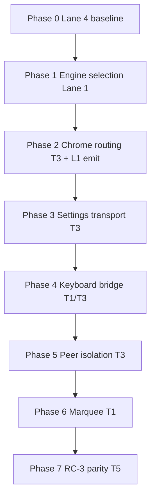

# T3 — RC-1/RC-4 multichart interaction re-migration plan (READ-ONLY)

**Status:** Plan only — **no implementation** until Director authorizes execution post honest-harness gate.  
**Baseline:** Lane 4 T0 step 17 honest actuation audit on build **20260715b1** — `reactParity`: **13 expected / 12 known-failing** (only **H-R12A** green).  
**Posture today:** **fallback-B** — multichart iframe panels default to pre-T1 behavior; migration code retained behind `__TALARIA_*` switches (`T1-fallbackB-disable-multichart-migration-report.md`).

**Governing decisions (do not re-litigate):**

- **D-011:** Diagnostic-first; consolidated **selection→parent-chrome routing** pre-authorized on root confirmation; mandatory fallback-posture A/B before blaming defects.
- **D-012 + I15:** Acceptance = **real cross-frame actuation** + **real end-state** on **built `dist-v9`** (build id inside panel iframe). Synthetic/green-shell proofs are **GREEN-SYNTHETIC** only.
- **I14:** Parent↔iframe coordination **postMessage only** — no parent globals in panel paths.
- **I13:** Every phase kill-switch gates **every** file touched, **React included**.

---

## 1. Row → root map (12 honest RED reactParity rows)

| Row | Checklist # | Actuation (I15) | Measures (end-state) | Root mechanism | Root group |
|-----|-------------|-----------------|----------------------|----------------|------------|
| **H-R01** | 1 | Real `page.mouse` single-click at iframe-translated hit on loaded bars | `readReactParityState.selectedIds` + parent V9 `#tl-sett` / toolbar visible | Fallback-B: lifecycle V2 OFF in iframe → click does not commit engine store selection; routing V3 alone insufficient without store | **A + B** |
| **H-R02** | 2 | Real single-click (host + panel B) | `isDrawingSelected` (store) + `readSelectionChrome` blue border | Same as A: store not selected; orphan handles without lifecycle retirement path | **A** |
| **H-R03** | 3 | Real Ctrl+click second tool | Both tool ids in `dm.selectedDrawings` / store | Multi-select toggle path gated off / store not updated in iframe | **A** |
| **H-R04** | 4 | Real double-click after select + V9 settle | `waitForParentDrawingSettingsOpen` — modal + style section, not quick-bar shell | Settings-open transport: ownership V2 OFF + incomplete postMessage open chain on honest click path | **B + C** |
| **H-R05** | 5 | Real dbl-click → real `page.keyboard` Esc | Store deselect + `readParentReactSettings` closed (no style section) | Esc/Delete bridge: parent keyboard does not cross iframe; settings UI blocks deselect without I14 forwarder | **D** |
| **H-R06** | 6 | Real Delete after select | `drawingExists` false + render delta + no ghost artifacts | Delete cmd not routed iframe→parent→iframe; `deleteSelected` missed `selectedDrawings[]` under fallback-B | **D** |
| **H-R07** | 7 | Real cross-panel single-clicks (host then panel B) | Exactly one store-selected id; host V9 cleared | Peer deselect / stale chrome: `multichart-clear-drawing-ui` ordering vs selection guard; ownership V2 OFF | **E** |
| **H-R08** | 8 | Real Ctrl+drag marquee (host + panel B) | `readCtrlMarqueeState` during drag (active, w/h>8) + store multi-select | Host/panel pointer path: `ctrlMarqueeSelect` inactive in iframe; modifier/focus not delivered cross-frame | **F** |
| **H-R09** | 9 | Real single → dbl → Esc chain | Full chain: select+V9, settings open, Esc deselect+close | Composite of **B + C + D** — fails at first broken leg on honest path | **B + C + D** |
| **H-R12** | 9b | Real select + parent gear click | Parent settings modal (not shell) after iframe selection | Gear route depends on working select (A/B) + settings transport (C) | **B + C** |
| **H-R13** | (burned) | Real panel-B dbl-click | Settings open + **still open after 400ms** (flash-close race) | `multichart-drawing-selected` / broad parent cleanup races settings open | **C** |
| **H-R14** | (burned) | Real panel-B Ctrl+drag | Marquee border active + both drawings in store | Iframe marquee controller not armed; same family as H-R08 panel-B | **F** |

### Root groups (shared mechanism)

| Group | Mechanism label | Rows discharged |
|-------|-----------------|-----------------|
| **A** | Engine selection store + lifecycle (iframe) | H-R01, H-R02, H-R03 (foundation) |
| **B** | Selection → parent V9 chrome routing (I14 postMessage) | H-R01, H-R04, H-R09, H-R12 |
| **C** | Settings-open transport + flash persistence | H-R04, H-R09, H-R12, H-R13 |
| **D** | Esc / Delete keyboard bridge (I14) | H-R05, H-R06, H-R09 |
| **E** | Peer isolation / single global owner | H-R07 (+ manager scenarios H-S34, H-S35) |
| **F** | Ctrl+drag marquee in iframe | H-R08, H-R14 |

**Honest-RED verdict (step 17):** All 12 rows are **honest RED** on b1 — real mouse/keyboard at iframe coordinates, store/modal end-states (not toolbar shell proxy). Prior greens on b44/b88 were **retracted** under D-012 when synthetic paths were removed.

**Note:** Current `known-failing.json` tracks **10** reactParity reds (H-R07, H-R12 promoted green in a later reconcile). Re-migration acceptance still targets the **full 12-row** step-17 matrix — Lane 4 re-runs before unfreeze.

---

## 2. Phased re-migration plan (6 phases)

Model: T5-style phased discharge — one root per phase, kill-switch per phase, RED→GREEN on honest harness before next phase.

### Phase 0 — Prerequisite (Lane 4, no product change)

| Item | Detail |
|------|--------|
| **Goal** | Frozen acceptance matrix + A/B harness |
| **Deliverable** | Step-17 table locked; `npm run gate:react` baseline; `--migration-on` flag documented |
| **Gate** | 12/12 RED on fallback-B default; 0 false greens |

### Phase 1 — Engine selection substrate (Group A)

| | |
|--|--|
| **Discharges** | H-R02, H-R03; unblocks H-R01 |
| **Mechanism** | Re-enable **tool lifecycle V2** + **legacy selection retire V2** in multichart iframe embeds (single-chart stays ON per fallback-B matrix) |
| **Files** | `chart/modules/tool-lifecycle-store.js`, `chart/modules/drawing-tools-manager.js`, `chart/chart.js` (+ I8 mirrors) |
| **Kill-switch** | Existing: `__TALARIA_DISABLE_TOOL_LIFECYCLE_V2`, `__TALARIA_DISABLE_LEGACY_SELECTION_RETIRE_V2` — Phase 1 **ON** = unset/false in iframe context only |
| **Master slice switch (optional)** | `__TALARIA_DISABLE_MC_REMIGRATION_PHASE1_ENGINE` (unset = Phase 1 ON) wrapping both predicates for one-knob revert |
| **Honest RED→GREEN** | H-R02, H-R03 **10/10**; H-R01 store leg green (V9 may still RED until Phase 2) |
| **Fallback-B retired** | Iframe default OFF for lifecycle + legacy-retire |
| **Lane** | **Lane 1** engine emit + predicates; T3 reviews only |

### Phase 2 — Parent chrome routing (Group B)

| | |
|--|--|
| **Discharges** | H-R01 (panel V9 bar), H-R12 select leg |
| **Mechanism** | Enable **ownership V2** for routing surfaces + **routing V3** (`multichart-drawing-selected` → `focusPanelById` + `TalariaV8bLive.onV9Sel` live lookup). Lane 1: `notifyV9SelectionSync` postMessage emit (separate gated commit). |
| **Files** | `talaria-design/src/MultichartGrid.jsx`, `talaria-design/src/TalariaV8bLive.jsx`, `drawing-tools-manager.js` (emit only, Lane 1) |
| **Kill-switch** | `__TALARIA_DISABLE_MULTICHART_OWNERSHIP_V2`, `__TALARIA_DISABLE_MULTICHART_PANEL_SELECTION_CHROME_ROUTING_V3` |
| **Honest RED→GREEN** | H-R01 **10/10** (panel B `toolbarVisible`); H-R12 gear path green |
| **Fallback-B retired** | `multichartOwnershipV2Enabled()` default false → true for routing slice only (not wholesale) |
| **Depends on** | Phase 1 (store must select on real click) |

### Phase 3 — Settings transport + flash (Group C)

| | |
|--|--|
| **Discharges** | H-R04, H-R13; H-R09 settings leg |
| **Mechanism** | `multichart-open-drawing-settings` postMessage; `openDrawingSettingsForPanel`; settings-flash V2 (preserve source panel, no broad cleanup race) |
| **Files** | `MultichartGrid.jsx`, `drawing-tools-ui.js`, `drawing-tools-manager.js` |
| **Kill-switch** | `__TALARIA_DISABLE_MULTICHART_SETTINGS_FLASH_FIX_V2`, `__TALARIA_DISABLE_MULTICHART_QUICKBAR_SETTINGS_FIX_V2` (settings-open subset) |
| **Honest RED→GREEN** | H-R04, H-R13 **10/10**; `waitForParentDrawingSettingsOpen` hasStyleSection, not quickBarShellOnly |
| **Depends on** | Phase 2 (select + V9 bar must work) |

### Phase 4 — Keyboard bridge Esc/Delete (Group D, I14)

| | |
|--|--|
| **Discharges** | H-R05, H-R06; H-R09 Esc leg |
| **Mechanism** | Parent Esc/Delete forwarders → `panel-cmd-bridge` `deleteSelectedDrawings`; iframe `handleKeyDown` Escape/Delete; `deselectAll` orphan chrome cleanup |
| **Files** | `MultichartGrid.jsx`, `panel-cmd-bridge.js`, `keyboard-shortcuts.js`, `drawing-tools-manager.js` |
| **Kill-switch** | `__TALARIA_DISABLE_MULTICHART_PANEL_KEYBOARD_V1` (new, preferred) **or** extend `__TALARIA_DISABLE_MULTICHART_QUICKBAR_SETTINGS_FIX_V2` (I13 audit required) |
| **Honest RED→GREEN** | H-R05, H-R06 **10/10** on built dist; switch-OFF restores RED |
| **Depends on** | Phase 3 (settings must open before Esc chain) |
| **Collision** | **Serialize away from T8 replay edits** on `panel-cmd-bridge.js` (replay bus) — keyboard slice is discrete cmd cases only |

### Phase 5 — Peer isolation + migrated ownership scenarios (Group E)

| | |
|--|--|
| **Discharges** | H-R07; manager **H-S34**, **H-S35**, **H-S44** |
| **Mechanism** | Peer deselect V1; `scrubHostStaleSelectionChrome`; `clearDrawingUiOnOtherPanels` with `ignoreSelectionGuard`; ownership V2 single quick-menu owner |
| **Files** | `MultichartGrid.jsx`, `multichart-manager.js` |
| **Kill-switch** | `__TALARIA_DISABLE_MULTICHART_PEER_DESELECT_V1`, ownership V2 peer slice |
| **Honest RED→GREEN** | H-R07 **10/10**; H-S34/35/44 GREEN (remove from `knownFailing` rollback window) |
| **Depends on** | Phases 2–4 (selection + settings lifecycle stable) |

### Phase 6 — Iframe Ctrl+drag marquee (Group F)

| | |
|--|--|
| **Discharges** | H-R08 (panel B), H-R14 |
| **Mechanism** | Real Ctrl+drag in iframe: pointer capture, `ctrlMarqueeSelect` state, store multi-select; parent modifier focus if needed |
| **Files** | `chart.js` (pointer/marquee), `drawing-tools-manager.js`; optional `MultichartGrid.jsx` focus on Ctrl+mousedown |
| **Kill-switch** | `__TALARIA_DISABLE_MULTICHART_PANEL_MARQUEE_V1` (new) |
| **Honest RED→GREEN** | H-R14, H-R08 panel-B **10/10**; host regression fence (H-R08 host already passes) |
| **Depends on** | Phase 1 (store multi-select) |

### Phase 7 — RC-3 Phase 5 multichart parity (parked T5; fold after interaction green)

| | |
|--|--|
| **Discharges** | RC-4 contract rows **H-S45–H-S50** (focus follows panel, draw quick-menu, indicator leak, drag bounds, command repaint) — **not** reactParity H-R* |
| **Mechanism** | Anchoring/sync compose in panel iframes; `sync-bridge.js` timestamp payloads; verify drawing decorate + volume render with multichart ON |
| **Files** | `sync-bridge.js`, `embed-bridge.js`, engine drawing modules — **avoid** `MultichartGrid.jsx` interaction handlers |
| **Kill-switch** | `__TALARIA_RC3_MC_PARITY_PHASE5` (new) + reuse migration slice switches |
| **Honest proof** | H-S45–50 GREEN + H-S40 panel-B variant (T5 step 1 plan) |
| **Runs** | **After Phases 1–6** and **after deploy unfreeze** — high collision risk if parallel with interaction phases |

---

## 3. Sequencing + collision map

### File collision matrix

| File | Phases | Serialize with |
|------|--------|----------------|
| `tool-lifecycle-store.js` / `drawing-tools-manager.js` / `chart.js` | 1, 3, 4, 6 | **Lane 1** owns; one commit per phase; T3 does not edit without handoff |
| `MultichartGrid.jsx` | 2, 3, 4, 5 | **Single Lane 2 owner** — max **one phase per PR**; Phases 3+4 may merge if touch disjoint handlers |
| `TalariaV8bLive.jsx` | 2 | With Phase 2 only |
| `panel-cmd-bridge.js` | 4 | **Freeze vs T8 replay** — schedule Phase 4 in a window with no T8 `panel-cmd-bridge` edits; keyboard cmd cases only |
| `multichart-manager.js` | 5 | After MultichartGrid Phase 5 |
| `sync-bridge.js` / anchoring | 7 | **After unfreeze**; do not interleave with Phases 2–6 |

### Parallel lane rules (deploy-hold hazard)

| Lane | May run in parallel | Must stay frozen |
|------|---------------------|------------------|
| **Lane 1** | Phase 1 engine commits | No ungated MultichartGrid edits |
| **Lane 2 (T3)** | Phases 2–6 sequential | No wholesale fallback reversal in one PR |
| **Lane 2 (T8)** | Replay/data path | **No** `MultichartGrid` / reactParity edits; `panel-cmd-bridge` only after T3 Phase 4 slot |
| **Lane 4** | Harness baseline updates per phase GREEN | Owns `known-failing.json`, `react-parity-lib.mjs` |

### D-011 step-0 A/B (each phase)

Before implementing phase *N*, run failing rows with **only** phase *N* switches ON in panel (`--migration-on` or targeted flags). Rows that flip green with migration ON but not OFF → phase *N* scope. Rows still RED → real defect within that slice.

---

## 4. Acceptance + unfreeze criteria

### Harness (mandatory)

| Criterion | Target |
|-----------|--------|
| `npm run gate:react` | **PASS**, **0 regressions** |
| `reactParity.knownFailing` | **Empty** (all 12 rows green) |
| Determinism | Each H-R01–H-R14 **10/10** on built `dist-v9` |
| Build id | Asserted **inside panel-B iframe** every run (L1) |
| Switch-OFF | Each phase switch **`= true`** restores that phase's RED cells |
| Manager `gate` | PASS (no new multichart regressions on H-S34/35/44 when promoted) |

### PO live-confirm (mandatory for **DONE (proven)**)

`MULTICHART-PARITY-CHECKLIST.md` on deployed build:

- Rows **1–9**, **9b**, **11** — host **and** panel B
- Row **10** — single-chart regression guard unchanged
- Record build id on host + every panel frame

### Fallback-B exit

| Switch family | Unfreeze state |
|---------------|----------------|
| `__TALARIA_DISABLE_TOOL_LIFECYCLE_V2` | iframe: effective **false** (V2 ON) |
| `__TALARIA_DISABLE_LEGACY_SELECTION_RETIRE_V2` | iframe: effective **false** |
| `__TALARIA_DISABLE_MULTICHART_OWNERSHIP_V2` | effective **false** for interaction slice |
| Per-phase switches | ON (unset) with documented revert |

### Deploy freeze lift (Manager)

All of:

1. Harness 12/12 GREEN + gate:react PASS  
2. PO sign-off on parity checklist (same build)  
3. H-S34, H-S35, H-S44 removed from rollback `knownFailing`  
4. No open **HR-PARITY#1–#8** registry rows in `user_replied` without `fixed_pending_live`  
5. Director authorization for execution (this plan)

**Labeling:** Until PO live-confirm, status is **DONE (dev only) — NEEDS-LIVE** per D-010/D-012.

---

## 5. Registry tags (Lane 4 — propose)

| Registry id | Rows | Owner |
|-------------|------|-------|
| `T3-REMIGRATION-P1` | H-R02, H-R03 | Lane 1 engine lifecycle |
| `T3-REMIGRATION-P2` | H-R01, H-R12 | T3 routing + L1 emit |
| `T3-REMIGRATION-P3` | H-R04, H-R13 | T3 settings transport |
| `T3-REMIGRATION-P4` | H-R05, H-R06 | T1/T3 keyboard I14 |
| `T3-REMIGRATION-P5` | H-R07, H-S34/35/44 | T3 peer isolation |
| `T3-REMIGRATION-P6` | H-R08, H-R14 | T1 marquee iframe |
| `T5-RC3-P7` | H-S45–50 | T5 anchoring (post-unfreeze) |

---

## 6. Director escalation summary (handoff paragraph)

Multichart interaction remains on **fallback-B** because T1’s panel migration was deliberately defaulted OFF after D-006/D-012 proved harness-only greens were false; Lane 4’s honest iframe harness now holds **12 stable RED rows** (real mouse/keyboard, store/modal end-states on **b1**). This plan re-migrates in **six gated phases**—engine selection substrate (Lane 1), then parent chrome routing, settings transport, Esc/Delete I14 bridge, peer isolation, and iframe marquee—each with its own kill-switch, D-011 A/B proof, and **10/10** `gate:react` GREEN before the next phase, **serializing** `MultichartGrid.jsx` to one phase per PR and keeping T8 replay edits off `panel-cmd-bridge` until the keyboard slice lands. **RC-3 Phase 5** (anchoring parity, H-S45–50) is folded as a **seventh post-unfreeze** tranche on `sync-bridge.js`, not mixed with interaction. **Unfreeze** requires empty `reactParity.knownFailing`, `gate:react` PASS, PO parity-checklist sign-off on the same build, and promotion of H-S34/35/44—only then may we leave fallback-B and lift the deploy freeze. **Authorization requested** to execute Phases 1–6 under this fence (not a wholesale revert reversal in one change).
