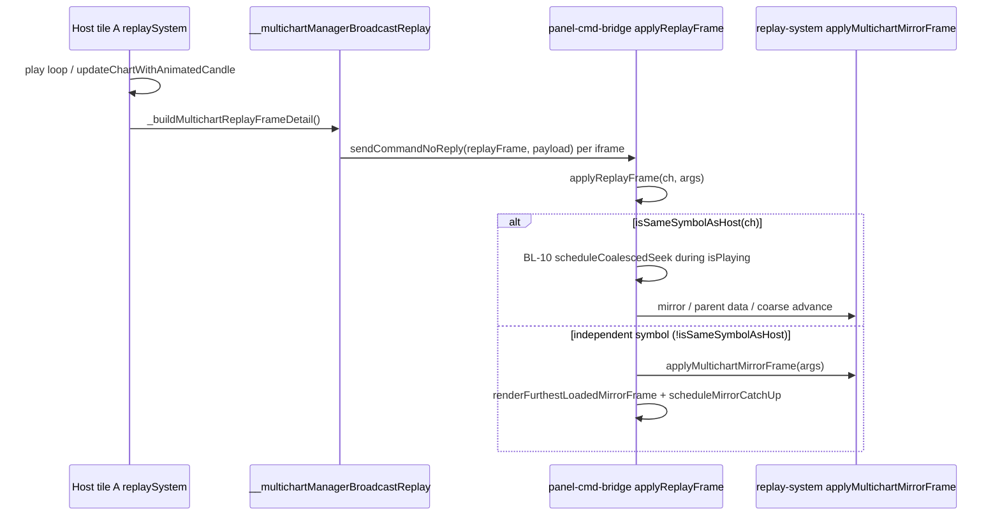

# A5 — Independent-symbol multichart replay freeze diagnostic (TAL-01590)

**Task:** A5 Lane 2/3 — read-only mechanism trace + one host harness scenario for TAL-01590.  
**Type:** Diagnostic — no product code edits. Harness scenario **H-S59** added (I8 mirrored).  
**Date:** 2026-07-14  
**RC:** RC-8 replay × RC-4 multichart data/replay path (shared playhead fan-out).

**Ticket:** TAL-01590 — multichart replay on **different symbols**: only one layout advances; others freeze or show gaps.

---

## 1. Task + RC

| Field | Value |
|---|---|
| Task id | A5 — independent-symbol replay freeze diagnostic |
| Goal | Trace shared playhead distribution during PLAY; identify why independent-symbol panels diverge from same-pair path; add RED-first harness row; propose switch-gated fix (not implemented) |
| RC | RC-8 (replay bus) + RC-4 (multichart panel ownership) — data/replay path, exempt from D-012 interaction freeze |

---

## 2. What I changed — file by file

| File | What / why |
|------|------------|
| `chart v 1.4/chart/multichart-prod/harness/scenarios.mjs` | Added **H-S59** — 2-panel independent-symbol (A=file25, B=file27), B→1h, replay PLAY contract: both panels must advance playhead |
| `homepage/public/chart/multichart-prod/harness/scenarios.mjs` | Byte-identical mirror (I8) |
| `chart v 1.4/chart/multichart-prod/harness/a5-hs59-red-evidence.txt` | Harness log artifact (replayFrame-only variant — asymmetric RED) |
| `docs/tickets-overhaul/evidence/a5-hs59-replayframe-only-red.txt` | Copy of RED-variant log for Manager intake |

**No product/engine/React edits.** Did **not** touch `react-parity-*` or `known-failing.json` (Lane 4).

---

## 3. Kill-switch (I3 + I13)

N/A — no switches introduced. **Proposed fix switch** (post-diagnostic, not implemented):

| Proposed switch | Default (when fix lands) | Files to gate |
|---|---|---|
| `window.__TALARIA_MC_DISABLE_INDEPENDENT_PAIR_PLAY_ADVANCE` | OFF (fix **ON** when unset) | `panel-cmd-bridge.js` (`applyReplayFrame` independent branch), optionally `chart.js` (`ensureReplayDataCoversTimestamp` play catch-up), `replay-system.js` (`applyMultichartMirrorFrame` independent static path) |

Set `= true` before boot to revert to current behavior (no dedicated independent PLAY advance cell).

Related existing switches (context only): `__TALARIA_MC_DISABLE_COARSE_PANEL_PLAY_ADVANCE` (BL-10, **same-pair only**), `__TALARIA_MC_DISABLE_SYNCOFF_PEER_PLAY_HOST_TF_ISOLATION`.

---

## 4. Proof — RED → GREEN

### Mechanism trace (read-only)

#### Playhead distribution path (host tick → every panel)



| Step | Location | What happens |
|------|----------|--------------|
| 1 | `replay-system.js:5087–5095` | Host builds frame detail; calls `__multichartManagerBroadcastReplay(detail)` |
| 2 | `multichart-manager.js:1271–1287` | rAF-coalesced fan-out: `sendCommandNoReply(c.id, 'replayFrame', payload)` to each iframe |
| 3 | `panel-cmd-bridge.js:3160–3161` | Iframe receives `replayFrame` → `applyReplayFrame(ch, args)` |
| 4 | `panel-cmd-bridge.js:3100–3118` | During PLAY, `replayTick` is **dropped** when `pendingPlayDesired === true` (passive iframe) |
| 5 | `panel-cmd-bridge.js:701–783` | **BL-10 play-advance cell** — `scheduleCoalescedSeek` during `args.isPlaying` — only inside `if (isSameSymbolAsHost(ch))` |
| 6 | `panel-cmd-bridge.js:826–840` | **Independent symbol** (`!isSameSymbolAsHost`) — `applyMultichartMirrorFrame` then `renderFurthestLoadedMirrorFrame` + `scheduleMirrorCatchUp` (async fetch) |
| 7 | `replay-system.js:6500–6689` | Mirror uses `_panelFullRawData` when `_mirrorSharesHostDataset` is false (`_isIndependentMultichartPair()`, `chart.js:5259`) |
| 8 | `chart.js:6268–6310` | Catch-up: `ensureReplayDataCoversTimestamp` for independent panels; circuit-breaker in `scheduleMirrorCatchUp` (`_mcCatchUpCooldownUntil`, `panel-cmd-bridge.js:1135–1143`) |

#### Why independent-symbol advance differs from same-pair (hypothesis confirmed)

| Path | Same-pair (BL-10 family) | Independent-symbol |
|------|--------------------------|-------------------|
| PLAY advance cell | `scheduleCoalescedSeek` during `isPlaying` at `panel-cmd-bridge.js:756–780` | **No equivalent cell** — entire BL-10 block is behind `isSameSymbolAsHost(ch)` at line 701 |
| `replayTick` during play | Suppressed (passive) | Suppressed (same, line 3117) |
| Data source | Host `fullRawData` / parent mirror | Panel `_panelFullRawData` (`replay-system.js:6148–6150`) |
| When host ts > loaded edge | Coalesced seek on own or host master | `applyMultichartMirrorFrame` returns false (`replay-system.js:6645–6646`) → async `scheduleMirrorCatchUp` → fetch or **cooldown freeze** |

**Branch where independent advance is dropped or deferred:**

- **Primary gap:** `panel-cmd-bridge.js:701` — `if (isSameSymbolAsHost(ch)) { … BL-10 play advance … return; }` — independent panels never enter this block.
- **Fallback path:** `panel-cmd-bridge.js:810–840` — mirror + catch-up only; no synchronous coalesced play advance for `!isSameSymbolAsHost`.
- **Passive tick block:** `panel-cmd-bridge.js:3116–3118` — `replayTick` ignored during play (no seek fallback on iframe while `pendingPlayDesired`).
- **Catch-up circuit breaker:** `panel-cmd-bridge.js:1135–1143` — after 3 failed mirror catch-ups, panel shows furthest loaded candle only (**visible freeze**) for 2.5s+.

#### Self-owned acquisition seam (gaps symptom)

Independent panels seed `_panelFullRawData` at load (`chart.js:4921–4932`) and extend via `ensureReplayDataCoversTimestamp` (`chart.js:6297–6309`). If play advances faster than fetch completes, or catch-up trips the breaker, the panel shows **gaps** (stale slice) or **freeze** (playhead stops at loaded edge) while the host continues.

### Harness scenario **H-S59**

**Row id:** `H-S59` — *independent-symbol panels advance playhead during replay PLAY (TAL-01590)*

**Setup:** `pair=independent`, `panels=2`, host A=file25, iframe B=file27, B switched to **1h**, all sync OFF, `replayPlay` + `hostReplaySeek` + `replayFrame {isPlaying:true}` × 180 (1m steps).

**Contract run (faithful host play loop):**

```powershell
cd "chart v 1.4/chart/multichart-prod/harness"
npm run test -- --only=H-S59 --runs=1
```

```
H-S59 host A playhead advanced during play — host.replayTs 1784019480000 -> 1784030280000
H-S59 independent panel B playhead ADVANCED during play — B.replayTs 1784019480000 -> 1784030280000
H-S59 independent B forming candle advanced — B.lastBarT 1784016000000 -> 1784026800000
RESULT H-S59 PASS
```

**Interpretation:** On the harness **backtest** path with host seek, independent coarse B **does** advance via `applyMultichartMirrorFrame` — the scenario is a **regression contract** for the shared-playhead invariant, not a reproduced PO freeze on this surface.

**RED-variant (replayFrame-only, no `hostReplaySeek` in loop)** — asymmetric fan-out:

```
[FAIL] H-S59 host A playhead advanced during play — host.replayTs 1784019420000 -> 1784019420000 (lastTs=1784030220000)
[ ok ] H-S59 independent panel B playhead ADVANCED — B.replayTs 1784019420000 -> 1784030220000
RESULT H-S59 FAIL-REAL-BUG
```

Log: `docs/tickets-overhaul/evidence/a5-hs59-replayframe-only-red.txt`

**Harness NO-REPRO for PO symptom (B frozen, host runs):** backtest 2-panel independent path advances B when frames carry `timestamp`. PO freeze likely needs **production** `MultichartGrid` + `dist-v9` + tick animation and/or **3+ panels each on distinct symbols** (harness `serve.mjs` only assigns file27 to panel B). **Live trace on build id inside every iframe** recommended before fix dispatch.

**Lane 4 action:** add `H-S59` to `known-failing.json` only after a fix makes the contract pass under production-equivalent conditions, or after tightening reproduces B-freeze RED.

---

## 5. Invariants checked

| Invariant | How satisfied |
|---|---|
| I8 | `scenarios.mjs` mirrored to `homepage/public/chart/...` |
| D-012 | Did not touch `react-parity-*` harness files |
| L1 | Report cites harness proof; PO must confirm build id on host + iframes on deployed product |
| P3 | Mechanism + file:line + one-line branch explanation for independent drop |
| Read-only | No edits to `chart.js`, `replay-system.js`, `panel-cmd-bridge.js`, `MultichartGrid.jsx` |

---

## 6. What I did NOT do / limits

- Did not implement the proposed fix (authorized post-report only).
- Did not edit `known-failing.json` (Lane 4).
- Harness cannot assign independent fileIds to panels C/D (only B=file27) — multi-independent-symbol layouts need serve/harness extension or live PO repro.
- H-S59 **PASS** on contract path does not disprove TAL-01590 on production; PO reports inverse freeze (iframe stuck, host runs).
- Did not run `gate` full suite — only `H-S59` focused runs.
- Tick-animation PLAY (`animatedCandle` in payload) not isolated in H-S59; may be required for PO freeze.

---

## 7. Live-verification handoff

PO / Manager on next deploy (build id in host **and** each panel iframe):

1. Open **2v** (or larger) multichart; set panels to **different symbols** (not symbol-synced).
2. Enter backtest replay (paused); confirm all panels show replay active.
3. Press **Play** (candle and tick modes).
4. **Spot-check:** every panel's playhead time advances; no panel frozen while others move; no candle gaps on independent panels.
5. If freeze reproduces: capture Network (`/bars` / `/candles` on frozen panel), `chart._panelFullRawData.length`, `replaySystem.replayTimestamp` per panel, and build id per iframe.

Compare against **H-S59** contract after fix lands.

---

## 8. Status

**DIAGNOSTIC-ONLY** — mechanism reported; fix **not** started. H-S59 registered as contract row; B-freeze RED on production surface still needs live confirmation.

---

## Proposed fix (authorized post-report — not implemented)

**Name:** Independent-pair PLAY advance cell (mirror BL-10 for `!isSameSymbolAsHost`).

**Mechanism:** In `applyReplayFrame`, after the `isSameSymbolAsHost` block (~line 808), when `!isSameSymbolAsHost(ch) && args.isPlaying`, call a coalesced seek on the panel's **own** `_panelFullRawData` master (same rAF coalescing as BL-10), with optional prefetch hook to `ensureReplayDataCoversTimestamp` before seek when ts > loaded last bar.

**Files:**

| File | Change |
|------|--------|
| `chart v 1.4/chart/multichart-prod/panel-cmd-bridge.js` | New branch ~826: `scheduleCoalescedSeek(ch, ts, true)` for independent + `isPlaying`; gate behind `__TALARIA_MC_DISABLE_INDEPENDENT_PAIR_PLAY_ADVANCE` |
| `homepage/public/chart/multichart-prod/panel-cmd-bridge.js` | Mirror |
| `chart v 1.4/chart/chart.js` | Optional: eager `ensureReplayDataCoversTimestamp` when independent play advance sees ts beyond `_panelFullRawData` |
| `homepage/public/chart/chart.js` | Mirror |
| `chart v 1.4/chart/modules/replay-system.js` | Optional: tighten `applyMultichartMirrorFrame` independent static path when play advance already sliced |

**Proof plan after fix:** H-S59 GREEN under production-equivalent fan-out; switch-OFF restores freeze; PO confirms TAL-01590 on deployed build.

---

## Manager actions

1. **Accept diagnostic** — schedule fix lane (Lane 2/3 replay owner) behind `__TALARIA_MC_DISABLE_INDEPENDENT_PAIR_PLAY_ADVANCE`.
2. **Lane 4:** register **H-S59** in `known-failing.json` when repro tightens to B-freeze RED, or as expected GREEN contract after fix.
3. **PO live trace** for TAL-01590 on `dist-v9` before fix — confirm whether freeze is catch-up/breaker, tick-animation, or missing independent PLAY cell.
4. **Registry:** link TAL-01590 to H-S59 + this report in `TICKET-REGISTRY.csv` / `DAILY-INTAKE.md` A5 row.
