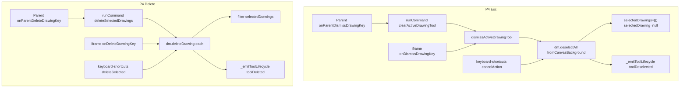

# T3 Re-migration Lane 1 — engine-store integration contract + Phase-1 commit manifest (READ-ONLY)

**Task:** `T3-remig-lane1-engine-store-integration-contract-plus-commit-manifest.md`  
**Type:** Read-only de-risking — no product/React/harness/registry edits, no git commit  
**Date:** 2026-07-16  
**RC:** RC-1 / RC-4 Group A — integration contract for P4/P6 consumers of Phase-1 substrate

---

## 1. Task + RC

| Field | Value |
|-------|-------|
| Task id | T3 remig Lane 1 — engine-store integration contract + Phase-1 commit manifest |
| Goal | Confirm P1 selection store is the single source P4/P6 consume; prepare ready-to-fire commit + build-bump manifest |
| RC | **RC-1 / RC-4 Group A** — prevents P4/P6 integration surprises |
| Authority | P1 IMPL report, P4/P6 PREP reports, frozen matrix `T3-PHASE0-FROZEN-MATRIX.md` |

---

## 2. What I changed — file by file

| Path | Change |
|------|--------|
| `docs/tickets-overhaul/worker-reports/T3-remig-lane1-integration-contract-plus-commit-manifest-report.md` | **Created** — this report |

**No product, React, harness, registry, or git operations performed.**

---

## 3. Kill-switch (I3 + I13) — contract context

Phase-1 master: `window.__TALARIA_DISABLE_MC_REMIGRATION_PHASE1_ENGINE` (unset = ON).

When master OFF, iframe `ToolLifecycleStore.isEnabled()` and `_isToolLifecycleV2Enabled()` / `_isLegacySelectionRetireV2Enabled()` revert to fallback-B opt-in — **P4/P6 must still read `dm.selectedDrawings`** (arrays may empty on click) but lifecycle-driven side-effects (object-tree refresh, settings invalidation) may not fire. P4/P6 impl should **not** add a parallel selection array; they gate **transport** on their own phase switches, not reimplement selection.

---

## Part A — Engine-store integration contract

### A.1 Phase-1 store surface (what P1 populates)

#### Authoritative runtime store (single source of truth)

| Field | Owner | Type | Written by |
|-------|-------|------|------------|
| `drawingManager.selectedDrawings` | per-panel `DrawingToolsManager` | `Drawing[]` | `selectDrawing()`, `deselectAll()`, `deleteDrawing()`, `completeCtrlMarqueeFromChart()` |
| `drawingManager.selectedDrawing` | same | `Drawing \| null` | Updated as **primary** (= last in `selectedDrawings` or sole selection) |

**Per-panel isolation:** Host A uses `window.chart.drawingManager`; panel B iframe uses its own `contentWindow.chart.drawingManager`. No shared array across panels (peer sync is drawing data via `broadcastDrawingChange`, not selection state).

#### Visual chrome parallel (secondary — must stay in sync)

| Field | Meaning | Written by |
|-------|---------|------------|
| `drawing.selected` | per-shape boolean for handles/chrome | `drawing.select()` / `deselect()` via `_commitSelectedDrawingVisual()` |

Harness end-state reads **store first**, chrome as orphan detector:

```243:253:chart v 1.4/chart/multichart-prod/harness/react-parity-lib.mjs
/** Engine store: is drawing id in selectedDrawings or d.selected? (I15 — no handle proxy). */
export async function readDrawingSelectedInStore(page, panelId, drawId) {
  // ...
  const inSel = (dm.selectedDrawings || []).some((x) => x && String(x.id) === String(id));
  const d = (dm.drawings || []).find((x) => x && String(x.id) === String(id));
  return inSel || !!(d && d.selected);
}
```

`readInteractiveState` / `waitForReactSelection` use `dm.selectedDrawings.map(d => d.id)` as the parity **selectedIds** contract.

#### ToolLifecycleStore (event bus + reduced snapshot — not primary for multi-select)

| API | Role |
|-----|------|
| `ToolLifecycleStore.isEnabled()` | Phase-1 iframe flip via `_isMcRemigrationPhase1EngineSliceActive()` |
| `emit(eventName, detail)` | Side-effect bus; `_reduce()` updates `state` |
| `getSelectedDrawings()` / `getSnapshot()` | Read-only snapshot — **can lag multi-select** |

**Events and `_reduce` shape:**

| Event | `_reduce` effect | Typical emitter |
|-------|------------------|-----------------|
| `toolSelected` | `state.selectedDrawings = drawing ? [drawing] : []` (**single only**) | `_selectExistingDrawingViaLifecycle`, placement-complete paths |
| `toolDeselected` | Clears `selectedDrawing`, `selectedDrawings`, `editingDrawing` | `deselectAll()` (when not `forSelectionChange`) |
| `toolDeleted` | Removes id from `state.selectedDrawings` | `deleteDrawing()` after dm array mutation |
| `toolHovered` / `toolHoverCleared` / `toolEditStarted` / `toolEditEnded` | Hover/edit fields | settings / hover paths |

**Critical contract:** Normal click/marquee paths call `selectDrawing()` **directly** and mutate `dm.selectedDrawings` **without** emitting `toolSelected` to the lifecycle store. Multi-select (Ctrl+click, marquee `addToSelection=true`) therefore lives in **`dm.selectedDrawings` only** — not in `lifecycleStore.state.selectedDrawings` (which `_reduce` collapses to one entry on `toolSelected`).

**P4/P6 impl rule:** Treat **`dm.selectedDrawings` + `dm.selectedDrawing`** as the integration surface. Use lifecycle events for **chrome/settings/object-tree side-effects**, not as the selection read path for Esc/Delete/marquee proofs.

#### Phase-1 predicate gates (enable the store path)

| Predicate | File | Iframe when P1 ON |
|-----------|------|-------------------|
| `_isToolLifecycleV2Enabled()` | `drawing-tools-manager.js` | `true` |
| `_isLegacySelectionRetireV2Enabled()` | `chart.js` | `true` → Escape/Delete use `dm`, not `chart.selectedDrawing` index |
| `ToolLifecycleStore.isEnabled()` | `tool-lifecycle-store.js` | `true` |

---

### A.2 P4 Esc/Delete — same store read/mutate paths

P4 does **not** introduce a new selection owner. All paths converge on `drawingManager`:



| P4 leg | Reads selection from | Mutates via | Store end-state |
|--------|---------------------|-------------|-----------------|
| Parent Esc | `dm.selectedDrawings`, `dm.selectedDrawing`, visual `d.selected` probes | `dismissActiveDrawingTool` → `deselectAll({ fromCanvasBackground: true })` | Empty `selectedDrawings`; H-R05 asserts `isDrawingSelected` false |
| Iframe Esc | same | same + `v9-drawing-tool-cleared` postMessage | same |
| Parent Delete | `hasDeletableDrawingSelection(dm)` on `selectedDrawings` / `selectedDrawing` | `deleteSelectedDrawings` cmd → `dm.deleteDrawing` | `drawingExists` false; H-R06 render delta |
| Iframe Delete | same | local `deleteDrawing` loop | same |
| Host keyboard | `dm.selectedDrawings` slice | `deleteSelected()` / `cancelAction()` | same |

**No divergent secondary state:** P4 must not read `chart.selectedDrawing` (legacy index) in iframe when P1 ON — `_isLegacySelectionRetireV2Enabled()` routes host `chart.js` keydown to `dm` (~19181–19198).

**P4 switch is transport-only:** `__TALARIA_DISABLE_MULTICHART_PANEL_KEYBOARD_V1` gates **whether** Esc/Delete reach `dm` — not a second selection model.

---

### A.3 P6 marquee — same store write path

| Step | Function | Store write |
|------|----------|-------------|
| Gesture start | `chart.js` `tryStartCtrlMarqueeSelect` | prepares dm; no selection yet |
| Gesture end | `completeCtrlMarqueeFromChart(x,y,w,h)` | `selectDrawing(drawing, true)` per hit |
| Per shape | `selectDrawing(..., addToSelection=true)` | `selectedDrawings.push(drawing)`; `_commitSelectedDrawingVisual` sets `d.selected` |

```13526:13540:chart v 1.4/chart/modules/drawing-tools-manager.js
    completeCtrlMarqueeFromChart(rectX, rectY, rectWidth, rectHeight) {
        // ...
        this.drawings.forEach((drawing) => {
            if (!this.isDrawingInRectangle(drawing, rectX, rectY, rectWidth, rectHeight)) return;
            // ...
            this.selectDrawing(drawing, true);
        });
    }
```

H-R08/H-R14 assert both ids in `dm.selectedDrawings` via `waitForReactSelection` / `isDrawingSelected` — **same store P1 multi-select proof uses** (`t3-remig-phase1-engine-proof.mjs` `probeSelect(..., true)`).

P6 switch (`__TALARIA_DISABLE_MC_REMIGRATION_PHASE6_MARQUEE`) gates **gesture start + bbox fallback** only — commit path still calls `selectDrawing`.

---

### A.4 Desync risks — guard at P4/P6 impl

| Risk | Symptom | Mitigation |
|------|---------|------------|
| **`d.selected` without `selectedDrawings`** | H-R02 orphan handles | P1 + `deselectAll` orphan sweep (~10069–10073); P4 Esc must call `deselectAll({ fromCanvasBackground: true })`, not chrome-only hide |
| **`lifecycleStore.state` vs `dm.selectedDrawings` on multi-select** | Object-tree shows one id when two selected | P4/P6 proofs use `dm.selectedDrawings`; do not assert on `lifecycleStore.getSelectedDrawings()` for marquee/multi-delete |
| **`toolSelected` emit on single path only** | Subscribers assume store snapshot is complete | P6 marquee must not rely on `toolSelected` emit — already writes via `selectDrawing` |
| **`forSelectionChange: true` skips `toolDeselected`** | Settings flash if deselect during replace-select | Expected; P4 Esc uses full deselect, not `forSelectionChange` |
| **Legacy `chart.selectedDrawing` index** | Host-only if legacy retire OFF | P1 ON keeps retire ON in iframe; P4 host path uses `dm` when retire ON |
| **Cross-panel selection leak** | H-R08 panel-B store read suspect | P5 peer isolation scope; P6 must focus panel B dm only |
| **`visuallySelected` probe** (`d.selected` scan) | Esc fires when store empty but chrome visible | P4 dismiss targets include visual scan — after P1, store and chrome should agree; if not, fix is P1 `deselectAll` not P4 parallel state |

---

### A.5 Host A vs panel B — same predicate/store path

| Surface | Predicate source | Store instance | Divergence |
|---------|------------------|----------------|------------|
| **Host A** | Parent `window` — P1 master unset → lifecycle + legacy retire **ON** | `window.chart.drawingManager` | None vs single-chart |
| **Panel B iframe** | Iframe `window` with Phase-1 iframe branch — master unset → **ON** | iframe `window.chart.drawingManager` | Separate dm; same API |
| **Parent forwarders (P4)** | Read focused panel via `getChartForPanelId` → **that panel's dm** | Same arrays as iframe-local path | No host-dm alias for panel B selection |

Phase-1 flip is **iframe-only** for the master slice; host A behavior is unchanged. P4/P6 proofs run on **both** A and B using the same harness readers (`readDrawingSelectedInStore`, `readCtrlMarqueeState`).

**Confirmed:** No host-only selection array that panel B would need to mirror for P4/P6 store operations.

---

## Part B — Phase-1 commit manifest (ready-to-fire)

### B.1 Gating condition (HARD — do not commit before this)

**DO NOT `git commit` until Lane 4 reports ALL of:**

1. **H-R02** honest **10/10** on built `dist-v9` (real mouse click → store + chrome)
2. **H-R03** honest **10/10** (real Ctrl+click multi-select in store)
3. **Phase-1 A/B:** `--phase1-off` restores RED on H-R02/H-R03 (and H-R01 store leg)
4. Re-validated frozen matrix unchanged (or Director escalation if material drift)
5. Lane 4 reconciles `known-failing.json` — **Lane 1 does not edit it**

Until then: engine proof + predicate A/B only = **DONE (dev only)**.

---

### B.2 Files to stage (`git add` — explicit paths only, never `-A`)

**7 paths (6 engine mirrors + 1 proof script):**

```
chart v 1.4/chart/modules/tool-lifecycle-store.js
chart v 1.4/chart/modules/drawing-tools-manager.js
chart v 1.4/chart/chart.js
homepage/public/chart/modules/tool-lifecycle-store.js
homepage/public/chart/modules/drawing-tools-manager.js
homepage/public/chart/chart.js
chart v 1.4/chart/multichart-prod/harness/t3-remig-phase1-engine-proof.mjs
```

**Explicitly EXCLUDE from this commit** (other lanes / ungated):

- `drawing-tools-ui.js` (T6 M3 uncommitted)
- `known-failing.json`, `react-parity-lib.mjs`, `react-run.mjs`, `scenarios.mjs` (Lane 4)
- React / `MultichartGrid.jsx` / `TalariaV8bLive.jsx`
- Docs, registry CSVs, evidence `.txt` files

**Note:** `drawing-tools-manager.js` includes **Step 0 H-S18** redraw guard (`replaySystem.isPlaying` / `inertia.active` skip in `_invalidateAfterLocalDrawingMutation`) bundled with Phase-1 predicate flip — same file pair; one commit is correct.

---

### B.3 Pre-commit verification checklist

```powershell
cd "c:\Users\user\Desktop\talaria1\full-talaria-log--main"

# 1. I8 mirror SHA256 — all three pairs must match
Get-FileHash "chart v 1.4/chart/modules/tool-lifecycle-store.js","homepage/public/chart/modules/tool-lifecycle-store.js" -Algorithm SHA256
Get-FileHash "chart v 1.4/chart/modules/drawing-tools-manager.js","homepage/public/chart/modules/drawing-tools-manager.js" -Algorithm SHA256
Get-FileHash "chart v 1.4/chart/chart.js","homepage/public/chart/chart.js" -Algorithm SHA256

# 2. Engine substrate proof
cd "chart v 1.4/chart/multichart-prod/harness"
node t3-remig-phase1-engine-proof.mjs

# 3. Lane 4 gate (MUST be green before commit)
npm run test:react -- --only=H-R02,H-R03 --runs=10
# optional: H-R01 store leg once hit-coord fixed

# 4. Step 0 regression hold
npm run test -- --only=H-S18 --runs=1
```

**Expected SHA256 at commit time (re-confirm — do not trust stale):**

| File | SHA256 (both trees) |
|------|---------------------|
| `tool-lifecycle-store.js` | `6A644DEF60A0AAFD12C80F21BF6966EA938968BF24D715D9B4B48FCF4E329ECA` |
| `drawing-tools-manager.js` | `46F10B6F58519AE5C6A69747D002B5F3C416697DAF6D58238DC8D1FC8DB1D2F7` |
| `chart.js` | `994A59F3A3AB1506B69332A97BBC2142C1956015DFA6D144BB4EF6AF273C031B` |

If working tree drifts before commit, re-run hashes after any fix.

---

### B.4 Build-id bump (cut immediately after commit / before PO handoff)

**Current harness stamp:** `20260715b2` (`serve.mjs`, `live/index.html`, `chart-embed.html`, SW).  
**Proposed Phase-1 cut:** **`20260716b1`** (next lane-1 engine-only bump; Manager may coordinate combined-cut id per `T3-COMBINED-BUILD-MANIFEST.md`).

**Automated bump (preferred):**

```powershell
cd "chart v 1.4/talaria-design"
$env:BUILD_ID = "20260716b1"
npm run build:live
```

`scripts/bump-dist-v9-cache.mjs` updates:

| Location | What gets bumped |
|----------|------------------|
| `talaria-design/live/index.html` | `window.__TALARIA_CHART_BUILD_ID`, all `?v=` on chart scripts |
| `talaria-design/live/public/sw.js` | `SW_VERSION = "talaria-chart-…"` |
| `chart/multichart-prod/chart-embed.html` | embed default `v` + vendor `?v=` |
| `chart/multichart-prod/harness/serve.mjs` | `const buildId = '…'` |
| `chart/legacy-index.html` | module script `?v=` (if present) |
| `homepage/public/chart/…` | mirror paths via build pipeline |

**Manual reconcile after bump:**

| File | Constant |
|------|----------|
| `chart v 1.4/chart/chart.js` (~L431) | `CHART_ENGINE_BUILD = '20260716b1'` |
| `homepage/public/chart/chart.js` | mirror |

**Post-bump verify:**

```powershell
cd "chart v 1.4/chart/multichart-prod/harness"
npm run test:react -- --only=H-R02,H-R03 --runs=10
# assert build id inside panel-B iframe matches 20260716b1
```

---

### B.5 Suggested commit message

```
T3 remig Phase 1: iframe engine selection substrate + H-S18 redraw guard.

Flip tool lifecycle V2 and legacy selection retire V2 ON by default in
multichart panel iframes behind __TALARIA_DISABLE_MC_REMIGRATION_PHASE1_ENGINE.
Includes Step 0 invalidate guard during replay play. Engine proof script added.
```

---

### B.6 Post-commit handoff

| Owner | Action |
|-------|--------|
| **Lane 4** | Already green before commit; after bump re-run `gate:react`; remove H-R02/H-R03 from `known-failing.json` |
| **Lane 2** | Phase 2 dispatch on H-R02/H-R03 + H-R01 store leg green |
| **Manager** | Register build `20260716b1` in intake; update `T3-COMBINED-BUILD-MANIFEST.md` §1.3 P1 → landed |
| **PO** | Live confirm: panel B single-click store select + Ctrl multi-select (V9 chrome may wait for P2) |

---

## 4. Proof — RED → GREEN

**N/A for this read-only task.** Pre-commit proof commands listed in §B.3. Current status: engine proof **PASS**; H-R02/H-R03 **BLOCKED** on Lane 4 hit-coord fix.

---

## 5. Invariants checked

| Invariant | Status |
|-----------|--------|
| I3 | P1 master switch documented; P4/P6 use own switches for transport only |
| I8 | SHA256 table for 3 file pairs; commit manifest explicit paths |
| I9 | Lane 4 owns `known-failing.json` — excluded from P1 commit |
| I13 | P4/P6 do not extend P1 switch |
| I14 | Store is per-iframe `dm`; P4 postMessage routes to same dm |
| I15 | Contract names `dm.selectedDrawings` as harness end-state |

---

## 6. What I did NOT do / limits

- No git commit, no `build:live` run, no hash re-verify after this document (hashes from working tree at report time).
- Did not re-run H-R02/H-R03 (Lane 4 blocker).
- `ToolLifecycleStore` multi-select gap documented — **not** fixed in P1 (out of scope; consumers must read `dm`).
- Combined unfreeze build may supersede `20260716b1` with a later canonical id — manifest uses Phase-1-isolated bump; Manager merges per D-018 #4.

---

## 7. Live-verification handoff

After commit + `20260716b1` deploy:

1. Build id in host + panel-B iframe = `20260716b1`.
2. Panel B: rectangle single-click → stays in `selectedDrawings` (handles, no orphan).
3. Two trendlines → Ctrl+click second → both ids in store.
4. `__TALARIA_DISABLE_MC_REMIGRATION_PHASE1_ENGINE=true` → above fails (A/B).

Esc/Delete (P4) and marquee (P6) are **not** PO-gated on this commit — they consume this store in later phases.

---

## 8. Status

**DIAGNOSTIC-ONLY (contract + manifest reported, commit not fired)**

| Deliverable | Status |
|-------------|--------|
| Store integration contract | **Complete** — `dm.selectedDrawings` authoritative; lifecycle store secondary |
| P4/P6 same-store trace | **Confirmed** with desync risks flagged |
| Commit manifest | **Ready-to-fire** — §B.2–B.5 |
| Gating condition | **Lane 4 H-R02/H-R03 honest 10/10 + A/B** before `git commit` |
