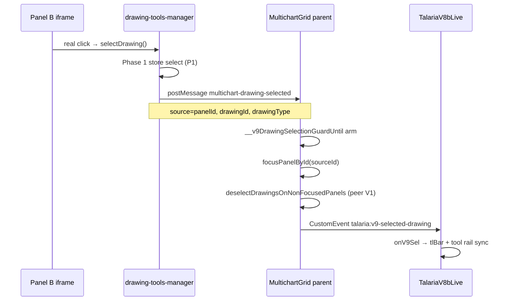

# T3 Re-migration Phase 2 PREP — React ownership + selection routing design (READ-ONLY)

**Task:** `ESC015-D017-lane2-commit-plus-phase2-prep.md` Part B (+ Part A commit/reconcile).  
**Type:** Part A executed; Part B read-only design — no product/React edits beyond committed slices.  
**Date:** 2026-07-15  
**RC:** RC-1 / RC-4 Group B (parent chrome routing) — design only; fix not started.

**Ready to implement Phase 2 on Phase-1-GREEN go.**

---

## 1. Task + RC

| Field | Value |
|-------|-------|
| Task id | ESC015/D017 follow-up — Part A commit + Part B Phase 2 PREP |
| Goal | Land D-017 snap-back; reconcile `replay-system.js`; design Phase 2 ownership + routing V3 |
| RC | **RC-1 / RC-4 Group B** — discharges H-R01 (V9 chrome leg), H-R12 select leg; partial H-R04 chrome prerequisite |

---

## 2. What I changed — file by file

### Part A — commits (file-scoped only)

| Commit | Hash | Paths |
|--------|------|-------|
| **D-017 snap-back** | `9462cef3` | `chart v 1.4/chart/chart.js`, `homepage/public/chart/chart.js`, `chart v 1.4/chart/sw.js`, `chart v 1.4/chart/dist-v9/sw.js`, `chart v 1.4/talaria-design/live/public/sw.js`, `homepage/public/chart/sw.js`, `homepage/public/chart/dist-v9/sw.js`, `docs/tickets-overhaul/worker-reports/ESC015-D017-lane2-snapback-fix-report.md` |
| **T8 finest-TF cadence (D-016)** | `d6d9822f` | `chart v 1.4/chart/modules/replay-system.js`, `homepage/public/chart/modules/replay-system.js`, `chart v 1.4/chart/multichart-prod/panel-cmd-bridge.js`, `homepage/public/chart/multichart-prod/panel-cmd-bridge.js`, `chart v 1.4/talaria-design/src/MultichartGrid.jsx` (cadence helpers only), `docs/tickets-overhaul/worker-reports/T8-step13-finest-tf-cadence-IMPL-report.md` |

**I8 SHA256 after commit:**

| Pair | SHA256 |
|------|--------|
| `chart.js` ↔ homepage | `1562C0301A0D3FD40C9A8AA496327B765FFA7E17EF867CAC32B26082FACD31B3` |
| `replay-system.js` ↔ homepage | `FAE5509078FD4D01259D4004C117CCC52AE3B040184F75AD2F2883125503EF33` |

**Explicitly NOT staged:** `known-failing.json`, `scenarios.mjs` (H-S82 harness — Lane 4), `PER-BUG-REGISTRY.csv`, `drawing-tools-ui.js`, order-entry, indicator modules, manager docs.

### Part B — design only

| File | Change |
|------|--------|
| `docs/tickets-overhaul/worker-reports/T3-remig-phase2-lane2-PREP-report.md` | This report |

---

## 3. Kill-switch (I3 + I13) — Phase 2 design

### Master slice (mandatory per D-018 #2)

| Switch | Default after Phase 2 lands | Meaning |
|--------|----------------------------|---------|
| `window.__TALARIA_DISABLE_MC_REMIGRATION_PHASE2_ROUTING` | **unset** (= Phase 2 ON) | One-knob revert: `true` restores fallback-B ownership posture for routing surfaces |

### Child predicates (retained)

| Switch | Fallback-B today | Phase 2 ON (master unset) |
|--------|------------------|---------------------------|
| `__TALARIA_DISABLE_MULTICHART_OWNERSHIP_V2` | ON only when `=== false` (opt-in) | **Default ON** in multichart shell unless explicit `true` |
| `__TALARIA_DISABLE_MULTICHART_PANEL_SELECTION_CHROME_ROUTING_V3` | Default ON (unset = enabled) | Unchanged — already ON; master gates **ownership** flip that makes routing effective |

### Proposed predicate logic (implementation contract)

```javascript
function _isMcRemigrationPhase2RoutingSliceActive() {
    if (typeof window === 'undefined') return true;
    return !window.__TALARIA_DISABLE_MC_REMIGRATION_PHASE2_ROUTING;
}

function multichartOwnershipV2Enabled() {
    if (typeof window !== 'undefined' && window.__TALARIA_DISABLE_MULTICHART_OWNERSHIP_V2) return false;
    if (!_isMcRemigrationPhase2RoutingSliceActive()) {
        return typeof window !== 'undefined' && window.__TALARIA_DISABLE_MULTICHART_OWNERSHIP_V2 === false;
    }
    return true; // Phase 2 ON: ownership default ON
}

function multichartPanelSelectionChromeRoutingV3Enabled() {
    if (!_isMcRemigrationPhase2RoutingSliceActive()) {
        return !(typeof window !== 'undefined' && window.__TALARIA_DISABLE_MULTICHART_PANEL_SELECTION_CHROME_ROUTING_V3);
    }
    return !(typeof window !== 'undefined' && window.__TALARIA_DISABLE_MULTICHART_PANEL_SELECTION_CHROME_ROUTING_V3);
}
```

Duplicate helpers in `TalariaV8bLive.jsx` (`v9PanelSelectionChromeRoutingV3Enabled` ~3897) must stay byte-synced.

### React / I13 coverage

| File | Gated by master + child |
|------|-------------------------|
| `MultichartGrid.jsx` | `multichartOwnershipV2Enabled`, `multichartPanelSelectionChromeRoutingV3Enabled` — all `multichart-drawing-selected` / focus / clearDrawingUi paths |
| `TalariaV8bLive.jsx` | `v9PanelSelectionChromeRoutingV3Enabled`, toolbar bridge `onV9Sel` routingV3 branch |
| `drawing-tools-manager.js` | **Emit only** (Lane 1) — `notifyV9SelectionSync` always fires when Phase 1 store selects; Phase 2 does not gate emit |

**No `panel-cmd-bridge.js` touch in Phase 2** (replay + Phase-4 keyboard regions — see §9).

---

## 4. Proof — RED → GREEN (Phase 2 targets)

### Prerequisites

- Phase 0 frozen RED matrix (Lane 4)
- Phase 1 GREEN: H-R02, H-R03 **10/10**; H-R01 **store leg** green (`selectedIds` populated on real iframe click)

### Honest harness commands (built dist, default switches)

```text
cd "chart v 1.4/chart/multichart-prod/harness"
node run.mjs --only=H-R01,H-R12
# switch-OFF A/B:
node run.mjs --bug --bugSwitches=__TALARIA_DISABLE_MC_REMIGRATION_PHASE2_ROUTING --only=H-R01
```

| Row | Actuation (I15) | Measures (end-state) | Phase 2 GREEN criterion |
|-----|-----------------|----------------------|-------------------------|
| **H-R01** | Real `page.mouse` single-click on panel B loaded bars (iframe-translated coords) | `readReactParityState`: `toolbarVisible` / `#tl-sett` on **parent** shell; `selectedIds` already green from P1 | Parent V9 quick bar visible for panel B selection **10/10** |
| **H-R12** | Real select on B + parent gear click | `waitForParentDrawingSettingsOpen` — modal with style section (settings transport = P3; **select+V9 leg** = P2) | Gear enabled path: focus panel B + `tlBarSelected` before gear (partial — full modal P3) |
| **H-R04** (chrome leg only) | Dbl-click deferred to P3 | — | P2 only ensures focus + selection guard armed before settings postMessage |

**Switch A/B:** Phase 2 master `true` → H-R01 `toolbarVisible` **RED** again (ownership opt-in reverted); routing V3 alone insufficient without ownership ON.

**Determinism target:** **10/10** per T3-REMIGRATION-PLAN §2 Phase 2.

---

## 5. Invariants checked

| Invariant | Part A | Part B design |
|-----------|--------|---------------|
| I8 | SHA256 matched on committed pairs | N/A |
| I13 | Snap-back switch gates all chart.js touch paths | Master slice gates React + ownership helpers |
| I14 | N/A | All selection state crosses `postMessage` + `CustomEvent` — no parent globals in iframe |
| D-018 | One-knob per phase | `__TALARIA_DISABLE_MC_REMIGRATION_PHASE2_ROUTING` |
| Serialization | D-017 `chart.js` 2456–2526 / 17296–17357 committed before P1 2349–2357 | Confirmed disjoint |

---

## 6. What I did NOT do / limits

### Part A — `replay-system.js` reconcile

| Verdict | Detail |
|---------|--------|
| **Committed** | +111 lines = **T8 step 13 / D-016 finest-TF cadence** (not snap-back). Helpers `_isFinestTfReplayCadenceEnabled` … `_onFinestTfCadencePanelsChanged`; play-step override; virtual `replayTimestamp`; mirror-frame pin. Paired with `panel-cmd-bridge.js` + `MultichartGrid.jsx` cadence resolver in commit `d6d9822f`. |
| **Not orphaned** | M4 diagnostic +110 referred to this landed cadence work, not unknown drift. |

### Left uncommitted (documented)

| Path | Diff summary | Suspected source | Action |
|------|--------------|------------------|--------|
| `drawing-tools-ui.js` (+6 lines) | `applyTextAlignDefaults` calls `notifyDrawingVisualMutation` / `saveDrawings` | **T6 step 4 / RC-6 Phase 3** (M3 settings invalidation) — orthogonal to snap-back/cadence | **Do not commit here** — Lane 3 owns |
| `scenarios.mjs` (+330) | H-S82, H-S83, other T8/Lane 4 rows | Lane 4 harness | **Do not commit** per guardrails |
| `known-failing.json` | Lane 4 baseline churn | T0 step 16/17 | **Do not commit** |
| Manager/registry CSVs | Intake updates | Manager | **Do not commit** |

### Part B limits

- No `dist-v9` React bundle rebuild — design references source JSX only.
- H-R12 full settings modal remains **Phase 3**; Phase 2 only covers select → parent focus → V9 bar sync.

---

## 7. Live-verification handoff

After Phase 2 impl on combined build (post P1 GREEN):

1. Build id in host + panel B iframe (`__TALARIA_CHART_BUILD_ID`).
2. Multichart 2×2, fallback-B **off** for Phase 2 master (unset).
3. Single-click trendline on **panel B** → parent floating style bar (`#tl-sett` / tlBar) appears without clicking host A.
4. Kill-switch: `window.__TALARIA_DISABLE_MC_REMIGRATION_PHASE2_ROUTING=true` + reload → bar stays hidden on panel B select (RED repro).

---

## 8. Status

| Part | Status |
|------|--------|
| **Part A** | **DONE (proven)** — commits `9462cef3` + `d6d9822f`; chart.js clean for Lane 1 Phase 1 |
| **Part B** | **DIAGNOSTIC-ONLY** — design ready; await Phase 1 GREEN |

---

## 9. Part B — Parent React ⇄ iframe ownership/routing map

### Message flow (I14)



### Iframe emit (Lane 1 — Phase 1 enables store; Phase 2 consumes)

| Step | File:region | Function |
|------|-------------|----------|
| 1 | `drawing-tools-manager.js:124–171` | `notifyV9SelectionSync` — synchronous `postMessage` `multichart-drawing-selected` |
| 2 | `drawing-tools-manager.js:9106` | Called from `selectDrawing` success path |
| 3 | `drawing-tools-manager.js:100–121` | `notifyMultichartParentSelectionCleared` → `multichart-drawing-deselected` (peer cleanup) |

### Parent receive + routing (Phase 2 flip targets)

| Step | File:region | Behavior gated by ownership V2 / routing V3 |
|------|-------------|---------------------------------------------|
| 1 | `MultichartGrid.jsx:6445–6480` | `multichart-drawing-selected` handler — arms guard, `focusPanelById`, peer deselect, fires `talaria:v9-selected-drawing` |
| 2 | `MultichartGrid.jsx:1848–1870` | `focusPanelById` — updates `focusedPanelIdRef` + peer deselect on focus change |
| 3 | `MultichartGrid.jsx:5171–5213` | `clearDrawingUiOnOtherPanels` — ownership V2 skipDismiss / preserveSourceSettings |
| 4 | `MultichartGrid.jsx:5039+` | `deselectDrawingsOnNonFocusedPanels` — early return when `!ownershipV2` |
| 5 | `TalariaV8bLive.jsx:21232–21280` | `onV9Sel` — `routingV3` branch accepts panel iframe selection by `panelId` + `drawingId` |
| 6 | `TalariaV8bLive.jsx:20855–20920` | Toolbar hook — multichart embed quick-bar path when `v9QuickBarPanelSettingsFixEnabled` |

### Rows discharged (Phase 0 → P2 assignment)

| Row | P2 responsibility |
|-----|-------------------|
| H-R01 | Parent V9 bar after panel select |
| H-R12 | Select + focus leg before gear (gear modal = P3) |
| H-R04 | Chrome prerequisite only (dbl-click transport = P3) |
| H-R09 | Composite — P2 fixes select+V9 leg only |
| TAL-01499 | Quick menu delayed — routing V3 + focus timing (needs-live confirm post-P2) |

---

## 10. File line-region map + collision check

| File | Phase 2 touch zones | Avoid |
|------|---------------------|-------|
| `MultichartGrid.jsx` | **54–77** predicate helpers; **1848–1870** `focusPanelById`; **5039–5213** ownership clear paths; **6393–6480** message handler; **5860** grid API exports | **2479–2491, 5539–5848** D-016 cadence (committed T8 — no P2 edits) |
| `TalariaV8bLive.jsx` | **3897–3903** routing helper; **21232–21499** `onV9Sel` effect; **20855–20920** toolbar hooks | Order-entry / billing regions — out of scope |
| `drawing-tools-manager.js` | **Read-only** emit verification — no predicate flip in P2 | Selection retire / lifecycle = P1 |
| `panel-cmd-bridge.js` | **No Phase 2 edits** | **562–574, 1974–1998** D-016 replay cadence (T8); **Phase 4** keyboard/delete cmd cases (D-018 #3) |
| `chart.js` | **No Phase 2 edits** | **2349–2357** P1 legacy retire; **2456–2526, 17296–17357** D-017 snap-back (committed) |

**Phase 4 keyboard window:** `panel-cmd-bridge.js` Esc/Delete/`deleteSelectedDrawings` cases — serialize T8 replay bus edits away from P4 per D-018 #3. Phase 2 does not touch bridge.

---

## 11. Lane 4 coordination

| Item | Lane 4 action |
|------|---------------|
| H-S82 | Register in `scenarios.mjs` + `TICKET-REGISTRY` (snap-back committed; harness uncommitted) |
| H-R01 / H-R12 | Re-run after P2 impl; confirm 10/10 on built dist |
| Phase 0 matrix | Must be frozen before P1 dispatch (blocks P2) |

---

## 12. Summary

| Item | Result |
|------|--------|
| Snap-back commit | `9462cef3` — chart.js clean for Phase 1 |
| Cadence commit | `d6d9822f` — replay-system + bridge + Grid cadence slice |
| Orphan `drawing-tools-ui.js` | T6 M3 — **not committed** |
| Phase 2 switch | `__TALARIA_DISABLE_MC_REMIGRATION_PHASE2_ROUTING` |
| Phase 2 targets | H-R01, H-R12 (chrome leg) **10/10** |
| Gate phrase | **Ready to implement Phase 2 on Phase-1-GREEN go** |
