# T3 Re-migration Phase 4 PREP — keyboard bridge Esc/Delete design (READ-ONLY)

**Task:** `T3-remig-phase4-lane1-PREP-readonly.md`  
**Type:** Read-only design — no product, React, harness, or registry edits  
**Date:** 2026-07-16  
**RC:** RC-1 / RC-4 **Group D** (I14 keyboard bridge) — design only; fix not started.

**Ready to implement Phase 4 on Phase-3-GREEN go + T8 window.**

---

## 1. Task + RC

| Field | Value |
|-------|-------|
| Task id | T3 re-migration Phase 4 PREP (Lane 1) |
| Goal | Design parent↔iframe Esc/Delete keyboard bridge behind a **new** master switch; map honest RED→GREEN targets and T8 collision window |
| RC | **RC-1 / RC-4 Group D (I14)** — discharges frozen-matrix **H-R05**, **H-R06**; **H-R09 Esc leg** |
| Authority | `T3-PHASE0-FROZEN-MATRIX.md` (frozen 2026-07-16), `DIRECTOR-DECISIONS.md` D-018 #2–#4, `T3-REMIGRATION-PLAN.md` Phase 4 |
| Blockers | Phase 3 GREEN (settings open before Esc chain); Lane 4 honest hit-coord fix (H-R02/H-R03 gate, not P4 mechanism); Manager-scheduled T8 pause on `panel-cmd-bridge.js` keyboard slice |

### Matrix confirmation — keyboard-pan rows

**No keyboard-pan rows are in frozen Phase 4 scope.** The authoritative 10-row matrix assigns only **H-R05**, **H-R06**, and the **Esc leg** of **H-R09** to P4. Arrow-key pan remains chart-local (`keyboard-shortcuts.js` / `chart.js` pointer pan) and is **out of scope** for this phase. Replay hotkeys (SPACE / Shift+Arrow / `.` / `,`) are a separate transport path (`replay-keyboard` postMessage) and are explicitly **not** P4.

---

## 2. What I changed — file by file

| Path | Change |
|------|--------|
| `docs/tickets-overhaul/worker-reports/T3-remig-phase4-lane1-PREP-report.md` | **Created** — this report |

**No product, React, harness, `known-failing.json`, or registry files touched.**

### Files planned for Phase 4 implementation (I8 mirrors where applicable)

| Path | Planned change |
|------|----------------|
| `chart v 1.4/chart/multichart-prod/panel-cmd-bridge.js` | New `multichartPanelKeyboardV1Enabled()`; re-gate Esc/Delete capture handlers + `deleteSelectedDrawings` cmd; **close parent settings on iframe Esc** (see §5 gap) |
| `homepage/public/chart/multichart-prod/panel-cmd-bridge.js` | Byte-identical mirror (I8) |
| `chart v 1.4/talaria-design/src/MultichartGrid.jsx` | Re-gate parent Esc/Delete forwarders (`5870–5923`) on **new** switch; ensure `v9-drawing-tool-cleared` / cmd completion closes settings when P4 ON |
| `chart v 1.4/chart/modules/drawing-tools-manager.js` | Migrate iframe Esc/Delete `handleKeyDown` gates from `multichartQuickbarSettingsFixEnabled()` → keyboard V1 predicate; preserve `fromCanvasBackground` + orphan `d.selected` cleanup |
| `homepage/public/chart/modules/drawing-tools-manager.js` | Mirror (I8) |
| `chart v 1.4/chart/modules/keyboard-shortcuts.js` | Gate multichart `cancelAction` / `deleteSelected` embed paths on keyboard V1 (host panel A + any embed reading parent flag) |
| `homepage/public/chart/modules/keyboard-shortcuts.js` | Mirror (I8) |
| `chart v 1.4/chart/chart.js` | **Read-only unless gap found** — legacy `handleKeyDown` Escape/Delete at ~19181–19200 already uses `dm`; host path covered by parent forwarders when shell focus |
| `chart v 1.4/chart/multichart-prod/harness/react-parity-lib.mjs` | Lane 4: add `--panel-keyboard-off` / `REACT_PARITY_PANEL_KEYBOARD_OFF` hook (design only here — implement with P4) |

**Explicitly out of scope:** `replay-system.js`, `sync-bridge.js`, order-entry, Phase 1 engine files (`tool-lifecycle-store.js`, lifecycle retire regions), T8 cadence regions in `panel-cmd-bridge.js` / `MultichartGrid.jsx`.

---

## 3. Kill-switch (I3 + I13)

### Master slice (mandatory per D-018 #2 — **new knob; do NOT extend quickbar-settings switch**)

| Switch | Default after Phase 4 lands | Meaning |
|--------|----------------------------|---------|
| `window.__TALARIA_DISABLE_MULTICHART_PANEL_KEYBOARD_V1` | **unset** (= Phase 4 ON) | One-knob revert: `true` restores pre-bridge Esc/Delete posture (panel B keys do not cross parent↔iframe boundary reliably) |

### Naming debt to fix in implementation

Today, keyboard transport is **incorrectly entangled** with the Phase 3 / T1 quickbar-settings switch:

| Helper today | Reads | Used for (keyboard-adjacent) |
|--------------|-------|------------------------------|
| `multichartKeyboardTransportFixEnabled()` | `__TALARIA_DISABLE_MULTICHART_QUICKBAR_SETTINGS_FIX_V2` | `panel-cmd-bridge.js` `onDismissDrawingKey` / `onDeleteDrawingKey` |
| `multichartSettingsFlashFixEnabled()` | `__TALARIA_DISABLE_MULTICHART_QUICKBAR_SETTINGS_FIX_V2` | `MultichartGrid.jsx` parent Esc/Delete forwarders |
| `multichartQuickbarSettingsFixEnabled()` | `__TALARIA_DISABLE_MULTICHART_QUICKBAR_SETTINGS_FIX_V2` | `drawing-tools-manager.js` iframe Esc/Delete under settings-blocked UI |

**Phase 4 impl must decouple:** keyboard paths read **`PANEL_KEYBOARD_V1`**; settings-open transport keeps **`QUICKBAR_SETTINGS_FIX_V2`** / **`SETTINGS_FLASH_FIX_V2`** under Phase 3 master. Extending the quickbar switch for Esc/Delete is **forbidden** (D-018 #2).

### Proposed predicate logic (implementation contract)

```javascript
function multichartPanelKeyboardV1Enabled() {
    if (typeof window === 'undefined') return true;
    return !window.__TALARIA_DISABLE_MULTICHART_PANEL_KEYBOARD_V1;
}

// panel-cmd-bridge.js (iframe reads parent flag)
function multichartPanelKeyboardV1EnabledInEmbed() {
    try {
        if (global.parent && global.parent !== global) {
            return !global.parent.__TALARIA_DISABLE_MULTICHART_PANEL_KEYBOARD_V1;
        }
    } catch (_) {}
    return multichartPanelKeyboardV1Enabled();
}
```

### React / I13 file coverage

| File | Gated paths (switch OFF = full revert in **that** path) |
|------|--------------------------------------------------------|
| `panel-cmd-bridge.js` | `onDismissDrawingKey`, `onDeleteDrawingKey`, listeners ~4078–4079; optional: post-dismiss `multichart-close-drawing-settings` |
| `MultichartGrid.jsx` | `onParentDismissDrawingKey`, `onParentDeleteDrawingKey` (~5870–5923); host `deleteSelectedDrawings` / `clearActiveDrawingTool` runCommand routing when invoked from keyboard forwarders |
| `drawing-tools-manager.js` | Iframe `handleKeyDown` Escape (settings-blocked + normal), Delete/Backspace (~5578–5624) |
| `keyboard-shortcuts.js` | `cancelAction` multichart branch (~933–958); `deleteSelected` (~971+); settings-blocked Escape (~489–494) on **host** document |
| `TalariaV8bLive.jsx` | **No P4 edits expected** — `multichart-dismiss-drawing-settings` listener stays; verify it does not read keyboard switch unless Esc-close path needs guard coordination |

### Harness A/B hook (Lane 4 — to wire with P4 impl)

| Hook | Effect |
|------|--------|
| `REACT_PARITY_PANEL_KEYBOARD_OFF=1` or `react-run --panel-keyboard-off` | Sets `__TALARIA_DISABLE_MULTICHART_PANEL_KEYBOARD_V1=true` at boot |
| Default boot (migration ON, P1–P4 masters unset) | Keyboard bridge active |
| Switch-OFF proof | H-R05, H-R06 **FAIL-REAL-BUG** 10/10 on built dist (D-011) |

---

## 4. Proof — RED → GREEN (Phase 4 targets)

### Prerequisites

| Prerequisite | Owner | Status |
|--------------|-------|--------|
| Phase 0 frozen matrix | Lane 4 | **Done** |
| Phase 1 engine substrate | Lane 1 | **Landed** — honest H-R02/H-R03 blocked on harness hit-coord |
| Phase 2 chrome routing (H-R01 V9 leg) | Lane 2 | Pending P1 honest green |
| Phase 3 settings transport (H-R04, H-R13) | Lane 2 | Pending P2 green — **blocks H-R05 setup** |
| T8 `panel-cmd-bridge.js` pause window | Manager | Schedule before P4 impl |

### Frozen authoritative rows (Phase 4)

| Row | Symptom | Honest actuation (I15) | End-state measures | P4 responsibility |
|-----|---------|------------------------|-------------------|-------------------|
| **H-R05** | Esc after settings open does not deselect + close settings | Real dbl-click → `page.keyboard.press('Escape')` via `pressEscapeReact` | `isDrawingSelected` false; `readParentReactSettings`: `open=false`, `hasStyleSection=false` | **Full** (setup leg = P3) |
| **H-R06** | Delete does not remove drawing from store | Real select → `page.keyboard.press('Delete')` via `deleteSelectedViaKeyboard` | `drawingExists` false; render-count delta; `assertNoGhostAfterDelete` | **Full** |
| **H-R09** | Select → settings → Esc chain breaks | Real single → dbl → Esc (host + panel B) | Store deselect + settings closed after chain | **Esc leg only** (select/V9 = P2; settings open = P3) |

### Commands (post-implementation)

```powershell
cd "chart v 1.4/talaria-design"
npm run build:live

cd "../chart/multichart-prod/harness"
Remove-Item Env:REACT_PARITY_PANEL_KEYBOARD_OFF -ErrorAction SilentlyContinue
node react-run.mjs --only=H-R05,H-R06,H-R09 --runs=10
npm run gate:react

# D-011 switch-OFF restoration
$env:REACT_PARITY_PANEL_KEYBOARD_OFF = "1"
node react-run.mjs --only=H-R05,H-R06 --runs=10
```

### I15 actuation + measurement (coordinate with Lane 4)

| Helper | Actuation | Honest? |
|--------|-----------|---------|
| `pressEscapeReact` | `focusReactPanel` (real canvas click) → `page.keyboard.press('Escape')` | **Yes** — real keyboard, no `dispatchEvent` / `handleKeyDown` injection |
| `deleteSelectedViaKeyboard` | Same focus → `page.keyboard.press('Delete')` | **Yes** |
| H-R05/H-R06 setup clicks | `singleClickDrawing` / `doubleClickDrawing` | **Blocked** until Lane 4 hit-coord fix on panned charts (same class as H-R02/H-R03) |

**End-state assertions (not proxies):** `isDrawingSelected`, `drawingExists`, `readParentReactSettings.hasStyleSection`, `readReactParityState.selectedIds`, render-count delta — **not** “keydown dispatched” alone.

**Acceptance bar:** Until built-product `build:live` + build id inside panel-B iframe, status is **DONE (dev only) — NEEDS-LIVE** per D-012 / step-12 addendum. Synthetic greens from T1 step 17 are **RETRACTED-FALSE-GREEN** under D-018.

### Expected RED before fix (fallback-B + keyboard switch OFF)

On build `20260715b1` with `__TALARIA_DISABLE_MULTICHART_PANEL_KEYBOARD_V1=true` (or pre-migration posture): panel B Esc/Delete do not reliably update store or close parent settings; H-R05/H-R06 fail on honest actuation per frozen matrix.

---

## 5. Keyboard path map (I14 — postMessage bridge, no parent globals)

### Focus establishment (shared with P2)

```
User clicks panel B canvas
  → panel-cmd-bridge notifyFocus (pointerdown/mousedown/focusin capture)
  → postMessage panel-focus → MultichartGrid focusPanelById
  → focusedPanelIdRef.current = 'B'
```

Harness: `focusReactPanel` calls `grid.focusPanelById(pid)` + real `page.mouse.click` on iframe canvas (`react-parity-lib.mjs:414–422`).

### Escape — three parallel paths (must all close settings when P4 ON)

```mermaid
flowchart TD
  subgraph parentShell [Parent document focus]
    PE[onParentDismissDrawingKey capture]
    PE --> RC1[runCommand clearActiveDrawingTool panelId=focused]
    RC1 --> CS1[closeDrawingSettingsForPanel]
    CS1 --> EV1[v9DrawingToolCleared event]
  end
  subgraph iframeCapture [Iframe capture — panel-cmd-bridge]
    ID[onDismissDrawingKey]
    ID --> DAT[dismissActiveDrawingTool dm]
    DAT --> PM1[postMessage v9-drawing-tool-cleared]
    PM1 --> MM[multichart-manager → v9DrawingToolCleared]
  end
  subgraph iframeDM [Iframe drawing-tools-manager window keydown]
    DM[handleKeyDown when isChartShortcutsBlockedBySettingsUi]
    DM --> DA[deselectAll fromCanvasBackground]
    DA --> PM2[postMessage multichart-close-drawing-settings]
    PM2 --> CS2[MultichartGrid closeDrawingSettingsForPanel]
  end
  subgraph hostA [Host panel A — keyboard-shortcuts / chart.js]
    KS[cancelAction / chart handleKeyDown Escape]
    KS --> DA2[dm.deselectAll + multichart-dismiss-drawing-settings]
  end
```



| Path | Entry | Mechanism | Settings close today | Phase 4 fix |
|------|-------|-----------|---------------------|-------------|
| **A** Parent shell | `MultichartGrid.jsx:5872–5898` | `runCommand('clearActiveDrawingTool')` + `closeDrawingSettingsForPanel` | **Yes** | Re-gate on `PANEL_KEYBOARD_V1` |
| **B** Iframe capture | `panel-cmd-bridge.js:4031–4047` | Local `dismissActiveDrawingTool` + `v9-drawing-tool-cleared` | **No** — `onV9DrawingToolCleared` in `TalariaV8bLive.jsx` clears rail only | **Add** `multichart-close-drawing-settings` postMessage on dismiss when settings may be open |
| **C** Iframe DM (settings-blocked) | `drawing-tools-manager.js:5578–5594` | `requestMultichartParentCloseDrawingSettings` → `multichart-close-drawing-settings` | **Yes** (gated on quickbar switch today) | Re-gate on `PANEL_KEYBOARD_V1`; keep `fromCanvasBackground` |
| **D** Host A | `keyboard-shortcuts.js:933–958` | `cancelAction` + `multichart-dismiss-drawing-settings` | Partial (DOM event) | Gate on `PANEL_KEYBOARD_V1` |

**Critical gap (P4 must close):** Parent settings DOM (`#multichart-global-settings-root`, `.tv-settings-modal`) lives on the **parent** document. Iframe `isChartShortcutsBlockedBySettingsUi()` often returns **false** when parent settings are open, so path **B** (capture, runs **before** bubble) can deselect locally without closing the parent modal — **H-R05/H-R09 Esc leg fail**. Path **A** works only when keyboard focus stayed on the parent shell (uncommon after canvas click).

### Delete — two paths

| Path | Entry | Mechanism | Store update |
|------|-------|-----------|--------------|
| **Parent shell** | `MultichartGrid.jsx:5901–5920` | `runCommand('deleteSelectedDrawings', { panelId: focused })` | Host cmd or iframe `panel-cmd` |
| **Iframe capture** | `panel-cmd-bridge.js:4049–4076` | Local `dm.deleteDrawing` loop (no postMessage) | Direct on iframe `drawingManager` |
| **Host A** | `keyboard-shortcuts.js:971–984` / `chart.js:19193–19198` | `dm.deleteDrawing` on host manager | Host store |
| **Iframe DM** | `drawing-tools-manager.js:5605–5624` | Local delete when quickbar fix enabled | Direct |

`deleteSelectedDrawings` cmd case (`panel-cmd-bridge.js:2642–2656`, `MultichartGrid.jsx:4327–4341`) is the **parent-routed** delete path; iframe capture deletes **locally** without cmd bus (acceptable when iframe has focus and P4 ON).

### postMessage / cmd inventory (keyboard-related only)

| Message / cmd | Direction | Role |
|---------------|-----------|------|
| `panel-cmd` → `clearActiveDrawingTool` | Parent → iframe | Parent Esc forwarder |
| `panel-cmd` → `deleteSelectedDrawings` | Parent → iframe | Parent Delete forwarder |
| `v9-drawing-tool-cleared` | Iframe → parent | Notify dismiss; **must** chain to settings close in P4 |
| `multichart-close-drawing-settings` | Iframe → parent | Close parent settings modal (P3/P4 handoff) |
| `replay-keyboard` | Iframe → parent | **Out of P4** — replay transport only (~3866–3927 bridge, ~3310–3352 Grid) |

### Prior art (retracted — informs design, not proof)

- `T1-step17-panelB-esc-delete-report.md` — original I14 bridge; 10/10 claimed under old switch; **RETRACTED-FALSE-GREEN** per D-018 honest-actuation mandate.
- `T1-step19-esc-delete-marquee-transport-diagnostic-report.md` — parent vs iframe focus races; informs path **A** vs **B** priority.

---

## 6. T8 collision window — `panel-cmd-bridge.js` line regions (D-018 #3)

### T8-owned regions — **do not edit during P4**

| Lines (approx.) | Owner | Content |
|-----------------|-------|---------|
| **550–712** | T8 / replay mirror | `applyReplayFrame`, host-switch hold, self-heal |
| **562–574** | T8 / D-016 | Finest-TF `replayTimestamp` pin on play frames |
| **1252–1290** | T8 | Coarse cadence / parent data mirror guards |
| **1974–1998** | T8 / D-016 | Play-step override / virtual timestamp alignment |
| **2418+** | T8 / TF | `setTimeframe` case (per T8 diagnostic) |
| **3244–3271** | T8 | `replayFrame` cmd dispatch |
| **3744–3796** | T8 | `replayFrame` coalescing hot path |
| **3866–3927** | T8 / replay keyboard | `onReplayKey` — **out of P4 scope** |

### Phase 4 discrete touch window (minimal — Manager pause zone)

| Lines (approx.) | P4 edit |
|-----------------|---------|
| **2638–2657** | `deleteSelectedDrawings` cmd case |
| **3935–3942** | `notifyParentDrawingToolCleared` |
| **3944–3966** | `dismissActiveDrawingTool` (shared with contextmenu — touch only keyboard-relevant `keepSelection` / deselect opts) |
| **3999–4008** | Replace `multichartKeyboardTransportFixEnabled` with `multichartPanelKeyboardV1EnabledInEmbed` |
| **4010–4029** | `isDrawingToolDismissKeyTarget`, `hasDeletableDrawingSelection` |
| **4031–4047** | `onDismissDrawingKey` — **add settings-close postMessage** |
| **4049–4079** | `onDeleteDrawingKey` + `addEventListener` registrations |

**Total P4 bridge footprint:** ~120 lines in one contiguous block (**3929–4079**), plus **19 lines** at **2642–2657** — discrete from T8 cadence/replay bus. Manager should pause T8 `panel-cmd-bridge` commits for this window only; T8 continues on `replay-system.js`, `MultichartGrid.jsx` cadence (**2479–2491, 5539–5848**), and non-keyboard bridge regions in parallel.

### `MultichartGrid.jsx` P4 window (Lane 2 coordination)

| Lines | Content |
|-------|---------|
| **5870–5923** | Parent Esc/Delete forwarders — **P4 only**; do not modify during P3 PR |
| **4321–4341** | Host-side `clearActiveDrawingTool` / `deleteSelectedDrawings` runCommand cases (keyboard-triggered) |

---

## 7. Phase 2 / Phase 3 dependencies

| Phase | Switch | What P4 rides on |
|-------|--------|------------------|
| **P2** | `__TALARIA_DISABLE_MC_REMIGRATION_PHASE2_ROUTING` | `focusPanelById` / `focusedPanelIdRef` — parent Esc/Delete forwarders target the correct panel; H-R09 select + V9 leg |
| **P3** | `__TALARIA_DISABLE_MC_REMIGRATION_PHASE3_SETTINGS` | **H-R05 setup:** `waitForParentDrawingSettingsOpen` must pass (`hasStyleSection`) before Esc; `openDrawingSettingsForPanel`, `multichart-open-drawing-settings`, flash guard `__v9DrawingSettingsOpenGuardUntil` |
| **P1** | `__TALARIA_DISABLE_MC_REMIGRATION_PHASE1_ENGINE` | Store selection populated before Delete/Esc (`selectedDrawings`, lifecycle store) |

**Ordering:** P4 implementation starts only after P3 honest **10/10** on H-R04/H-R13 and Manager opens T8 bridge window. P4 may land in the same PR cycle as late P3 only if `MultichartGrid.jsx` touch zones are disjoint (P3: **5074–5213, 6482–6500**; P4: **5870–5923**).

**Handoff from P3 → P4:** P3 arms `__v9DrawingSettingsOpenGuardUntil` — P4 Esc must call `closeDrawingSettingsForPanel` (clears guard at **5104–5107**) without reintroducing flash-close races P3 fixed.

---

## 8. Invariants checked

| Invariant | How this PREP satisfies it |
|-----------|---------------------------|
| **I3** | One master switch `PANEL_KEYBOARD_V1` designed with per-file gate list |
| **I13** | Explicit decouple from quickbar-settings switch; ungated paths called out (path B settings-close gap) |
| **I14** | All cross-boundary keyboard routing via postMessage / `panel-cmd` — no parent globals into iframe |
| **I15** | Harness actuation named; end-state assertions specified; retracted T1 greens not cited as proof |
| **I8** | Mirror pairs listed for bridge + engine files |
| **D-018 #3** | T8 collision regions mapped; replay-keyboard excluded from P4 |
| **D-011** | Switch-OFF A/B hook specified |

**Not satisfied (deferred to impl):** switch-OFF RED restoration proof; live built-product confirm.

---

## 9. What I did NOT do / limits

- **No implementation** — read-only per prompt.
- **No harness edits** — `--panel-keyboard-off` hook designed but not wired.
- **No manager re-gate** — H-S18 / full `gate` not run in this task.
- **chart.js** keyboard region (~19181–19200) not modified in plan — host path may suffice; re-open if host-only Esc fails after P4 bridge.
- **Arrow-key pan** not analyzed for P4 — confirmed out of frozen matrix.
- **TalariaV8bLive.jsx** `onDismissMcSettings` still reads quickbar switch for open-guard — may need read-only coordination with P3/P4 masters at impl time.
- Assumes Lane 4 hit-coord fix lands before honest 10/10 claims on any row using `singleClickDrawing` setup.

---

## 10. Live-verification handoff

After P4 impl + `build:live` bump:

1. Open multichart 2-up (host A + panel B); confirm build id in **both** iframes.
2. Panel B: draw rectangle → single-click select → double-click open settings → **Esc** → drawing deselected, settings modal gone, V9 bar state sane.
3. Repeat on host A.
4. Panel B: select drawing → **Delete** → shape gone, no ghost handles, render updates.
5. Switch OFF: set `__TALARIA_DISABLE_MULTICHART_PANEL_KEYBOARD_V1=true` in parent console → Esc/Delete on panel B revert to broken posture (PO witnesses RED).

Parity checklist rows: frozen **H-R05**, **H-R06**, **H-R09** (Esc leg).

---

## 11. Status

**DIAGNOSTIC-ONLY (mechanism reported, fix not started)** — read-only Phase 4 PREP complete.

**Ready to implement Phase 4 on Phase-3-GREEN go + T8 window.**
