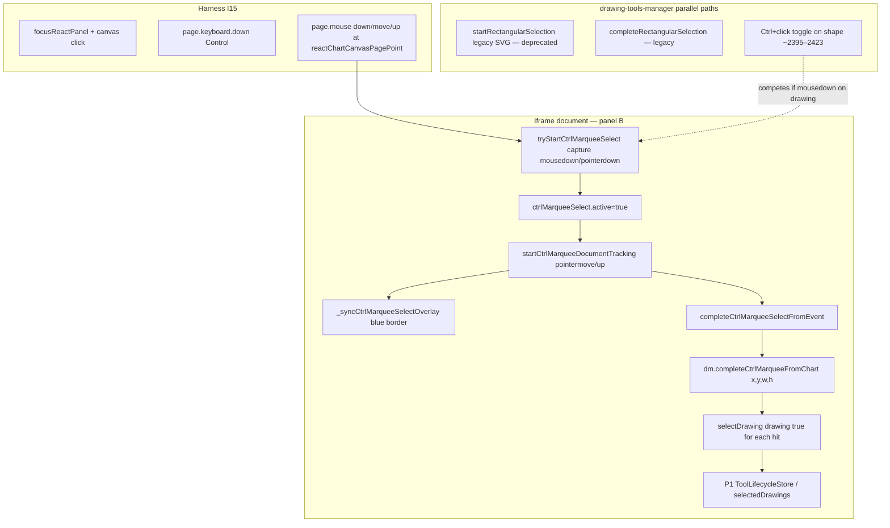
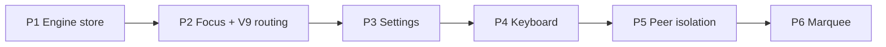

# T3 Re-migration Phase 6 PREP — iframe Ctrl+drag marquee design (READ-ONLY)

**Task:** `T3-remig-phase6-lane1-PREP-readonly.md`  
**Type:** Read-only design — no product, React, harness, or registry edits  
**Date:** 2026-07-16  
**RC:** RC-1 / RC-4 **Group F** (iframe marquee multi-select) — design only; fix not started.

**Ready to implement Phase 6 on P5-GREEN go.**

---

## 1. Task + RC

| Field | Value |
|-------|-------|
| Task id | T3 re-migration Phase 6 PREP (Lane 1) — final re-migration phase |
| Goal | Design iframe Ctrl+drag rubber-band marquee behind a **new** master switch; map honest RED→GREEN targets, line regions, and dependencies |
| RC | **RC-1 / RC-4 Group F** — discharges frozen-matrix **H-R08**, **H-R14** |
| Authority | `T3-PHASE0-FROZEN-MATRIX.md` (frozen 2026-07-16), `DIRECTOR-DECISIONS.md` D-018 #2, `T3-REMIGRATION-PLAN.md` Phase 6 |
| Blockers | Phases 1–5 GREEN in sequence; Lane 4 hit-coord fix for honest click/drag proof on panned charts |

### Frozen-matrix marquee row confirmation

| Row | Symptom | Honest actuation (I15) | End-state measures | Phase |
|-----|---------|------------------------|-------------------|-------|
| **H-R08** | Ctrl+drag marquee inactive; store multi-select fails (**host leg authoritative**) | `page.mouse` Ctrl+drag at iframe-translated canvas coords (host **A** + panel **B**) | `readCtrlMarqueeState`: `active` + `w/h > 8` during drag; both trendline ids in store via `waitForReactSelection` | **P6** |
| **H-R14** | Panel-B Ctrl+drag marquee inactive + no store multi-select | Real panel-B Ctrl+drag (`ctrlDragMarquee`) | Marquee border active during drag; `isDrawingSelected` true for both placed trendlines | **P6** |

**Suspect flag (harness only, not dropped):** H-R08 panel-B store read may leak host ids — host leg remains authoritative RED per frozen matrix.

**No other marquee rows** in the frozen 10-row set. H-R03 (Ctrl+click toggle) is **Phase 1**, not P6.

---

## 2. What I changed — file by file

| Path | Change |
|------|--------|
| `docs/tickets-overhaul/worker-reports/T3-remig-phase6-lane1-PREP-report.md` | **Created** — this report |

**No product, React, harness, `known-failing.json`, or registry files touched.**

### Files planned for Phase 6 implementation (I8 mirrors where applicable)

| Path | Planned change |
|------|----------------|
| `chart v 1.4/chart/chart.js` | Re-gate iframe marquee start (`tryStartCtrlMarqueeSelect`) on **Phase 6 master** (replace quickbar-settings gate); verify `_isCtrlMarqueeFixEnabled()` multichart policy; no replay-region edits |
| `homepage/public/chart/chart.js` | Byte-identical mirror (I8) |
| `chart v 1.4/chart/modules/drawing-tools-manager.js` | Re-gate `isDrawingInRectangle` bbox fallback (`_getDrawingLineBoundsForMarquee`) on Phase 6 switch; verify `completeCtrlMarqueeFromChart` → `selectDrawing(..., true)` populates **P1 store**; Ctrl+click toggle path (~2395–2423) read-only unless P1 regression |
| `homepage/public/chart/modules/drawing-tools-manager.js` | Mirror (I8) |
| `chart v 1.4/talaria-design/src/MultichartGrid.jsx` | **Optional only** — ensure `focusPanelById` on iframe mousedown before Ctrl+drag if honest proof shows parent-shell focus steals gesture; read-only audit of `dismissActiveDrawingTool` / `isRectSelecting` (~515–549) — no functional change unless focus race proven |
| `chart v 1.4/chart/multichart-prod/panel-cmd-bridge.js` | **No Phase 6 edits expected** — `isRectSelecting` appears only in Esc dismiss helpers (~3947, 4014) |
| `chart v 1.4/chart/multichart-prod/harness/react-parity-lib.mjs` | Lane 4: add `--phase6-marquee-off` / `REACT_PARITY_PHASE6_MARQUEE_OFF` hook (design only here) |

**Explicitly out of scope:** `replay-system.js`, `sync-bridge.js`, `panel-cmd-bridge.js` keyboard slice (P4), order-entry, Phase 1 predicate files unless `selectDrawing` store emit audit requires a one-line guard.

---

## 3. Kill-switch (I3 + I13)

### Master slice (mandatory per D-018 #2 — new knob; do NOT extend P1/P2/P4 switches)

| Switch | Default after Phase 6 lands | Meaning |
|--------|----------------------------|---------|
| `window.__TALARIA_DISABLE_MC_REMIGRATION_PHASE6_MARQUEE` | **unset** (= Phase 6 ON) | One-knob revert: `true` restores fallback-B marquee posture (iframe Ctrl+drag inactive / no store multi-select) |

**Alias (plan doc):** `__TALARIA_DISABLE_MULTICHART_PANEL_MARQUEE_V1` — same semantics; implementation should pick **one** name. This PREP recommends **`__TALARIA_DISABLE_MC_REMIGRATION_PHASE6_MARQUEE`** for consistency with P1/P3 masters.

### Child predicate (retained — pre-existing overlay/tracking fix)

| Switch | Scope | Phase 6 role |
|--------|-------|--------------|
| `__TALARIA_DISABLE_CTRL_MARQUEE_FIX` | `chart.js` document-level pointer tracking + SVG overlay (`_syncCtrlMarqueeSelectOverlay`) | **Independent** — step 8/9 fix; stays ON when unset. Phase 6 master gates **multichart iframe enablement** only; both must be ON for honest GREEN |

### Naming debt to fix in implementation

Today, multichart iframe marquee is **incorrectly gated** on the quickbar-settings switch (same entanglement P4 decouples for keyboard):

| Location | Current gate | Phase 6 replacement |
|----------|--------------|---------------------|
| `chart.js:31825–31837` `tryStartCtrlMarqueeSelect` | Parent `__TALARIA_DISABLE_MULTICHART_QUICKBAR_SETTINGS_FIX_V2` blocks iframe marquee | Read parent `__TALARIA_DISABLE_MC_REMIGRATION_PHASE6_MARQUEE` |
| `drawing-tools-manager.js:13714` `isDrawingInRectangle` | `multichartQuickbarSettingsFixEnabled()` for bbox fallback | `multichartPhase6MarqueeEnabled()` (iframe reads **parent** flag, I14) |

### Proposed predicate logic (implementation contract)

```javascript
function _isMcRemigrationPhase6MarqueeSliceActive() {
    if (typeof window === 'undefined') return true;
    return !window.__TALARIA_DISABLE_MC_REMIGRATION_PHASE6_MARQUEE;
}

function multichartPhase6MarqueeEnabled() {
    if (!_isMcRemigrationPhase6MarqueeSliceActive()) return false;
    return true;
}

// chart.js iframe embed — parent authoritative (I14)
function multichartPhase6MarqueeEnabledInEmbed() {
    try {
        if (typeof window !== 'undefined' && window.parent && window.parent !== window) {
            return !window.parent.__TALARIA_DISABLE_MC_REMIGRATION_PHASE6_MARQUEE;
        }
    } catch (_) {}
    return multichartPhase6MarqueeEnabled();
}
```

Host panel A uses `multichartPhase6MarqueeEnabled()` on parent `window`. Single-chart standalone: master unset → marquee ON (same as today when `CTRL_MARQUEE_FIX` ON).

### React / I13 file coverage

| File | Gated paths |
|------|-------------|
| `chart.js` | `tryStartCtrlMarqueeSelect` iframe early-return; optional `_isCtrlMarqueeFixEnabled` multichart branch |
| `drawing-tools-manager.js` | `isDrawingInRectangle` line-bounds fallback; optional iframe-only guards on legacy `startRectangularSelection` if still reachable |
| `MultichartGrid.jsx` | **None required** unless focus-race fix lands — document in impl report if touched |
| `TalariaV8bLive.jsx` | **No P6 edits** |

### Harness A/B hook (Lane 4 — wire with P6 impl)

| Hook | Effect |
|------|--------|
| `REACT_PARITY_PHASE6_MARQUEE_OFF=1` or `react-run --phase6-marquee-off` | Sets `__TALARIA_DISABLE_MC_REMIGRATION_PHASE6_MARQUEE=true` at parent boot |
| Switch-OFF proof | H-R08, H-R14 **FAIL-REAL-BUG** 10/10 (D-011) |

---

## 4. Proof — RED → GREEN (Phase 6 targets)

### Prerequisites

| Prerequisite | Owner | Status |
|--------------|-------|--------|
| Phase 0 frozen matrix | Lane 4 | **Done** |
| Phase 1 GREEN | Lane 1 | **Landed** — store multi-select substrate; honest H-R02/H-R03 blocked on hit-coord |
| Phase 2 GREEN | Lane 2 | Pending — `focusPanelById` / V9 routing |
| Phase 3 GREEN | Lane 2 | Pending — settings transport |
| Phase 4 GREEN | Lane 1 | Pending — keyboard bridge |
| Phase 5 GREEN | Lane 2 | Pending — peer isolation (H-S34/35/44); **H-R07 dropped** |
| Lane 4 hit-coord | Lane 4 | **Critical for setup** — placement + drag targeting on panned charts |

### Commands (post-implementation)

```powershell
cd "chart v 1.4/talaria-design"
npm run build:live

cd "../chart/multichart-prod/harness"
Remove-Item Env:REACT_PARITY_PHASE6_MARQUEE_OFF -ErrorAction SilentlyContinue
node react-run.mjs --only=H-R08,H-R14 --runs=10
npm run gate:react

# D-011 switch-OFF restoration
$env:REACT_PARITY_PHASE6_MARQUEE_OFF = "1"
node react-run.mjs --only=H-R08,H-R14 --runs=10
```

### I15 actuation + measurement

| Helper | Actuation | Measures |
|--------|-----------|----------|
| `ctrlDragMarquee` | `focusReactPanel` → `page.keyboard.down('Control')` → `page.mouse` drag between `reactChartCanvasPagePoint` fractions (0.12,0.18)→(0.78,0.82) | **Real** parent-level mouse + keyboard (I15); polls `readCtrlMarqueeState` during drag |
| H-R08 | Same on host **A** and panel **B** | During-drag: `active && w>8 && h>8`; after: both trendline ids store-selected |
| H-R14 | Panel **B** only; places two trendlines via host bar indices offset | Border during drag + `isDrawingSelected` for both ids |

**End-state (not proxies):** `dm.selectedDrawings` / `isDrawingSelected` for **both** enclosed drawings; marquee tracker `ctrlMarqueeSelect.active` during drag — not merely “mousedown dispatched.”

**Orphan handles:** Matrix primary assert is store multi-select. After P1 GREEN, optionally add `readSelectionChrome.hasBlueBorder` on both ids as secondary fence (H-R02 class) — not required for P6 discharge per frozen matrix wording.

### Hit-coord caveat (Lane 4 dependency)

| Concern | Impact on P6 |
|---------|--------------|
| `drawingHitLocalPoint` / panned viewport | **Setup** for click-based scenarios (H-R01–R07) — marquee uses **canvas fraction** coords via `reactChartCanvasPagePoint`, not per-drawing hit math |
| Panned chart + off-screen drawings | If pan moves trendlines outside drag box, multi-select fails for **product** reasons — harness must place tools on visible bars (`reactDefaultTrendlinePoints`) and may need pan-reset or wider drag box after hit-coord fix |
| `ctrlKey` delivery cross-frame | `page.keyboard.down('Control')` + `page.mouse` at parent-translated coords — honest path per current harness; if 10/10 still fails after switch fix, audit Puppeteer modifier propagation before adding parent modifier forward |

**T1 step 16** claimed GREEN via synthetic in-iframe events — **RETRACTED-FALSE-GREEN** under D-018 / step-17 honest audit. Current harness (`ctrlDragMarquee`) is I15-aligned; frozen b1 baseline is RED for both H-R08 and H-R14.

### Expected RED before fix (fallback-B b1)

```
H-R08: during.active=false or w/h≤8; store multi-select missing (host leg)
H-R14: panel-B marquee inactive; selectedIds < 2
```

---

## 5. Marquee path map (iframe-local — no postMessage for gesture)

Marquee is **not** an I14 postMessage transport like Esc/Delete. The entire gesture runs inside the **iframe document**: pointer capture → `chart.ctrlMarqueeSelect` → `drawingManager.completeCtrlMarqueeFromChart` → `selectDrawing(add=true)` → P1 lifecycle store.



### Why it fails today (fallback-B b1)

| Failure mode | Mechanism |
|--------------|-----------|
| **Switch gate** | `tryStartCtrlMarqueeSelect` returns false in iframe when parent `QUICKBAR_SETTINGS_FIX_V2` OFF — wrong switch; fallback-B leaves marquee disabled even when `CTRL_MARQUEE_FIX` ON |
| **Empty bbox commit** | `isDrawingInRectangle` returns false for trendlines when `getBBox()` empty in iframe — line-bounds fallback gated on same wrong switch (step 16 fix present but tied to quickbar flag) |
| **Gesture competition** | Ctrl+mousedown on drawing DOM → `selectDrawing(toggle)` (~2407) or `_tryStartCtrlSelectionMove` — chart marquee requires **empty chart** hit (`findDrawingsAtPoint` empty or fix-enabled geometric bypass ~31870–31876) |
| **Armed tool** | `dm.currentTool` or `chart.tool !== 'cursor'` blocks `tryStartCtrlMarqueeSelect` — harness clears tool before drag |
| **Store not updated** | Even when overlay draws, `selectDrawing` without P1 lifecycle may not persist to store — **P1 dependency** |
| **Host leg H-R08** | Same engine path on host A; frozen matrix lists host leg RED — not iframe-only |

### Path inventory (authoritative line regions)

#### `chart.js` — gesture owner

| Lines (approx.) | Symbol / role |
|-----------------|---------------|
| **700–707** | `ctrlMarqueeSelect` state init |
| **18854–18976** | `drawCtrlMarqueeSelect` canvas paint |
| **18884–18957** | `_ensureCtrlMarqueeSelectOverlayRect`, `_syncCtrlMarqueeSelectOverlay`, `_hideCtrlMarqueeSelectOverlay` |
| **18926–18939** | `_isCtrlMarqueeFixEnabled` (`__TALARIA_DISABLE_CTRL_MARQUEE_FIX`) |
| **30158–30174** | `_eventCanvasLocalXY` — all marquee coords |
| **31754–31823** | `updateCtrlMarqueeSelectFromEvent`, `completeCtrlMarqueeSelectFromEvent`, document tracking |
| **31825–31910** | `tryStartCtrlMarqueeSelect` — **primary P6 gate site** |
| **31912–31924** | `mousedown` / `pointerdown` capture registration |
| **32240–32242** | inline drag handler `ctrlMarqueeSelect` branch |
| **32384–32386** | mouseup complete |
| **26338–26339, 26441–26442** | render-loop `drawCtrlMarqueeSelect` |

#### `drawing-tools-manager.js` — selection commit + competition

| Lines (approx.) | Symbol / role |
|-----------------|---------------|
| **2395–2423** | Ctrl+click toggle on canvas (defers empty-space to chart.js marquee) |
| **13390–13456** | `_tryStartCtrlSelectionMove` — competes with marquee on multi-select drag |
| **13461–13467** | `_cancelChartCtrlMarqueeIfActive` |
| **13505–13510** | `isCtrlMarqueeGestureActive` |
| **13515–13548** | `prepareCtrlMarqueeSelectFromChart`, `completeCtrlMarqueeFromChart`, `cancelCtrlMarqueeSelectFromChart` |
| **13553–13689** | Legacy `startRectangularSelection` / `completeRectangularSelection` (SVG path — prefer chart.js) |
| **13698–13739** | `isDrawingInRectangle` — **P6 bbox fallback gate** |
| **13742+** | `_getDrawingLineBoundsForMarquee` |

#### `panel-cmd-bridge.js` — **no P6 touch**

| Lines | Note |
|-------|------|
| **3947, 4014** | `isRectSelecting` in Esc dismiss only — adjacent to P4 keyboard window, not marquee mechanism |

#### `MultichartGrid.jsx` — optional / read-only

| Lines | Note |
|-------|------|
| **515–549** | `dismissActiveDrawingTool` cancels `isRectSelecting` — unrelated to Ctrl+marquee start |
| **1848–1870** | `focusPanelById` — P2 dependency; ensures harness focus before drag |

### Prior art (retracted — informs design, not proof)

| Report | Lesson |
|--------|--------|
| `T1-step8-ctrl-drag-marquee-report.md` | Fragmented ownership chart.js vs drawing-manager — unified on chart.js path |
| `T1-step9-marquee-border-fix-report.md` | Pointer-dominant stream — overlay sync from tracker |
| `T1-step16-iframe-marquee-report.md` | Bbox fallback + parent switch — **10/10 retracted** under honest harness |
| `T1-step19-esc-delete-marquee-transport-diagnostic-report.md` | Marquee is iframe-local pointer transport; bundled under wrong switch with Esc/Delete |

---

## 6. T8 / collision check

Phase 6 edits **`chart.js` pointer/marquee regions only** — not `panel-cmd-bridge.js`. T8 collision risk is **low** vs Phase 4, but `chart.js` is shared with T8 replay/snap-back/TF work.

### T8-owned `chart.js` regions — **do not edit during P6**

| Lines (approx.) | Owner | Content |
|-----------------|-------|---------|
| **2456–2526** | D-017 snap-back | `_panReleaseAnchorHoldFixDisabled`, `_userOwnsReleasedViewport` |
| **17296–17357** | D-017 | Index-pin suppress guards |
| **21157–22291** | T8 TF diagnostic | Timeframe switch hot path (per P3 PREP) |
| Replay tick / `_panelPlayFollowContinuousOffsetX` | T8 / Lane 2 | Out of P6 scope — do not interleave |

### Phase 6 touch window (disjoint from T8 when respected)

| File | P6 zones | Safe if T8 avoids |
|------|----------|-------------------|
| `chart.js` | **700–707**, **18854–18957**, **31754–31924**, **32240–32386** | Snap-back + replay tick bands above |
| `drawing-tools-manager.js` | **13515–13755**, gate at **31825-policy mirror** in dm | P1 lifecycle regions elsewhere — one phase per commit |
| `panel-cmd-bridge.js` | **None** | P4 keyboard window **3929–4079** unrelated |
| `MultichartGrid.jsx` | **Optional** focus hook only | P2–P5 handlers elsewhere — Lane 2 serializes |

**Manager scheduling:** P6 does **not** require T8 `panel-cmd-bridge` pause (unlike P4). Coordinate with Lane 2 so P6 `chart.js` commit does not overlap T8 TF/replay edits in **21157+** or snap-back bands.

---

## 7. Dependencies + ordering



| Phase | What P6 rides on |
|-------|------------------|
| **P1** | `selectDrawing(drawing, true)` from `completeCtrlMarqueeFromChart` must populate `selectedDrawings` + lifecycle store (H-R03 substrate) |
| **P2** | `focusPanelById` — harness and product route focus to correct iframe before Ctrl+drag; parent V9 chrome stable during multi-select |
| **P3** | No direct discharge — settings modal must not steal Ctrl+drag pointer (blocked UI uses `isChartShortcutsBlockedBySettingsUi`, not marquee) |
| **P4** | No direct discharge — independent keyboard transport |
| **P5** | `clearDrawingUiOnOtherPanels` / peer deselect must not clear marquee selection on source panel mid-gesture; **P6 last** so peer isolation rules are stable before marquee proof |

**P6 is the final re-migration interaction phase** (before parked P7 RC-3 parity). Implement only after **P5-GREEN** + manager `gate` clean.

---

## 8. Invariants checked

| Invariant | How this PREP satisfies it |
|-----------|---------------------------|
| **I3** | One master switch `__TALARIA_DISABLE_MC_REMIGRATION_PHASE6_MARQUEE` with per-file gate list |
| **I13** | Decoupled from P1/P2/P4/quickbar switches; child `CTRL_MARQUEE_FIX` documented |
| **I14** | Marquee needs no postMessage — iframe-local; parent switch authority only for kill-switch |
| **I15** | Harness actuation named; retracted T1 greens not cited as proof |
| **I8** | Mirror pairs listed |
| **D-018 #2** | New phase knob — not extending prior masters |

**Not satisfied (deferred to impl):** switch-OFF RED proof; live built-product confirm.

---

## 9. What I did NOT do / limits

- **No implementation** — read-only per prompt.
- **No harness edits** — `--phase6-marquee-off` hook designed but not wired.
- **No `panel-cmd-bridge.js` marquee transport** — gesture is iframe-local; bridge only mentions `isRectSelecting` in Esc dismiss.
- **Legacy SVG marquee** (`startRectangularSelection`) — deprecated; P6 should not expand unless chart.js path fails audit.
- **Objects-tree / PLAN2-FOUND#3** — out of P6 scope (T1 step 19 RC-4).
- Assumes Lane 4 hit-coord fix before claiming honest 10/10 on any scenario sharing panned-canvas setup.

---

## 10. Live-verification handoff

After P6 impl + `build:live` bump:

1. Multichart 2-up; build id in host + panel-B iframe.
2. Panel B: place two trendlines → disarm tool → **Ctrl+drag** box enclosing both → blue dashed border **during** drag → release → both shapes selected (handles visible).
3. Repeat on host A (H-R08 host leg).
4. Switch OFF: `__TALARIA_DISABLE_MC_REMIGRATION_PHASE6_MARQUEE=true` on parent → Ctrl+drag does not multi-select (PO witnesses RED).

Parity checklist rows: frozen **H-R08**, **H-R14**.

---

## 11. Status

**DIAGNOSTIC-ONLY (mechanism reported, fix not started)** — read-only Phase 6 PREP complete.

**Ready to implement Phase 6 on P5-GREEN go.**
