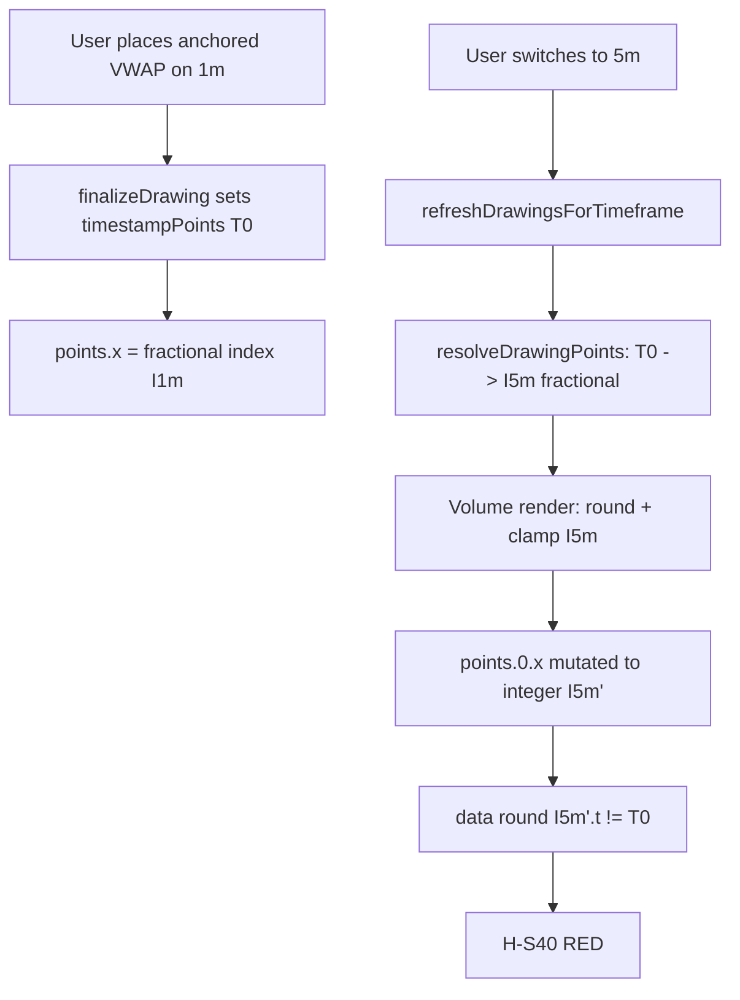

# T5 step 1 — Anchoring unification diagnostic (RC-3)

## 1. Task + RC

- **Task:** T5 step 1 (Lane 1) — read-only anchoring unification diagnostic.
- **Goal:** Map every anchoring convention in the chart engine, document RC-3 divergences, and produce a turnkey RC-3 unification plan (contract + migration order + harness strategy).
- **RC:** RC-3 — inconsistent anchoring / coordinate model across tools (`ROOT-CAUSES.md:21-26`, `TRACKS.md:65-70`).
- **Scope guard:** No product/engine/React/harness edits during integration freeze. This report is the sole deliverable.

---

## 2. What I changed — file by file

**N/A — diagnostic only.** No files touched. No mirrored-tree copies changed. No builds or gate runs executed.

---

## 3. Kill-switch (I3 + I13)

**N/A — diagnostic only.** Proposed kill-switch strategy for implementation steps is in §9 (Migration plan).

---

## 4. Proof — RED → GREEN

**N/A — diagnostic only.** Existing tracked-RED evidence (not re-run during freeze):

| Scenario | Status | Evidence |
|----------|--------|----------|
| H-S40 | tracked RED | `known-failing.json:63` — anchored VWAP timestamp drifts on 1m→5m |
| H-S41 | tracked RED | `known-failing.json:64` — fixed-range VP endpoints drift on TF switch |
| H-S42 | tracked RED | `known-failing.json:65` — anchored VP anchor drifts on TF switch |

T0 step 4 report (`worker-reports/T0-step4-t5-anchoring-scenarios-report.md`) documents 3/3 FAIL-REAL-BUG on `--only=H-S40,H-S41,H-S42 --runs=3`. Harness helpers: `readAnchorSnapshot` (`scenarios.mjs:5225-5257`), `assertAnchorTimestampsStable` (`5272-5284`).

---

## 5. Invariants checked

| Invariant | How satisfied |
|-----------|---------------|
| I8 (mirrored trees) | No edits — N/A |
| I3/I13 (kill-switch) | Plan proposes per-step switches in §9; not implemented |
| I6 (no index anchors) | Inventory identifies remaining index-primary offenders; exit criterion for T5 |
| I9 (no gate regressions) | No gate run (freeze) |
| I14 (multichart parity) | Risk matrix in §10 flags iframe/sync-bridge touch points |

---

## 6. What I did NOT do / limits

- Did **not** edit engine, React, or harness files (deploy freeze).
- Did **not** run `npm run gate`, fast loop, or live build verification.
- Did **not** exhaust every `Math.round(p.x)` call site — inventory focuses on **anchor authority** (who owns persisted position vs who converts for render), not incidental rounding in label math.
- **Prepend-history** and **replay-advance** paths: T0 step 4 probed and found **no deterministic harness RED** for volume tools today (prepend index compensation; replay advance does not shift window basis). Manager scoping note (`MANAGER-FINDINGS.md:162`) stands — those ticket symptoms need **live PO verification** after TF-switch fix lands.
- **Copy/paste offset** (TAL-00253, TAL-01383): clipboard path reviewed (`drawing-tools-manager.js:10386-10418`) but no new harness scenario authored (out of diagnostic scope).
- Line refs cite **canonical tree** `chart v 1.4/chart/**`; mirror `homepage/public/chart/**` is byte-identical per I8.

---

## 7. Live-verification handoff

After T5 implementation (post-freeze), PO should verify on a named build **inside panel iframe** (I14):

1. **TF switch (harness parity):** Panel A, 1m chart → place anchored VWAP → note candle time → switch to 5m → VWAP must stay on same wall-clock time and price. Repeat for fixed-range VP (two clicks) and anchored VP.
2. **Prepend (live-only today):** Pan left to load older history while anchored VWAP visible → anchor must not jump to a different candle time.
3. **Replay:** Enable replay, place trendline + anchored VWAP → advance 10 candles → both must stay on original timestamps; drag price label during replay must not snap back (TAL-00157#24).
4. **Multichart sync:** Draw on panel A → confirm panel B receives drawing with matching `timestampPoints` after sync (`sync-bridge.js:1784-1847`).
5. **Copy/paste:** Copy trendline, paste with offset → pasted copy must land offset in **timestamp space**, not re-use stale bar index from clipboard normalization.

Build id: TBD when T5 fix ships.

---

## 8. Status

**DIAGNOSTIC-ONLY (mechanism reported, fix not started).**

---

## 9. Anchor inventory

### 9.1 Canonical dual-coordinate model (intended)

The engine uses **two representations** with a defined bridge:

| Layer | Shape | Authority | Key APIs |
|-------|-------|-----------|----------|
| **Persistence** | `{timestamp, price}[]` → `drawing.timestampPoints` | **Source of truth** after first save | `DrawingTool.toJSON` (`drawing-tools-base.js:2846-2871`), `fromJSON` (`2893-2927`) |
| **Runtime** | `{x: fractionalBarIndex, y: price}[]` → `drawing.points` | Derived each frame / after data mutation | `CoordinateUtils.resolveDrawingPoints` (`3334-3349`), `pointsFromTimestamps` (`3295-3308`) |
| **Screen** | pixel `(px, py)` | Ephemeral | `chart.dataIndexToPixel` / `pixelToDataIndex` (`chart.js:29699-29716`), `yScale(price)` / `yScale.invert(py)` |

**Timestamp ↔ index conversion:**

- `indexToTimestamp` — extrapolates beyond data range (`drawing-tools-base.js:3155-3201`)
- `timestampToIndex` — binary search + fractional bucket (`3212-3267`)
- `pointsToTimestamps` / `pointsFromTimestamps` (`3276-3308`)

**Replay overlay on resolve:**

- `buildTimestampResolveOptions` (`3320-3327`) — when replay active and tool is in `CANDLE_INDEX_CLAMPED_TYPES`, sets `{ replayClampToLastBar: true }`
- `CANDLE_INDEX_CLAMPED_TYPES` = `volume-profile`, `fixed-range-volume-profile` only (`705-708`) — **not** `anchored-vwap` or `anchored-volume-profile`

**TF refresh sync (manager):**

- `refreshDrawingsForTimeframe` → `_syncDrawingPointsFromTimestamps` (`drawing-tools-manager.js:12544-12565`, `11573-11624`)
- TF refresh passes `tsOpts: null` to skip replay clamp (`11608-11612`)
- Skips during pan/zoom burst unless `tfRefresh` (`11576-11588`)

### 9.2 Subsystem inventory

#### A. Drawing tools — shared base path (canonical)

| Convention | File:function | Lines | data → pixel | pixel → data |
|------------|---------------|-------|--------------|--------------|
| Screen pick (discrete) | `CoordinateUtils.screenToData` | `3018-3031` | — | `pixelToDataIndex` → `Math.round(rawX)` unless `continuous` (freehand) |
| Screen pick (continuous) | same | `3028-3029` | — | fractional `rawX` preserved |
| Render | `CoordinateUtils.dataToScreen` | `3038-3050` | `dataIndexToPixel(dataX)`, `yScale(dataY)` | — |
| Persist | `DrawingTool.toJSON` | `2846-2871` | prefers `timestampPoints` | — |
| Load | `DrawingTool.fromJSON` | `2893-2927` | rebuilds `timestampPoints` from serialized points | — |
| Live resolve | `CoordinateUtils.resolveDrawingPoints` | `3334-3349` | `timestampPoints` → `pointsFromTimestamps` | — |
| Finalize anchor capture | `DrawingTool` (on complete) | `2087+` | sets `timestampPoints` from current `points` | — |

**Render preference:** Most tool modules call `scales.chart.dataIndexToPixel(idx)` with `scales.xScale(idx)` fallback — same math when chart helpers exist.

#### B. Drawing tools — volume family (index-primary offenders)

| Tool type | File:class | Lines | Anchor behavior | Divergence |
|-----------|------------|-------|-----------------|------------|
| `anchored-vwap` | `drawing-tools-advanced-volume.js` | `525-534` | `Math.round(points[0].x)` → clamp to `[0, lastIdx]` → **mutates** `points[0].x` every render | Overwrites TF-resolved fractional index; ignores `timestampPoints` at render |
| `fixed-range-volume-profile` | same | `1164-1178` | Rounds both endpoints, clamps left to data, writes back `points[0/1].x` | Same; two-point range re-anchored to rounded indices |
| `anchored-volume-profile` | same | `2209-2219` | Rounds anchor, clamps, mutates `points[0].x`; right pinned to `latestDataIndex` | Same + implicit right endpoint not timestamp-stable |
| `volume-profile` (non-anchored) | same | `2001+` | Index rounding in render loops | In `CANDLE_INDEX_CLAMPED_TYPES` — intentional data-bound |

ROOT-CAUSES cites `834-866`; current offender lines are **525-534** (render path moved; mechanism unchanged).

#### C. Drawing tools — index math in labels / derived geometry (secondary)

These read `Math.round(p.x)` for **display** or bar-count labels, not as persistence authority:

| Module | Lines | Purpose |
|--------|-------|---------|
| `drawing-tools-lines.js` | `931-940` | Bar count between endpoints |
| `drawing-tools-shapes.js` | `1706-1715` | Bar count labels |
| `drawing-tools-patterns.js` | `95-96, 171-172` | Pattern span indices |
| `drawing-tools-channels.js` | `824-825, 1102-1103, 1140-1165` | Regression channel bar loops |
| `drawing-tools-advanced.js` | `74-75, 365-367, 744-746` | Gann/fib bar labels via `getTimestampAtIndex(round(x))` |
| `drawing-tools-text.js` | `3771` | Text marker candle lookup |
| `drawing-tools-manager.js` | `4817, 6080-6123` | Magnet snap, handle rounding, label index lookup |

Registry tie: TAL-00271#9/#10 (level numbers follow pan) — likely label path using viewport-relative or index-without re-resolve, not volume-style mutation.

#### D. Magnet / snap (opt-in, placement-time)

| Convention | File:function | Lines | Behavior |
|------------|---------------|-------|----------|
| Magnet snap | `DrawingToolsManager.snapToCandle` | `4812-4823` | `Math.round(point.x)` → OHLC price snap; X stays rounded index |
| Screen-to-data default | `CoordinateUtils.screenToData` | `3028-3029` | Rounds X on placement (non-continuous) |
| Keyboard toggle | `keyboard-shortcuts.js` | `131, 1007-1014` | Sets `chart.magnetMode` |

**Divergence D5:** Placement rounds X to integer bar index; persistence then stores timestamp via `indexToTimestamp(round(x))` — sub-candle placement is lost unless freehand `continuous` mode.

#### E. Crosshair / visible center

| Convention | File:function | Lines | Behavior |
|------------|---------------|-------|----------|
| Visible center timestamp | `chart._getVisibleCenterTimestamp` | `29735-29743` | `Math.floor(pixelToDataIndex(centerX))` — **floor**, not round |
| Pixel helpers | `chart.pixelToDataIndex` / `dataIndexToPixel` | `29699-29716` | Fractional index preserved (no round trip) |

**Divergence D6:** Center/crosshair uses `floor`; placement/magnet uses `round` — edge-of-candle ambiguity (TAL-00157#4 “jumps to previous candle middle”).

#### F. Orders (price-only anchor)

Orders anchor to **price** on the live Y scale, not bar index:

- Evidence in `ROOT-CAUSES.md:40` (`order-manager.js:18332`, `38143` — line numbers may drift; pattern is `yScale` / `invert` on entry preview and TP/SL lines).
- No `timestampPoints` participation; pan/zoom moves chart under fixed price — correct for order rail.
- Multichart: host-focused order rail (`ROOT-CAUSES.md:33`, `MultichartGrid.jsx` bridge) — orders do not share drawing anchor pipeline.

**RC-3 scope:** Low — orders are intentionally price-anchored. T5 should not unify orders into timestamp+index drawing contract.

#### G. Indicators (bar-index render loops)

| Convention | File | Lines | Behavior |
|------------|------|-------|----------|
| Full recompute | `chart-indicators-full.js` | `7814-7815` (per ROOT-CAUSES) | Recompute every replay frame — index over `chart.data` |
| Pane Y | indicator render paths | various | `yScale(indicatorValue)` |

Indicators are **data-series-indexed**, not user-placed anchors. RC-6 (T6) owns indicator lifecycle; RC-3 touch is limited to **magnet snap-to-indicator** (`drawing-tools-manager.js:4836-4844`) reading indicator values at `Math.round(point.x)`.

#### H. Replay system (timestamp-primary playhead)

| Convention | File | Lines | Behavior |
|------------|------|-------|----------|
| Virtual time | `replay-system.js` | `27-31` | Playhead tracked by timestamp, not index |
| TF swap map | same | `117+` | `Map replay playhead to native bar index after TF swap (timestamp-stable)` |
| Go-to timestamp | same | `1508, 1621-1659, 2312+` | Snaps to `{candleIndex, timestamp}` |

**Divergence D7:** Replay slice + drawing resolve use timestamp authority, but volume tools re-clamp to integer index on render — replay advance looks stable until TF switch or resample exposes drift.

Harness: H-S36/H-S37 (T4 replay interaction) PASS today — pending-fill / TP-line stability, not volume TF-switch (`MANAGER-FINDINGS.md:155`).

#### I. Multichart / iframe sync

| Convention | File:function | Lines | Behavior |
|------------|---------------|-------|----------|
| Drawing sync decorate | `sync-bridge.js` `decorateDrawingPointsWithLocalIndices` | `1784-1847` | Incoming `timestampPoints` → `CoordinateUtils.pointsFromTimestamps` on **local** `chart.data` |
| Manager TF sync | `drawing-tools-manager.js` `_syncDrawingPointsFromTimestamps` | `11573-11624` | Same resolver, per-panel |
| Panel cmd replay | `panel-cmd-bridge.js` | (replay timestamp forwarding — per T3/T4 work) | Forwards replay bus events |

**Divergence D8:** Sync path is timestamp-correct; volume render mutation on each panel can desync visual from stored `timestampPoints` after local TF differs across panels.

#### J. Clipboard / copy-paste

| Convention | File:function | Lines | Behavior |
|------------|---------------|-------|----------|
| Copy | `copyDrawing` → `_buildDrawingClonePayload` | `10377-10384` | Serializes drawing |
| Normalize | `_normalizeClipboardPayload` | `10386-10418` | If `coordinateSystem === 'timestamp'`, converts to **index** via `pointsFromTimestamps` before paste |
| Freehand | same | `10413-10417` | **Deletes** `timestampPoints` — intentional index-only clone |

**Divergence D4:** Paste normalizes to index at paste-time; if chart data changed between copy and paste, offset is wrong (TAL-01383#1 resolved but mechanism remains; TAL-00253 copy displacement cited in ROOT-CAUSES).

#### K. Harness probe convention

| Convention | File:function | Lines | Behavior |
|------------|---------------|-------|----------|
| `readAnchorSnapshot` | `scenarios.mjs` | `5232-5246` | Reads `drawing.points[].x`, derives `timestamp` from `data[round(x)].t` — **not** from `drawing.timestampPoints` |
| Assertion | `assertAnchorTimestampsStable` | `5272-5284` | Compares derived bar timestamps before/after TF switch |

**Divergence D3:** Probe intentionally measures **effective** anchor (what user sees), which exposes volume-tool index reinterpretation even when `timestampPoints` in memory might still be correct until render overwrites `points`.

---

## 10. Divergence map (RC-3 root)

| ID | Paths that should agree | What disagrees | Mechanism | Registry / tickets |
|----|-------------------------|----------------|-----------|-------------------|
| **D1** | `timestampPoints` persistence vs volume render | Render uses `round(points[n].x)` + clamp; ignores resolved fractional index | Index reinterpreted on new `chart.data` length/basis | TAL-00322#11-17, TAL-00323#2/9/10/13/15, H-S40/41/42 |
| **D2** | `resolveDrawingPoints` (manager TF refresh) vs volume `render()` | Manager writes resolved `points`; render immediately overwrites `points[0].x` | Mutation after resolve | Same as D1 |
| **D3** | Harness `readAnchorSnapshot` vs `timestampPoints` field | Probe uses `data[round(x)].t` | Effective-anchor test — correct for RC-3 proof | H-S40/41/42 design |
| **D4** | Clipboard timestamp coords vs paste offset | `_normalizeClipboardPayload` flattens to index at paste | Stale index when data window moves | TAL-01383#1, TAL-00253 (ROOT-CAUSES), TAL-01304#1 |
| **D5** | Fractional placement vs persisted timestamp | `screenToData` rounds X; `indexToTimestamp` loses sub-bar fraction | Snap-to-candle-center vs click position | TAL-00157#4, TAL-00322#12/#13 |
| **D6** | `floor` (center) vs `round` (placement/magnet) | Different bar selection at candle edges | Off-by-one candle on click | TAL-00157#4 |
| **D7** | Replay timestamp playhead vs volume index render | Replay resolves timestamps; volume re-clamps index | Latent until TF/resample | TAL-00157#24, TAL-00157#16 (replay elements) |
| **D8** | `sync-bridge` timestamp decorate vs per-panel render | Each panel re-mutates indices independently | Cross-panel VP/VWAP drift on mismatched TF | TAL-00157#22 (multichart price mismatch) |

### RC-3 failure cascade (TF switch)



---

## 11. Proposed unified anchor contract

### 11.1 Canonical primitive

**Single authority:** `AnchorPoint = { timestamp: number, price: number }` stored in `drawing.timestampPoints[]`.

**Single resolve entry (already exists — extend, do not fork):**

```text
CoordinateUtils.resolveDrawingPoints(drawing, chart, tsOpts?)
  → [{ x: fractionalBarIndex, y: price }]
```

**Single screen projection (already exists):**

```text
dataIndexToPixel(resolve.x) + yScale(resolve.y)
```

**Rules (invariants):**

1. **I6:** No drawing type may treat `points[n].x` as persistence authority after finalize.
2. **Render is read-only:** `render()` must not assign to `this.points[n].x` (or `.y`) except during active drag (`_isLiveEditing`).
3. **Clamp policy is explicit:** Tools that must bind to loaded data declare via `CANDLE_INDEX_CLAMPED_TYPES` or a new `ANCHOR_CLAMP_POLICY` enum (`none` | `data-bounds` | `replay-last-bar` | `right-edge-live`). Clamp applies inside `timestampToIndex` / resolve options, not in render.
4. **Fraction preservation:** Placement stores timestamp from **fractional** `pixelToDataIndex` unless user enabled magnet (then round is explicit opt-in).
5. **TF / prepend / replay:** Any `chart.data` mutation triggers `_syncDrawingPointsFromTimestamps` (already wired) — render must consume result unchanged.
6. **Multichart:** `sync-bridge` continues to ship `timestampPoints`; never ship raw `points.x` across panels.

### 11.2 Opt-in snap layer (post-resolve)

```text
applyMagnet(point, chart, mode) → point'  // placement-time only
```

Magnet rounds **after** fractional pick, then `indexToTimestamp` runs — documented tradeoff.

### 11.3 Type-specific policies

| Type | timestamp authority | clamp policy | right-edge behavior |
|------|--------------------|--------------|---------------------|
| Lines/shapes/fib | yes | `none` (extrabar allowed) | — |
| `anchored-vwap` | yes | `data-bounds` on anchor only | — |
| `fixed-range-volume-profile` | yes (both points) | left `data-bounds`, right extrabar | optional `fixedScreenRightX` stays screen-anchored |
| `anchored-volume-profile` | yes (anchor) | `data-bounds` | right = `timestampToIndex(lastBar.t)` via resolve, not `latestDataIndex` round |
| `volume-profile` | yes | `data-bounds` | keep in `CANDLE_INDEX_CLAMPED_TYPES` |
| Freehand | index-only acceptable | delete `timestampPoints` on clone only | per existing `10413-10417` |

---

## 12. Migration plan (RC-3 unification — lowest risk first)

### Phase 0 — Observability (no behavior change)

- Add debug-only assert: if `render` mutates `points.x` while not live-editing, log tool type + id (`__TALARIA_ASSERT_ANCHOR_MUTATION`, default off).
- Extend `readAnchorSnapshot` (harness, later) to also return `timestampPoints` for diffing — optional.

### Phase 1 — Volume render read-only (highest ROI, isolated file)

**Target:** `drawing-tools-advanced-volume.js` classes: `AnchoredVWAPTool`, `FixedRangeVolumeProfileTool`, `AnchoredVolumeProfileTool`.

**Change:** Remove `this.points[n].x = …` from `render()`; read clamped index into locals only; use `CoordinateUtils.resolveDrawingPoints(this, chart)` when `timestampPoints` present.

**Kill-switch:** `window.__TALARIA_RC3_VOLUME_RENDER_RESOLVE` (default **true** when shipped; **false** restores current render-mutation path).

**Proof:** H-S40/41/42 GREEN ×10; gate removes three known-failing entries.

**Registry closure (harness-proven):** TAL-00322#11-17, TAL-00323#2/9/10/13/15, TAL-01293#1 (if VP family).

### Phase 2 — Expand clamp policy in resolve

**Target:** `drawing-tools-base.js` — add `anchored-vwap`, `anchored-volume-profile` to clamp metadata; implement right-edge anchor for anchored VP in resolve, not render proxy (`2216-2234`).

**Kill-switch:** `window.__TALARIA_RC3_CLAMP_POLICY` gates new type sets.

**Proof:** H-S40/41/42 + manual PO prepend check.

### Phase 3 — Clipboard timestamp preservation

**Target:** `drawing-tools-manager.js` `_normalizeClipboardPayload` / `pasteDrawing`.

**Change:** Keep `timestampPoints` on paste; apply offset in timestamp space (+1 bar interval or pixel-derived delta), then resolve.

**Kill-switch:** `window.__TALARIA_RC3_PASTE_TIMESTAMP_OFFSET`.

**Proof:** New H-S43 (proposed): copy trendline → pan chart → paste → assert timestamp offset, not index overlap (TAL-01383 class).

### Phase 4 — Placement fraction + magnet unification

**Target:** `CoordinateUtils.screenToData`, `snapToCandle`, drawing finalize paths.

**Change:** Default fractional X; magnet applies `round` explicitly; unify `floor` vs `round` for center vs placement (documented policy).

**Kill-switch:** `window.__TALARIA_RC3_FRACTIONAL_PLACE`.

**Proof:** H-S44 (proposed): place trendline between candles → TF switch → sub-candle position stable within ½ bar.

### Phase 5 — Multichart parity pass (I14)

**Target:** `sync-bridge.js`, panel iframe smoke.

**Change:** Verify decorate + volume render fix compose; add panel-B variant of H-S40.

**Kill-switch:** Reuse multichart migration switch from T1/T3 where applicable.

**Proof:** H-Rxx parity row (multichart checklist) + H-S40 panel B.

### Phase 6 — Label / Gann level anchoring

**Target:** `drawing-tools-advanced.js`, channels, fib level labels.

**Change:** Labels call `resolveDrawingPoints` parent anchor, not raw `round(p.x)` + pan offset.

**Registry:** TAL-00271#9/#10.

---

## 13. RED-scenario candidates

### Proven tracked RED (implement Phase 1 → GREEN)

| ID | Surface | Steps | Assert |
|----|---------|-------|--------|
| **H-S40** | host iframe | 1m anchored VWAP → 5m | `assertAnchorTimestampsStable` |
| **H-S41** | host iframe | 1m fixed-range VP → 5m | both endpoints stable |
| **H-S42** | host iframe | 1m anchored VP → 5m | anchor stable |

### Proposed (author after Phase 1)

| ID | Surface | RC-3 aspect | Registry tie |
|----|---------|-------------|--------------|
| **H-S43** | host + panel B | paste uses timestamp offset after data prepend | TAL-01383, TAL-00253 |
| **H-S44** | host | fractional placement survives TF switch | TAL-00157#4 |
| **H-S45** | host | magnet ON vs OFF timestamp delta explicit | TAL-00322#12 |
| **H-S46** | panel A+B | same drawing synced, TF A≠B, timestamps match | TAL-00157#22 |
| **H-S47** | replay on | anchored VWAP through 20-tick advance | TAL-00157#24 (live-primary) |
| **H-S48** | replay on | left-prepend while VWAP visible | prepend (live-primary per Manager) |

### Existing PASS scenarios to guard (no regressions)

- **H-S36/H-S37** — replay pending-fill / TP-line (T4; must stay GREEN through T5)
- **H-S32/H-S33** — lifecycle (T1)
- Viewport family H-S18 prepend offset — orthogonal but run in gate

---

## 14. Risk notes (I14 multichart vs single-chart)

| Migration step | Single-chart risk | Multichart / iframe risk | Mitigation |
|----------------|-------------------|--------------------------|------------|
| Phase 1 volume render | Low — one file family | **Medium** — panel iframes run same module; sync-bridge sends timestamps that render then broke | Run H-S40 in panel iframe; verify `decorateDrawingPointsWithLocalIndices` output not overwritten |
| Phase 2 clamp policy | Low | Low — uses same resolver per panel | — |
| Phase 3 paste | Medium — focus/clipboard ownership | **High** — clipboard is per-iframe; parent may not share | Test paste on panel B after copy on panel B only (I14) |
| Phase 4 fractional placement | Medium — affects all tools | **High** — crosshair in iframe vs host | Gate with switch OFF per panel |
| Phase 5 sync | — | **High** | Mandatory I14 checklist row |
| Phase 6 labels | Low | Medium — synced drawings + local pan | Panel parity smoke |

**Files crossing iframe boundary (do not break T1/T3 bridges):**

- `sync-bridge.js` (drawing payload)
- `panel-cmd-bridge.js` (commands, replay bus)
- `MultichartGrid.jsx` (host settings / keyboard)
- `embed-bridge.js` (settings forward)

Phase 1 is **engine-only inside iframe** — lowest cross-boundary risk; preferred first land after freeze.

---

## 15. Implementation checklist (turnkey for T5 step 2+)

1. [ ] Phase 1: strip `points[n].x` mutation from three volume `render()` paths (`drawing-tools-advanced-volume.js:530, 1177-1178, 2212`).
2. [ ] Phase 1: at start of each render, `const pts = CoordinateUtils.resolveDrawingPoints(this, scales.chart)`; use `pts` locals for pixels.
3. [ ] Phase 1: mirror to `homepage/public/chart/**` (I8).
4. [ ] Phase 1: add `__TALARIA_RC3_VOLUME_RENDER_RESOLVE` guard around new path.
5. [ ] Proof: `--only=H-S40,H-S41,H-S42 --runs=10` GREEN; remove from `known-failing.json`.
6. [ ] Gate + `npm run gate` if shared engine touched.
7. [ ] PO live prepend + replay checklist (§7).
8. [ ] Phase 3–6 per priority after TF-switch GREEN.

---

## 16. Key file index (quick navigation)

| Path | Role |
|------|------|
| `chart v 1.4/chart/modules/drawing-tools-base.js` | Canonical timestamp↔index + resolve |
| `chart v 1.4/chart/modules/drawing-tools-advanced-volume.js` | RC-3 primary offenders |
| `chart v 1.4/chart/modules/drawing-tools-manager.js` | TF sync, magnet, clipboard |
| `chart v 1.4/chart/chart.js` | `pixelToDataIndex` / `dataIndexToPixel` |
| `chart v 1.4/chart/modules/replay-system.js` | Timestamp playhead |
| `chart v 1.4/chart/multichart-prod/sync-bridge.js` | Cross-panel timestamp decorate |
| `chart v 1.4/chart/multichart-prod/harness/scenarios.mjs` | H-S40/41/42 + `readAnchorSnapshot` |
| `docs/tickets-overhaul/ROOT-CAUSES.md` | RC-3 definition |
| `docs/tickets-overhaul/TRACKS.md` | T5 exit criteria |

---

*Report author: T5 step 1 diagnostic worker. Integration freeze respected — zero product diffs.*
