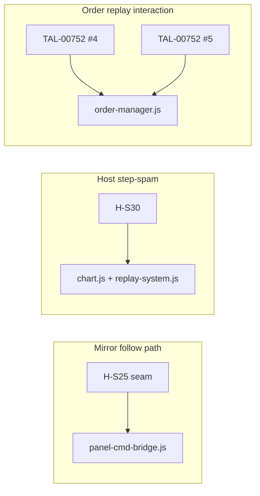

# T8 step 15 — replay-interaction diagnostic bundle (pre-b1)

## 1. Task + RC

- **Task:** `T8-step15-lane2-replay-interaction-diagnostic-bundle.md` — read-only root + fix PLANs for **H-S30**, **TAL-00752 #4/#5**, and shared-region landing order (await PO b1).
- **RC:** **Tooling/diagnostic — no RC discharged.** Informs **RC-8** replay-interaction family + **RC3-HS25#1** (related only via post-b1 sequencing).

---

## 2. What I changed — file by file

**No product, harness, or registry edits.** Read-only diagnostic.

| File | Change |
|------|--------|
| `docs/tickets-overhaul/worker-reports/T8-step15-replay-interaction-diagnostic-bundle-report.md` | This report. |

**Explicit:** `known-failing.json`, `PER-BUG-REGISTRY.csv`, `chart.js`, `panel-cmd-bridge.js`, `order-manager.js` — **NOT touched.**

---

## 3. Kill-switch (I3 + I13)

Documented per item below (existing switches where fix already landed; proposed switches for #4/#5).

---

## 4. Proof — RED → GREEN

### H-S30 harness runs (this step)

```text
cd "chart v 1.4/chart/multichart-prod/harness"
node run.mjs --only=H-S30 --runs=3
node run.mjs --only=H-S30 --runs=1 --bug --bugSwitches=__TALARIA_MC_DISABLE_STEP_SPAM_REFETCH_GUARD
# flake probe: --runs=1 × 10 consecutive
```

| Run set | Verdict | Key metrics |
|---------|---------|-------------|
| **3× default** | **PASS×3** | phase2 host fetches=0; peerB phase1=0 phase2=0; no stale-index jump |
| **1× kill-switch** | **PASS** (harness limitation — see H-S30 §) | Same — RED cell not reproduced |
| **10× isolated** | **PASS×10** | peerB always 0 |

**Build id:** harness `serve.mjs` → **20260715b1**.

**Historical context:** T0 step 16 isolated **0/3 FAIL-REAL-BUG** on `peerB phase2=2` (independent panel self-fetch). T8 step 5b labeled H-S30 a **false gate regression** (3/3 PASS). **This step:** isolated **13/13 PASS** — tracked peer-fetch failure **not reproduced** in current tree; Lane 4 should re-isolate under full gate before promotion.

**I15:** H-S30 actuates via synchronous `rs.requestStepForward()` loop in host main frame (real replay API, not synthetic offset injection). Measures real fetch log (`countFetchesByFile`), `replayTimestamp`, `currentIndex`, `_panLoading`, `offsetX`.

### TAL-00752 #4 / #5

No harness scenario exists yet. Diagnosis from code path + T4 step 10 hand-back. **NEEDS-LIVE** for PO confirmation.

---

## 5. Invariants checked

| Invariant | Status |
|-----------|--------|
| **I3** | Existing kill-switches documented; no new code. |
| **I9** | Did not edit `known-failing.json`. |
| **I15** | H-S30 uses real step-forward API + fetch log; #4/#5 are code-path diagnosis only. |
| **D-010** | Status **DIAGNOSTIC-ONLY**. |
| **Pre-b1 guardrail** | No replay-path implementation. |

---

## 6. What I did NOT do / limits

- No product fixes, no new harness scenarios, no registry commits.
- Did not run full `npm run gate` or PO live confirm on #4/#5.
- H-S30 kill-switch RED arm did not fail (harness pre-arms `_mcManualStepBurstUntil` in `spamStepForwardBurst` — may mask legacy storm even when guard disabled; Lane 4 should tighten RED cell if promotion requires causal proof).
- Did not reproduce step-16 `peerB phase2=2` failure in 13 isolated runs.

---

## 7. Live-verification handoff

### H-S30 (if still tracked)

1. Build **20260715b1**, single chart or multichart host.
2. Enter **paused** replay on **1m** near session start (short left prefix).
3. Spam **step forward** rapidly (~20+ clicks).
4. **Expect:** playhead advances forward only; no backward jump, no stuck loading spinner, no refetch storm.

### TAL-00752 #4

1. Enter replay (paused or playing).
2. Open **limit** order draft with SL enabled.
3. **Drag** entry or SL on chart while advancing replay (step or play).
4. **Bug:** SL line/price glitches (jumps away from drag position).

### TAL-00752 #5

1. Enter replay with order draft open.
2. Press **← / →** (keyboard chart pan).
3. **Bug:** entry/SL/TP preview glitches (wrong screen position or panel desync). Arabic report: keyboard chart move causes glitch.

---

## 8. Status

**DIAGNOSTIC-ONLY (mechanism reported, fix PLANs ready for post-b1 execution)**

---

# Item 1 — H-S30

## What it actuates / measures

| | Detail |
|--|--------|
| **Setup** | Independent 2×2; **sync OFF**; host **file25 @ 1m** paused replay; peer **B file27 @ 1h** |
| **Actuation** | Per phase: pin short display prefix (`PREFIX_IDX=2`) → synchronous **`rs.requestStepForward()` × 25** in host main frame → microtask flush → `waitHostReplayQuiet` |
| **Measures** | Per-phase **API fetch counts** (host file25, peer file27); `replayTimestamp` / `currentIndex` monotonicity; post-fetch stale-index regression (`afterMicro.ts` vs `afterSync.ts`); `_panLoading`; repeat-burst `offsetX` jump |

## Real defect (§6cs — host cell)

**Primary mechanism (documented in `scenarios.mjs` ~L4247–4268):**

During **paused** replay with a **short left prefix**, `getReplayAutoScrollState` yields **positive `offsetX`** → `chart.js` `constrainOffset` fires `checkViewportLoadMore('backward', true)` (**force=true**, bypasses 80ms debounce). Rapid step-forward spam starts overlapping backward `/bars` fetches. Fetch completion restores **stale `currentIndex`** captured at fetch start, **overwriting** steps advanced mid-fetch → visible **backward playhead jump** + **stuck `_panLoading`** + self-sustaining `.finally` re-chain.

**Fix already landed (default ON):**

| Layer | File | Mechanism |
|-------|------|-----------|
| Burst window | `replay-system.js` `requestStepForward` / `stepForward` | `_mcManualStepBurstUntil` (+150ms) |
| Suppress probe | `chart.js` ~L18587–18591 | Skip backward load-more during burst |
| Harden index | `chart.js` ~L23163–23176 | `max(backwardShifted, curNow)` on fetch complete |
| Suppress re-chain | `chart.js` ~L23400–23405 | Skip `_scheduleReplayPanLoadLeft` during burst |

**Switch:** `window.__TALARIA_MC_DISABLE_STEP_SPAM_REFETCH_GUARD` (unset = fix ON).

## Secondary tracked failure (Lane 4 — peer isolation)

`known-failing.json` reason: **peer B `phase2=2` self-fetches** during host-only spam (§6cs peer isolation CORE). **Not reproduced** this step (13/13 `peerB=0`). Hypothesis: full-gate ordering / TF-settle race on B's 1h switch, or intermittent — needs full-gate re-run before promotion.

## Fix PLAN

### A — Host step-spam (already implemented)

**No new impl** unless kill-switch RED is required for promotion. If RED harness gap matters, Lane 4 should adjust `spamStepForwardBurst` to **not** pre-set `_mcManualStepBurstUntil` when `--bugSwitches` includes the guard disable flag.

### B — Peer B self-fetch (if full gate still red)

| | |
|--|--|
| **Hypothesis** | Host replay enter / step side-effect or shared boot poll triggers independent iframe B to refetch despite sync OFF |
| **Files** | `panel-cmd-bridge.js` (replayEnter / replayTick fan-out), `MultichartGrid.jsx` (interval/range sync gates), embed data ownership |
| **Proposed switch** | `window.__TALARIA_MC_DISABLE_HOST_REPLAY_STEP_PEER_FANOUT` (default ON = peers inert during host-only manual step) |
| **RED assertion** | Existing H-S30 CORE: `peerB phase1=0 && phase2=0` |

## Registry tag (Lane 4 — propose, do not commit here)

```csv
T8-HS30#1,,chart_core_ui,replay-step-spam,RC-8,open,"Host paused-replay step-forward spam causes backward refetch storm / stale-index jump; peer isolation breach variant",H-S30: §6cs. Host fix landed __TALARIA_MC_DISABLE_STEP_SPAM_REFETCH_GUARD (replay-system.js + chart.js). Isolated 13/13 PASS this step; step-16 tracked peerB phase2=2 — verify full gate before promote. Owner: T8 replay.
```

---

# Item 2 — TAL-00752 #4 (replay × drag limit → SL glitch)

## Reproduce path

1. Replay active (paused or playing).
2. User opens **limit** order draft (SL enabled).
3. User **drags** preview line (entry or SL) on chart.
4. Concurrently replay advances (tick / step / `updatePositions`).

## Root hypothesis

**Race in `order-manager.js` replay preview sync vs drag handler.**

| Path | Site | Behavior |
|------|------|----------|
| Replay bus | `updatePositions()` ~L27323 → `_syncPreviewToReplayPrice()` ~L17079 | On every replay tick |
| Limit branch | ~L17089–17092 | Calls `_autoDetectOrderTypeFromEntry()` + **`updatePreviewLines()`** full redraw |
| Drag guard | ~L17085 | `if (this.isDraggingPreviewLine) return` |
| Drag handler | ~L18704–18710, 19466–19520 | Sets/clears `isDraggingPreviewLine`; on end clears flag **before** rAF `updatePreviewLines()` |

**Defect window:** Replay tick lands **after** drag `end` clears `isDraggingPreviewLine` but **before** drag-handler snapshot posts SL price to inputs — `_syncPreviewToReplayPrice` limit branch runs `_autoDetectOrderTypeFromEntry` (compares entry to **moving** `getCurrentCandle().c`) and **`updatePreviewLines()`** rebuilds SL from **stale** `#slPrice` / `previewLines.sl`, overwriting the dragged SL Y.

Secondary: brief `isDraggingPreviewLine = false` during risk-recalc block ~L19280–19309 (restores `wasDragging`) if replay tick interleaves.

## Owner track

| Track | Rationale |
|-------|-----------|
| **T8 primary** | Replay tick cadence (`replaySystem.onUpdate` → `updatePositions`) drives the conflicting sync |
| **T3 adjacency** | Multichart iframe draft mirror (`_multichartPostDraftSnapshotToParent`) if bug is panel-only |

**Not** `panel-cmd-bridge.js` follow path.

## Fix PLAN

| | |
|--|--|
| **Mechanism** | (1) Extend replay-preview sync guard: skip `_syncPreviewToReplayPrice` when `isDraggingPreviewLine \|\| _multichartPostDraftDragBusy`. (2) For limit/stop drafts, defer `_autoDetectOrderTypeFromEntry` until drag idle (do not full-`updatePreviewLines` mid-drag). (3) On drag end, pin `slManuallyPositioned = true` before clearing drag flag. |
| **Files** | `chart v 1.4/chart/modules/order-manager.js` (primary); I8 mirror `homepage/public/chart/modules/order-manager.js` |
| **Switch** | `window.__TALARIA_DISABLE_ORDER_ENTRY_REPLAY_DRAG_SYNC_GUARD` (unset = fix ON) |
| **RED assertion** | New **H-S84** (proposed): paused replay + limit draft + synthetic SL drag Y + `hostReplaySeek` step + assert `previewLines.sl.price` unchanged (±1 tick); switch-OFF fails |
| **Fence** | H-S37 (TP stable redraw), existing order-entry property tests |

## Registry tag (Lane 4)

```csv
TAL-00752#4,TAL-00752,orders,replay-interaction,RC-8,user_replied,"Replay + drag limit order glitches stop loss position",T8 step 15: _syncPreviewToReplayPrice × isDraggingPreviewLine race (order-manager.js ~L17079–17092). Owner T8 replay×order-entry; fix PLAN __TALARIA_DISABLE_ORDER_ENTRY_REPLAY_DRAG_SYNC_GUARD. Cross-track hand-back Lane 3 step 10.
```

---

# Item 3 — TAL-00752 #5 (replay × keyboard pan → order entry glitch)

## Reproduce path

1. Replay active with order draft open (limit/market).
2. User presses **ArrowLeft / ArrowRight** (keyboard pan).
3. Preview lines / panel controls glitch.

## Root hypothesis

**Viewport pan + replay tick double-update on draft preview — no shared drag guard on keyboard path.**

| Path | Site | Behavior |
|------|------|----------|
| Keyboard pan | `keyboard-shortcuts.js` `moveChart` ~L646–651 | `offsetX -= bars * spacing`; `constrainPan`; render |
| Pan overlay sync | `chart.js` `_syncOrderOverlaysDuringPan` ~L25620–25629 | Calls `updatePreviewLinePositions()` (Y-only) |
| Replay tick | `order-manager.js` `updatePositions` → `_syncPreviewToReplayPrice` | Full `updatePreviewLines()` for limit branch; market branch shifts TP/SL inputs |

**Defect:** Keyboard pan moves canvas **immediately**, but replay tick (or next render) runs **full** `updatePreviewLines()` / `_autoDetectOrderTypeFromEntry` using candle-close anchor while **price inputs unchanged** → screen Y desync or panel “glitch”. No `userHasPanned` / interaction flag blocks order replay sync during keyboard navigation.

## Owner track

| Track | Rationale |
|-------|-----------|
| **T3 + T8 split** | T3: keyboard pan actuation (`keyboard-shortcuts.js`); T8: replay-bus sync suppression during viewport interaction |
| **Consolidated impl recommended** | Same `order-manager.js` guard family as #4 |

**Not** multichart `_panelPlayFollowContinuousOffsetX`.

## Fix PLAN

| | |
|--|--|
| **Mechanism** | (1) Treat keyboard pan like drag-busy: set short `orderManager._replayViewportInteractionUntil` on `moveChart` / `moveChartFast`; `_syncPreviewToReplayPrice` no-ops while active. (2) After pan, call `updatePreviewLinePositions()` only (not full redraw) until settle. (3) Optional: wire `replaySystem.userHasPanned` for keyboard pan (parity with mouse pan disengage). |
| **Files** | `order-manager.js`; `keyboard-shortcuts.js`; optionally `chart.js` `_syncOrderOverlaysDuringPan` |
| **Switch** | `window.__TALARIA_DISABLE_ORDER_ENTRY_REPLAY_PAN_SYNC_GUARD` (unset = fix ON) — or **single switch** with #4: `__TALARIA_DISABLE_ORDER_ENTRY_REPLAY_INTERACTION_GUARD` |
| **RED assertion** | New **H-S85** (proposed): replay paused + limit draft + real `page.keyboard.press('ArrowLeft')` ×3 + assert `previewLines.sl.price` and SL label Y stable (I15 real keyboard); switch-OFF fails |
| **Fence** | H-S19/H-S19b follow scenarios unaffected |

## Registry tag (Lane 4)

```csv
TAL-00752#5,TAL-00752,orders,replay-interaction,RC-8,user_replied,"Keyboard chart move triggers order entry glitch during replay",T8 step 15: keyboard pan (keyboard-shortcuts moveChart) × replay updatePositions/_syncPreviewToReplayPrice desync. Owner T8+T3; consolidated with #4 in order-manager.js. Cross-track hand-back Lane 3 step 10.
```

---

# Item 4 — Relationship pass (H-S25, H-S30, #4, #5)

## Shared `_panelPlayFollowContinuousOffsetX` / mirror follow path?

| Item | Touches follow path? | Primary code region |
|------|---------------------|-------------------|
| **H-S25** seam | **YES** | `panel-cmd-bridge.js` `forceSamePairParentDataMirror` → `_panelPlayFollowContinuousOffsetX` (~L1452–1494, ~L1802) |
| **H-S30** step-spam | **NO** | Host `chart.js` `constrainOffset` / backward fetch + `replay-system.js` `requestStepForward` |
| **TAL-00752 #4** | **NO** | `order-manager.js` draft preview replay sync + drag handlers |
| **TAL-00752 #5** | **NO** | `keyboard-shortcuts.js` + `order-manager.js` + `chart.js` overlay pan sync |

**Conclusion:** Only **H-S25** shares the mirror follow path. **#4 and #5** share each other (`_syncPreviewToReplayPrice` / preview overlay region in `order-manager.js`). **H-S30** is orthogonal (host data-step / fetch isolation).



## Recommended post-b1 landing order

| Order | Step | Scope | Why this order |
|-------|------|-------|----------------|
| **1** | **H-S25 seam continuity** (T8 step 14 PLAN) | `panel-cmd-bridge.js` only | Highest-visibility play follow; isolated from order-entry; PO b1 cadence already on staging — do not collide with order-manager edits |
| **2** | **TAL-00752 #4 + #5 consolidated** | `order-manager.js` + `keyboard-shortcuts.js` (+ minor `chart.js`) | Same preview-sync region; one replay-interaction guard family; avoids two passes through 43k-line order-manager |
| **3** | **H-S30 baseline reconcile** | Lane 4 only unless peer fetch recurs | Host §6cs fix **already landed**; isolated 13/13 PASS — promote from `known-failing` after full-gate confirm; impl only if `peerB phase2>0` returns |
| **4** | **PO live confirm** | b1 + above fixes | I15: replay×drag and keyboard paths need built-product confirm |

**Not recommended:** Single mega-step merging H-S25 + #4/#5 — different files, different acceptance surfaces, high collision risk on `panel-cmd-bridge.js` replay play path.

---

## Lane 4 handoff summary

| Row | Action |
|-----|--------|
| **H-S30** | Re-run isolated + full gate; if 3/3 PASS → **promote** (host fix landed); update reason if peer fetch gone |
| **H-S25** | Stay tracked until step 14 seam fix authorized post-b1 |
| **TAL-00752 #4/#5** | Apply registry tag updates above; route post-b1 impl to T8 (consolidated order-replay guard step) |
| **Proposed harness** | H-S84 (#4), H-S85 (#5) — Lane 4 or T8 impl step |
