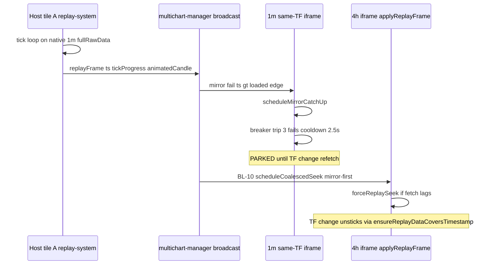

# T8 step 4 — mixed-TF replay-master diagnostic report

## 1. Task + RC

- **Task:** `T8-step4-lane2-mixed-tf-replay-master-diagnostic.md` — READ-ONLY mechanism trace for PO staging feedback on build `20260715a1` (PLAN2-FOUND#4): same-symbol mixed-TF replay — coarse (4h) full re-render + viewport jump-back; fine (1m) jumping; **priority lead:** intermittent **stuck-until-TF-change** repro. Assess PO finest-TF-master proposal; trace whether TAL-01590 breaker/edge-park hits same-symbol coarse/finer cells and whether step-3 fix scope is too narrow.
- **RC:** **Tooling/diagnostic — no RC discharged.** Overlaps **TAL-01563** (reopened), **TAL-01575**, **TAL-01573** (RC-2). **Strong structural overlap with TAL-01590** freeze mechanism on same-symbol paths step-3 does not cover (`!isSameSymbolAsHost` gate at `:815`).

---

## 2. What I changed — file by file

**No product or harness edits.** READ-ONLY trace only.

| File | Change |
|------|--------|
| *(none)* | Diagnostic report only — `docs/tickets-overhaul/worker-reports/T8-step4-mixed-tf-replay-master-diagnostic-report.md` |

**Explicit:** no other files touched. `react-parity-lib.mjs`, `known-failing.json`, `panel-cmd-bridge.js`, `replay-system.js`, `chart.js` — all read-only.

---

## 3. Kill-switch (I3 + I13)

**N/A — diagnostic only, no switches introduced or modified.**

Relevant **existing** switches for the traced paths (reference for fix lane):

| Switch | Default | Gated behavior |
|--------|---------|----------------|
| `__TALARIA_MC_DISABLE_COARSE_PANEL_PLAY_ADVANCE` | fix ON (switch OFF) | BL-10 coarse play-advance via `scheduleCoalescedSeek` |
| `__TALARIA_MC_DISABLE_PANEL_PLAY_VIEWPORT_FOLLOW` | fix ON | BL-11 play follow |
| `__TALARIA_MC_DISABLE_PLAY_FOLLOW_COST_GUARD` | fix ON | BL-12/13 cost guard + continuous eased follow |
| `__TALARIA_MC_DISABLE_FINER_OWNER_PLAY_VIEWPORT_FOLLOW` | fix ON | Finer self-owner follow on `forceReplaySeek` settle |
| `__TALARIA_MC_DISABLE_SYNCOFF_PEER_PLAY_HOST_TF_ISOLATION` | fix ON | `peerPlayMustStayOnOwnMaster` mirror skip |
| `__TALARIA_FIX_REPLAY_INTERVAL_CADENCE` | fix ON | Host INTERVAL single-owner (`getReplayStepTimeframeForSync`) |

---

## 4. Proof — RED → GREEN

**N/A — diagnostic only.** No commands run; no RED/GREEN claims. Mechanism derived from static trace of shipping code + policy table (`T8-MIRROR-POLICY-TABLE.md` §2).

**I15:** PO symptoms are **NEEDS-LIVE** by definition; this report does not claim reproduction in harness.

---

## 5. Invariants checked

| Invariant | Status |
|-----------|--------|
| I1–I2 (scope) | Satisfied — zero product diff |
| I3/I13 (kill-switch) | N/A — no new switch |
| I8 (mirror trees) | N/A — no edits |
| I14 (freeze) | Satisfied — read-only on replay path |
| I15 | Satisfied — no proxy greens claimed |
| Lane-2 standing rule | Satisfied — no guard #21 proposed; cells named in policy table |

---

## 6. What I did NOT do / limits

- Did **not** run staging/live replay or add a mixed-TF harness scenario (e.g. H-S17 family is 1m host + 1h coarse, not PO’s 4h + 1m combo on staging).
- Did **not** capture runtime `_mcCatchUpFails` / `_mcCatchUpCooldownUntil` on a stuck panel — static trace only; PO should note whether stuck panel TF matches host TF when freeze hits (predicts breaker vs coarse fetch-lag path).
- Did **not** confirm which panel is **selected/host** in PO’s repro (host tile A is always the engine owner regardless of focus).
- Did **not** separate PO “full re-render” visually from **data resample + `render()`** vs **Y-axis `calculateScales` invalidation** (RC-2) — both can look like “whole chart redraw”; RC-2 limb needs live profiling.
- Did **not** evaluate interval-sync-ON or range-sync-ON variants (PO setup assumed sync OFF per staging notes).
- Assumed **tick playback mode** (production default on staging) — candle-by-candle mode would change cadence math.

---

## 7. Live-verification handoff

**PO confirm on staging build `20260715a1`:**

1. Layout: **same symbol**, **sync all OFF**, ≥2 panels — one **4h**, one **1m** (note which tile is host/selected).
2. Enter replay **paused**, then **Play** (tick mode).
3. **4h panel:** note whether jump-back happens **every ~1m host tick** vs **only on 4h bar close**; whether price scale refits (RC-2) or only X scroll shifts.
4. **1m panel:** note jump size — sub-candle smooth vs whole-candle leaps; compare when 1m panel is host vs non-host.
5. Optional A/B: set host display to **4h** while keeping 1m panel — retest (tests finest-TF-master vs display-TF-master hypothesis).

**Priority repro (stuck-until-TF-change):**

6. During play, when one panel **sticks** while others advance: **do not click** — change **only the stuck panel’s TF** (e.g. 4h → 1h → 4h, or 1m → 5m → 1m) and confirm play **resumes without** pausing/restarting replay.
7. Record: stuck panel TF vs host TF (same or different), whether stuck panel’s forming bar / `replayTimestamp` froze at loaded edge, and whether resume coincided with `setTimeframe` refetch (network tab `/bars`).

Record panel id, host TF, playback mode, and a short screen capture for Director escalation.

---

## 8. Status

**DIAGNOSTIC-ONLY (mechanism reported, fix not started)**

---

# Mechanism report (deliverable body)

## H. PRIORITY — “stuck until TF change, then resumes” (PO repro clue)

### Verdict (fast path)

**Confirmed structural match to TAL-01590 edge-park / catch-up breaker**, surfacing on **same-symbol** paths that step-3 **does not fix**. Step-3 (`panel-cmd-bridge.js:815–819`) gates `scheduleCoalescedSeek(ch, ts, true)` to **`!isSameSymbolAsHost` only** — same-symbol mixed-TF panels never enter that cell.

**TF change unsticks** because `setTimeframe` forces a **fresh master re-acquire** anchored on the host playhead (`panel-cmd-bridge.js:2387–2394`, `chart.js:6268+` `ensureReplayDataCoversTimestamp` / `_multichartMirrorHostTfSwitchIfReady`), which clears the loaded-edge gap and resets catch-up success (`panel-cmd-bridge.js:1161–1162` `_mcCatchUpFails = 0`, `_mcCatchUpCooldownUntil = 0`).

### Which panel sticks — depends on TF relation to host

| Stuck panel | During PLAY primary path | Freeze mechanism when master lags host `ts` |
|-------------|--------------------------|---------------------------------------------|
| **Same TF as host** (e.g. 1m panel, host 1m) | `:785–807` `forceSamePairParentDataMirror`; on mirror fail → `:846` `scheduleMirrorCatchUp` | **Exact TAL-01590 breaker:** `applyMultichartMirrorFrame` returns false when `ts > lastT` (`replay-system.js:6645–6646`) → `ensureReplayDataCoversTimestamp` retries → 3 failures → **2.5s cooldown** (`panel-cmd-bridge.js:1147–1154`) → `scheduleMirrorCatchUp` no-ops (`:1090–1092`) → **`renderFurthestLoadedMirrorFrame` parks at loaded edge** (`:889–909`) |
| **Coarser** (e.g. 4h, host 1m) | `:756–780` BL-10 `scheduleCoalescedSeek` (`peerPlayMustStayOnOwnMaster` false) | Parent mirror may **succeed visually** while panel `fullRawData` is short; `forceReplaySeek` fallback depends on async `ensureReplayDataCoversTimestamp` (`:1996–2006`). **No breaker trip** on this path, but **same edge-park symptom** if fetch never covers host ts. Mirror-first coalesced path (`:1917–1925`) can mask lag until TF refetch |
| **Finer self-owner** (e.g. 1m, host display 4h) | `:732–755` `forceReplaySeek` | `_ensureFinerPanelOwnerCoversPlayhead` (`chart.js:6311–6314`) — fetch race / short owner window → seek on stale master → **frozen at edge** until TF switch refetches owner window |

### Intermittent + TF-dependent — why

1. **Async fetch race:** `ensureReplayDataCoversTimestamp` is promise-based; host playhead outruns panel load intermittently (`chart.js:6324–6328` inflight coalescing).
2. **Breaker cooldown:** after 3 failed catch-ups, **2.5s hard park** (`panel-cmd-bridge.js:1152–1154`); looks like “stuck until something changes.”
3. **B-FIX-F host-unsettled hold:** `:591–597` parks panel when host playhead outside host master window — releases when host settles **or** panel refetches on TF change.
4. **`args.isPlaying` false on some frames:** coarse BL-10 advance gated on `args.isPlaying` (`:756–757`); if broadcast drops flag, coarse panel returns `:783` without seek (finer self-owner still `forceReplaySeek`s).

### Does step-3 need to extend to coarse/finer same-symbol?

**Yes — partially, as Director escalation (not silent extension).**

| Cell | Step-3 covers? | Gap |
|------|----------------|-----|
| independent × playing | **Yes** (`:815–819`) | — |
| same-symbol **same-TF** × playing | **No** | Still uses mirror + `scheduleMirrorCatchUp` breaker (`:838–846`) — **same freeze class as TAL-01590** in a mixed-TF layout |
| same-symbol **coarser** × playing | **No** (BL-10 exists but mirror-first) | `scheduleCoalescedSeek(ch, ts, false)` tries parent mirror before own-master `forceReplaySeek` (`:1917–1931`); should likely mirror independent fix: **`ownMasterOnly=true` during PLAY** to skip host-data mirror and advance on panel master |
| same-symbol **finer self-owner** × playing | **No** | Already `forceReplaySeek`, but no coalesced own-master cell; fetch-lag edge-park remains |

**Finest-TF-master does not replace this fix:** it changes step cadence but does not stop edge-park when a panel’s loaded master `< host replayTimestamp`. The unstick-on-TF-change signature points to **own-master play advance + catch-up demotion** (TAL-01590 pattern) extended beyond `!isSameSymbolAsHost`.

---

## A. Replay-master / cadence ownership map

### Single clock owner today

The **host tile A** `replay-system.js` instance is the **only** replay engine. Peer iframes are passive consumers of broadcast frames.

| Stage | Location | What owns cadence |
|-------|----------|-------------------|
| Play loop | `replay-system.js:5084–5098` (`updateChartWithAnimatedCandle`), `4560–4561` (`completeTickAnimation`), `3688–3709` (`startCandleByCandle`) | Host `replay-system` — tick loop (~72 ticks per **native 1m** raw candle) or candle loop (`getCandleStepIntervalMs`) |
| Step TF / INTERVAL | `replay-system.js:3716–3748` (`_resolveReplayStepTimeframe`), `554–564` (`getReplayStepTimeframeForSync`), `672–680` (`_isSubBarStepMode`) | Host UI: chart TF, V9 INTERVAL override, playback mode — **not** min(peer TFs) |
| Frame payload | `replay-system.js:6705–6732` (`_buildMultichartReplayFrameDetail`) | Host `replayTimestamp`, `tickProgress`, `animatedCandle`, `isPlaying`, `hostFileId` |
| Fan-out | `replay-system.js:5092–5098` → `multichart-manager.js:1271–1287` | One rAF-coalesced `replayFrame` per host animation frame to every iframe |
| Iframe entry | `panel-cmd-bridge.js:3160+` → `applyReplayFrame` | Per-panel TF relation branch |

**Answer:** The master is **host tile A’s replay engine**, advancing on the host’s **native 1m `fullRawData`** clock in tick mode. It is **not** the finest-TF panel and **not** strictly the host’s **display** TF — display TF affects resample/step mode (`_shouldStepByReplayInterval`, `_isSubBarStepMode`), but the broadcast timestamp is the host playhead on the shared bus.

### Per-panel derivation (same symbol, mixed TF)

Policy cells from `T8-MIRROR-POLICY-TABLE.md` §2:

| Panel relation | `applyReplayFrame` branch | adopt-data (playing) | adopt-X (playing) | Cadence felt |
|----------------|---------------------------|----------------------|-------------------|--------------|
| **Same TF as host** | `:785–807` `forceSamePairParentDataMirror` | **Y** — clone host batch each frame | **Y** — eased same-TF follow (`:1394–1429`) | Host tick rate |
| **Coarser** (e.g. 4h, host 1m) | `:756–780` BL-10 `scheduleCoalescedSeek` | **P** — own coarse master; coalesced 1×/rAF | **Y** — `maybePanelPlayViewportFollow` (BL-11/12/13) | Data: coarse bar updates; bus: fine host ticks |
| **Finer self-owner** (e.g. 1m, host display 4h) | `:732–755` `forceReplaySeek` + follow | **P** — own finer master | **Y** — finer-owner follow | Seeks on each coalesced host frame |

**Coarse derivation:** Host sends **fine** `replayTimestamp` every tick. Coarse panel coalesces (`panel-cmd-bridge.js:1876–1931`) then either (1) mirrors host animated payload (`applyParentReplayMirror` `:1028–1076`) resampled to 4h, or (2) `forceReplaySeek` → `goToReplayTimestamp` → `updateChartData` on **own** `fullRawData` (`replay-system.js:5627–5674`, `3091–3179`).

**Finer derivation:** `forceReplaySeek` (`panel-cmd-bridge.js:1958–1999`) advances playhead on panel’s finer master to the **shared** host timestamp, then `maybePanelPlayViewportFollow` (`:1774–1872`).

---

## B. Coarse (4h) — full re-render + viewport jump-back

### Mechanism trace (split: mirror-policy vs RC-2)

**1. Mirror-policy / cadence (primary for PO symptom)**

- **BL-10 coarse play path** (`panel-cmd-bridge.js:756–780`, `1927–1931`): legitimate coarser peer (`peerPlayMustStayOnOwnMaster` false when `panelMs > hostMs`, `:1204–1226`) enters coalesced seek with `ownMasterOnly=false`, so **parent mirror is attempted first** (`:1917–1925`).
- **`applyParentReplayMirror`** (`:1028–1076`): when host tick animation is active, applies host 1m `animatedCandle` through `applyMultichartMirrorFrame` → **full `resampleData` of sliced raw prefix** to 4h (`replay-system.js:6614–6626`, `6690–6691`). That is a **whole-chart data refresh** every coalesced rAF, not an in-place last-bar patch on coarse TF.
- **Fallback `forceReplaySeek`** (`panel-cmd-bridge.js:1931`, `replay-system.js:5674`): `updateChartData(autoScroll)` **re-slices entire prefix + resamples** (`:3167–3179`) — same cost profile when mirror fails.
- **adopt-X / viewport:** After data apply, **`maybePanelPlayViewportFollow`** (`panel-cmd-bridge.js:1774–1872`) calls `syncReplayViewportToPlayhead({ forceRecenter: true, render: true })` with BL-13 continuous offset (`_panelPlayFollowContinuousOffsetX`, `:1744–1771`). Comments at `:1815–1821` document that **`goToReplayTimestamp`/mirror can nudge `ch.offsetX` off the eased baseline** between frames, so follow may **re-pin or repaint** — perceived as jump or snap-back.
- **`_finishMultichartMirrorRender`** (`replay-system.js:6249–6320`): if auto-scroll thinks viewport needs recovery, sets `offsetX` from **bar-quantized** `getReplayAutoScrollState` (`:6297–6315`) — can **override** window-preserving offsets from mirror paths.

**2. RC-2 flavor (secondary / cross-cut — TAL-01573)**

- Every `updateChartData` / mirror finish bumps `bumpDataVersion` and schedules indicator recalc (`replay-system.js:3183–3194`). `render()` → `calculateScales()` (`chart.js:25992`, `23670+`) repaints the full canvas — **Y-domain refit** if price range changes. PO “whole chart re-renders” may include this limb; it is **not** unique to mixed-TF policy and was routed to RC-2/T2 in D-014.

**3. Ruled out as primary**

- **BL-6 coarse recenter** (`maybeRecenterCoarsePanelAfterHostSwitch`, `:1625–1674`) — **paused host-TF switch** only; `shouldSkipCoarsePanelHostSwitchSeek` gates on `!isPlaying` (`:1569–1570`).
- **Stale mirror viewport alone** — play path intentionally **does not** preserve offset the way `applyStaticMirrorFrame` does for pause (`:1485–1492`); play uses follow recenter by design (BL-11).

**Verdict:** PO coarse symptom is **primarily mirror-policy cadence** (coarse×playing adopt-data **P** + adopt-X **Y**): fine host tick stream forces **per-tick resample or seek** on 4h panel, then **leading-edge follow** recenters X. **RC-2** may amplify “full redraw” feel but is a **separate escalation track**.

---

## C. Fine (1m) — per-advance jumping

### Mechanism trace

Depends on whether 1m panel is **same-TF as host** or **finer self-owner**:

| Setup | Path | Jump mechanism |
|-------|------|----------------|
| Host 1m + panel 1m | `forceSamePairParentDataMirror` `:803–807` | Historically **bar-quantized** `getReplayAutoScrollState` within candle (BL-13 eased follow wired at `:1394–1429` for same-TF). Residual jumps = device-pixel column boundaries or host/panel width lag. |
| Host 4h display + panel 1m finer | `_multichartFinerSamePairPanelSelfOwns` (`chart.js:3538–3558`) → `forceReplaySeek` `:754` | Panel advances to shared ts on **own** 1m master **once per host broadcast**. If host steps by **4h display cadence** (candle mode / coarse step), 1m panel gets **sparse large seeks** → visible **whole-candle jumps**. If host tick mode, seeks are rAF-coalesced but **`goToReplayTimestamp` full reslice** (`updateChartData`) can still run per frame. |
| Host 1m + panel 1m but not host tile | Same-TF mirror path if TFs match | Should track host ticks; jumps imply follow/coalesce fighting seek nudges (BL-13 comments `:1815–1821`) or range-sync/host offset copy (not PO’s sync-OFF case). |

**Cadence mismatch vs master:** The bus timestamp is always **fine** in host tick mode; **felt** mismatch on 1m is usually **apply-path cost** (`forceReplaySeek` + full resample) or **host display/step** running coarser than 1m (INTERVAL / candle mode / host on 4h), not a missing finest-TF clock on the native master.

---

## D. PO finest-TF-master proposal — feasibility

### What PO asked

Drive replay clock from the **finest-TF panel**, not the selected/host display TF, so all panels advance on fine ticks.

### What already exists

- Host engine already ticks on **native 1m `fullRawData`** in tick mode (`startTickAnimation` / `updateChartWithAnimatedCandle`).
- Shared playhead is already **timestamp-based** on the bus (`detail.timestamp`), not host display index.

### What finest-TF-master would actually change

| Scope | Change | Bounded? |
|-------|--------|----------|
| **Narrow (policy-cell)** | Compute `min(panelTfMs)` across same-symbol peers; use it to (a) gate coarse panel **data apply** to coarse bar boundaries while still receiving fine ts, (b) force host **step/INTERVAL** to finest TF when any peer is finer | **Yes** — T8 cells: coarse×playing adopt-data, host INTERVAL owner |
| **Medium** | Move `_resolveReplayStepTimeframe` / play-loop step size to multichart-aware finest-TF resolver | **Partial** — touches `replay-system.js` + manager, still one engine |
| **Broad (re-architecture)** | Run replay engine on non-host iframe or N engines | **No** — breaks host controls, `multichart-manager` broadcast model, harness actuation |

### Guards / cells that assume host-is-master

1. **Host-only play loop** — `replay-system.js` on tile A (`5087–5095`).
2. **`_buildMultichartReplayFrameDetail`** — host state only (`6705–6732`).
3. **`readParentChart` / `hostTf`** — TF relation tests (`panel-cmd-bridge.js:703–704`, `1204–1226`).
4. **`_readCommittedHostStateForFinerOwner`** — finer ownership vs **host native** (`chart.js:3554–3558`).
5. **`_mcIntervalSyncOn`** — forces peers toward **host** TF (`panel-cmd-bridge.js:705–720`).
6. **`getReplayStepTimeframeForSync`** — host INTERVAL (`replay-system.js:554–564`).
7. **`forceSamePairParentDataMirror`** — host batch authority (`panel-cmd-bridge.js:1263+`).
8. **Harness contracts** — H-S17 (coarse advances, bounded renders), H-S19/H-S19b (BL-11/13 on coarse) assume **host 1m tick stream + coarse own-master**; finest-TF-master **changes expected render counts and advance cadence**.

### Symptoms fixed vs not fixed

| Symptom | Finest-TF-master helps? |
|---------|-------------------------|
| 4h full resample every host tick | **Partially** — only if paired with **coarse apply decimation** (policy); clock alone does not stop `applyParentReplayMirror` resample |
| 4h viewport jump-back | **Partially** — if jumps are bar-quantized follow seams; not if RC-2 Y-refit |
| 1m jumping when host on 4h | **Likely yes** — forces fine step interval |
| 1m jumping when host already 1m tick | **Unlikely** — apply/follow path is the bug |
| TAL-01575 replay-start shift | **No** |
| TAL-01573 manual rescale full re-render | **No** (RC-2) |
| TAL-01590 independent symbol | **No** |

### Conflicts to flag

- **D-014 ruling on TAL-01563:** was **documented-intentional** (coarse group advance + BL-13 smooth X). PO reopen implies **cell behavior escalation**, not a guard tweak.
- **H-S17 invariant:** coarse must advance playhead but **not** reslice per 1m tick (`scenarios.mjs` ~1361) — current shipping path may **violate intent** when parent mirror succeeds on every tick; finest-TF-master without apply decimation **worsens** render count.
- **Director gate:** any change to **who owns replay step TF** is **shipped-behavior** → escalation per D-013/D-014.

---

## E. Recommendation (Director)

| Track | Verdict |
|-------|---------|
| **(0) PRIORITY — TAL-01590-class edge-park on same-symbol cells** | **Escalate first.** Extend own-master play-advance (step-3 pattern) beyond `!isSameSymbolAsHost`: at minimum **same-TF × playing** (breaker path `:846`) and **coarser × playing** (`scheduleCoalescedSeek` with `ownMasterOnly=true` during PLAY, skip mirror-first). TF-unstick signature is the fastest proof this is the mechanism. |
| **(a) T8 policy-cell — finest-TF / apply cadence** | **Secondary** for jump-back / group-advance feel (TAL-01563). Finest-TF step owner helps when host display/step is coarser than finest peer; **does not** fix edge-park alone. |
| **(b) RC-2 invalidation** | **Tertiary.** If PO confirms Y-axis refit / indicator storm on each advance (TAL-01573). |
| **(c) Both** | **Recommended sequencing:** (0) same-symbol play advance extension → (a) cadence/apply decimation → (b) RC-2 if needed. |

**Do not** add mirror guard #21 — mixed-TF cadence belongs in the policy table (per prompt guardrails).

---

## F. Escalation-candidate cells (Director)

| Cell | Ticket | Issue | Evidence in trace |
|------|--------|-------|-------------------|
| **same-symbol + same-TF + playing + adopt-data** | TAL-01590 / PLAN2-FOUND#4 | Mirror fail → catch-up breaker → edge-park; **step-3 fix does not gate here** | `panel-cmd-bridge.js:822–846`, `1083–1154`, `889–909`; step-3 `:815` `!isSameSymbolAsHost` |
| **same-symbol + coarser + playing + adopt-data** | TAL-01563 (reopened) | Mirror-first BL-10 coalesced seek; fetch lag edge-park; TF refetch unsticks | `panel-cmd-bridge.js:756–780`, `1917–1931`, `chart.js:6268+` |
| **same-symbol + coarser + playing + adopt-X** | TAL-01563 | BL-11/13 follow `forceRecenter` + bar-quantized `getReplayAutoScrollState` fights preserved offset → jump-back | `panel-cmd-bridge.js:1774–1872`, `replay-system.js:6297–6315` |
| **same-symbol + finer + playing + adopt-data/X** | TAL-01563 | Finer self-owner `forceReplaySeek` + owner-window fetch lag; TF switch refetches | `panel-cmd-bridge.js:732–755`, `chart.js:6311–6314` |
| **host replay-step owner × multichart** | NEW (finest-TF-master) | Step TF = host chart/INTERVAL, not `min(peer TF)` | `replay-system.js:3716–3748`, `554–564` |
| **any + playing + rescale/render adopt-Y** | TAL-01573 | RC-2 `calculateScales` on play repaint | `chart.js:25992`, `replay-system.js:3183–3194` |
| **replay-enter + adopt-X** | TAL-01575 | Boot / enter-replay viewport (if PO sees shift at start) | Policy table §3; H-S28–S31 family |

---

## G. Diagram — current play fan-out

---

*End of report.*
