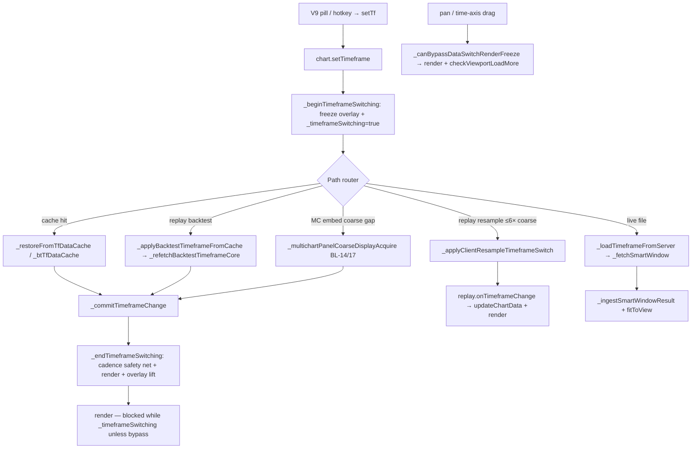

# T8 — TF-switch response diagnostic (TAL-01597 + TAL-01603a)

## 1. Task + RC

- **Task:** `T8-tf-response-lane2-diagnostic-READONLY.md` — trace TF-switch → acquisition → repaint; attribute two failure modes; propose fix boundaries + RED specs (no implementation).
- **Tickets:** **TAL-01597** (slow switch; few candles until pan), **TAL-01603 part a** (main-chart TF stuck; only 1D/4h respond first time).
- **RC:** **RC-8** (T8 data-acquisition / mirror policy seam — BL-14/17 family) + **RC-2** (invalidation / stuck-until-interaction render half). Dual-cite per intake.

**Status:** **DIAGNOSTIC-ONLY** — fix awaits authorization + a clear lane slot.

---

## 2. What I changed — file by file

**No product, harness, or registry files touched.** Read-only trace of:

| Path | Why read |
|------|----------|
| `chart v 1.4/chart/chart.js` | `setTimeframe`, freeze/repaint, server fetch, BL-14 acquire, `_endTimeframeSwitching` safety net |
| `chart v 1.4/chart/modules/replay-system.js` | `onTimeframeChange` resample + viewport + render |
| `chart v 1.4/chart/multichart-prod/panel-cmd-bridge.js` | `setTimeframe` cmd, `_timeframeSwitching` guards |
| `chart v 1.4/talaria-design/src/TalariaV8bLive.jsx` | V9 `tf` → `chart.setTimeframe` routing |
| `docs/tickets-overhaul/DAILY-INTAKE.md` | Symptom + routing authority |

---

## 3. Kill-switch (I3 + I13) — proposed (not implemented)

| Proposed switch | Default | Mode | Gated region (spec) |
|-----------------|---------|------|---------------------|
| `__TALARIA_DISABLE_TF_SWITCH_POST_COMMIT_REPAINT_V2` | ON (fix when unset) | **(b) invalidation** | `_endTimeframeSwitching` forced rebuild + synchronous `render()` + rAF second paint; `_loadTimeframeFromServer` rAF ordering (`fitToView` before `_restoreOrJumpAfterTfSwitch`) |
| `__TALARIA_DISABLE_TF_SWITCH_IMMEDIATE_BACKFILL_V2` | ON | **(a) acquisition** | `_snapReplayViewportAfterTfSwitch` / `_loadTimeframeFromServer` completion: eager `checkViewportLoadMore('backward', true)` + defer removal of freeze until `_viewportLeftFullyCovered()` on **main chart** (today only multichart embed uses `_holdTfRevealUntilCovered`) |
| Existing (panel coarse seam — do not duplicate) | ON | **(a) panel** | `__TALARIA_MC_DISABLE_PANEL_COARSE_DISPLAY_ACQUIRE`, `__TALARIA_MC_DISABLE_COARSE_PANEL_REPLAY_TF_ACQUIRE` — BL-14/17 paths in `setTimeframe` / `_multichartPanelCoarseDisplayAcquire` |
| Existing (reveal hold — panel only) | ON | **(a) panel** | `__TALARIA_DISABLE_TF_REVEAL_HOLD` — `_shouldHoldTfReveal` / `_holdTfRevealUntilCovered` |
| Existing (cache fast-path guard) | ON | **(a) both** | `__TALARIA_DISABLE_BT_TF_CACHE_PLAYHEAD_COVER` — backtest cache skip when playhead outside window |

**V9 React:** no switch required if engine path is fixed; optional `__TALARIA_DISABLE_V9_TF_EARLY_NOOP_GUARD` only if audit shows `chart.currentTimeframe === target` short-circuit is implicated (see §4.3).

---

## 4. Proof — RED → GREEN (spec only; not run)

### 4.1 Mechanism trace — single-chart main (then panel delta)



**Entry:** `setTimeframe()` (`chart.js` ~21157) — documents six paths A–F.

**Freeze (intentional):** `_beginTimeframeSwitching` (~21575) sets `_timeframeSwitching`; `render()` returns early (~26137) unless `_canBypassDataSwitchRenderFreeze()` (~21530). Pan/time-axis interaction is the **designed** bypass that also triggers `checkViewportLoadMore` (~22758).

**First paint trigger:** `_endTimeframeSwitching` (~21675) — explicitly documents the **"new grid, old candles"** defect and runs a cadence safety net + `render()` before overlay removal. Async server path: rAF block ~22266–22290 calls `_endTimeframeSwitching()` then `render()`.

**Replay resample:** `_applyClientResampleTimeframeSwitch` (~7786) → `replaySystem.onTimeframeChange` (~7031) → `updateChartData` + `render` / `_ensureMultichartViewportVisible`.

### 4.2 Multichart panel differences

| Mechanism | Main chart | Embed panel |
|-----------|------------|-------------|
| Reveal hold until viewport filled | **No** (`_shouldHoldTfReveal` returns false ~21864–21868) | **Yes** — `_holdTfRevealUntilCovered` polls + `checkViewportLoadMore` (~21892) |
| BL-14/17 coarse acquire | Backtest + non-backtest replay coarse gap (~21302–21346, `_multichartPanelCoarseDisplayAcquire` ~3023) | Same — bounded hybrid fetch vs chunk-walk |
| Mirror TF switch deferral | N/A | `panel-cmd-bridge.js` skips mirror seeks while `ch._timeframeSwitching` (~712, ~2439, ~2697) |
| V9 routing | Direct `chart.setTimeframe` | `grid.runCommand('setTimeframe')` → panel-cmd (~12576–12578) |

TAL-01603a is scoped to **main chart** in intake; panel BL-14/17 paths are **related evidence** for TAL-01597 on multichart but not the primary 01603a surface.

### 4.3 Why only 1D/4h “respond” (coarse vs intraday branch map)

| Destination TF | Typical path (main, backtest + fileId) | Why it often “works” first click |
|----------------|----------------------------------------|--------------------------------|
| **1D / 4h** | `_applyBacktestTimeframeFromCache` (~8655) — session-anchored prefetch (`_scheduleBacktestTimeframePrefetch`) **or** `_refetchBacktestTimeframeCore` with coarse `barLimit` (~22461) | Coarse windows are **prefetched/cached** at session end; fewer async failure modes |
| **5m** (from 1m native) | Live: `_canClientResampleToTimeframe` — ratio ≤6 (~7447–7449) → **sync** resample. Replay backtest: **always** cache/refetch branch (~21235–21255), not client resample | Live path is instant; replay may miss cache → async refetch |
| **15m / 1h / 30m** | `_canClientResampleToTimeframe` returns **false** (ratio > 6) → `_loadTimeframeFromServer` or `_refetchBacktestTimeframeCore` | **Network-bound**; viewport window may be **narrow** (~22252–22254 comment: “1h with only a few bars”) |
| **Finer in replay** | `_refetchBacktestTimeframeCore` + `_getBacktestReplayFetchRange` fine 2000-bar playhead-centered window (~22412) | Heavier fetch; playhead cover guard may reject cache (~8702–8718) |

**UI short-circuit (01603a contributor):** V9 `useEffect([tf])` (~12609) returns early when `chart.currentTimeframe === target` **without** verifying `_committedBarsMatchTimeframe`. If a prior switch committed the **label** (`_commitTimeframeChange`) but left **wrong cadence bars** (documented in `_endTimeframeSwitching` ~21677–21685), a retry click appears “stuck” while 1D/4h paths more often complete atomically.

**Cadence gate:** `_barsMatchTimeframe` / `_committedBarsMatchTimeframe` (~21647–21654) — idempotency `haveCurrentTfData` (~21171–21178) refuses noop only when bars match destination cadence.

### 4.4 Two-mode attribution

| Ticket | Symptom | Mode **(a) slow/partial acquisition** | Mode **(b) missing invalidation** | Verdict |
|--------|---------|----------------------------------------|-----------------------------------|---------|
| **TAL-01597** | Slow; few candles until pan | **Primary.** Server/smart window delivers a **subset**; `fitToView()` before viewport restore (~22256–22277) can leave most candles off-screen; backward prefetch is **deferred** (`_snapReplayViewportAfterTfSwitch` ~22500 `deferBackwardPrefetch`); multichart `_holdTfRevealUntilCovered` intentionally holds partial state | **Secondary.** Pan bypasses render freeze (~21530–21544) and runs `checkViewportLoadMore` — interaction is the **designed** backfill trigger; matches RC-2 “stuck until interaction” | **Both — (a) dominant, (b) amplifies** |
| **TAL-01603a** | Main chart; only 1D/4h respond | **Primary for intraday.** 15m/1h/30m take **async server/refetch** paths; coarse TFs hit **cache/prefetch** fast path | **Primary for “first click noop”.** Partial commit + V9 `currentTimeframe === target` guard (~12609); `_getRenderTimeframe` may show old axis until `_tfSwitchBarsMatchDestination` (~21519–21526) | **Both — (a) for intraday slowness, (b) for first-click stuck** |

**Evidence lines (in-tree, not harness-run):**

```21677:21724:chart v 1.4/chart/chart.js
        // Did the switch path actually install bars for the destination TF? Some
        // replay / multichart tiles commit currentTimeframe (so the axis/grid repaint
        // at the new TF) but leave this.data at the PREVIOUS timeframe until the user
        // pans or clicks — the "new grid, old candles" symptom.
        ...
        if (!destBarsMatched) {
            try {
                if (this.replaySystem && this.replaySystem.isActive
                    && typeof this.replaySystem.updateChartData === 'function') {
                    this.replaySystem.updateChartData(false);
```

```22249:22254:chart v 1.4/chart/chart.js
            // Immediately put the chart into a renderable state.
            // ... Without a valid offsetX for the NEW dataset, those intermediate renders produce
            // "No candles drawn! All N candles are outside viewport" warnings and a
            // blank chart on smaller-data timeframes (e.g. 1h with only a few bars).
```

```7445:7449:chart v 1.4/chart/chart.js
        // Zoom-out (coarser/equal TF): instant client resample for small steps only.
        // 1m→1D (×1440) must refetch/cache — resampling a 1m window yields ~1 daily bar.
        if (newMs >= rawMs * 0.92) {
            if (newMs / rawMs > 6) return false;
```

---

## 5. Invariants checked

| Invariant | How satisfied |
|-----------|---------------|
| READ-ONLY | No edits to product/harness/registry |
| Lane 1 chart.js P1 zone | Fix boundaries scoped to ~21575–21759, ~22150–22291, ~26126–26140 — **disjoint** from P1 engine predicates (~2349–2357 per manifest) |
| I15 (spec) | RED specs below require **real pill click** + **visible candle count / bar cadence** end-state — not `currentTimeframe` string alone |
| I13 | Proposed switches gate every file in each mode (chart.js primary; replay-system.js only if `onTimeframeChange` ordering changes) |

---

## 6. What I did NOT do / limits

- **No runtime repro** on staging `20260715b2` — mechanism trace from code + intake only.
- **Did not run** harness; no new scenario registered (Lane 4 owns `scenarios.mjs`).
- **PO environment unknown** — live vs backtest vs replay-active changes which branch dominates; PO should record mode when reproducing.
- **TAL-01603b/c** (replay cadence / freeze) explicitly **out of scope** — covered by D-016/D-015 shipped slices.
- **Server latency** not measured — mode (a) may be partially network, not purely client invalidation.

---

## 7. Live-verification handoff (for PO / future fix acceptance)

**Repro matrix (main chart, single layout):**

1. Load file with `currentFileId`; note replay on/off.
2. From **1m**, click **15m** → within **2s without panning**, count visible candles (should fill viewport, not 3–8 stubs).
3. From **1m**, click **1D** → should switch on **first** click (label + candles + axis agree).
4. Repeat **5m, 1h, 4h** — record which need second click or pan.
5. Enable `window.__CHART_TF_SWITCH_DEBUG__ = true`; capture `[TF-switch]` path tags (`server`, `client-resample-live`, `backtest-cache`, etc.).

**Build:** any post-combined-cut build; confirm `window.__TALARIA_CHART_BUILD_ID` on host frame.

---

## 8. Status

**DIAGNOSTIC-ONLY** — two-mode attribution complete; fix boundaries + RED specs proposed. **Fix awaits authorization + a clear lane slot** (after Phase-1-GREEN / combined-build cut per Manager queue).

---

# Appendix A — Fix boundaries (spec only)

### Mode (a) — acquisition / partial window

| File | Region | Change intent |
|------|--------|---------------|
| `chart.js` | `_loadTimeframeFromServer` ~22256–22290 | After ingest: `_restoreOrJumpAfterTfSwitch` **before** or instead of naive `fitToView`; ensure `offsetX` places fetched window on screen; eager backward prefetch when `hasMoreLeft` |
| `chart.js` | `_refetchBacktestTimeframeCore` completion / `_snapReplayViewportAfterTfSwitch` ~22467–22509 | Same ordering; avoid leaving viewport outside fetched span |
| `chart.js` | `_holdTfRevealUntilCovered` (~21892) | **Optional:** extend parallel “main chart immediate backfill” helper (today embed-only) — gated by new switch |
| `chart.js` | `_multichartPanelCoarseDisplayAcquire` (~3023) | **Panel only** — already addresses slow coarse chunk-walk; regression fence H-S20/H-S23 |

### Mode (b) — invalidation / stuck-until-interaction

| File | Region | Change intent |
|------|--------|---------------|
| `chart.js` | `_endTimeframeSwitching` ~21675–21758 | Strengthen cadence safety net: if `!_committedBarsMatchTimeframe`, **block** overlay lift until rebuild succeeds; always `scheduleRender` + invalidate pan/display caches |
| `chart.js` | `render()` freeze guard ~26137 | After successful commit, ensure one **unconditional** paint even when `_tfSwitchBarsMatchDestination` heuristic is loose (~21492–21516 finer-native shortcut) |
| `chart.js` | `_canBypassDataSwitchRenderFreeze` ~21530 | **Do not remove** pan bypass — fix root so first paint does not depend on it |
| `replay-system.js` | `onTimeframeChange` ~7180–7230 | Ensure `updateChartData` + `render: true` on main initiator before `signalReady` lifts freeze |
| `TalariaV8bLive.jsx` | `useEffect([tf])` ~12609 | Consider cadence-aware retry: if `currentTimeframe === target` but `!chart._committedBarsMatchTimeframe(target)`, still call `setTimeframe` (engine API or probe) |

---

# Appendix B — RED scenario specs (Lane 4 register — do not commit here)

### H-S84 (proposed) — Main-chart TF switch fills viewport without pan (TAL-01597)

| Field | Spec |
|-------|------|
| **Actuation (I15)** | Real click V9 `[data-tf="15m"]` on **host** built `dist-v9`; no pan/zoom for 3s after click |
| **Measure** | `page.evaluate`: `visibleCandleCount / viewportBarCapacity ≥ 0.85` AND `_committedBarsMatchTimeframe('15m')` AND `_timeframeSwitching === false` |
| **Surface** | `build:live` served; build id inside host iframe |
| **RED boot** | `__TALARIA_DISABLE_TF_SWITCH_POST_COMMIT_REPAINT_V2 = true` AND `__TALARIA_DISABLE_TF_SWITCH_IMMEDIATE_BACKFILL_V2 = true` → partial/stuck |
| **Determinism** | 10/10 on fileId instrument with ≥90d history |

### H-S85 (proposed) — Main-chart intraday TF first-click response (TAL-01603a)

| Field | Spec |
|-------|------|
| **Actuation** | Sequence: 1m → click 15m → **without second click** assert; then 1m → 1h → assert; compare to 1m → 1D (control) |
| **Measure** | After each click within 4s: `currentTimeframe` matches AND `_barsMatchTimeframe(data, target)` AND `renderPending === false`; **not** merely topbar pill text |
| **Branch probe** | Log `[TF-switch]` path — intraday must not end on noop/idempotency when cadence mismatches |
| **RED** | Same switches as H-S84; optionally force V9 early-return by pre-setting `currentTimeframe` with mismatched `data` |

### H-S86 (proposed, optional panel) — BL-14 coarse acquire vs chunk-walk (regression fence)

| Field | Spec |
|-------|------|
| **Actuation** | Existing H-S20/H-S23 topology — keep GREEN when mode (a) main-chart fix lands |
| **Measure** | No reintroduction of 51-fetch chunk-walk; bounded fetch count cap |

---

# Appendix C — Collision / sequencing notes

| Collision | Risk | Mitigation |
|-----------|------|------------|
| **Lane 1 Phase 1** (`chart.js` ~2349–2357 lifecycle predicates) | Low — TF fix regions are ~21575–22291, ~26126 | Serialize commits; no touch P1 zone |
| **`replay-system.js` D-016 cadence** (`d6d9822f`) | Medium — `onTimeframeChange` + `updateChartData` shared | Lane 2 owns TF switch slot; avoid concurrent replay-loop edits |
| **`panel-cmd-bridge.js` Phase 4 keyboard** (T3 P4) | Medium — `setTimeframe` case ~2418, `_timeframeSwitching` guards ~512–712 | Schedule TF fix **before** P4 keyboard slice or in discrete `chart.js`-only commit |
| **D-017 snap-back zones** (`chart.js` ~2456–2526, ~17296–17357) | Low if TF work stays in switch/freeze regions | Do not fold pan-release edits into TF PR |
| **RC-6 M3 uncommitted `drawing-tools-ui.js`** | None for TF path | Keep separate |
| **Combined build manifest** | TF fix is **post-unfreeze** candidate unless Manager fast-tracks | Do not block re-migration P1–P6 |

**Recommended lane slot:** Lane 2, **after** Phase-1-GREEN authorization, **single `chart.js` PR** for mode (b) repaint ordering first (smaller blast radius), then mode (a) backfill if PO still reports partial windows.

---

# Appendix D — Registry tags (propose — Lane 4)

| Tag | Tickets | Owner |
|-----|---------|-------|
| `T8-TF-RESPONSE-A` | TAL-01597 partial acquisition | Lane 2 `chart.js` fetch/viewport |
| `T8-TF-RESPONSE-B` | TAL-01597 / TAL-01603a invalidation | Lane 2 `chart.js` + optional V9 guard |
| `RC-2-INVALIDATION-TF` | TAL-01597 interaction half | T2 cross-cite |
