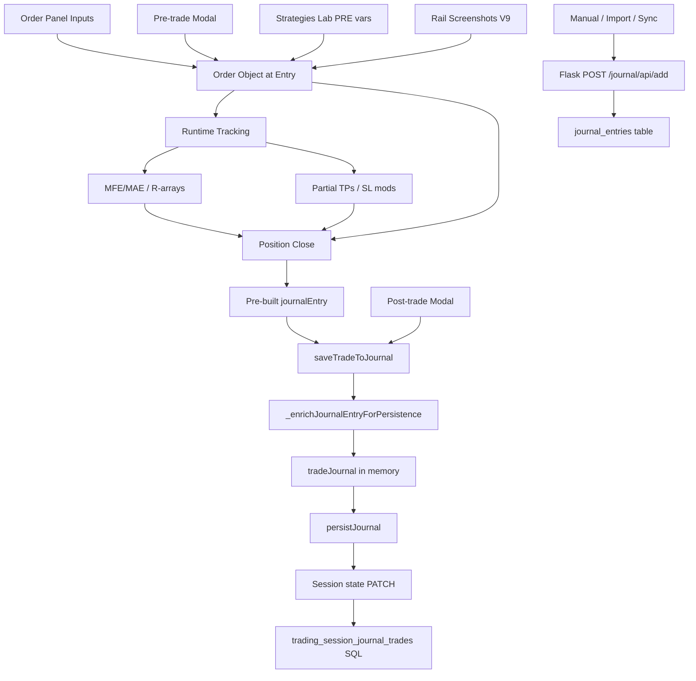

# Trade Input & Persistence Catalog

Complete reference of every field collected when a trade is taken in Talaria, and where it is saved.

**Last scanned:** 2026-06-06  
**Primary sources:** `chart v 1.4/chart/modules/order-manager.js`, `journal-backend/routes/journal/trades.py`, `journal-backend/models.py`, `chart v 1.4/chart/api_server.py`, `chart v 1.4/chart/session_journal_store.py`

---

## Overview: two persistence paths

| Path | When used | Storage |
|------|-----------|---------|
| **Session journal (backtest / chart)** | Trades placed on the chart during a trading session | `trading_session_journal_trades.payload_json` (SQL) + session `state_json` on PATCH; full trade object as JSON |
| **User journal (Flask backend)** | Manual add, import, or sync to `/journal/api/add` | `journal_entries` table (PostgreSQL/SQLite via journal-backend) |

Most chart trades are saved to the **session journal** as a rich JSON payload. The **Flask journal** is a separate, flatter schema used for the dashboard journal, imports, and profile-based trade lists.

---

## 1. User-facing inputs

### 1.1 Order panel (at entry — before/during place)

Collected from the Advanced Order panel (`placeAdvancedOrder` and related flows).

| UI control / source | Field(s) used | Notes |
|---------------------|---------------|-------|
| `orderQuantity` | `quantity`, `originalQuantity` | Lot/contract size |
| `orderEntryPrice` | `openPrice` | Snapped to tick grid when applicable |
| `enableTP` + `tpPrice` | `takeProfit` | Optional |
| `enableSL` + `slPrice` | `stopLoss`, `initial_sl` | Optional; drives risk calculation |
| Order side (Buy/Sell) | `type`, `direction` | `BUY` or `SELL` |
| Order type (Market / Limit / Stop) | Pending vs immediate fill | Limit/stop → `pendingOrders` first |
| `riskAmountUSD` | Risk budget (display/validation) | Mode: `risk-usd` |
| `riskAmountPercent` + `balanceType` | Risk budget from % of balance | Mode: `risk-percent` |
| `lotSizeAmount` | Direct lot sizing | Mode: `lot-size` |
| `autoBreakevenToggle` + BE fields | `autoBreakeven`, `breakevenSettings` | `mode` (rr/pips/$), `value`, `pipOffset` |
| `trailingSLToggle` + trailing fields | `trailingStop` | `unitMode`, activation threshold, step size, `limitUsd`, etc. |
| `multipleTPToggle` + TP ladder | `tpTargets[]` | Per target: `id`, `price`, `percentage`, `distributionMode`, `originalValue`, `hit` |
| Multi-entry levels | Split group orders | `splitGroupId`, `splitIndex`, `splitTotal`, `isSplitEntry` |
| Split entries (%) | Multiple pending legs | Same split fields |
| Scale-with-position checkbox | `tradeGroupId` (scaled trades) | Groups entries; aggregate journal on full close |
| **Pre-trade variables** (`orderStrategyVariablesMount`) | `strategyVariables[]` | From Strategies Lab; see §1.3 |
| V9 rail uploads (`window.__talariaV9RailScreenshots`) | `railScreenshots[]` | User images: `{ dataUrl, name }`; first split leg only |

### 1.2 Pre-trade journal modal (optional, right after entry)

Shown via `showTradeJournalModal(order, isClosing=false)`.

| UI control | Saved to | Shape |
|------------|----------|-------|
| `tradeReason` | `order.journalEntry.preTradeNotes.reason` | Free text |
| `tradeSetup` | `order.journalEntry.preTradeNotes.setup` | Text; defaults to session default setup |
| `tradeTags` | `order.journalEntry.preTradeNotes.tags` | Comma-separated; merged with strategy variable tags |

Also sets `order.journalEntry.timestamp`.

User can **Skip** — notes remain empty/default.

### 1.3 Strategies Lab variables

Defined on the session (`strategy_variables` or `strategy_definition.variables`).

**Pre-trade (`timing: 'pre'`)** — filled in order panel, stored on order as:

```json
{
  "id": "var-id",
  "name": "Variable label",
  "vtype": "yesno | multi",
  "value": "yes | no | ..."
}
```

**Post-trade (`timing: 'post'`)** — filled in close modal, stored on journal as `post_strategy_variables` (same shape).

### 1.4 Post-trade journal modal (at exit — optional)

Shown via `showTradeJournalModal(order, isClosing=true, closeData)`.

| UI control | Saved to | Shape |
|------------|----------|-------|
| `tradeReason` | `postTradeNotes.reason` | Lessons learned |
| `tradeSetup` | `postTradeNotes.setup` | Post-trade analysis |
| `tradeTags` | `postTradeNotes.tags`, top-level `tags` | Merged with post-variable tags |
| Post variable mount | `post_strategy_variables[]` | Strategies Lab POST vars |
| (derived) | `rulesFollowed` | `true` if `reason === 'rules-followed'` |

User can **Skip** — trade still saves; post fields null/empty.

---

## 2. Auto-collected at entry (order object)

Set when the order is created (`placeAdvancedOrder`, `openBuyOrderFromPanel`, pending fill, etc.).

| Field | Type | Description |
|-------|------|-------------|
| `id` | number/string | Trade ID (`orderIdCounter++`; scaled/split may use prefixed IDs) |
| `symbol`, `ticker` | string | Active instrument |
| `sourceFileId` | string | Chart data source file |
| `instrument_settings` | object | Snapshot at entry: `ticker`, `contract_size`, `pip_size`, `pip_value_per_lot`, `spread_pips`, `commission_per_lot_per_side` (+ camelCase aliases) |
| `openPrice` | number | Fill price |
| `openTime` | number (ms) | Market fill timestamp |
| `entryMarkerTimeMs` | number | Chart marker anchor time |
| `quantity` | number | Current size (reduces on partial TP) |
| `originalQuantity` | number | Size at entry (for journal) |
| `riskAmount` | number | USD risk from SL distance × lots |
| `originalRiskAmount` | number | Frozen risk for R-multiple (unaffected by trailing SL) |
| `status` | string | `OPEN` → `closed` |
| `stopLoss`, `takeProfit` | number/null | SL/TP prices |
| `autoBreakeven`, `breakevenSettings` | bool/object | BE config |
| `trailingStop` | object/null | Trailing SL state |
| `tpTargets` | array/null | Multi-TP ladder |
| `highestPrice`, `lowestPrice` | number | Running high/low while open |
| `mfe`, `mae` | number | Max favorable/adverse price levels |
| `mfeTime`, `maeTime` | number | When MFE/MAE occurred |
| `mfeMaeTrackingEndTime` | number | End of in-trade MFE/MAE window |
| `postExitTrackingMode`, `postExitTrackingCandles` | string/number | Post-exit bar tracking config |
| `postExitProcessedCandles` | number | Bars processed after exit |
| `partialCloses` | array | Starts `[]` |
| `partialClosePnL` | number | Starts `0` |
| `sl_modifications` | array | Starts `[]` — audit log |
| `trail_sl_path` | array | Starts `[]` — per-bar trail history |
| `initial_sl` | number/null | Original SL at creation |
| `array_base_price` | number | Base for R-array math |
| `entry_offset_r` | number | R offset from base (0 for single entry) |
| `balance_at_creation` | number | Account balance at trade open |
| `strategyVariables` | array/null | Pre-trade lab variables |
| `preTradeNotes` | object | From modal (may be empty) |
| `railScreenshots` | array | V9 user uploads |
| `entryScreenshot` | string (data URL) | Captured async after place |
| `screenshotPromise` | Promise | Internal; awaited before journal save |
| `splitGroupId`, `splitIndex`, `splitTotal`, `isSplitEntry` | various | Multi-entry / split legs |
| `tradeGroupId` | string | Scaled position group |

---

## 3. Auto-collected during the trade (runtime)

Updated while the position is open; copied to journal on close.

### 3.1 MFE/MAE & R-arrays (per bar)

| Field | Description |
|-------|-------------|
| `bar_close_r[]` | Per-bar close in R units |
| `bar_high_r[]` | Per-bar high in R |
| `bar_low_r[]` | Per-bar low in R |
| `post_exit_bar_close_r[]` | Post-exit bars (close) |
| `post_exit_bar_high_r[]` | Post-exit bars (high) |
| `post_exit_bar_low_r[]` | Post-exit bars (low) |
| `mfe_r`, `mae_r` | Derived max of bar arrays |

### 3.2 Partial take-profits (`partialCloses[]`)

Each element when a TP leg fills:

| Field | Type | Description |
|-------|------|-------------|
| `closePrice` | number | Fill price |
| `closeTime` | number | Timestamp |
| `bar` | number | Bar index at exit |
| `quantity` | number | Lots closed |
| `pnl` | number | Gross P&L |
| `pnl_net` | number | After commission |
| `commission` | number | Round-trip commission for this partial |
| `rr_at_exit` | number | R-multiple at this exit |
| `percentage` | number | Fraction of position (0–1) |
| `hitType` | string | e.g. `TP-PARTIAL`, `TP`, `SL`, `BE`, `MANUAL` |
| `exit_reason` | string | `TP_HIT`, `SL_HIT`, `BE_HIT`, `MANUAL`, `STOP_OUT` |
| `targetId` | string/number | Which TP target filled |

Also updates: `partialClosePnL`, `last_partial_exit_time`, `entries_locked` (cancels pending split siblings after first partial).

### 3.3 SL/TP modifications (`sl_modifications[]`)

| Field | Description |
|-------|-------------|
| `bar` | Candle timestamp |
| `time` | ISO time string |
| `field` | `SL`, `TP1`, `TP2`, … |
| `old`, `new` | Price before/after |
| `trigger` | `MANUAL`, `AUTO_BE`, `AUTO_BE_RECALC`, `TRAIL`, `MANUAL_OVERRIDE_TRAIL` |

### 3.4 Other runtime flags

| Field | Description |
|-------|-------------|
| `entries_locked` | Split group: unfilled siblings cancelled after partial TP |
| `trail_disabled_by_manual` | Trail overridden by manual SL move |
| `unrealizedPnL` | Live P&L while open (not always in journal row) |

---

## 4. Auto-collected at exit

| Field | Source | Description |
|-------|--------|-------------|
| `closePrice`, `exitPrice` | Fill | Exit price |
| `closeTime`, `exitTime` | Fill | Exit timestamp |
| `closeType` | Hit type | `BE`, `SL`, `TP`, `MANUAL`, `STOP_OUT`, etc. |
| `pnl`, `netPnL`, `realizedPnL` | Calculated | Total P&L (includes partials) |
| `finalClosePnL` | Calculated | P&L from final exit only |
| `exitScreenshot` | `screenshotManager` | Chart snapshot at close |
| `balance_at_exit` | `this.balance` | Balance after close |
| `active_sl_at_exit` | Position | SL at moment of exit |
| `active_tps_at_exit` | `tpTargets` | TP ladder state at exit |
| `multiTpSnapshot` | Split aggregate | `{ id, price, percentage, hit }[]` |
| `tpRealizedBreakdown` | Computed | Per-TP realized P&L breakdown |
| `aggregateFinalExitPnL` | Split aggregate | Sum of final-leg P&L |

### 4.1 Derived timing & calendar fields

| Field | Example |
|-------|---------|
| `entryDate`, `exitDate` | ISO strings |
| `dayOfWeek` | `Monday` |
| `hourOfEntry`, `hourOfExit` | 0–23 |
| `month` | `June` |
| `year` | 2026 |
| `holdingTimeMs` | ms |
| `holdingTimeHours` | float |
| `holdingTimeDays` | float |

### 4.2 Derived performance metrics

| Field | Description |
|-------|-------------|
| `rewardToRiskRatio` | \|P&L\| / risk or planned TP/SL ratio |
| `rMultiple` | P&L / `originalRiskAmount` |
| `originalRiskAmount` | Copied to journal if missing |
| `planned_risk_pct` | risk / balance at creation × 100 |
| `actual_risk_r` | Actual entry vs initial SL in R |
| `actual_rr_gross`, `actual_rr_net` | Blended RR (multi-TP) |
| `pnl_dollars_gross`, `pnl_dollars_net` | Blended P&L |
| `commission_total` | Total commission |
| `spread_pips_at_entry` | From instrument settings |
| `commission_at_entry` | Per-lot per-side |
| `pip_value_at_entry` | Pip value per lot |
| `final_exit_bar`, `total_bars_held` | Bar count |
| `savedAt` | `Date.now()` when persisted |
| `trading_session_id` | Active session ID |

---

## 5. Session journal payload (full trade row)

When a trade closes, `saveTradeToJournal` / close paths build a journal object and persist via `persistJournal()` → session state PATCH → `_sync_trading_session_journal_trades`.

**SQL row:** `trading_session_journal_trades`

| Column | Description |
|--------|-------------|
| `session_id` | Trading session FK |
| `user_id` | Owner |
| `client_trade_id` | `tradeId` or `id` from payload |
| `payload_json` | **Full JSON below** |
| `created_at`, `updated_at` | Timestamps |

### 5.1 Standard single-trade journal fields

```
tradeId, id                    // same numeric id
symbol, ticker
direction, type                // BUY / SELL
setup                          // from preTradeNotes or session default
strategy_variables             // PRE lab snapshot
post_strategy_variables        // POST lab snapshot (after modal)

entryTime, exitTime
entryDate, exitDate
dayOfWeek, hourOfEntry, hourOfExit, month, year

entryPrice, exitPrice
openPrice, closePrice          // legacy aliases
openTime, closeTime            // legacy aliases
stopLoss, takeProfit
closeType, status

netPnL, pnl, realizedPnL
riskPerTrade, riskAmount, originalRiskAmount
rewardToRiskRatio, rMultiple

mfe, mae, mfeTime, maeTime
highestPrice, lowestPrice
bar_close_r, bar_high_r, bar_low_r
post_exit_bar_close_r, post_exit_bar_high_r, post_exit_bar_low_r
mfe_r, mae_r

quantity
spread_pips_at_entry, commission_at_entry, pip_value_at_entry
instrument_settings            // only if flat cost fields incomplete

holdingTimeMs, holdingTimeHours, holdingTimeDays

preTradeNotes                  // { reason, setup, tags }
postTradeNotes                 // { reason, setup, tags, postStrategyVariables? }
tags, rulesFollowed

entryScreenshot, exitScreenshot
railScreenshots                // [{ dataUrl, name }]
savedAt
trading_session_id
```

### 5.2 Multi-TP / partial close extras

```
hasPartialCloses
partialCloses[]                // see §3.2
partialClosePnL
finalClosePnL
active_tps_at_exit
multiTpSnapshot
tpRealizedBreakdown
hasMultipleTakeProfits
```

### 5.3 Split-entry aggregate (`isSplitEntry: true`)

```
isSplitEntry, isAggregateMultiEntry
splitGroupId, numberOfEntries
splitEntries[]                 // per leg — see §5.5
aggregateFinalExitPnL
```

### 5.4 Scaled-trade aggregate (`isScaledTrade: true`)

```
isScaledTrade, scaledGroupId, numberOfEntries
scaledEntries[]                // per scaled leg
entryScreenshots[]             // [{ orderId, screenshot, openPrice, openTime }]
```

### 5.5 Per-leg objects (`splitEntries[]` / `scaledEntries[]`)

| Field | Description |
|-------|-------------|
| `id` | Leg order id |
| `splitIndex` | 1-based index (split only) |
| `quantity`, `lotSize` | Lots |
| `openPrice`, `closePrice` | Prices |
| `pnl`, `partialClosePnL`, `finalClosePnL` | P&L breakdown |
| `openTime`, `closeTime` | Timestamps |
| `closeType` | How leg closed |
| `entryScreenshot` | Per-leg chart capture |
| `partialCloses` | Leg-level partials (split) |

### 5.6 Audit / discipline block

```
sl_modifications[]
trail_sl_path[]
initial_sl
active_sl_at_exit
entries_locked
array_base_price
entry_offset_r
balance_at_creation
balance_at_exit
planned_risk_pct
actual_risk_r
```

### 5.7 Session-level aggregates (saved with journal array)

Written alongside `journal` on session PATCH:

| Key | Description |
|-----|-------------|
| `per_instrument_stats` | Per-ticker win rate, net P&L, avg RR, MFE/MAE |
| `journal_by_ticker` | Journal grouped by symbol |

---

## 6. Flask journal database (`journal_entries`)

**API:** `POST /journal/api/add` (and `PUT /journal/api/<id>`)

**Required on create:** `symbol`, `direction`, `entry_price`, `exit_price`, `quantity`

### 6.1 Table columns

| Column | Type | User/API input? | Notes |
|--------|------|-----------------|-------|
| `id` | int | auto | Primary key |
| `user_id` | int | auto | From JWT |
| `profile_id` | int | auto | Active journal profile |
| `strategy_id` | int | optional | FK to strategies |
| `symbol` | string | **yes** | Required |
| `direction` | string | **yes** | Required |
| `entry_price` | float | **yes** | Required |
| `exit_price` | float | **yes** | Required |
| `stop_loss` | float | optional | |
| `take_profit` | float | optional | |
| `high_price` | float | optional | |
| `low_price` | float | optional | |
| `quantity` | float | **yes** | Default 1.0 |
| `contract_size` | float | optional | |
| `instrument_type` | string | optional | Default `crypto` |
| `risk_amount` | float | optional | |
| `pnl` | float | optional | |
| `rr` | float | optional | Reward:risk |
| `notes` | text | optional | Free text |
| `strategy` | string | optional | Strategy name |
| `setup` | string | optional | Setup name |
| `commission` | float | optional | |
| `slippage` | float | optional | |
| `open_time` | datetime | optional | Multiple formats supported |
| `close_time` | datetime | optional | Must be after open_time |
| `entry_screenshot` | string | optional | URL path after upload |
| `exit_screenshot` | string | optional | URL path after upload |
| `date` | datetime | optional | `entry_datetime` in API |
| `variables` | JSON | optional | `{ varName: [values] }` — custom tags/variables |
| `extra_data` | JSON | optional | Arbitrary extension blob |
| `import_batch_id` | int | auto | Set on Excel import |
| `duration_seconds` | int | computed | DB trigger |
| `duration_minutes` | int | computed | DB trigger |
| `duration_hours` | float | computed | DB trigger |
| `duration_category` | string | computed | DB trigger |
| `created_at`, `updated_at` | datetime | auto | |

### 6.2 Screenshot upload (Flask journal)

`POST /journal/api/upload-screenshot` accepts `data_url` or `image_base64` → returns `/api/journal/screenshots/<user>_<uuid>.png` stored in `entry_screenshot` / `exit_screenshot`.

### 6.3 API response shape (`serialize_entry`)

Returns snake_case keys matching table columns plus `variables`, `extra_data`, ISO timestamps for `date`, `created_at`, `updated_at`.

---

## 7. Data flow diagram



---

## 8. Field name aliases (chart journal)

The session journal uses mixed naming for backward compatibility:

| Canonical | Aliases |
|-----------|---------|
| `tradeId` | `id` |
| `direction` | `type` |
| `entryPrice` | `openPrice` |
| `exitPrice` | `closePrice` |
| `entryTime` | `openTime` |
| `exitTime` | `closeTime` |
| `netPnL` | `pnl`, `realizedPnL` |
| `strategy_variables` | `strategyVariables` |
| `post_strategy_variables` | `postStrategyVariables` |

---

## 9. What is NOT saved to Flask journal from chart trades

Chart session journal rows are **not automatically mapped** 1:1 into `journal_entries` unless explicitly synced/imported. The session payload is significantly richer (screenshots as data URLs, R-arrays, split/scaled structures, audit logs).

Flask journal `extra_data` and `variables` can hold extensions if a sync layer maps chart fields into them.

---

## 10. Quick checklist: minimum data for a complete chart trade record

- [ ] Entry: symbol, side, qty, entry price/time, SL/TP
- [ ] Risk: `riskAmount`, `originalRiskAmount`
- [ ] Pre-notes: `preTradeNotes` + `strategy_variables`
- [ ] Runtime: MFE/MAE, bar R-arrays, partial closes if multi-TP
- [ ] Exit: close price/time, `closeType`, total P&L
- [ ] Post-notes: `postTradeNotes` + `post_strategy_variables`
- [ ] Media: `entryScreenshot`, `exitScreenshot`, optional `railScreenshots`
- [ ] Context: `instrument_settings` or flat cost fields, `trading_session_id`, `savedAt`

---

## Source file index

| Topic | File |
|-------|------|
| Order placement & journal save | `chart v 1.4/chart/modules/order-manager.js` |
| Session journal SQL sync | `chart v 1.4/chart/api_server.py` (`_sync_trading_session_journal_trades`) |
| Journal read/write helpers | `chart v 1.4/chart/session_journal_store.py` |
| Flask CRUD | `journal-backend/routes/journal/trades.py` |
| DB model | `journal-backend/models.py` (`JournalEntry`) |
| Analytics normalization | `homepage/src/app/dashboard/analytics/backend/analytics_core/normalization.py` |
| Dashboard journal table utils | `homepage/src/app/dashboard/sessionJournalUtils.ts` |
