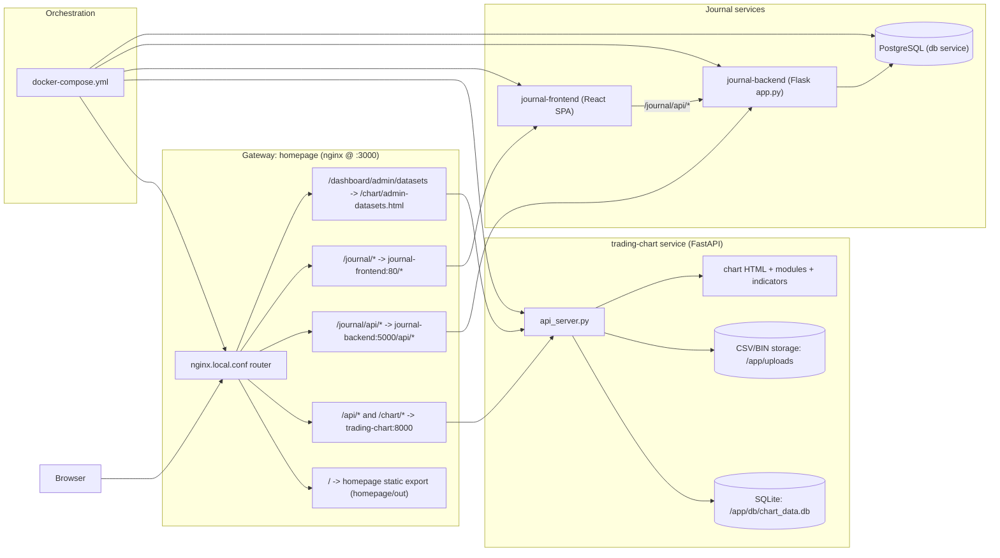

    

    <b>Automatic Architecture Diagrams from Code</b> 
    <a href="https://github.com/swark-io/swark">GitHub</a> • <a href="https://swark.io">Website</a> • <a href="mailto:contact@swark.io">Contact Us</a>

## Usage Instructions

1. **Render the Diagram**: Use the links below to open it in Mermaid Live Editor, or install the [Mermaid Support](https://marketplace.visualstudio.com/items?itemName=bierner.markdown-mermaid) extension.
2. **Recommended Model**: If available for you, use `claude-3.5-sonnet` [language model](vscode://settings/swark.languageModel). It can process more files and generates better diagrams.
3. **Iterate for Best Results**: Language models are non-deterministic. Generate the diagram multiple times and choose the best result.

## Generated Content
**Model**: GPT-4o - [Change Model](vscode://settings/swark.languageModel)  
**Mermaid Live Editor**: [View](https://mermaid.live/view#pako:eNp9k9tOGzEQhl9l5WucB8hFpUJKSQsUmtx5EZrYk82ADysfAhHi3etdl2QbtvHName-Ofy_5TcmnUI2ZbVtPLSbajmrbZVPSKsSuPTORrSqhLvzVSw9KLLNxQZ8nDyF14eK8y_VuZB9wDiVNOb4w6CmJy4KwQ2QHcvP_ubJKpIQnQ9j1LdPFHeeGrKg-Qrkc2rHqi4FGvdEvCX5jH6M-C6Uh5esi0fndOA9PwZeHYGgtmAlKr51OpmB8t62Iz_P84b_2DkX0NJjQL_Na7W74uUPAVnOLpLsQgO4z_4Uziv0vCsieWR1Qa6FBKs0coXdDU9enP8ku5A3J0wfEzCDCCsIeOhzKxb31xRxnyoa5seTbv_fdBHzCqk9VPwSoQvtDZmfcDSRHvh5Jyy-xol0dk3NJIZSfy8ikM6XpgaZQVEP_RatC1GG8MGYk07cUP5GcjYcGi0E2u1-6xOKr5zBFpqBjUtRpj5qJ0F3l9D3uBv0YGfMoM_PR-Un-1azuEGDNZtWNVO4hqRjzd4zlFoFEWcEeZZh0-gTnjFI0S12Vn78e5eaDZuuQQd8_wPCh0DM) | [Edit](https://mermaid.live/edit#pako:eNp9k9tOGzEQhl9l5WucB8hFpUJKSQsUmtx5EZrYk82ADysfAhHi3etdl2QbtvHName-Ofy_5TcmnUI2ZbVtPLSbajmrbZVPSKsSuPTORrSqhLvzVSw9KLLNxQZ8nDyF14eK8y_VuZB9wDiVNOb4w6CmJy4KwQ2QHcvP_ubJKpIQnQ9j1LdPFHeeGrKg-Qrkc2rHqi4FGvdEvCX5jH6M-C6Uh5esi0fndOA9PwZeHYGgtmAlKr51OpmB8t62Iz_P84b_2DkX0NJjQL_Na7W74uUPAVnOLpLsQgO4z_4Uziv0vCsieWR1Qa6FBKs0coXdDU9enP8ku5A3J0wfEzCDCCsIeOhzKxb31xRxnyoa5seTbv_fdBHzCqk9VPwSoQvtDZmfcDSRHvh5Jyy-xol0dk3NJIZSfy8ikM6XpgaZQVEP_RatC1GG8MGYk07cUP5GcjYcGi0E2u1-6xOKr5zBFpqBjUtRpj5qJ0F3l9D3uBv0YGfMoM_PR-Un-1azuEGDNZtWNVO4hqRjzd4zlFoFEWcEeZZh0-gTnjFI0S12Vn78e5eaDZuuQQd8_wPCh0DM)

